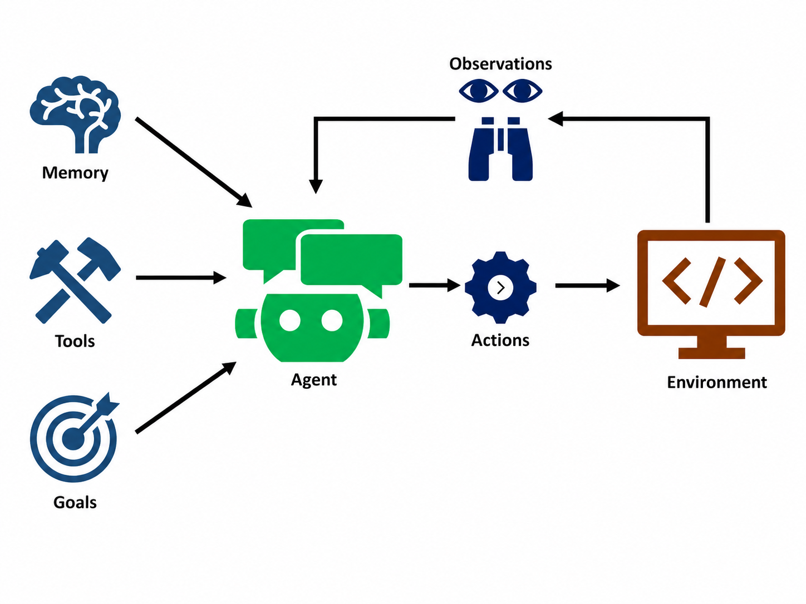
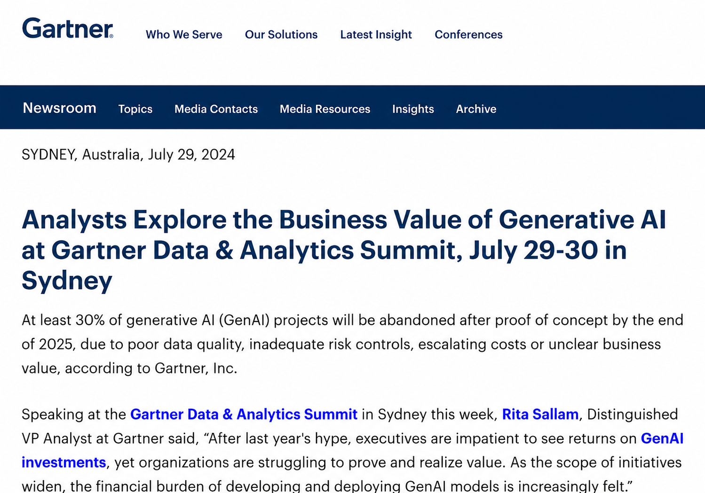
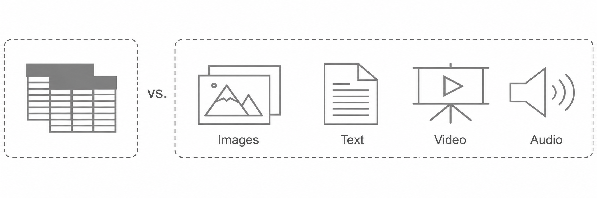
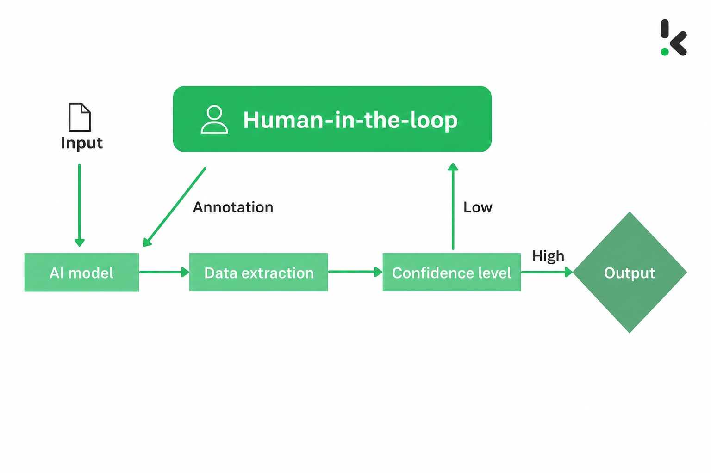

## What Kind of Data Engineering Do We Need in the Agentic Era? (Part 1)

From "Copilot" to "Agent," we are standing at the dawn of a new era. In this future driven by AI Agents, AI will no longer be merely a human copilot or passive tool. It will become a "digital employee" that can deeply integrate into core enterprise business processes, autonomously perceive, decide, and execute complex tasks. However, an Agent's intelligence level and efficiency depend entirely on the quality of the data it can access and understand. General-purpose large models are "generalists" trained on massive public Internet data. They have broad knowledge but lack industry depth. To solve enterprise-specific, high-value business problems, they must rely on the private-domain data accumulated inside enterprises over time, data full of unique business insight.

This leads to a core question that goes straight to the point: can the data engineering system we have used so far, mainly designed for BI reports and human analysts, meet the extreme requirements of advanced AI Agents for data breadth, depth, real-time performance, and accuracy? If the answer is no, what form should future data engineering evolve into?

We believe that to successfully navigate this transformation, we must thoroughly reshape the data foundation and move toward a new unified, intelligent, and hyper-converged platform. This article analyzes the challenge in depth and outlines a new blueprint for data engineering in the Agentic era.

### The Agentic Revolution: Beyond Generation, What Makes AI "Agentic"?

Agentic AI, or AI with agent capabilities, is a system that can complete specific goals under limited human supervision. It goes beyond the content-creation scope of generative AI and enters the new domain of autonomous action and task execution. Its core "agentic" characteristics are reflected in the following dimensions:

- Autonomy: This is the most essential feature of Agentic AI: the ability to autonomously execute complex, multi-step tasks without continuous human supervision. It can set long-term goals and continuously track progress.
- Reasoning and planning: An Agent can break down a high-level, vague goal, such as "plan a trip to Japan for me," into a series of concrete, executable steps, such as searching for flights, booking hotels, and arranging an itinerary.
- Perception and environment understanding: Through sensors, APIs, databases, user interactions, and other methods, an Agent continuously collects and interprets data from its environment to form a real-time and comprehensive understanding of the current state.
- Action and tool use: An Agent does not only think; it can also act. It executes planned tasks by calling external systems, APIs, and various software tools. These tools form the "executor" layer in the Agent technology stack.
- Adaptation and learning: An Agent can continuously optimize its strategy and decision model based on feedback and results from its actions, making it highly suitable for dynamic and changing environments.

Moreover, a single Agent does not exist in isolation. Advanced Agentic systems collaborate through an "orchestration layer." At this layer, a "meta-agent" or supervisor can coordinate multiple Agents with different specialties to jointly complete an extremely complex overarching goal, forming a multi-Agent system. This points toward a future where enterprises can assemble a "virtual workforce" made up of AI.

### Why Traditional Data Engineering Is No Longer Enough in the Agentic Era

The autonomous-enterprise vision described by Agentic AI hangs by a thread: whether Agents can access and understand high-quality, real-time, comprehensive data. However, the outdated data technology stacks in most enterprises have become the fundamental bottleneck to realizing this vision. Gartner has also pointed out that 30% of generative AI projects fail after the PoC stage, mainly due to data quality, risk management, or cost issues.

The core data challenges are the following six:

#### The Re-Emergence of Data Silos

An Agent's ability to "perceive" depends entirely on its ability to access data. In most enterprises, data is severely fragmented and scattered across dozens or even hundreds of independent systems: relational databases, NoSQL databases, various SaaS applications such as Feishu and WeCom, cloud object storage, local file systems, and more. Even enterprises that have already tried to break down business-system chimneys by building a so-called "data middle platform" mostly focus their integration on structured data.

However, the massive amount of multimodal unstructured data that is critical to Agentic AI, including documents, images, audio, and video, remains scattered across internal communication tools, personal cloud drives, and attachments in various business systems. It lacks unified management and has not been effectively integrated into a unified view. This fragmentation is fatal for Agents. They cannot form a complete and coherent understanding of the environment, and therefore cannot make optimal decisions.

#### Challenges in Multimodal Data Processing

For decades, traditional data engineering has centered on structured and semi-structured data. Yet 80% to 90% of enterprise data is unstructured, including massive volumes of text documents, images, audio, video, and PDF files. One of the revolutionary aspects of generative AI, and Agentic AI as its extension, is that they can understand and unlock the enormous value of this "dark data."

The problem is that existing traditional data pipelines were not born for this. They generally lack connectors, parsing capabilities, and storage models for diverse unstructured data. Integrating data in these varied formats is a huge technical challenge and often requires building complex, fragile, and hard-to-maintain custom processing flows for each data type.

#### Missing Feedback and Evaluation Loops

One of the core characteristics of Agentic AI is its ability to learn and adapt from interactions. A truly intelligent system must be able to evaluate the consequences of its actions and use that feedback to continuously optimize future decisions. This requires data infrastructure not only to provide data, but also to build a complete closed-loop feedback chain.

However, traditional data engineering, especially data pipelines centered on ETL/ELT, is designed as a one-way flow: data is extracted from source systems, transformed, and finally loaded into a target warehouse or data lake for downstream analysis. These pipelines are good at "informing" the system of the current state, but they lack mechanisms for capturing and processing "action outcomes." When an Agent performs an operation based on data provided by the pipeline, such as adjusting the budget of a marketing campaign, the result of that operation, such as changes in click-through rate, is usually not systematically fed back into the data pipeline to form a learnable closed loop.

This one-way data architecture fundamentally prevents Agents from realizing one of their most important capabilities: iterating and improving themselves through experience. It prevents them from learning lessons from success and failure.

#### Scaling Bottlenecks from Demo to Production

Building a RAG demo that processes dozens of documents is relatively simple, but there is a huge gap between that and deploying Agentic AI systems at scale in real production environments. In large enterprises, systems often need to process terabytes or even petabytes of data, perform complex model training and fine-tuning, and support Agent engineering. This scale brings severe challenges:

- Infrastructure pressure: Supporting such enormous data volumes and compute requirements requires large amounts of high-performance CPU and GPU compute, large-capacity storage, and high-bandwidth, low-latency network architecture. Any solution that looks feasible at the prototype stage may fail during scaled deployment because of infrastructure bottlenecks.
- Fragile data pipelines: As data sources and data volumes grow exponentially, manually built and maintained data pipelines become extremely fragile and complex. When enterprises move from experimentation to industrialized, scalable delivery, rigid data pipelines become a major obstacle to agile iteration and reliable operations.

#### Data Security Management and Governance Challenges

When Agents need access to massive volumes of new types of enterprise data from different sources, especially multimodal data such as documents, audio, and video, traditional security and permission-management systems are no longer adequate. The autonomy of Agents enables them to execute tasks across system boundaries, but it also turns them into a potentially major security risk.

An Agent without strict and fine-grained permission control may access sensitive data beyond its authorization while executing a task, such as financial statements, employee personal information, or core business secrets. More dangerously, when it calls external tools or APIs, it may unintentionally leak internal sensitive information to third parties, causing irreversible losses and compliance risks.

Therefore, to address the challenges brought by these new data sources, building strong data security and permission-management systems is no longer a "nice-to-have" feature, but a "survival requirement" for ensuring secure and compliant system operation.

#### Technology Stack Complexity and Talent Shortage

Building a modern data pipeline for Agentic AI is, in essence, an extremely complex system integration project. Enterprises need to glue together a series of independent "point solutions": connectors for data access, tools for multimodal data parsing, embedding models for vectorization, multiple databases for storage (relational, NoSQL, and vector databases), orchestration frameworks for task scheduling, and monitoring systems. This patchwork "RAG technology stack" is not only expensive to maintain, but also extremely fragile.

The core of this challenge is that most companies do not have the deep R&D capabilities required to build and maintain such a complex end-to-end data pipeline on their own. This requires a professional team spanning data engineering, AI engineering, MLOps, and other fields, with continuous investment of significant resources in development, integration, and iteration. For most enterprises that are not technology giants, this is a capability gap that is difficult to cross, and it severely hinders Agentic AI from moving from prototype validation to scaled production.
