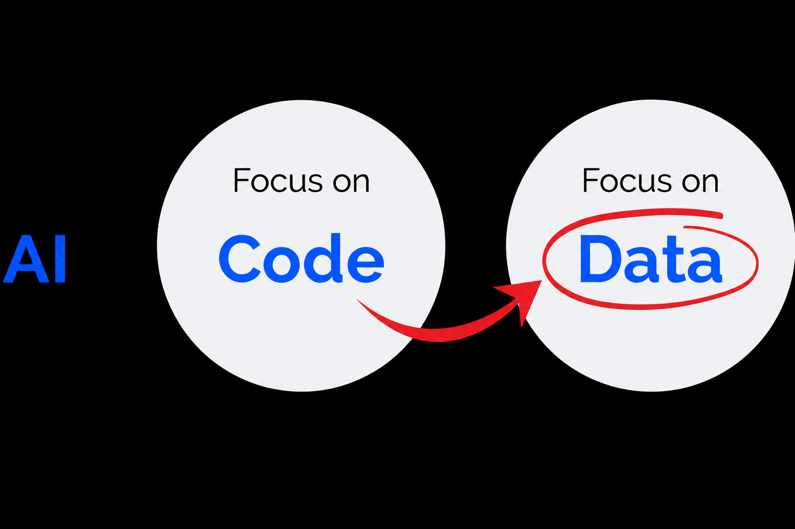
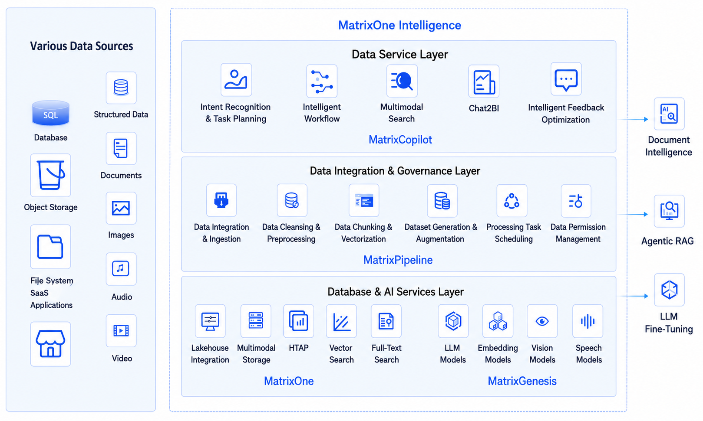
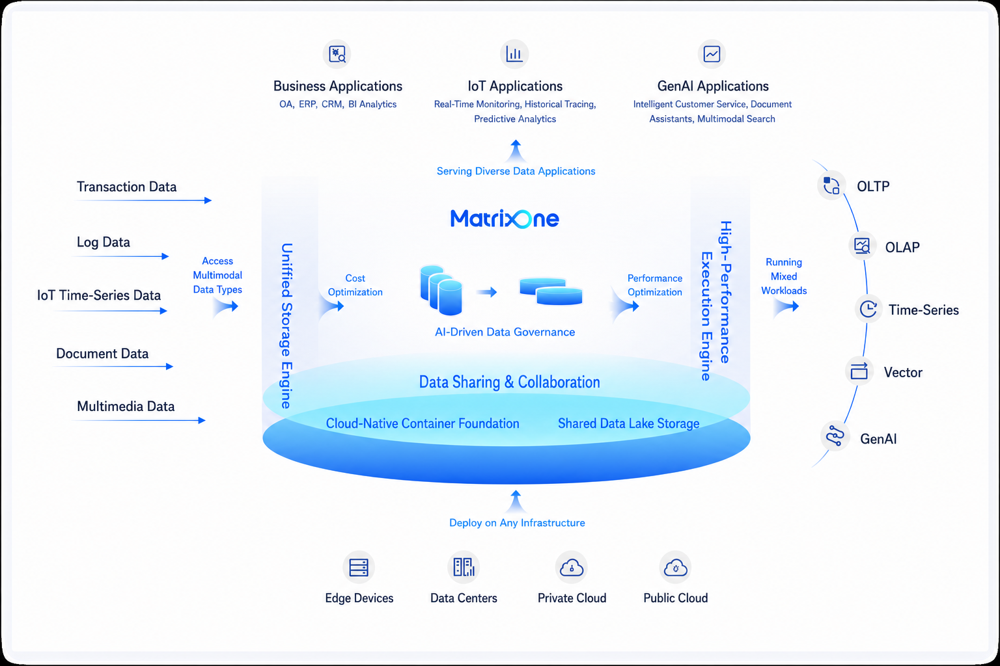

Previous article: [What Kind of Data Engineering Do We Need in the Agentic Era? (Part 1) | MatrixOrigin](https://matrixorigin.cn/posts/agent-area-data-need)

### Data-Centric AI Is Becoming Mainstream

From the perspective of the data layer, the new wave of AI has brought enormous data engineering challenges. From the perspective of the AI layer, a new mainstream view is also taking shape: the future of AI is fundamentally Data-Centric.
Strongly advocated by leading AI scholars such as Andrew Ng, the core idea is that, now that model algorithms have become highly mature, continuously and systematically improving data quality is far more effective for improving AI system performance than endlessly adjusting model parameters. The traditional "model-centric" paradigm treats data as static input, while the "data-centric" paradigm treats data as a dynamic core asset that requires continuous iteration and optimization.

This idea has gained unprecedented importance in the Agentic era. For GenAI, low-quality data may cause models to generate incorrect hallucinations or biased text. For Agentic AI systems that need to act autonomously, however, the consequences may be disastrous business decisions and incorrect actions in the real world. Every perception, plan, and decision made by an Agent directly depends on the quality of its input data.
Therefore, the soul of data engineering in the Agentic era is no longer "how to store and move data," but "how to build an engine that can systematically and automatically improve data quality." It must be a system capable of creating a data flywheel: transforming raw data into high-quality AI-Ready data, driving Agents to produce high-quality actions and interactions, and then using the new, valuable feedback data generated by those interactions to further optimize and enrich the data assets.

### Six Core Characteristics of Agentic Data Engineering

To overcome the core problems described above, incremental patches to existing data engineering are far from enough. We urgently need a new data engineering philosophy built on a set of first principles designed specifically for an autonomous, multimodal, and evolvable AI world. Therefore, we believe new Agentic data engineering must have six core characteristics:

**Characteristic 1: Integrated Architecture**  
To address data silos and technical complexity in the Agentic era, we must completely abandon the stitched-together technology stack that glues multiple point solutions into a patchwork. A modern data platform for Agentic AI must be a highly integrated, unified platform covering the full lifecycle from data ingestion, governance, and storage to final service delivery.
This unity fundamentally solves the problems of technology stack complexity and capability gaps. Enterprises no longer need to invest massive R&D resources in integrating and maintaining a dozen or more tools. At the same time, by using a hyper-converged kernel within a single platform to process transactional, analytical, vector, and full-text data in a unified way, the platform breaks down data silos caused by proliferating systems and ensures that Agents can obtain a comprehensive and consistent view of data.

**Characteristic 2: Multimodal Native**  
Next-generation data engineering must treat the processing and integration of unstructured data as a core design goal from the outset. Unstructured data should be a first-class citizen in the system, just like other data, rather than being handled by an add-on feature. From data ingestion connectors and parsing logic to storage formats and query engines, the platform must be optimized to natively support multimodal content such as text, images, audio, and video. This directly addresses the challenges of processing and preparing multimodal data, turning the complex pipelines that previously had to be customized for each data type into standardized, automated workflows within the platform, thereby truly unlocking the value of the "dark data" that accounts for more than 80% of enterprise data.

**Characteristic 3: AI-Driven Governance**  
In the face of massive, heterogeneous multimodal data, traditional human-dependent data governance is not only inefficient, but also fundamentally constrained in capability. AI-driven governance means deeply embedding AI into every stage of data governance and using intelligent methods to automate tasks that were previously impossible or extremely time-consuming. For unstructured data, traditional methods struggle to classify, filter, and clean effectively. An AI-driven platform can understand document content and recognize image scenes, enabling fine-grained governance that was previously impossible and fundamentally improving data quality. In complex business scenarios, the associations, transformations, and quality validation rules among different data assets may number in the thousands, making manual maintenance impossible. AI can automatically understand, generate, and execute these complex governance rules, freeing data engineers from tedious rule maintenance and greatly improving governance efficiency and accuracy, thereby ensuring that the data fed to Agents is high-quality and trustworthy.

**Characteristic 4: Closed-Loop Evolvability**  
AI data engineering must evolve from a one-way "data pipeline" into a "learning system" that supports two-way interaction. It must natively support a complete closed-loop feedback chain. Every Agent action, every interaction with the environment, and every piece of user feedback should be systematically captured, stored, and analyzed. This interaction data becomes valuable input for the next round of model optimization and strategy adjustment. It directly remedies the fundamental lack of feedback loops in traditional data engineering and drives continuous iteration and evolution of Agent capabilities in real business scenarios.

**Characteristic 5: Secure and Trustworthy**  
Security and privacy protection must be design starting points, not add-on features. Strict zero-trust security policies must be embedded into every stage, from data ingestion to Agent action. This directly addresses the core risks in data security management and governance. By providing fine-grained role-based access control (RBAC), end-to-end encryption, automatic discovery and masking of sensitive data, and complete audit logs for all Agent operations, the platform creates trusted, controllable, and compliant security guardrails for autonomous Agent actions, fundamentally preventing data leakage and misuse.

**Characteristic 6: Elastic Scalability**  
The underlying architecture of new data engineering must be designed for large scale, high concurrency, and elastic demand. Scalability must be considered across the compute power layer, model layer, storage layer, and compute layer, with each layer able to scale independently and dynamically according to business workloads. This ensures that the system can maintain high performance and high availability when processing petabyte-scale data or handling high-concurrency requests, while helping enterprises use resources on demand and control costs effectively.

### MatrixOne Intelligence: An AI-Native Multimodal Data Intelligence Platform

Facing the six core data challenges of the AI Agent era, MatrixOrigin has launched MatrixOne Intelligence, a one-stop AI-native multimodal data intelligence platform designed specifically to address these challenges.
MatrixOne Intelligence is a highly integrated platform designed to fundamentally solve the data difficulties enterprises encounter when implementing AI Agents:

- To address data silos and processing complexity, the platform provides one-stop data ingestion, parsing, and deep understanding capabilities, seamlessly integrating and processing heterogeneous multimodal data including documents, audio, and video.
- To address technology stack complexity and talent gaps, the platform uses a hyper-converged database and an integrated workflow engine to replace the multiple tools that traditional solutions require, greatly simplifying the technical architecture and lowering the barriers to development, operations, and maintenance.
- To address scaling bottlenecks, the platform is designed on a cloud-native architecture with powerful elastic scaling capabilities, ensuring a smooth transition from experimental prototypes to enterprise-grade production applications.
- To address the lack of feedback mechanisms and the challenges of security governance, the platform includes built-in management capabilities for Agent interaction data, as well as full-chain permission control and auditing, helping enterprises build secure, controllable, and continuously evolving Agent applications.
  Its core goal is to systematically transform scattered, heterogeneous raw data within enterprises into high-quality AI-Ready data that AI Agents can use efficiently, and to establish a closed loop between data feedback and model optimization, continuously improving Agents' ability and accuracy in solving complex business problems.

### Platform Architecture

As shown in the following diagram, the platform is divided from bottom to top into three core layers: the database and AI service layer, the data integration and governance layer, and the data service layer. Ultimately, these layers serve AI intelligent applications. The layers are tightly connected and jointly form a data engineering solution for GenAI and Agents.

**Database and AI Foundation Layer**  
The database and AI foundation layer provides a complete foundation for database and AI model capabilities. It supports unified storage of structured, semi-structured, and unstructured data, efficient query capabilities for different workloads, and LLMs, embedding models, and various vision and speech models, providing AI capabilities for data parsing, understanding, and Agent applications.

**Data Integration and Processing Layer**  
The data integration and governance layer is responsible for collecting, cleaning, and transforming data from the various data sources on the left side of the diagram. Through visual workflows, it parses, understands, enriches, and vectorizes multimodal data, processing raw data into high-quality AI-Ready data.

**Data Service Layer**  
This layer serves as an intelligent interaction bridge between the platform and final applications. It provides unified and convenient data services externally in the form of AI Agents. This layer encapsulates complex retrieval logic, such as hybrid search and multi-path recall, as well as tool invocation capabilities, converting underlying data and AI capabilities into directly consumable intelligent services such as multimodal search, intelligent Q&A, and report generation. Through this service layer, upper-layer application developers do not need to worry about underlying data complexity and can quickly build powerful AI intelligent applications.

### Platform Components

The MatrixOne Intelligence platform contains four core components. Each corresponds to a different layer in the platform architecture and together they form a complete technical system. Through collaboration, these products seamlessly connect the data intelligence foundation, data ETL, and data service capabilities, providing a one-stop, end-to-end multimodal data intelligence solution.
Next, we introduce these four core components one by one, explaining their functional positioning and unique value at different layers, and showing how they work together to address the data and intelligence challenges enterprises face when implementing GenAI.

**MatrixOne Hyper-Converged Cloud-Native Database**  
MatrixOne is the core data management foundation of the MatrixOne Intelligence platform. It is designed to provide enterprises with a comprehensive hyper-converged database solution that supports efficient processing of GenAI-oriented multimodal data. Built on a separation of storage and compute and a cloud-native architecture, it supports unified storage and querying of structured, semi-structured, and unstructured data. MatrixOne provides multimodal data fusion processing capabilities and can simultaneously support transactional (OLTP), analytical (OLAP), vector search, full-text search, and time-series data queries, greatly simplifying the management of complex enterprise data workloads. In addition, MatrixOne has powerful snapshot capabilities, providing reliable support for data versioning of rapidly and dynamically changing training, validation, and evaluation datasets in GenAI. Through deep integration with MatrixGenesis and MatrixPipeline, MatrixOne can quickly complete data parsing, deep understanding, and vectorization, while supporting high-performance multidimensional retrieval and recall.

**MatrixGenesis AI Model Service**  
MatrixGenesis is the AI service module in the MatrixOne Intelligence platform, focused on providing enterprises with large model support and intelligent application development capabilities. As a core tool for enterprise AI transformation, MatrixGenesis covers full-lifecycle management from model training and fine-tuning to inference deployment, helping enterprises quickly apply GenAI to real business scenarios. By integrating advanced large model services, such as LLMs and multimodal models, with a MaaS (Model as a Service) platform, MatrixGenesis supports flexible configuration and expansion to meet diverse industry needs. In addition, MatrixGenesis provides powerful Agent workflow design and development capabilities, enabling enterprises to rapidly build Agent applications for specific business scenarios. With efficient workflow management tools and convenient model integration capabilities, MatrixGenesis significantly lowers the technical threshold for enterprise AI application development and provides solid support for GenAI implementation at scale.

**MatrixPipeline Multimodal Data Engineering**  
MatrixPipeline is the data processing and governance module in the MatrixOne Intelligence platform, designed to provide enterprises with efficient ingestion, transformation, and management capabilities for multimodal data. As the core engine of data flows, MatrixPipeline supports unified ingestion from structured and semi-structured data to unstructured data. Through flexible connectors and automated ETL processes, it helps enterprises easily integrate data from multiple sources. Its built-in preprocessing and parsing capabilities can intelligently parse different data formats, such as PDF, Word, JPEG, video, and audio, extract content, and perform feature engineering, providing high-quality data support for subsequent model training and inference. In addition, MatrixPipeline provides data cleaning, enrichment, and annotation capabilities. Combined with embedded annotation and automated feature generation capabilities provided by large models, it greatly improves the efficiency and accuracy of data governance. Through deep integration with the MatrixOne database, MatrixPipeline enables seamless data flow management and supports efficient data version management and full-lifecycle tracking. As a foundational module for enterprise data intelligence, MatrixPipeline simplifies the construction of complex data pipelines and significantly lowers the technical barrier to multimodal data governance.

**MatrixCopilot Data Service Assistant**  
MatrixCopilot is the data service assistant of the MatrixOne Intelligence platform. It is not a simple API layer, but a revolutionary AI-native data assistant. Users can interact with MatrixCopilot in natural language and assign complex data tasks, such as "Help me integrate user feedback from all channels and identify the top five product complaint points." MatrixCopilot autonomously understands user intent, automatically plans and builds the underlying MatrixPipeline data processing workflow, calls MatrixGenesis AI capabilities for analysis, and ultimately delivers structured data results. Most importantly, the process is fully transparent and optimizable. If users are not satisfied with the result, they can provide feedback directly through conversation, and MatrixCopilot will intelligently adjust and optimize the workflow it built, rerun it, and deliver more accurate results, forming a powerful interactive closed loop.
