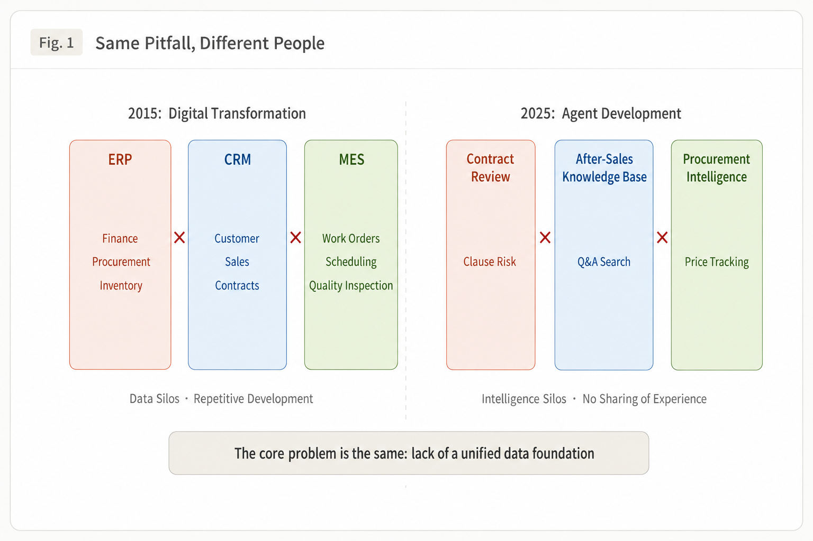
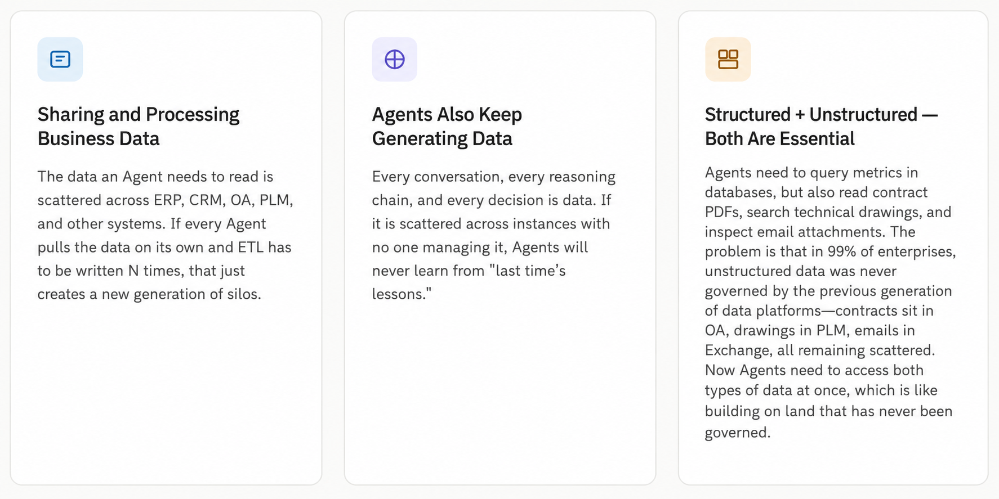
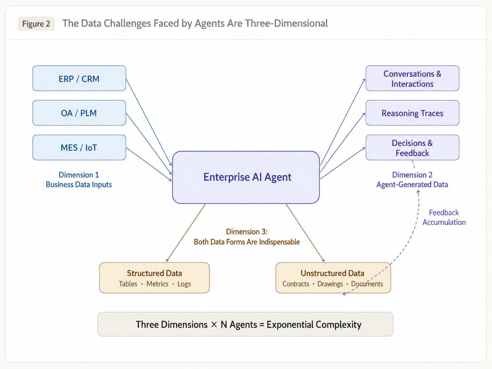
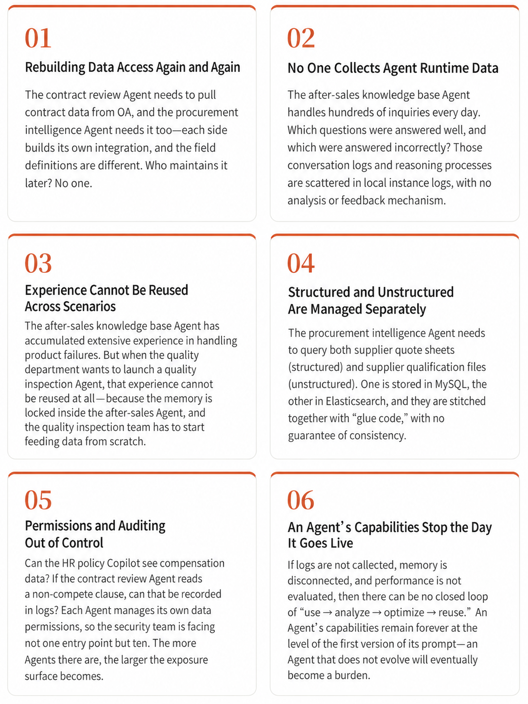
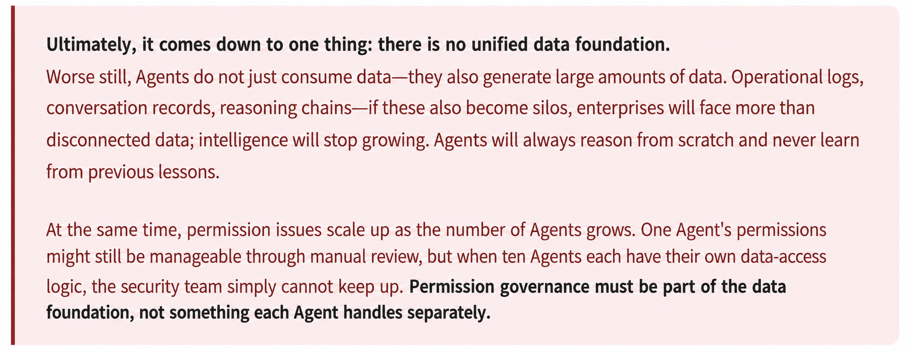
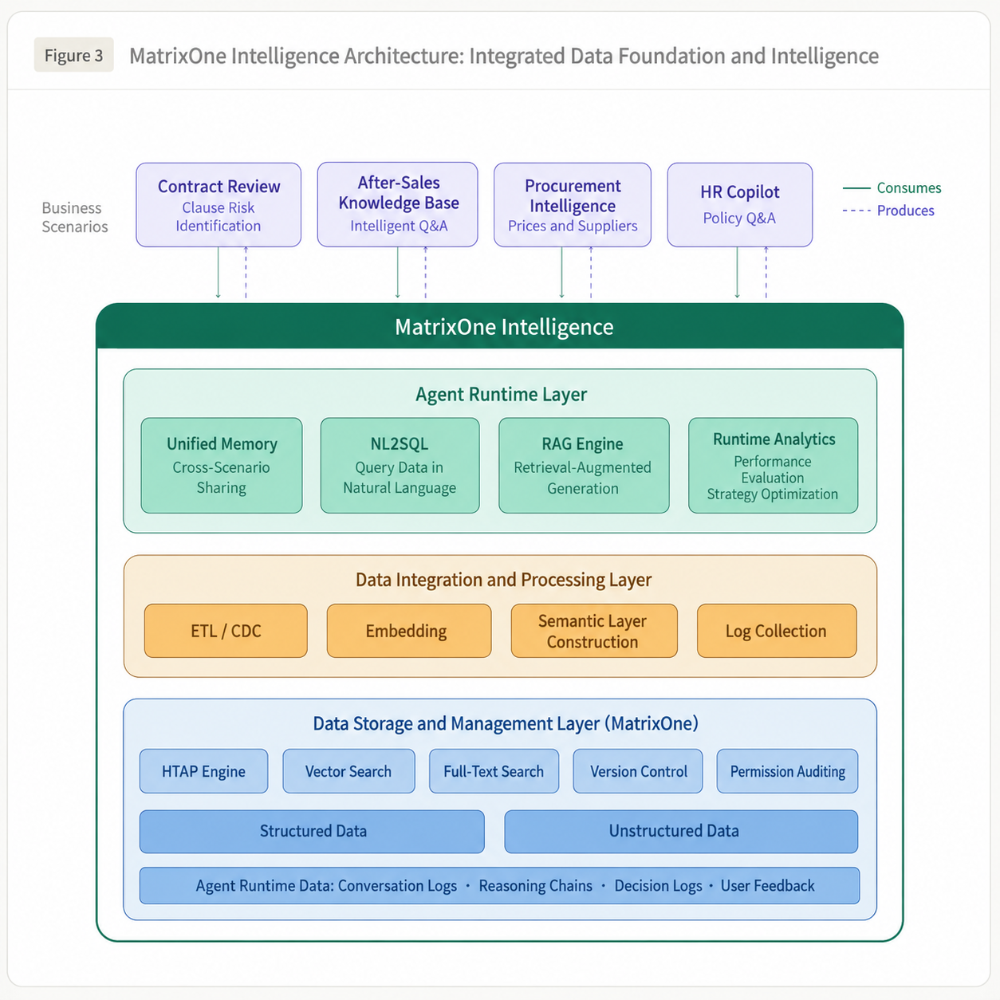
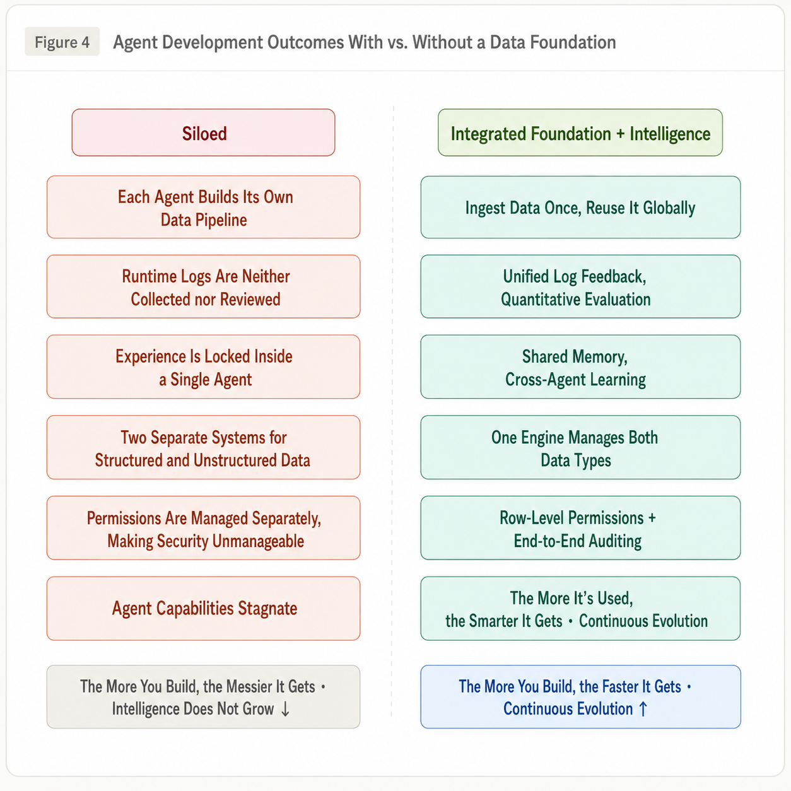
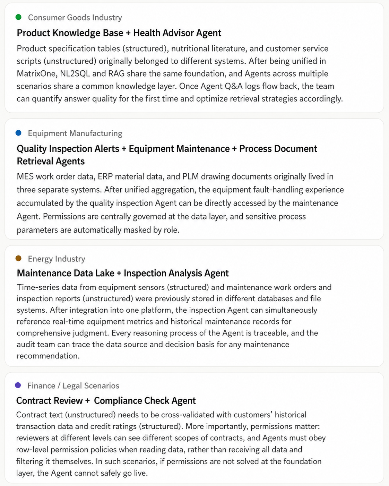

# Why Enterprise Agent Development Cannot Do Without a Data Platform

Ten years ago, enterprises built a pile of "information chimneys" and then spent five years making up for it. Today, if Agents are launched one by one in isolation, the same detour will happen again, and this time the pit will be deeper.

## An Old Story with New Characters

Anyone who has worked on enterprise informatization will recognize this picture: ERP manages finance and supply chain, CRM manages sales, MES manages the workshop, and OA manages approvals. Each system works smoothly on its own, but once cross-system data is needed, trouble begins. The same order number has three formats across three systems. Production scheduling wants sales forecasts, so someone exports Excel first and then manually imports it.

Later, enterprises spent three to five years building data middle platforms. In essence, they were paying back the debt from the earlier decision to "launch applications first and ignore integration."

Today, AI Agents are repeating the same script.

Each department builds its own: Legal launches a contract review Agent, Customer Service deploys an after-sales knowledge-base Q&A Agent, Procurement builds a supplier intelligence Agent, HR creates a policy Q&A Copilot, and so on. Each project can show value when reported individually, but when viewed together, all the old problems return.

If we look carefully, this time is even more troublesome than ten years ago. In the digital era, silos only meant that "business data did not connect." In the Agent era, the pit has three layers.

## Three Layers of Challenges Far More Complex Than "Connecting Systems"

Think about it: a contract review Agent needs to read contract text (unstructured), but it also needs to query a customer's historical payment records (structured) and previous approval comments on contract clauses (data produced by Agents themselves). Three kinds of data come from three different places. And this is only one Agent.

The problem is that when you have five or ten Agents running at the same time, each Agent cross-calls multiple structured and unstructured data sources. These call relationships are not a straight line, but a network. Structured data at least left traces in the previous generation of data platforms: where tables are, what fields mean, and who has permission to access them. There is at least some foundation. But unstructured data has never been uniformly managed. Which contracts are in which directory, which drawings are the latest version, and whose inbox contains scattered email attachments? Once these things start being called by Agents in a network, after only a few more links, the chain becomes almost impossible to untangle. **It is not that "complexity has increased." It is that control is directly lost.**

## What Pits Will Agents Fall Into Without a Data Foundation?

Over the past two years, while implementing Agents at dozens of customer sites, we have stepped into or seen many pitfalls. They can be summarized into six categories:

## Build the Foundation and Intelligence Together

When discussing the relationship between data platforms and business applications, the past decade of data middle platform construction left behind two typical ways of taking detours. Today, both are reappearing in the Agent field:

**The first is the IT-led mindset of "build the road first, then let traffic run."** It assumes that the data platform must first be built as large and complete as possible, with master data governance finished, data quality fully cleaned, and the metric system completed, before the business can use it. This sounds rigorous, but in practice such projects often spend two years still "governing" while the business side has already built its own scattered tools because it cannot wait. By the time the platform is complete, the business has already run many processes elsewhere, and migration costs more than building from scratch.

**The second is the business-led mindset of "run first and think later."** It ignores the data platform entirely. Whichever department needs an Agent gets one, and data access is built separately by each team. The first three scenarios are indeed fast. But by the fourth and fifth, problems all appear: inconsistent data definitions, permissions that cannot be controlled, and no experience sharing among Agents. The later you go, the more pits appear, and the slower construction becomes.

Behind both mindsets is the same wrong assumption: that foundation construction and business construction are two separate things. Either one must be completed before the other begins, or only one of them should be done.

Our experience is that **the foundation and intelligence must be built together.** Especially for enterprises whose data foundation is not ideal, the right approach is to choose one high-value Pilot Agent scenario and run it first, while building the data foundation through that process. When the Agent runs successfully, the business value loop closes, and the data pipeline and permission strategy close with it. When the second scenario is connected, the foundation already has reusable capabilities, so speed naturally improves. It is not building the road first and then opening traffic, nor forcing vehicles across empty land. It is building the road while traffic begins, and letting road and vehicles grow together.

At the beginning of 2024, we observed signs of Agent siloing at customer sites. This led to a product decision: launch **MatrixOne Intelligence (MOI)**, not as another standalone Agent tool, but as an AI data intelligence platform built on a data platform foundation. It integrates the capabilities required by Agent runtime with underlying data storage, integration, and processing, enabling teams to accumulate business value and data assets simultaneously from the first scenario.

Pay attention to the hierarchy in this diagram: business scenarios are at the top, and MOI sits underneath as the whole foundation. MOI has three internal layers:

### Agent Runtime Layer

NL2SQL, RAG retrieval, memory management, runtime analytics: these are common capabilities required by all Agents. They only need to be built once. New scenarios do not need to rebuild them and can call them directly.

### Data Integration and Processing Layer

Data from various business systems is ingested through ETL/CDC. Documents are vectorized through embedding. Structured metrics become queryable in natural language through a semantic layer. Agent runtime logs are also unified in this layer. **Data is processed once and shared by all Agents.**

### Data Storage and Management Layer (MatrixOne)

At the bottom is the MatrixOne cloud-native database, which supports HTAP hybrid transactional/analytical processing, vector retrieval, and full-text search at the same time. Structured and unstructured data are managed in one engine, and Agent runtime logs are stored here as well. Permission control is implemented uniformly at this layer: row-level and column-level data permissions and operation auditing are defined at the data engine level, instead of letting each Agent above manage its own permissions. Ten Agents share one security policy, not ten separate policies.

The core design principle is this: scenarios above Agents can vary widely, but the data foundation underneath is the same. Data is ingested once, permissions are uniformly defined at the data layer, and memory is centrally stored. No matter how many Agents are added in the future, marginal cost decreases.

## Comparison: How Different Are the Two Paths?

## Implementation Validation: Real Samples Across Industries

This architecture is not a conceptual diagram drawn on a PPT. Since 2024, we have validated this "foundation + intelligence" synchronous construction path in AI Agent projects across multiple industries. The cases below each have their own focus, but they share one conclusion: **a data platform is the prerequisite for Agents to truly run, not just an enhancement.**

Common conclusion: in implemented projects, the launch time for the second Agent scenario is generally shortened by more than 60% compared with the first, because data pipelines, permission strategies, memory frameworks, and log aggregation are all reused. The earlier the foundation is built, the faster later scenarios run.

## Five Lessons Summarized After Stepping Into Pits

### Start the Foundation and Agent Together. Do Not Go to Either Extreme.

Do not spend two years building a "perfect data foundation" before building Agents. That is the old IT mindset, and the business cannot wait. But do not ignore the foundation and let each department build an Agent first either. The first few may be fast, but later ones become slower and slower. The right rhythm is to run the first Pilot scenario on a scalable foundation from day one, and use the business loop to drive the data loop.

### Use One Engine to Manage Structured and Unstructured Data. Do Not Patch Systems Together.

Agents naturally need both types of data at the same time. If structured data uses one database, documents use another, and vectors require yet another, the data platform itself becomes a new silo. Choose an engine that natively supports HTAP + vector retrieval + full-text search, and you will avoid many detours.

### Collect Agent-Generated Data from Day One.

Conversation records, reasoning chains, decision logs, user ratings: these data are the fuel for Agent evolution. Do not wait until six months after launch to think, "Maybe we should analyze effectiveness." Let these data flow back to the unified platform from day one, so later effectiveness evaluation and strategy optimization have data to use.

### Define Permissions at the Data Layer, Not Separately in Each Agent.

The more Agents there are, the more important permission governance becomes. Row-level and column-level permission control and operation auditing should be handled uniformly at the foundation layer. Agents receive data that has already been desensitized and filtered for compliance. Ten Agents use one security policy, not ten. This is not optional; it is the compliance baseline.

### Start with One Scenario, Then Replicate Horizontally.

Do not try to build an "all-purpose Agent platform" all at once. Choose a scenario with good data quality and visible business value, such as after-sales knowledge-base Q&A or contract clause review. After the end-to-end path works, the second scenario becomes faster because pipelines, permissions, and memory frameworks can all be reused.

## Final Thoughts

No one doubts the value of Agents. But whether that value can be realized ultimately depends on infrastructure.

The lesson from the digitalization wave ten years ago was simple: applications are easy to build, but foundations are hard to repair. In today's Agent era, the problem has one more layer: Agents not only consume data, but also continuously generate data. The data they need is not only structured tables and metrics, but also unstructured content such as contracts, drawings, and documents. When these three dimensions overlap, Agents without a foundation only become more chaotic as they grow.

The good news is that this time we can build the foundation correctly from the first scenario. No waiting, no remedial lessons. **Let the foundation and intelligence grow together. That is the right answer.**
