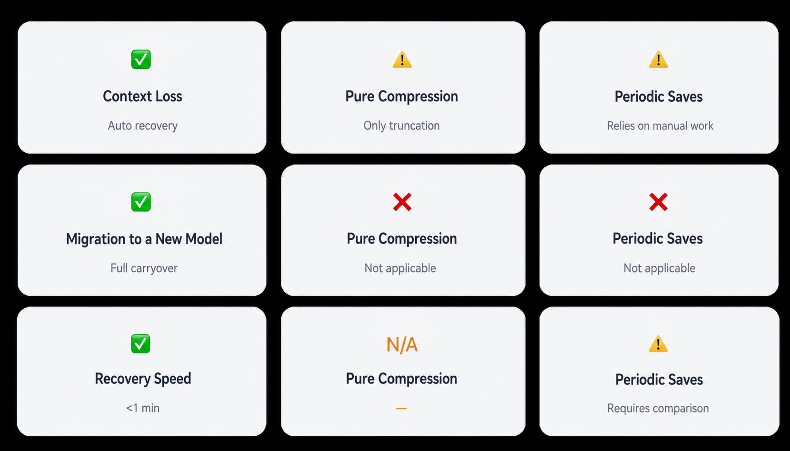

# Did Your Agent Crash? Did the Context Window Overflow? Did It Forget Everything After Switching Models?

Have you ever run into moments like these?

After half a day of debugging, the Agent suddenly crashes and everything has to start over.

The context has grown to 30,000 tokens, and output quality drops off a cliff.

Your plan quota runs out and you switch models. The new Agent comes online: "Hello, I am your new assistant." Everything from the previous conversation is gone.

We have encountered all of these problems, and painfully so. Today we want to share a solution we find elegant: the **death note mechanism**.

## 01 Three "Death Scenarios" That Hurt Every Time

### 01 The Agent Suddenly Crashes

You are in the middle of a complex code refactor. More than ten rounds of conversation and hundreds of tool calls have happened, and the task is almost done. Then the process crashes.

"Hello, I am your AI assistant. How can I help you?"

What was I doing? What was the configuration? Which step had I reached? Everything is forgotten.

### 02 The Context Window Explodes

As a long-running task continues, the output starts to become strange: decisions contradict each other, tool calls repeat, and the model starts hallucinating.

Once the context exceeds the 40% quality threshold, the model begins losing earlier information.

Which part should be compressed? How should the conversation continue after compression? If handled poorly, it can be messier than a crash.

### 03 Memory Loss After Switching Models

The model plan reaches its limit, so you switch to another model. The new model says:

"Hello, I am the new model. Please tell me what you need."

It does not remember the project background, the decisions already made, or the user's preferences. Every switch requires another round of onboarding.

---

## 02 Our Solution: The Death Note

### Core Idea

People write wills before they die. Why can't an Agent write a "death note" before it "dies"?

When an Agent detects that it is about to "die" because of a restart, compression, or model switch, it proactively writes a note that records what it is doing, where it has progressed, and what should happen next.

On the next startup, the new Agent reads the note first and continues seamlessly.

| Trigger | Scenario |
| --- | --- |
| Manual instruction | The user says "I am going to restart," "save progress," or "write a death note" |
| Automatic marker | When tool calls reach 20 or more, prompt the user: "Save a checkpoint?" |

---

## 03 What Should the Note Contain?

```death-note.md
Death Note
# Generated at: 2026-04-10 20:33 | Status: Pending recovery

## 1. Identity
- Agent type: Hermes
- User: Lulin
- Current project: Semiconductor production line Agent

## 2. What was being done before termination
- Task: Debugging the dashboard output prediction model
- Current step: Third round of parameter tuning; baseline has passed
- Completed: Data cleaning / feature engineering / baseline model
- Blocker: Prediction error rate is high; suspect missing X feature
- Next step: Add X feature and retrain

## 3. Core constraints
- User preference: Get to the point, no unnecessary words
- Project rule: Read the source code before making changes

## 4. Key configuration
- Model: MiniMax-M2.5
- Memoria-related memory IDs: [019d7759...]

Status: Pending recovery - read this file when the next Agent starts
```

Shared path, usable across Agents:

`/tmp/death-note/death-note.md`

All Agents share the same path. After the note is written, it is placed here. The next Agent automatically reads it when starting. After recovery, the note is automatically deleted to avoid repeated recovery.

---

## 04 Recovery Flow

1. Agent starts.

2. Check whether the death note exists:

`/tmp/death-note/death-note.md`

3. If it exists, read it -> recover -> delete the note.

If it does not exist, start normally.

4. Connect to Memoria and verify connectivity.

Retrieve related memories, such as where the last session stopped and which pitfalls were encountered.

5. Start working.

The handoff is seamless and the context is complete.

---

## 05 Death Note vs. Other Approaches



---

## 06 Three Main Use Cases

### A. Agent Crash Recovery

Before crash: write the death note with the current task and context snapshot.

Then, or through an automatically triggered long-task checkpoint:

After restart: read the note -> recover context -> continue working.

What used to take 30 minutes of recovery becomes less than one minute of automatic recovery.

### B. Context Window Compression

Detected: context exceeds the 40% threshold.

Write the death note with an essential summary and current task state.

Compression: keep the most recent conversation and use the death note summary as the beginning of the new context.

Continue: the model "remembers" what it was doing, even though details have been dropped.

Compression is no longer "truncation"; it becomes a prepared handoff.

### C. Model Switching

Original model: write the death note with complete state, configuration, and preferences.

Plan limit reached -> switch to a new model.

New model: read the death note and read historical memories from Memoria.

"Hello, I am the new model. You are currently working on the dashboard prediction task for a semiconductor project. The last step was parameter tuning, and the next step is to add X feature. Continue?"

Switching models is no longer "forgetful restart"; it becomes "a role handoff without losing the job."

---

## 07 Working with Memoria

Instant state + long-term experience = complete recovery.

- Death note: preserves instant state. Before restart, compression, or model switching, it writes the current task and context snapshot into the note.
- Memoria: accumulates long-term experience. Lessons, configurations, and memories persist across sessions and can be recalled through semantic retrieval at any time.

The new Agent knows both "what was just happening" and "what pitfalls were encountered before," enabling complete context recovery.

---

## 08 Future Optimization Directions

1. Smarter automated triggers: today this relies on rules, such as 20 or more tool calls. In the future, AI should decide for itself when a moment is worth recording.
2. Linking compression and notes: automatically generate a summary note during context compression, instead of waiting until "death" to write it.
3. Multi-level checkpoints: not only "death" checkpoints, but also checkpoints at key task milestones, forming a version chain.
4. Standardized cross-Agent relay: open the death note path and format as an industry standard so any Agent can read and write it.

---

## Summary

The essence of the death note is to give the Agent a sense of "near-death awareness." It knows it may be about to "die," so at the last moment it puts all key information into a note at a shared location. When the next Agent arrives, it reads the note first and takes over seamlessly.

The Agent no longer fears "death," because it knows it can "come back."

---

Experience Memoria at https://thememoria.ai/
