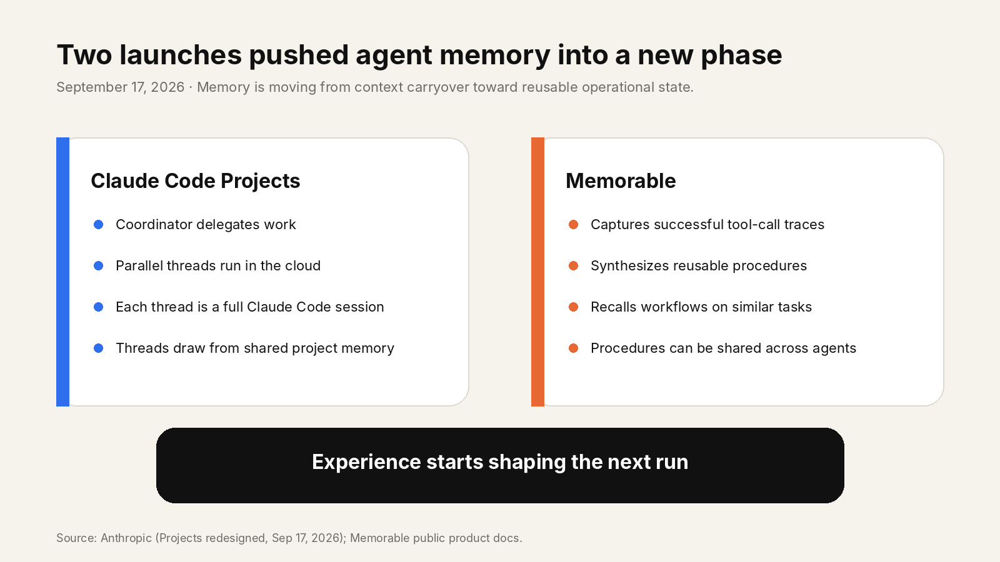
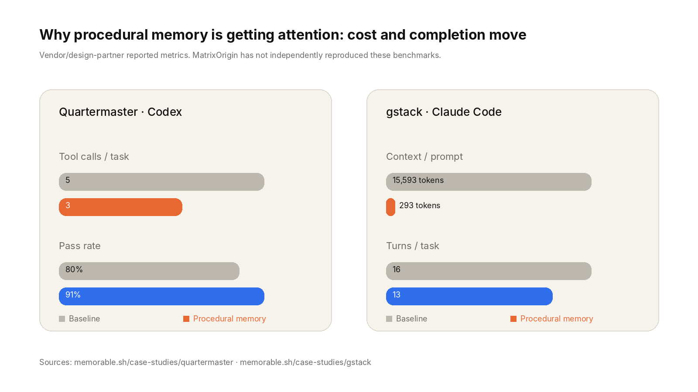
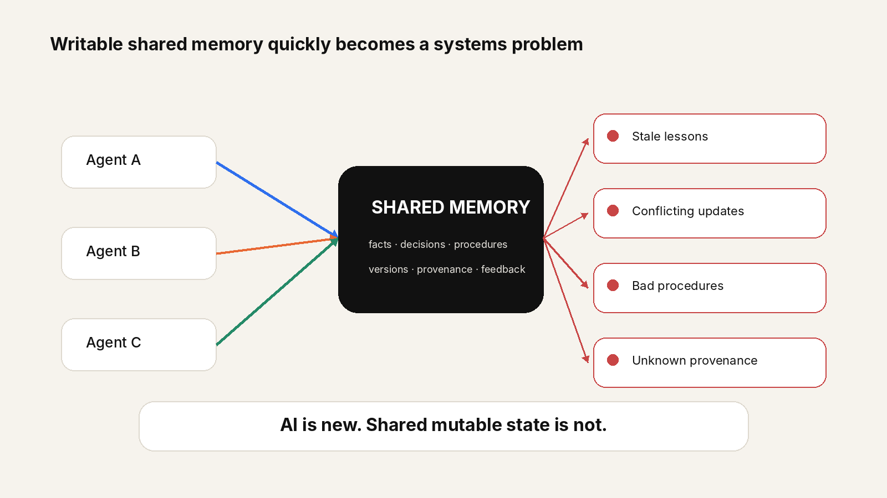
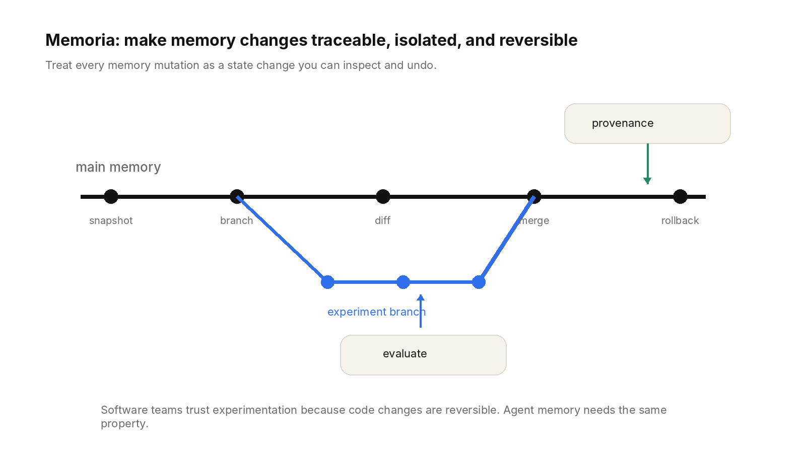

# Agents Learn. Bad Memory Scales Too.

> Claude Projects now coordinates parallel threads with shared memory. Procedural memory is turning successful runs into reusable workflows. The next engineering question is painfully practical: what happens when agents learn the wrong thing?

Two launches landed on September 17 and, together, they make the next agent-infrastructure problem much easier to see.

Anthropic redesigned Claude Code Projects around a coordinator and parallel threads. Each thread is a full Claude Code cloud session working on its own branch and repo copy. Anthropic also says every thread adds to and draws from shared project memory.

Memorable launched procedural, graph-based memory for agents. It captures tool-call traces from successful runs, synthesizes the useful path into a reusable procedure, then recalls that workflow when a similar task shows up again.

The direction is clear: agents are starting to carry operational experience from one run into the next. That can remove a lot of repeated reasoning. It also gives bad memory a much longer half-life.

*Figure 1 · Two public launches on Sep 17 pushed agent memory toward reusable operational state.*

## Bad facts answer badly. Bad procedures behave badly.

An incorrect fact might produce one wrong answer. An incorrect procedure can make the same mistake repeatable. A workaround that succeeded last week may be stale after an API change. A lucky run may look like a reliable playbook. A local optimization can be copied across an entire fleet of agents.

That is why procedural memory is attractive and risky at the same time. The upside is concrete. In Memorable’s public design-partner cases, Quartermaster reports tool calls falling from 5 to 3 and pass rate moving from 80% to 91% on the same fixture. A gstack case reports a learned procedure of 293 tokens versus a 15,593-token general skill, with turns per task falling from 16 to 13 in a replicated run. These are vendor/design-partner numbers, not independent benchmarks, but they show why the idea has momentum.

*Figure 2 · Public, vendor/design-partner reported metrics from Memorable. MatrixOrigin has not independently reproduced them.*

> A bad procedure can turn a one-off failure into a repeatable failure.

## Shared memory brings old systems problems back

Claude’s new architecture makes the systems angle hard to ignore. Code already gets isolation: each worker thread has its own branch, and overlapping changes become ordinary merge conflicts. Shared memory is a different surface. As memory becomes writable and accumulates across workers, teams will need rules for versions, provenance, conflicting updates, stale state, and recovery.

Consider a simple project rule. One thread learns that billing changes require finance approval. Two days later the process changes. Another thread writes the new rule. A third worker still retrieves the old one and turns it into a reusable procedure. Nothing has crashed. The system is simply carrying multiple truths from different points in time.

Database engineers have seen this movie before. The vocabulary is familiar: isolation, versioning, provenance, conflict resolution, rollback. AI is new. Shared mutable state is not.

*Figure 3 · Once multiple agents read and write durable memory, state-management problems move into the critical path.*

## Memory governance is moving into the product core

The market is already signaling this. Memorable’s own documentation now covers procedure revisions and pruning for stale or superseded workflows. That is a healthy design choice, and it proves the broader point: once agents accumulate experience, memory governance stops being a cleanup script. It becomes part of the runtime.

At MatrixOrigin, this is why Memoria treats memory as versioned state. Snapshot, branch, diff, merge, rollback, and provenance are built into the memory lifecycle. An agent can try a new memory path in isolation, evaluate it, merge what works, and return to a known state when quality regresses. MatrixOne’s Copy-on-Write engine provides the underlying data-versioning primitives.

*Figure 4 · Memoria applies version-control primitives to the memory lifecycle.*

Software teams became comfortable changing production code aggressively because the change history is visible and recovery is routine. Long-lived agents need the same confidence around memory. The goal is not to stop learning. The goal is to make learning reversible.

A three-year-old agent will accumulate more than context. It will accumulate shortcuts, procedures, assumptions, preferences, and stale lessons. The hard audit question will be: which of those learned behaviors are still valid today?

> Agents will learn continuously. Production memory needs a way back when they learn the wrong thing.

Claude Projects and procedural memory are useful signals because they push memory closer to the execution path. As that happens, retrieval quality is only one part of the problem. The write path — who changed memory, why, when, with what evidence, and how to undo it — becomes infrastructure.

> Memoria is MatrixOrigin’s open-source memory layer for AI agents. GitHub: [github.com/matrixorigin/Memoria](https://github.com/matrixorigin/Memoria)

## Sources

All links below are public sources. Memorable benchmark figures are vendor/design-partner reported and have not been independently reproduced by MatrixOrigin.

- Anthropic — Projects redesigned: from folder to conversation (Sep 17, 2026) — [https://claude.com/blog/projects-redesigned](https://claude.com/blog/projects-redesigned)
- Memorable — Procedural, graph-based memory for agents — [https://www.memorable.sh/](https://www.memorable.sh/)
- Y Combinator — Memorable company launch page — [https://www.ycombinator.com/companies/memorable](https://www.ycombinator.com/companies/memorable)
- Memorable — Quartermaster case study — [https://www.memorable.sh/case-studies/quartermaster](https://www.memorable.sh/case-studies/quartermaster)
- Memorable — gstack case study — [https://www.memorable.sh/case-studies/gstack](https://www.memorable.sh/case-studies/gstack)
- Memorable — CLI docs: revisions and pruning — [https://www.memorable.sh/docs/cli](https://www.memorable.sh/docs/cli)
- MatrixOrigin — Memoria — [https://github.com/matrixorigin/Memoria](https://github.com/matrixorigin/Memoria)
