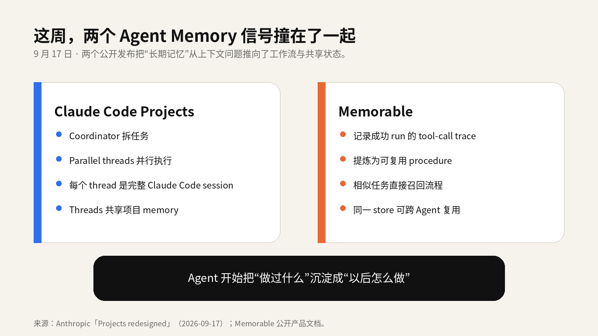
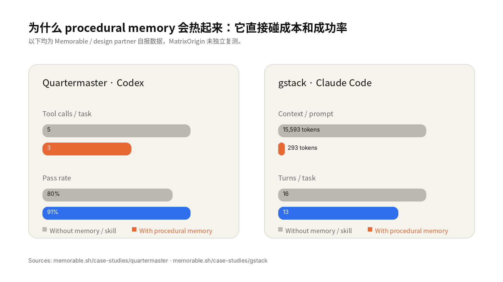
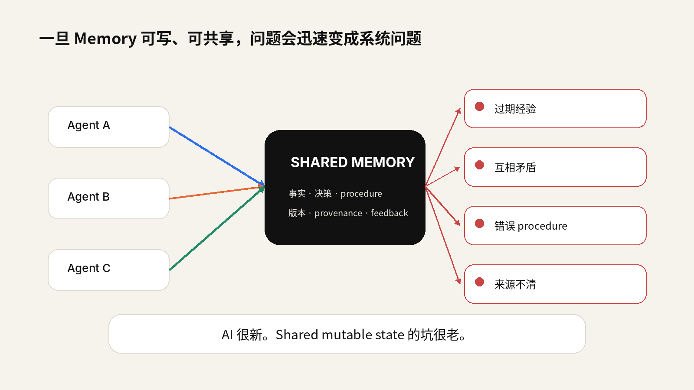
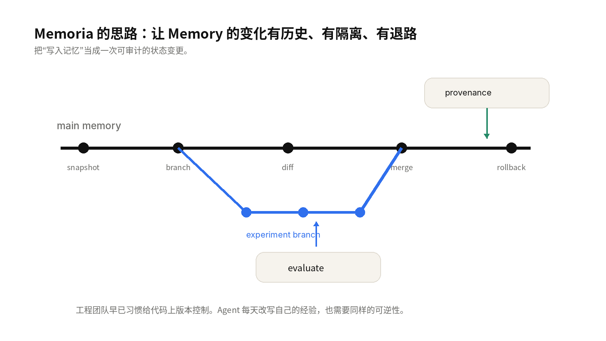

# Agent 会学习，也会把错误学成习惯

> Claude Code 把 shared memory 放进并行工作流；procedural memory 同时升温。接下来的工程难题很直接：一条错误经验写进长期记忆后，怎么找出来，怎么阻止它扩散，怎么回滚？

这周，Agent Memory 的两个信号撞在了一起。

9 月 17 日，Anthropic 更新 Claude Code Projects。一个 coordinator 可以拆任务、调度多个 parallel threads；每个 thread 都是完整的 Claude Code cloud session，在自己的 repo branch 上工作。更关键的一句藏在官方发布里：每个 thread 都会向项目的 shared memory 写入和读取信息。

同一天，Memorable 把 procedural memory 推到台前。它记录 Agent 成功执行时的 tool-call trace，删掉死路，把有效步骤压成可复用 procedure；下一次遇到相似任务，先召回已经走通的路径。

两个产品方向不同，却踩中了同一个变化：Agent 开始把经验带到下一次执行里。以前很多 memory 方案更像“帮模型找回旧信息”；现在，过去的执行结果开始直接影响未来的动作。效率会涨，风险也会有复利。

*图 1｜Claude Projects 与 procedural memory 同时把“经验复用”推向生产工作流。*

## 1. 失忆让 Agent 变慢，误记会让它稳定地做错事

事实类记忆出错，常见后果是一句回答不对。Procedure 写错，性质会更麻烦：它会把一次偶然、一次过时的做法，变成以后每次都优先复用的路径。

想象一个 coding agent。它花了 20 分钟修好一次鉴权 bug，记住了修改文件、命令和验证方式。下次碰到同类问题，直接复用这条路径非常合理。可一周后依赖升级，旧 workaround 已经失效；如果 memory 仍把它当成“成功经验”，Agent 会更快地走向错误答案。

> 一段坏的 procedure，能把偶发错误升级成可重复错误。

这也是 procedural memory 最近容易引起共鸣的原因。Memorable 公布的 design-partner 数据里，Quartermaster 在同一类任务上把 tool calls 从 5 次降到 3 次，pass rate 从 80% 提到 91%；gstack 的一个 Claude Code 场景里，召回的 learned procedure 只有 293 tokens，而原先的通用 skill 是 15,593 tokens。数字来自厂商与合作方，不能当成行业基准，但方向很有吸引力：把已经验证过的经验从长 prompt 里拿出来，按需召回。

*图 2｜Memorable 公开案例中的自报指标。价值点很直接：少走重复路径，少带无关上下文。*

## 2. Shared memory 一上并发，老问题全回来了

Claude Projects 这次更新最值得数据库工程师注意的细节，不是 parallel threads 本身，而是这些 threads 会积累并共享项目 memory。Anthropic 已经给代码并发准备了成熟边界：每个 thread 在自己的 branch 和 repo copy 里工作，代码重叠时按正常 PR 处理 merge conflict。

Memory 的生命周期更暧昧。项目里如果同时存在多条执行线，一条规则今天被 A 更新，明天又被 B 用旧信息改回去；某个 Agent 把推测写成事实；第三个 Agent 把这条错误经验继续包装成 procedure。系统表面上仍然“记得很多”，内部已经产生了时间、来源和版本问题。

工程师会很快碰到一串熟悉的词：versioning、provenance、isolation、conflict resolution、rollback。AI 很新，shared mutable state 的坑很老。

*图 3｜多 Agent 共享可写 Memory 后，冲突、过期与来源追踪会进入主路径。*

## 3. Memory governance 会从“清理工具”变成主能力

有意思的是，procedural memory 的产品已经开始往这个方向补。Memorable 的公开文档里已经出现 revisions、stale / superseded pruning：同一个任务学到不同做法时保留 revision，表现更差或过期的 procedure 可以清理。这个细节很重要，它说明产品一旦允许 Agent 持续积累经验，治理就很难留在外围。

Memory 以后会像代码、配置和数据一样经历变更。一次写入最好能回答几个基本问题：谁写的，依据是什么，当时哪次运行通过了验证，后面改过几次，现在谁在用。缺少这些信息，出了问题只能从行为结果倒推，排查成本会很高。

## 4. 这也是 Memoria 为什么把 Git 的习惯带进 Memory

工程团队不会允许 production code 被直接覆盖，同时没有 history、diff 和 rollback。可今天不少 Agent memory 的写入路径仍然接近 add / search / delete：一条新经验写进去，旧状态很难隔离验证。

Memoria 把 snapshot、branch、diff、merge、rollback 和 provenance 放进 memory lifecycle。Agent 可以在 branch 上尝试新的记忆策略，先做 evaluation，再决定是否 merge；效果回退时，能够回到已知状态。底层 MatrixOne 的 Copy-on-Write 机制负责把 snapshot 和 branch 做成数据库原生能力。

*图 4｜Memoria 的核心思路：让 Memory 的变化像代码变更一样可追踪、可隔离、可回退。*

这里的重点不在“给 Memory 套一层 Git UI”。真正有价值的是可逆性。有了可逆性，Agent 才敢更频繁地学习，团队也敢把长期记忆放进更关键的工作流。

## 5. 接下来要盯的，不只是检索准确率

过去一年，Agent Memory 的讨论经常围绕 vector search、embedding、context window 展开。接下来更值得盯的是 write path：什么东西有资格进入长期记忆，写入前后怎么评估，更新如何保留来源和时间，多个 Agent 共用时怎样避免互相污染。

一个运行三年的 Agent，最难审计的可能不是三年的聊天记录，而是三年里逐渐形成了哪些做事习惯。它会积累捷径，也会积累陈旧假设。某些错误甚至因为“以前成功过”而显得格外可信。

> Agent 会学习。生产环境需要确保它学错时有路可退。

Claude Projects 把 shared memory 推到多 Agent 工作流里，procedural memory 开始把成功执行沉淀成可复用经验。两件事叠在一起，Agent Memory 的下一阶段已经很清楚：存得更多只是起点，真正的工程量在“怎么让记忆安全地变化”。

> Memoria 是 MatrixOrigin 开源的 Agent Memory 项目。GitHub：[github.com/matrixorigin/Memoria](https://github.com/matrixorigin/Memoria)

## 参考资料

以下链接均为公开来源。图表中的 Memorable 数据为厂商/设计伙伴公开披露，未由 MatrixOrigin 独立复测。

- Anthropic — Projects redesigned: from folder to conversation (Sep 17, 2026) — [https://claude.com/blog/projects-redesigned](https://claude.com/blog/projects-redesigned)
- Memorable — Procedural, graph-based memory for agents — [https://www.memorable.sh/](https://www.memorable.sh/)
- Y Combinator — Memorable company launch page — [https://www.ycombinator.com/companies/memorable](https://www.ycombinator.com/companies/memorable)
- Memorable — Quartermaster case study — [https://www.memorable.sh/case-studies/quartermaster](https://www.memorable.sh/case-studies/quartermaster)
- Memorable — gstack case study — [https://www.memorable.sh/case-studies/gstack](https://www.memorable.sh/case-studies/gstack)
- Memorable — CLI docs: revisions and pruning — [https://www.memorable.sh/docs/cli](https://www.memorable.sh/docs/cli)
- MatrixOrigin — Memoria — [https://github.com/matrixorigin/Memoria](https://github.com/matrixorigin/Memoria)

