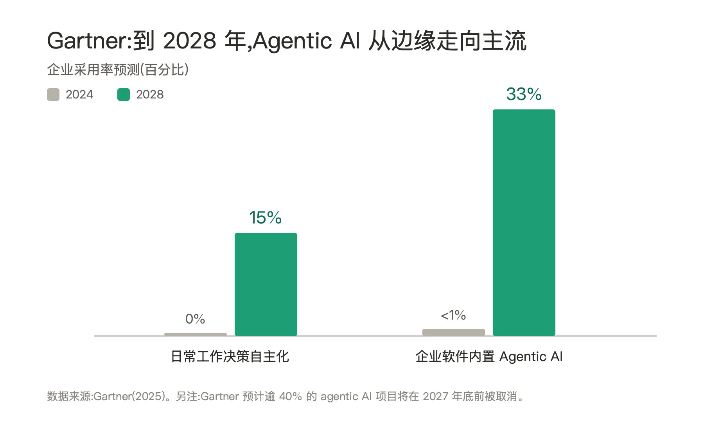
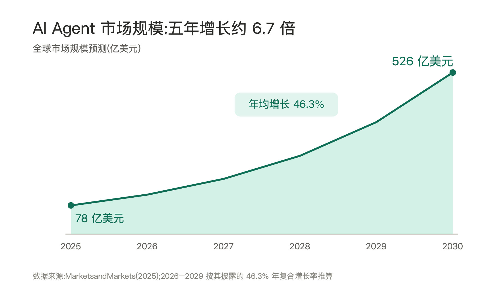
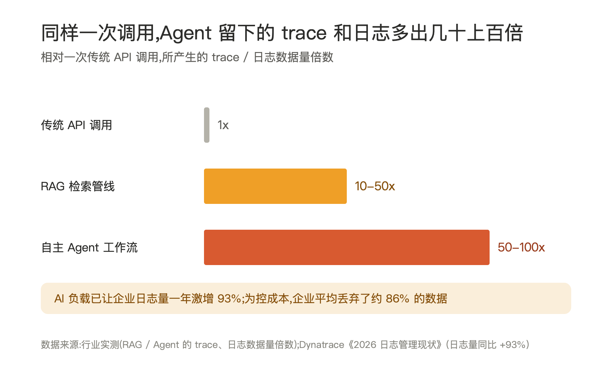
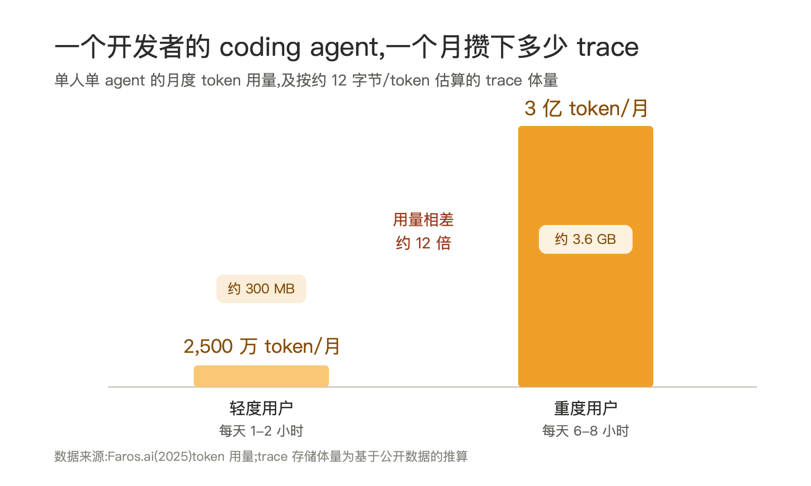

# Agent 正在成为新的"智能手机"和"智能汽车"

## 一、一个正在发生的拐点:Agent 的数量很快会超过人

过去二十年,每一波技术浪潮都可以用一条"数量曲线"来概括。

PC 时代,全球计算机从几百万台长到十几亿台;智能手机时代,联网终端在十年内突破人类总人口,达到 50 亿、60 亿量级;再加上智能汽车、智能音箱、摄像头、传感器这些 IoT 设备,真正联网的"智能终端"早已是地球人口的好几倍。

**今天,Agent 正在重演这条曲线——而且会比以往任何一次都更陡。**

原因很简单:前几波浪潮里,每多一个"智能终端"都对应一次硬件制造、一次物流、一次购买。要多一台手机,就得多造一台手机。而 Agent 不需要。Agent 是软件,是可以被一行代码、一次部署、一次复制就凭空"生出来"的存在。

- 在 C 端,每个人很快会拥有不止一个 Agent:订日程的、管钱的、写代码的、陪你聊天的。
- 在企业端,情况更夸张。每一个岗位、每一条业务流程、每一个微服务,都可能挂上一个甚至一群 Agent:客服、销售、风控、运维、数据分析……它们之间还会互相调用、互相委派,形成一张 Agent 网络。

数量这件事,头部公司已经按"超过人"在规划:Salesforce 公开喊出部署 10 亿个 Agent 的目标;NVIDIA 认为未来企业 IT 部门会变成"管理 AI Agent 的 HR",Agent 数量将达数十亿乃至超过员工人数;Gartner 则预测,到 2028 年约 15% 的日常工作决策将由 AI Agent 自主做出(2024 年几乎为 0),约三分之一的企业软件将内置 agentic AI。

当"造一个 Agent"的边际成本趋近于零,数量增长就不再受物理世界约束。**人类有 80 亿,但 Agent 没有这个上限。** 用不了太久,Agent 的数量就会像当年智能手机超过人口一样,安静地、不可逆地超过人的数量,然后继续往上走一到两个数量级。

## 二、为什么说它"像"智能手机和智能汽车

把 Agent 类比成智能手机和智能汽车,不只因为"数量多",而是因为它们共享同一套增长结构:

**1. 一个新的"单位实体"被定义出来了。** 手机把"一个上网的人"变成可寻址、可计费的终端;汽车把"一次出行"变成可联网、可升级、可数据化的智能体;Agent 则把"一个任务、一个角色、一个意图"变成了一个独立、可被调度的数字实体。每多一个,世界上就多一个会主动产生行为的节点。

**2. 增长靠平台和生态,而不是单点。** 智能手机的爆发不是因为某一款手机,而是 iOS / Android + 应用商店把"造一个 App"的门槛降到极低。Agent 也一样——一旦有了好用的模型、框架、工具协议(MCP 这类标准)和托管平台,"造一个 Agent"会像今天发条朋友圈一样普通。门槛塌掉的那一刻,就是数量曲线起飞的那一刻。市场预测也印证了这条曲线:据 MarketsandMarkets,全球 AI Agent 市场规模将从 2025 年的 78 亿美元增长到 2030 年的 526 亿美元,五年增长约 6.7 倍(年复合增长率 46.3%)。

**3. 它们都是"会持续产生数据的活体"。** 这是最关键、也最容易被忽略的一点。智能手机真正改变世界,不是因为能打电话,而是因为它带着 GPS、摄像头、传感器,7×24 小时产生位置、行为、社交、消费数据;智能汽车的价值也越来越不在四个轮子,而在它每天跑出的几十 TB 路况和驾驶数据。

**Agent 同样如此——而且它产生数据的强度,比前两者都更高。**

## 三、Agent 本身就是一个永不停歇的数据工厂

我们习惯把 Agent 看作"数据的消费者":读文档、查数据库、调 API。但换个角度,**Agent 更是一个高强度的数据生产者。**

智能手机产生的是位置点和点击流,智能汽车产生的是传感器读数。而 Agent 每一次交互,产生的是**密度高得多、语义丰富得多的过程数据**:

- 用户说了什么(输入意图)
- Agent 怎么理解的(推理过程、思维链)
- 它调用了哪些工具、传了什么参数、拿回什么结果
- 中途如何纠错、如何重试、如何在多个方案间权衡
- 最终输出了什么,用户是否满意、是否打断、是否修改

把这一整条链路完整记录下来,就是所谓的 **Agent Trace(智能体轨迹)**。

如果说智能手机的位置数据是"点",智能汽车的行车数据是"线",那么 Agent Trace 就是**带着完整决策上下文的"全过程录像"**。它不只告诉你"发生了什么",还告诉你"为什么这么做、当时怎么想的"。

而且,Agent 产生这种数据的强度,远超传统软件。同样完成一件事,据行业实测,一条 RAG 检索管线产生的 trace 和日志数据,是一次普通 API 调用的 10–50 倍;一个会多轮调用工具、反复推理的自主 Agent 工作流,更高达 50–100 倍。

这股数据洪流已经在冲垮现有系统——Dynatrace《2026 日志管理现状》显示,AI 负载让企业日志量在一年内激增 93%,而为了控制成本,企业平均不得不丢弃约 86% 的数据。**被丢掉的,恰恰是最该用来校正和训练 Agent 的 Trace。**

## 四、具体到一个 Agent:trace 和日志的量有多大

宏观倍数之外,落到单个 Agent 身上,体量同样惊人。最有体感的一把尺子,是一个开发者天天在用的 coding agent。

一次复杂的编码任务,要把代码库塞进上下文、再多轮调用工具和反复推理,留下的 Trace 远不是"一问一答"可比。按公开用量估算:一个轻度用户(每天 1–2 小时)每月约产生 300 MB 的 Trace,而一个重度用户(每天 6–8 小时)每月可达 3.6 GB——**这还只是一个人、一个 Agent。**

把这个数乘上一家公司成百上千名工程师,再乘上客服、风控、运维、数据分析等各类 Agent,**企业一年沉淀下来的 Trace 轻松到 PB 级。** 这正是问题的开始:这么大、这么高频、这么非结构化的数据,现有系统根本扛不住——于是只能像上一节那样,把绝大部分直接丢掉。

> 一句话:**Agent 的 Trace 和日志,正以远超传统软件的强度高速堆积;多到现有系统只能选择丢弃——而被丢掉的,恰恰是最有价值的那部分。**

## 五、Agent Trace 才是真正被低估的资产

很多人把注意力放在"造出更聪明的 Agent",但下一阶段的核心竞争力,会越来越落在**谁能把 Agent Trace 用起来**。因为 Trace 至少在三个层面具有不可替代的价值:

**1. 校正行为(Correction / Evaluation)。** 有了完整 Trace,你才能真正知道 Agent 在哪一步出了错——意图理解错了,工具调错了,还是推理跑偏了。它是评测、调试、对齐的事实依据。没有 Trace,优化 Agent 就像闭着眼睛开车。

**2. 形成记忆(Memory)。** 今天的 Agent 大多是"金鱼记忆",每次会话重头开始。Trace 正是记忆的原材料:从历史轨迹里萃取"这个用户的偏好""这条流程的最佳路径""上次踩过的坑",沉淀成长期记忆。**Trace 是过去,记忆是被结构化、被复用的过去。**

**3. 反哺训练(Training)。** 这是最有想象力的一层。高质量训练数据越来越稀缺,而 Agent Trace 恰恰**自带"过程"和"结果信号"**:成功轨迹是正样本,失败和被纠正的轨迹是天然负样本,用户的接受 / 修改 / 打断是免费的偏好标注。用这些真实数据做后训练、强化学习、蒸馏,模型和 Agent 就能在使用中持续自我进化。

把三层连起来,就是一个**数据飞轮**:

> Agent 越多 → 跑出越多 Trace → Trace 用来校正行为、沉淀记忆、训练模型 → Agent 更强更好用 → 更多人造更多 Agent → Trace 更多……

只不过这一次,飞轮转得更快,因为 Agent 的繁殖不需要工厂。

## 六、对企业而言:真正的瓶颈,是承接 Trace 的数据基础设施

飞轮听起来很美,但对企业来说,有一个冷峻的现实:**今天绝大多数企业的数据基础设施,根本没有为 Agent Trace 这种数据形态做好准备。** 前面那个"被迫丢弃 86% 数据"的数字,就是最直白的证据——企业不是不想用 Trace,而是现有系统扛不住、只能扔。

传统数据栈是为"人产生的、结构化的、低频的"数据设计的——订单、报表、点击日志,落进数仓、跑跑 BI。而 Agent Trace 是另一个物种:

- **量级不同:** 它由机器 7×24 小时高频产出,如前所示,一个 Agent 一天产生的轨迹可能就超过一个人一年的操作日志。规模化之后,Trace 体量会以"机器并发 × 交互密度"的速度膨胀,直接冲击存储和成本。
- **形态不同:** 它是半结构化、高维、嵌套的——既有自然语言,又有工具调用的结构化参数,还有思维链、中间状态、时序关系。用传统关系表很难优雅地装下。
- **用途不同:** 同一份 Trace,既要支持**实时**的监控告警与行为干预,又要支持**离线**的评测、记忆萃取和模型训练。一份数据要同时服务在线和离线两套链路。
- **治理要求不同:** Trace 里塞满了用户隐私、业务机密、敏感操作。它既是金矿,也是合规与安全的高压线——一旦泄露或滥用,代价远超普通日志。

换句话说,**企业要真正吃到 Agent 的红利,先要补上一层"为 Trace 而生"的数据基础设施。** 这层基础设施至少要回答几个问题:

1. **采集与标准化:** 怎么从五花八门的 Agent、框架、模型里,以统一的 schema 把 Trace 完整、低损耗地收上来?(OpenTelemetry for Agents 这类标准会变得很重要)
2. **存储与成本:** 怎么用分层存储、压缩、冷热分离,扛住指数级增长的数据量而不被成本拖垮——而不是像今天这样被迫丢掉 86%?
3. **检索与关联:** 怎么把一次跨多个 Agent、多次工具调用的完整链路串起来,做到"任意一次行为都可回溯、可下钻"?
4. **加工与复用:** 怎么把原始 Trace 流水线化地加工成三种产物——**评测集、记忆、训练数据**,让飞轮真正转起来?
5. **治理与安全:** 怎么做脱敏、分级、访问控制和审计,让 Trace 既能被用起来,又不踩合规红线?

能把这五件事做扎实的企业,等于给自己装上了一个**"Agent 数据中台"**:对外,它让每一个 Agent 都变得可观测、可治理、可信赖;对内,它把每一次交互都变成沉淀下来的资产,而不是用完即弃的日志。**没有这层基础设施,Agent 越多,企业积累的只是越来越贵的噪声;有了这层基础设施,Agent 越多,企业的数据护城河就越深。**

## 七、结语:为"Agent 洪流"提前布局

我们正站在一个和 2008 年(iPhone + App Store)、和 2014 年前后(汽车联网化)同等量级的拐点上。

- **数量上:** Agent 会像智能手机和 IoT 设备一样,在很短的时间里超过人的数量,并继续指数级增长。
- **数据上:** 每一个 Agent 都是高强度的数据工厂,它产出的 Agent Trace,是迄今为止最丰富的"决策行为数据",规模已是 PB 级起步。
- **能力上:** 谁能把 Trace 用于校正、记忆和训练,谁就掌握了让 Agent 持续进化的飞轮。
- **门槛上:** 而对企业而言,能不能转动这个飞轮,取决于有没有一层**为 Trace 而生的数据基础设施**。

所以,真正值得现在就投入的,可能不只是"再造一个更聪明的 Agent",而是**为即将到来的 Agent 洪流,提前建好承接它的数据基础设施**:

> 怎么**采集**每一条 Trace、怎么**存储和检索**海量轨迹、怎么把 Trace 变成**可评测的指标**、**蒸馏成记忆**、**喂回训练**,又怎么在这之上做好**治理与安全**——

当 Agent 真的成为新的"智能手机"和"智能汽车"时,**赢家未必是造出最多 Agent 的人,而是建好了数据基础设施、最懂得使用这些 Agent 留下的数据的人。**
