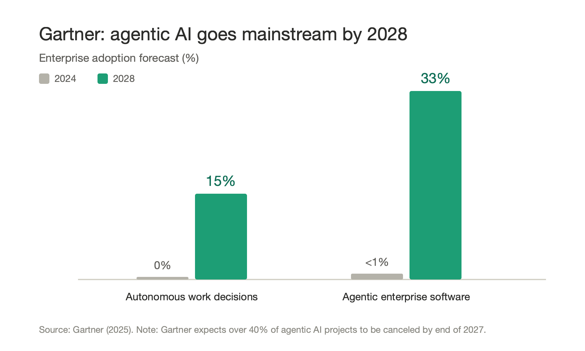
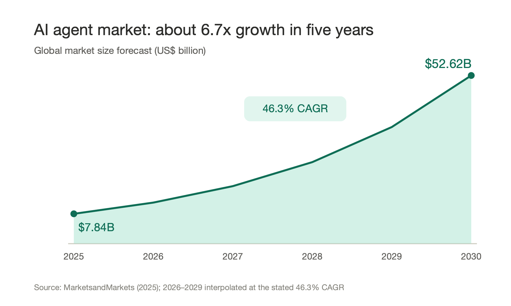
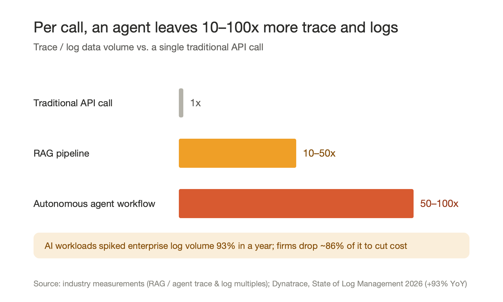
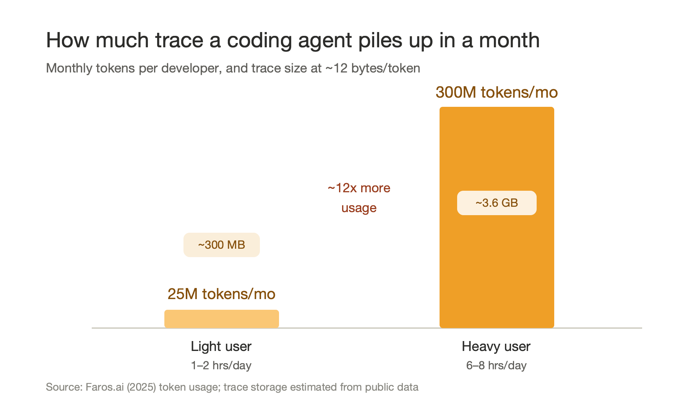

# Agents Are Becoming the New "Smartphones" and "Smart Cars"

## 1. A turning point already underway: agents will soon outnumber people

Over the past two decades, every wave of technology could be summed up by a single "count curve."

In the PC era, the world's computers grew from a few million to well over a billion. In the smartphone era, connected terminals broke past the human population within a decade, reaching 5–6 billion. Add in smart cars, smart speakers, cameras, and sensors, and the number of truly connected "smart endpoints" had long since become several times the planet's population.

**Today, agents are replaying this curve—and they will climb it more steeply than anything before.**

The reason is simple. In every previous wave, each new "smart endpoint" meant one act of manufacturing, one shipment, one purchase. To get one more phone, you had to build one more phone. Agents don't work that way. An agent is software—something that can be conjured into existence with a line of code, a single deployment, a single copy.

- On the consumer side, each person will soon own more than one agent: one to manage your calendar, one for your money, one to write code, one to keep you company.
- On the enterprise side, it gets even wilder. Every role, every business process, every microservice may carry one—or a whole swarm of—agents: customer service, sales, risk control, operations, data analysis… and they call and delegate to one another, forming a network of agents.

This is no longer rhetoric—the biggest companies are already planning around "more than people." Salesforce has publicly set a goal of deploying 1 billion agents; NVIDIA argues that enterprise IT will become "the HR department for AI agents," with agents numbering in the billions and eventually exceeding headcount; and Gartner predicts that by 2028, around 15% of day-to-day work decisions will be made autonomously by AI agents (up from roughly 0% in 2024), with about a third of enterprise software embedding agentic AI.

Once the marginal cost of "making an agent" approaches zero, growth is no longer bound by the physical world. **There are 8 billion humans, but there is no such ceiling on agents.** Before long, the number of agents will—quietly and irreversibly, just as smartphones once passed the human population—exceed the number of people, and then keep climbing one or two orders of magnitude higher.

## 2. Why they look like smartphones and smart cars

Casting agents as the new smartphones and smart cars isn't just about "big numbers." It's because they share the same growth structure:

**1. A new "unit entity" gets defined.** The phone turned "a person online" into an addressable, billable terminal; the car turned "a trip" into a connected, upgradable, data-generating machine. The agent turns "a task, a role, an intent" into an independent, schedulable digital entity. Every new one adds another node to the world that actively produces behavior.

**2. Growth rides on platforms and ecosystems, not single products.** The smartphone explosion wasn't about any one phone—it was iOS / Android plus the app stores driving the cost of "making an app" down to nearly nothing. Agents are the same: once you have capable models, frameworks, tool protocols (standards like MCP), and hosting platforms, "making an agent" becomes as ordinary as posting to social media. The moment that barrier collapses is the moment the count curve takes off. Market forecasts bear this out: per MarketsandMarkets, the global AI agent market will grow from about US$7.84 billion in 2025 to about US$52.62 billion in 2030—roughly 6.7x in five years (a 46.3% CAGR).

**3. They are all "living things that continuously generate data."** This is the most important point—and the easiest to overlook. The smartphone changed the world not because it could make calls, but because, with GPS, cameras, and sensors, it generates location, behavior, social, and consumption data 24/7. The value of a smart car lies less and less in its four wheels and more and more in the tens of terabytes of road and driving data it produces every day.

**Agents are the same—and they generate data at even higher intensity than either.**

## 3. An agent is a never-resting data factory

We're used to thinking of agents as "consumers of data": they read documents, query databases, call APIs. But flip the lens, and **an agent is even more a high-intensity producer of data.**

A smartphone produces location points and clickstreams; a smart car produces sensor readings. But every single interaction of an agent produces a far denser, far more semantically rich stream of process data:

- What the user said (the input intent)
- How the agent understood it (the reasoning, the chain of thought)
- Which tools it called, with what parameters, and what came back
- How it corrected course, retried, and weighed competing options along the way
- What it finally output, and whether the user was satisfied, interrupted, or edited it

Record this entire chain end to end, and you get what's called an **Agent Trace**.

If the smartphone's location data is a "point" and the smart car's driving data is a "line," then an Agent Trace is **a full-process recording that carries the complete decision context**. It tells you not only "what happened," but "why it was done that way, and what the agent was thinking at the time."

What's more, the intensity at which agents generate this data far exceeds traditional software. To accomplish the same task, industry measurements show that a single RAG retrieval pipeline produces 10–50x the trace and log data of an ordinary API call; an autonomous agent workflow—calling tools across many turns and reasoning repeatedly—produces as much as 50–100x.

This flood is already breaking existing systems. Dynatrace's *State of Log Management 2026* reports that AI workloads spiked enterprise log volume by 93% in a single year—and that, to control cost, organizations are forced to discard roughly 86% of the data. **And what gets thrown away is precisely the Trace that should be used to correct and train agents.**

## 4. Down to a single agent: just how much trace and log is that

Beyond the macro multiples, the volume is just as striking for a single agent. The most tangible yardstick is the coding agent a developer uses every day.

A complex coding task has to stuff the codebase into context, then call tools and reason across many turns; the Trace it leaves behind is nothing like a single question-and-answer. By public usage estimates, a light user (1–2 hours/day) generates about 300 MB of Trace per month, while a heavy user (6–8 hours/day) can hit 3.6 GB per month—**and that's just one person, one agent.**

Multiply that by the hundreds or thousands of engineers in a company, then again by every kind of agent for customer service, risk control, operations, and analytics, and **the Trace a single enterprise accumulates in a year easily reaches the petabyte scale.** That's where the problem begins: data this large, this high-frequency, this unstructured is more than existing systems can hold—so, as in the previous section, most of it simply gets thrown away.

> In one line: **agent Trace and logs are piling up at an intensity far beyond traditional software—so much that existing systems can only discard them, and what gets discarded is exactly the most valuable part.**

## 5. Agent Trace is the truly underrated asset

Many people fixate on "building a smarter agent," but the core competitive edge of the next phase will increasingly come down to **who can actually put Agent Trace to use.** Because Trace is irreplaceable on at least three levels:

**1. Correction / Evaluation.** Only with complete Trace can you truly know where an agent went wrong—was it a misread intent, a wrong tool call, or reasoning that drifted off course? Trace is the factual basis for evaluation, debugging, and alignment. Without it, optimizing an agent is like driving with your eyes closed.

**2. Memory.** Today's agents mostly have "goldfish memory," starting over with every session. Trace is the raw material for memory: from historical trajectories you can distill "this user's preferences," "the best path through this process," "the pitfalls we hit last time," and crystallize them into long-term memory. **Trace is the past; memory is the past made structured and reusable.**

**3. Training.** This is the most imaginative layer. High-quality training data is increasingly scarce, and Agent Trace happens to **carry both "process" and "outcome signals":** successful trajectories are positive samples, failed and corrected ones are natural negatives, and a user's accept / edit / interrupt is free preference labeling. Feed this real data into post-training, reinforcement learning, and distillation, and models and agents can keep evolving through use.

Connect the three layers and you get a **data flywheel:**

> More agents → more Trace produced → Trace used to correct behavior, accumulate memory, and train models → stronger, more useful agents → more people building more agents → even more Trace…

Except this time the flywheel spins faster—because breeding agents needs no factory.

## 6. For enterprises: the real bottleneck is the data infrastructure to catch the Trace

The flywheel sounds wonderful, but enterprises face a sobering reality: **today's data infrastructure, in most organizations, simply isn't ready for a data form like Agent Trace.** That earlier figure—"forced to discard 86% of the data"—is the bluntest evidence: it's not that enterprises don't want to use Trace, it's that existing systems can't handle it and have no choice but to throw it out.

The traditional data stack was designed for data that is "human-generated, structured, and low-frequency"—orders, reports, clickstreams—landing in a warehouse to run BI. Agent Trace is another species entirely:

- **Different scale:** It's produced by machines 24/7. As shown above, a single agent's trajectories in one day can exceed a person's operational logs for a whole year. At scale, Trace volume balloons at the rate of "machine concurrency × interaction density," hitting storage and cost head-on.
- **Different shape:** It's semi-structured, high-dimensional, and nested—natural language plus structured tool-call parameters plus chains of thought, intermediate states, and temporal relationships. A traditional relational table can't hold it gracefully.
- **Different uses:** The same Trace must serve both **real-time** monitoring, alerting, and behavioral intervention, and **offline** evaluation, memory distillation, and model training. One body of data has to serve both online and offline pipelines.
- **Different governance demands:** Trace is packed with user privacy, business secrets, and sensitive actions. It's both a gold mine and a high-voltage line for compliance and security—a leak or misuse costs far more than an ordinary log.

In other words, **to truly capture the agent dividend, an enterprise must first add a layer of data infrastructure built for Trace.** That infrastructure has to answer at least these questions:

1. **Capture and standardization:** How do you collect Trace, completely and with low loss, from a motley mix of agents, frameworks, and models into a unified schema? (Standards like OpenTelemetry for agents will matter a lot here.)
2. **Storage and cost:** How do you use tiered storage, compression, and hot/cold separation to withstand exponentially growing volume without being crushed by cost—instead of being forced, as today, to drop 86%?
3. **Retrieval and correlation:** How do you stitch together a full chain that spans multiple agents and many tool calls, so that "any single behavior is traceable and drillable"?
4. **Processing and reuse:** How do you turn raw Trace, in a pipelined way, into three products—**evaluation sets, memory, and training data**—so the flywheel actually spins?
5. **Governance and security:** How do you do redaction, classification, access control, and auditing so Trace can be used and still stay on the right side of compliance?

An enterprise that nails these five things has effectively installed an **"Agent Data Platform":** outward, it makes every agent observable, governable, and trustworthy; inward, it turns every interaction into an accumulated asset rather than a use-once-and-discard log. **Without this layer, the more agents you have, the more expensive noise you accumulate; with it, the more agents you have, the deeper your data moat.**

## 7. Closing: get ready for the "agent flood" now

We're standing at an inflection point on par with 2008 (iPhone + App Store) and the mid-2010s (the connected car).

- **On count:** Like smartphones and IoT devices, agents will surpass the number of people in short order, and keep growing exponentially.
- **On data:** Every agent is a high-intensity data factory, and the Agent Trace it produces is the richest "decision-and-behavior data" we've ever had—already starting at petabyte scale.
- **On capability:** Whoever can turn Trace into correction, memory, and training holds the flywheel that keeps agents evolving.
- **On the threshold:** And for enterprises, whether you can spin that flywheel comes down to whether you have a layer of data infrastructure built for Trace.

So what's truly worth investing in now may not just be "building a smarter agent," but **building, ahead of time, the data infrastructure that will catch the coming agent flood:**

> how to **capture** every Trace, how to **store and retrieve** trajectories at massive scale, how to turn Trace into **measurable metrics**, **distill it into memory**, **feed it back into training**—and how to do **governance and security** on top of all that.

When agents truly become the new "smartphones" and "smart cars," **the winner may not be whoever builds the most agents, but whoever has built the data infrastructure—and best knows how to use the data those agents leave behind.**
