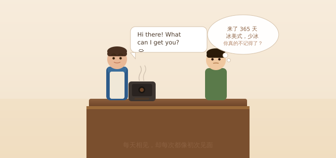
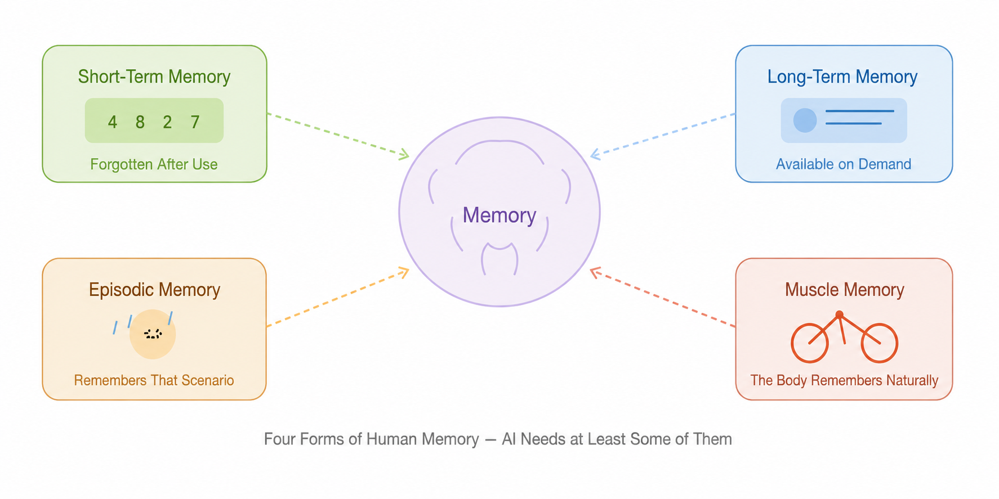
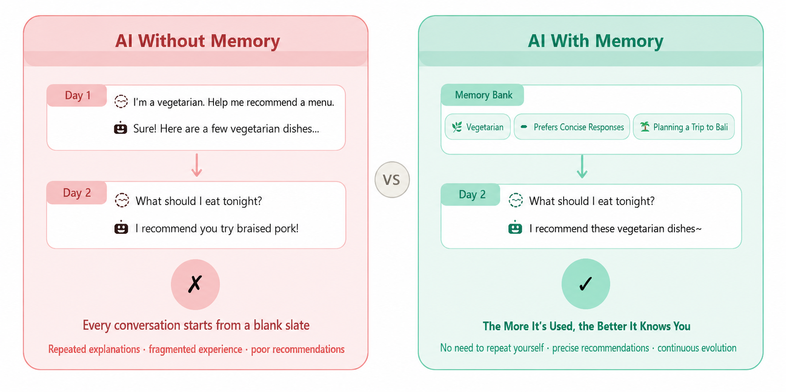
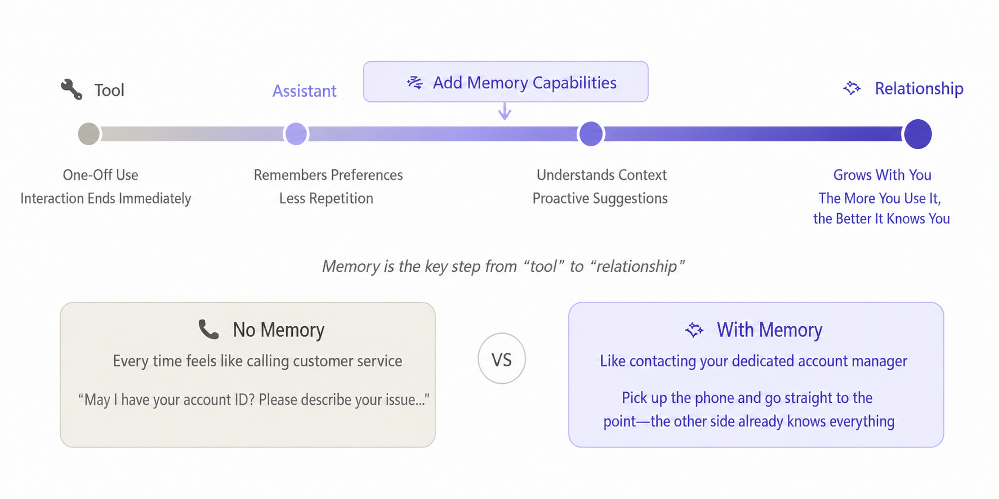

# Why Do AI Agents Need Memory?

Have you ever had this experience?

You go to the same coffee shop every day, but the barista always looks at you as if it is the first time you have met. "Hello, what would you like?" Come on. I have been coming here for a year. Iced Americano, less ice, please.

Chatting with today's AI often feels much the same.

---

## Does Every Chat Have to Feel Like the First Meeting?

You open ChatGPT, talk for an hour, and plan your weekend trip. Then you close the window. The next day, you open it again:

"Hello! How can I help you?"

...Did we not just talk yesterday?

You have to explain who you are, where you are going, what kind of hotel style you like, and that you do not eat spicy food. Everything starts from scratch.

It is like having a friend who forgets you every time they go to sleep. Your friendship is forever stuck at "Nice to meet you."

To be honest, this is how we have been using AI over the past few years. It works, but something has always felt missing. That missing piece is memory.

---

## Think About How Powerful Your Brain Is

We rarely notice how important memory is in daily life because it feels so natural.

When you go to your regular noodle shop, the owner glances at you and asks, "The usual?" You nod, and that is it. They remember your taste.

When you have a meeting with colleagues, you do not have to start every time with "What does our company do?" You share common memory.

When you learned to ride a bicycle as a child, you fell a few times and then learned it. Even if you do not ride for ten years, you still do not forget. Your body remembers it for you.

Human memory comes in several forms. In simple terms:

🧠 **Short-term memory** -- A verification code you just saw, used once and then forgotten. Normal operation.
🧠 **Long-term memory** -- Your name, where you live, and your favorite movie.
🧠 **Episodic memory** -- It rained on your birthday last year, and you remember the scene.
🧠 **Muscle memory** -- Typing, riding a bike, chopping vegetables. You can do them without thinking.

AI does not need to have feelings, but it should at least remember things related to you, right? Otherwise, how can it become smoother to use over time?

---

## AI Without Memory: A Collection of Failure Scenes

See which of these sounds familiar:

🤦 **"I am vegetarian" -- and then it recommends braised pork**
Yesterday, you just told the AI that you are vegetarian, and it even listed a bunch of vegetarian recipes for you. Today, you say, "Recommend something for dinner," and it enthusiastically serves up a plate of braised pork ribs.

🤦 **Travel plan? What travel plan?**
You spent an hour finalizing a trip to Dali with the AI: hotels, attractions, and routes were all selected. The next day, you say, "Help me continue optimizing the itinerary," and it replies, "Where would you like to travel?"

🤦 **"Keep it concise" -- and it writes a thesis**
You clearly said, "Keep the answer concise. Do not be verbose." In the next conversation, it starts writing at great length again, as if that exchange never happened.

The root cause is the same in every scenario: AI has no memory. Every conversation starts with a blank page.

## 

## With Memory, the Whole Experience Changes

The good news is that leading AI products have already started to "remember." How well does it work? Let us look directly:

### ChatGPT: No More "Training a New Employee" Every Day

In April 2025, OpenAI made a major upgrade to ChatGPT: it can now remember what you have discussed before and automatically use that information next time.

Told it "I am lactose intolerant"? Future recipe recommendations automatically skip milk. Said "I like tables"? Future answers default to table formatting.

It feels like you have finally moved from "bringing a new intern up to speed every day" to "having a reliable long-term partner."

### Google Gemini: It Remembers Not Only What You Say, but Also What You Do

In 2025, Google added "Personal Context" to Gemini. It does not only remember conversation content. It can also combine data from Gmail, Google Photos, and other services to understand you.

You say, "Help me prepare for next week's meeting." It knows your schedule, remembers the unresolved issue you raised in the previous meeting, and even knows that you prefer dark backgrounds in PPT slides.

It feels a bit like an assistant who has worked with you for three years.

### Claude: Memory Is Fully Transparent, and You Decide

Anthropic's Claude has also added memory, but it has taken a different path: full transparency. You can see what it remembers, edit it at any time, and delete it at any time. It also categorizes memories into work roles, current projects, personal preferences, and more.

Many people's biggest concern about AI memory is, "What is it secretly remembering about me?" Claude's answer is: everything is laid out for you to see, and you decide.

---

## Not Just Chatbots: Memory Is Changing Many Products

Memory is certainly useful for general assistants, but it becomes even more interesting in vertical scenarios:

🏃 **AI fitness coach**
"You ran 3 km more this week than last week. Nice work!" Instead of asking every time, "What kind of exercise do you usually do?"

📚 **AI learning companion**
It remembers where you are in your learning, which knowledge points you often get wrong, and when your attention is strongest. It understands your learning rhythm better than you do.

✈️ **AI travel planner**
It knows that you like niche destinations, prefer homestays over hotels, and dislike rushed itineraries. Every plan iterates on your preferences instead of starting from zero.

💬 **AI companionship products (such as Character.AI and Replika)**
They remember what you talked about before, how you have been feeling recently, and the names of friends you mentioned. This turns "chatting with AI" into "interacting with a character who understands you."

💰 **AI bookkeeping assistant**
"You spent 800 yuan on milk tea this month, 40% more than last month. Do you want to cut back?" Painful, but useful.

---

## Ultimately, Memory Turns AI from a "Tool" into a "Relationship"

What is AI without memory? A tool. You use it and leave, and it does not know you. Every interaction is a one-off transaction.

What about AI with memory? It starts to feel a bit like a relationship. It knows you, understands you, and becomes more in sync with you over time.

For example:

📞 Without memory = every time you call customer service, you hear, "May I have your account number? Please describe your issue." You start from scratch.
🤝 With memory = you have a dedicated customer manager who remembers everything about your situation and gets straight to the point as soon as the call starts.

Which experience is better hardly needs saying.

---

## But Memory Also Comes with Challenges

Every good thing has another side, and AI memory is no exception:

🔒 **Privacy**: It remembers so much about me. Is that safe? What if it leaks? That is why mainstream products now emphasize that users can view, edit, and delete memories.

🤔 **What if it remembers incorrectly?** AI may remember your preference in the opposite way and then keep making suggestions based on wrong information. A good memory system needs the ability to correct errors.

🗑️ **I want it to forget some things**: Just as in life, there are things you do not want brought up repeatedly. AI also needs to support "selective forgetting."

Fortunately, the industry is taking these issues seriously. "User control over their own memories" is becoming a baseline consensus in AI product design.

---

## A Few Final Words

Why does AI need memory? The reason is very simple:

This is how people interact with one another.

You do not get to know your friends again every day. You do not reorder from scratch every time you visit your regular shop. You do not start every meeting by saying, "Hello everyone, my name is Zhang San."

Memory is the foundation of relationships, the prerequisite for efficiency, and the starting point for "understanding you better over time."

Only when AI has memory can it move from being a cold tool to becoming a truly useful partner that gets smoother to use over time.

---

## A Quick Recommendation: Memoria

After saying so much about the importance of AI memory, you may wonder: who is actually solving this problem?

Here is an open-source project we are building: [Memoria](https://github.com/matrixorigin/Memoria).

Simply put, Memoria is infrastructure that gives AI Agents "long-term memory." It is a memory service based on the MCP (Model Context Protocol), allowing your AI assistant to remember your preferences, facts, and decisions across conversations.

It has several interesting features:

🧬 **Manage memory like Git** -- This is Memoria's most distinctive feature. Every memory change has snapshots and audit trails. You can create branches for experimental attempts, roll back if you are not satisfied, and merge if you are. Just as developers use Git to manage code, Memoria lets you manage AI memory in the same way.

🔍 **Semantic search** -- It is not simple keyword matching. Memories are retrieved by meaning. If you say, "I do not drink milk," a later search for "dietary restrictions" can also find that memory.

🛡️ **Self-governance** -- Built-in contradiction detection and isolation of low-confidence memories. AI will not become confused because it remembered two mutually contradictory pieces of information.

🔒 **Privacy first** -- Supports local deployment and local embedding models, so your data can stay entirely on your own machine.

Memoria currently supports mainstream AI tools including Kiro, Cursor, Claude Code, Codex, and OpenClaw. Any Agent compatible with the MCP protocol can use it.

In fact, the article you are reading was written in an AI environment equipped with Memoria. It remembers my writing preferences, project background, and previous discussions, so I do not have to explain everything from scratch each time.

That is exactly the point we have been talking about all along: AI with memory simply feels different to use.

If you are interested, visit [GitHub](https://github.com/matrixorigin/Memoria), give it a star, and try adding memory to your AI 🧠
