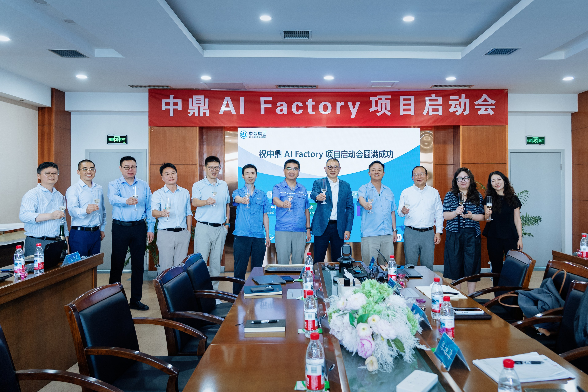
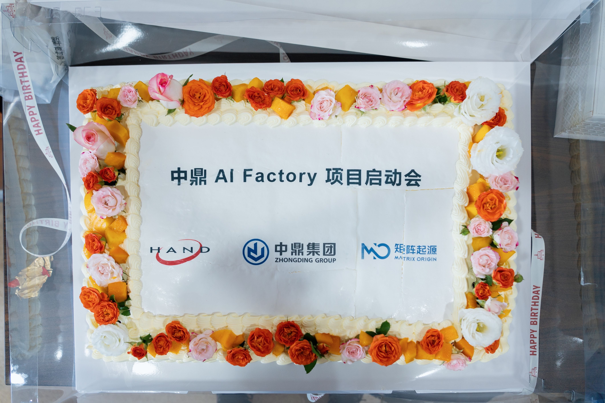

# 矩阵起源、汉得信息、中鼎集团共建 AI Factory，打造全球化智能制造新样板

2026年8月19日，矩阵起源、汉得信息与中鼎集团的 AI Factory 项目在安徽宁国正式启动。

作为一家业务遍布全球的制造企业，中鼎集团对 AI 的期待，早已不仅是验证几个应用是否可行，而是希望 AI 真正融入产品研发、质量管理、供应链协同和生产运营等日常业务，成为企业持续提升效率与创新能力的重要组成部分。

此次合作，三方将围绕企业级 AI 基础设施建设展开深度协同，共同打造覆盖数据治理、知识构建、智能检索、Agent 运行与业务应用的一体化 AI Factory，让 AI 从概念验证走向规模化生产应用。

## 三层抓手：一个“可生长”的 AI Factory 是怎么建出来的

AI Factory 要支撑的不是“几个验证场景”，而是“长期、多场景、跨业务线”的持续运行。围绕这一目标，我们设计了三层架构，解决规模化中不同层级的问题。

### 数据与智能底座层：矩阵起源 MatrixOne Intelligence

在数据与智能底座层，矩阵起源以 MatrixOne Intelligence（MOI）为核心，构建 AI Factory 的统一数据与知识底座。MOI 基于自研的 MatrixOne 多模态数据库，将结构化数据、非结构化内容、向量结果与业务元数据在同一体系内统一管理与治理，支持向量检索与全文检索的结合，让图纸、文档与结构化数据的元数据及向量结果同层管理，检索类场景无需再各自搭建数据链路；同时集成 OCR、视觉理解模型（VLM）、大语言模型（LLM）与 Agent 运行等能力，让 AI 真正“读懂”图纸、文档与工艺知识。

### 业务应用层：汉得信息「得·灵」企业级AI产品/服务体系

在应用层，汉得信息基于近三十年积累的企业数字化转型经验，依托「得灵」企业级 AI 应用产品与服务体系，帮助客户构建可持续演进的全球化 AI Factory。从方案设计、应用开发到上线运营，汉得的方案、业务、开发与交付团队与客户业务方并肩推进，将底座能力进一步连接到研发、质量、供应链等真实业务流程，让 AI 真正服务于制造现场。

### 软件技术栈层：NVIDIA AI Enterprise

在软件技术栈层，我们引入 NVIDIA AI Enterprise。其面向 AI 开发的微服务、框架与库，和先进的 GPU 编排、基础设施管理相集成，构成生产就绪的企业级商业软件套件，让企业以优化的资源利用率规模化运行 AI 工作负载。

引入这套技术栈的关键在于「可扩展」：验证阶段场景少、并发低，怎么部署都能跑；一旦场景增多、多业务线并发使用，推理服务的标准化部署与模型定制能力就成为必要条件——NVIDIA NIM 负责推理服务的标准化部署，NVIDIA NeMo 负责模型定制，与项目算力规划同步推进。

## 底座之上，场景生长

AI Factory 的宏大蓝图，从来不是被模型能力卡住的，而是被数据卡住的：数据是否一致、是否可用、底座是否稳健，往往决定了多个场景能否并行推进。图纸、工艺、质检记录、历史成交价，这些知识原本散落在各系统与个人手中；一旦被统一治理并开放检索，它们就从"单个场景的输入"升级为"所有场景共享的底座养料"。为此，项目前期将聚焦为中鼎搭建图纸知识库，把历史图纸沉淀为可复用、可检索的资产，支持工程师实现零件图纸以图搜图与工序作业指导书自动生成，加速企业生产制造流程。

## 从一次落地，到一套可全球复制的范式

中鼎 AI Factory 的启动，不是为了一次性的“上线几个 AI 应用”，而是为了跑通一条可全球复制的智能化转型路径。当 AI 平台、业务场景、Token 化能力与全球化规划方法论被一同验证，企业便拥有了一套可推广的智能化转型范式——今天在中鼎流体，明天可以走进集团每一个海外工厂。

未来，矩阵起源将继续携手汉得信息等生态伙伴，把在中鼎沉淀的方法论、工具与平台能力打磨成可复用的标准件，让 AI Factory 从“一个项目”走向“一种能力”，赋能更多中国制造企业完成从“数字化”到“智能化”的跨越。

## 关于汉得信息

汉得信息是国内领先的企业级数智化产品和解决方案综合提供商，长期服务企业数字化转型一线，提供全方位的数字化智能化产品、解决方案及企业级应用生态服务，致力于推动AI与业务流程深度融合，助力企业智能化升级。

## 关于中鼎集团

中鼎集团是全球领先的机械基础件和汽车零部件跨国企业集团，长期深耕密封系统、减震降噪及智能底盘、流体及热管理、智能悬架系统等领域。公司业务遍及全球20多个国家和地区，致力于为全球客户提供高品质的系统解决方案。
