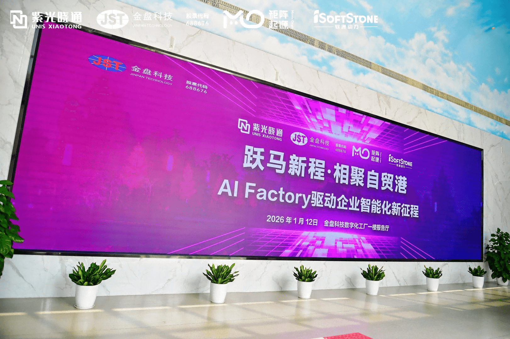
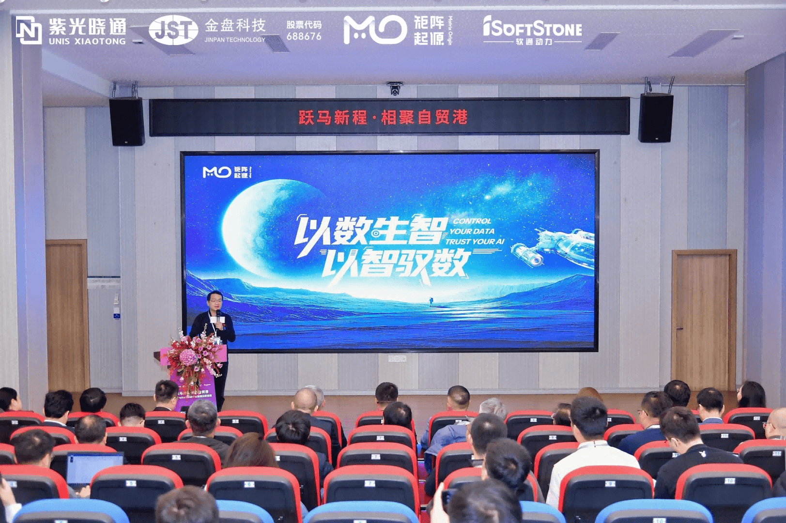
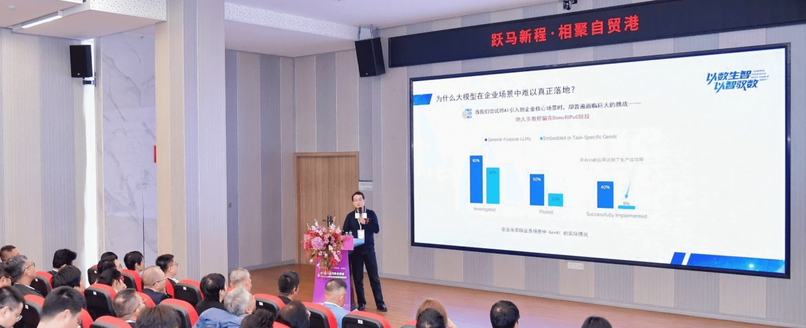
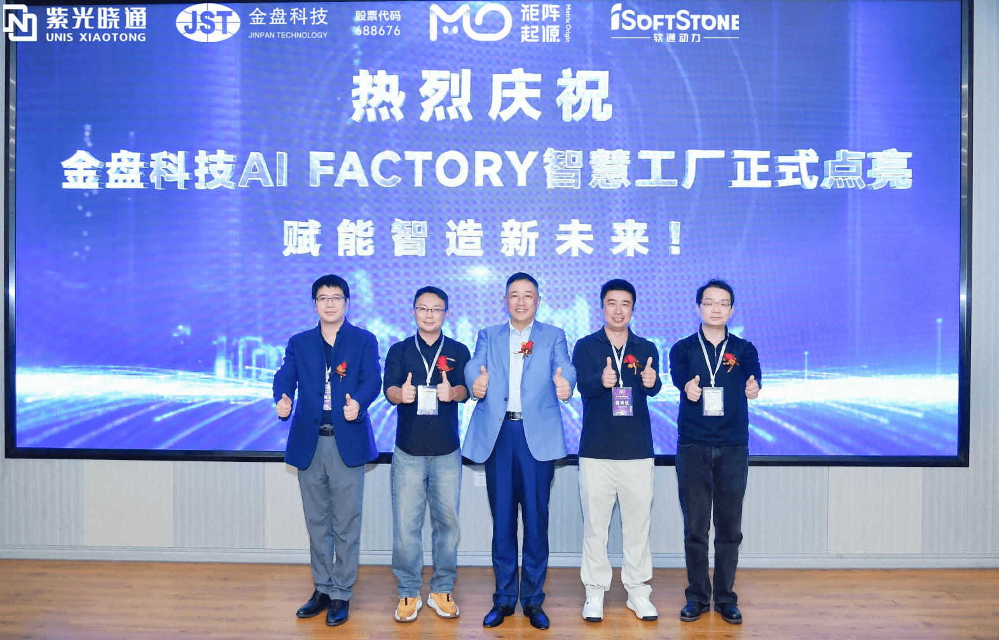

# Anchoring 2026: MatrixOrigin Joins Forces with Industry Partners to Hit the AI + Manufacturing Accelerator

When the manufacturing lines of the physical world deeply intersect with AI algorithms in the digital world, the manufacturing industry is entering a new moment of intelligent transformation. On January 12, 2026, MatrixOrigin, together with Jintpan Technology and iSoftStone, co-hosted the event "Riding Toward a New Journey, Gathering at the Free Trade Port - An AI Factory Driving a New Era of Enterprise Intelligence." At the event, Jintpan Technology's first self-developed HVDC product officially lit up the smart factory data center, announcing that the AI smart factory jointly built by the three parties had officially begun operation.

This is a joint exploration aimed at industrial depth. Jintpan Technology uses its self-developed HVDC product to build the energy hub of the compute infrastructure. MatrixOrigin uses the MatrixOne Intelligence (MOI) platform to carry the intelligent data foundation. iSoftStone deploys agent applications based on the Tianxuan series platform. Each party focuses on its own strengths and accurately grasps the industrial transition from digitization to intelligence. Around the overall layout of "AI compute infrastructure + AI foundation platform + AI Agents," the three parties will gradually improve operating efficiency through full-chain, full-scenario intelligent upgrades and establish a new paradigm of deep integration between artificial intelligence and high-end manufacturing.

In this architecture, the data foundation is the key hub connecting compute and intelligence. Based on the MOI platform, MatrixOrigin has built a unified data infrastructure for the smart factory. With high-performance, high-concurrency processing capabilities, it supports the aggregation, governance, and invocation of massive industrial data, providing real-time and precise private-domain knowledge supply for large models. This allows the AI inference and business decisions in the upper layer not only to "run fast," but also to "understand the business."

For Jintpan Technology, this AI smart factory is a key move in its "15th Five-Year Plan" smart manufacturing strategy. For MatrixOrigin, it is another large-scale validation of the MOI platform in high-end manufacturing. The multi-party collaboration also successfully turns the abstract architecture of "compute + data + model" into a physical reference model, providing the industry with a reproducible practice sample of hardware-software collaboration and ecosystem co-building.

From proof of concept to real-world operation, we are witnessing the explosive growth of data element value. Looking ahead, MatrixOrigin will continue to refine its AI-native data infrastructure capabilities and work with more partners to transform massive amounts of data from dormant assets into direct productive force driving industrial upgrading.
