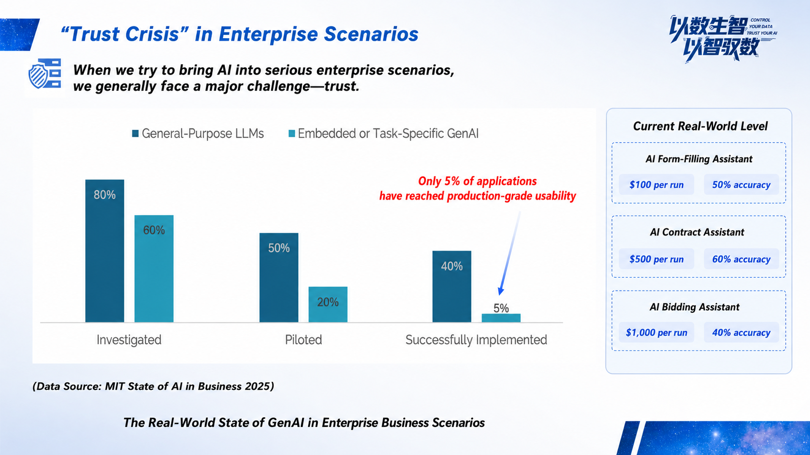
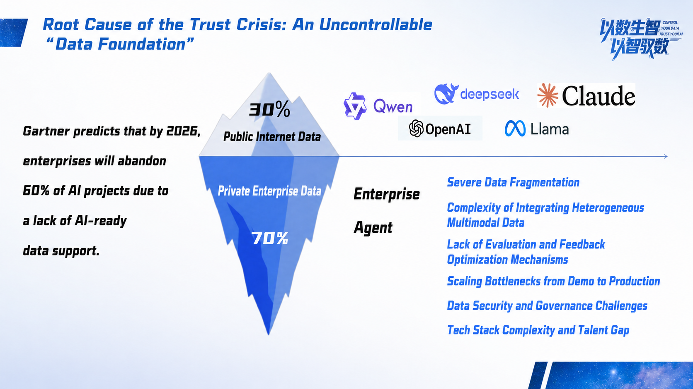
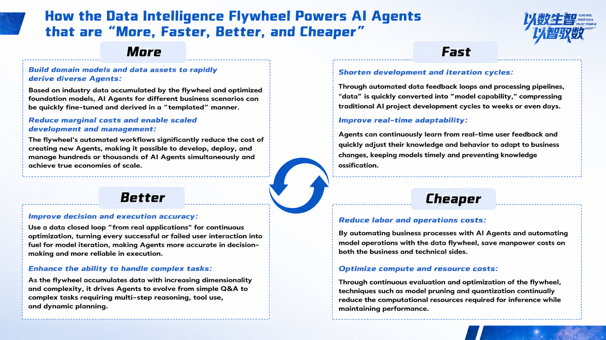

AI is like a genius who has just graduated from a top university with perfect theoretical knowledge. But on the first day he walks into your company, he does not understand your business processes, data distribution, or departmental rules.

As a result, the "top student" you hired at great cost may even make mistakes when reviewing a complex contract.

This is exactly the common dilemma enterprises face when applying AI today. After the industry has moved past the frenzy around large models, a more realistic question stands in front of us: **How can we solve the "last mile" problem of AI implementation?**

## A Smart "Graduate" Gets Lost on the First Day

We first need to clarify one fact: the bottleneck in current AI implementation no longer lies in models not being "smart" enough.

An MIT report shows that when enterprises apply "mission-critical AI," the final success rate for generating value is only **5%**.

Where is the problem?

We believe the **core issue is the "data gap" between AI intelligence and enterprise value**. AI has strong general knowledge, but it severely lacks your enterprise's "internal knowledge" and "business context." It does not know which systems data is scattered across, does not understand which departments' materials need to be called behind a bid document, and does not understand unwritten business rules.

When compute power and algorithms are no longer the main contradiction, the next value high ground that can allow AI to truly "work" for enterprises must return to **data** itself.

## Every Generation of Applications Calls for a New Data Foundation

Looking back at the history of technological development, one clear pattern runs throughout: **the emergence of every generation of disruptive applications drives transformation in the data infrastructure behind them.**

From relational databases in the ERP era, to distributed systems in the mobile Internet era, and then to today. We firmly believe that AI, as an epoch-making application, also needs a brand-new data foundation tailored for it.

This foundation must allow that smart "AI graduate" to quickly complete "onboarding training" and "on-the-job practice," growing rapidly from a newcomer into an expert who can handle work independently.

MatrixOrigin CEO Wang Long recently provided a deeper explanation of this industry insight and response path. You can click the video below to watch the full content.

https://www.bilibili.com/video/BV1DepvzxEsm/?spm_id_from=333.1387.homepage_video_card.click&vd_source=43f0b8e0e88e2dab7bc97a44191fec81

In short, the response we propose for solving AI implementation challenges can be summarized by one concept:

## Let AI Drive AI and Build a New-Generation "Intelligent Data Flywheel"

How should such a data foundation be built? The core concept we propose is **"from data to intelligence, from intelligence to data"** (Control your data, trust your AI).

This means AI should not only learn from data, but also manage and optimize data in return, forming a self-reinforcing intelligent closed loop. We call this the new-generation **"intelligent data flywheel"**, and build it around four key points: **more, faster, better, and cheaper**.

- **More:** One-stop integration of multimodal and multi-source data inside the enterprise, providing AI with the most comprehensive "learning materials."

- **Faster:** Shorten AI iteration cycles from "months" to "days" or even "hours," allowing it to grow rapidly through real business feedback.

- **Better:** Establish a complete evaluation and feedback mechanism to ensure every AI behavior is controllable and every result is trustworthy.

- **Cheaper:** Reduce the comprehensive cost of data management and AI applications from the foundation through an integrated architecture.

This "intelligent data flywheel" concept has already been validated in real business scenarios. For example, in cooperation with Jinpan Technology, we greatly shortened the bid-document production cycle from 3-7 days, while improving accuracy in core processes from 50% to more than 95%.

Therefore, the key to solving AI implementation challenges is not pursuing a more all-powerful general model, but building an intelligent data foundation that allows AI to learn quickly and evolve continuously inside the enterprise. **Only by helping smart AI quickly adapt to the enterprise environment can it truly grow from a "top student" into an "expert" that creates core value.**

About MatrixOrigin

MatrixOrigin is an industry-leading provider of Data & AI platform technologies and services. Its core team comes from well-known technology companies in China and abroad and has broad industry and international vision. MatrixOrigin's core product, MatrixOne Intelligence, is an AI-native multimodal data intelligence platform for enterprises. It uses artificial intelligence technologies, including large models, and an innovative hyper-converged data foundation to help enterprises centrally manage and govern multimodal data and turn private-domain data into AI-Ready data assets. It has already served leading enterprises across industries, including StoneCastle, China Mobile IoT, Amway Nutrilite, Jiangxi Copper, and XCMG Hanyun, helping enterprises transform and upgrade from informatization and digitization to intelligence.
