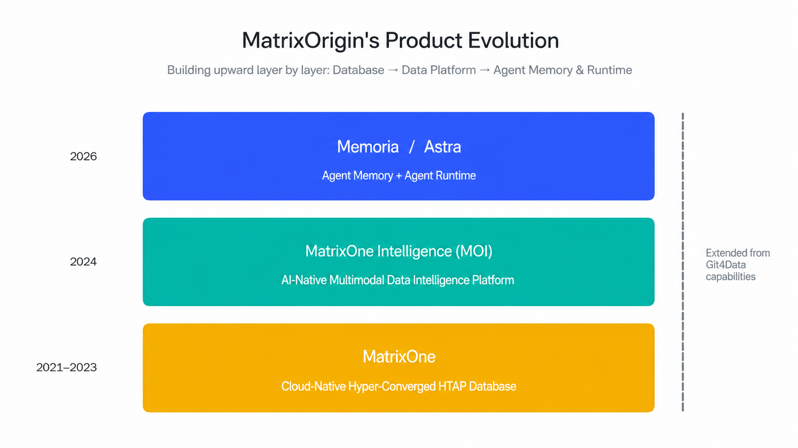
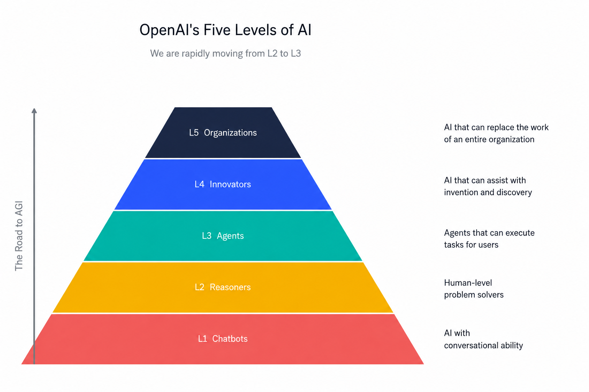
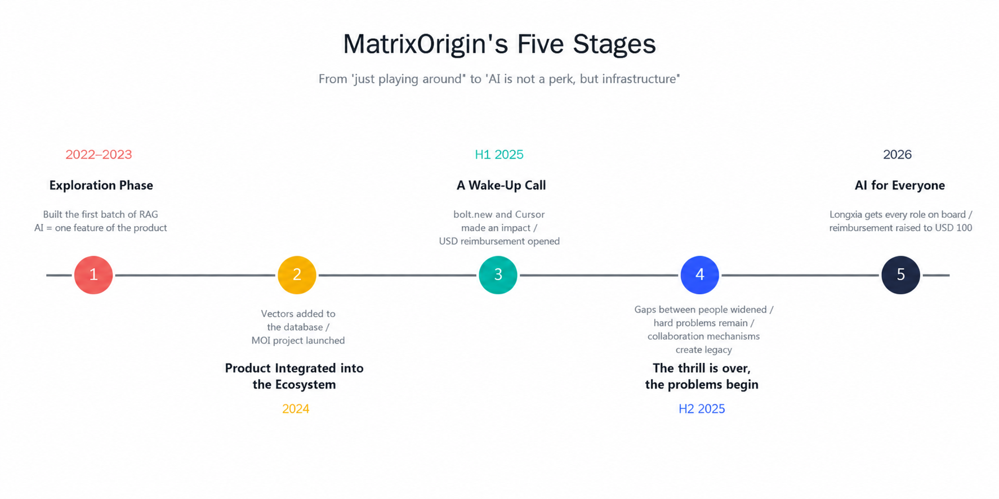

# 70 People, a Group of AI: MatrixOrigin Organization Reconstruction Notes
# Part 1: We Cannot Become a One-Person Company, So We Can Only Rewrite the Organization

MatrixOrigin VP of Product Deng Nan

---

## Preface

Over the past year or two, AI's impact on society has been so large that I do not need to emphasize it. Everyone has felt it firsthand in their own industry.

When it comes to company management, two terms have been discussed the most. One was the theme of our annual meeting at the beginning of this year: **"How to build an AI Native organization."** The other, to be honest, is even hotter: **OPC (One Person Company).**

The logic of OPC is seductive: after AI releases productivity to the extreme, one person plus a pile of AI tools can support a company with millions or even tens of millions in annual revenue. In fact, quite a few such cases have appeared over the past two years, and the success rate of one-person companies is clearly much higher than it was ten years ago. If you browse Twitter or Xiaohongshu, stories like this are everywhere, and they are tempting.

But we have to return to ourselves and honestly ask one question: **Can MatrixOrigin become a one-person company? Can that achieve what we want to achieve?**

Our CEO Wang Long thought seriously about this question, and the answer was clear: **No.**

For a toC SaaS product, an AI application, or a newsletter, OPC may truly work. But what we build is Data + AI foundational infrastructure. A database kernel requires decades of engineering accumulation. Enterprise customers are developed quarter by quarter. A complete Agent Runtime and Memory system is not something one person can carry alone. A company like ours does not fit into an OPC model.

So for us, "whether to become a one-person company" is not the real question. **The real question is: what does AI mean for an organization like ours? How should we turn ourselves into an AI Native organization?**

That is where the annual meeting theme came from at the beginning of this year.

Strictly speaking, our engagement with AI did not start recently. It has been almost ten years now, as the next section will explain. After so much contact with AI, we felt it was time to sit down seriously and explain what "AI means for the organization." Looking back at MatrixOrigin's changes over the past few years, it is already hard to say "we are using AI," because AI is no longer just a tool we use. It has entered our products, code, customer solutions, the talking points of BD colleagues, and even our reimbursement forms.

After the annual meeting, we decided to write this down seriously. This is not external PR. It is a candid unpacking of the pits we stepped into, the dividends we gained, the things we have understood, and the things we have not yet understood.

This series has three articles:

- **Part 1 (this article)**: How we reached the point where we "must become an AI Native organization": how the industry changed and how we changed ourselves.
- **Part 2**: What our ideal AI Native organization looks like.
- **Part 3**: The practices we have tried, are still trying, and have stumbled through.

Let us begin with Part 1.

---

## 1. First, Who Are We?

Before discussing the process, we need to briefly introduce MatrixOrigin as a company, otherwise the story that follows lacks context.

**MatrixOrigin** was founded in 2021. Official website: [matrixorigin.cn](https://matrixorigin.cn/). We have always worked in the Data + AI track. In one sentence: **we build foundational infrastructure for enterprise data intelligence.**

But our relationship with AI goes back further. **Our founding team was already deeply immersed in AI as early as 2017.** Back then, the team was still at Tencent Cloud, working in Tencent Cloud's big data and artificial intelligence team on the previous generation of AI products and projects. That was the period when deep learning was moving from academia into industry, and CV, NLP, and recommendation systems were spreading across industries. The projects the team tackled and the pitfalls it experienced during those years are the reason we have long-term confidence in AI today. So when ChatGPT appeared at the end of 2022, we reacted faster than many companies, not because we were prophetic, but because we had already been in this river for a long time.

The company is not large, **a little over 70 people including interns**, but it has all the necessary functions. **70% are in product and R&D**, and the remaining 30% are distributed across BD, pre-sales, after-sales, marketing, and functional roles. Precisely because we are small, every change brought by AI is especially visible. There are only a few people in each role, so who uses AI, how well they use it, and how much output changes are almost all visible to the naked eye.

We should also briefly talk about our products. Our product development has gone through three stages:

- **2021-2023: Build a brand-new hyper-converged database.** During this stage, our main product was only one thing: **MatrixOne** ([matrixorigin.cn/matrixone](https://matrixorigin.cn/matrixone)), a cloud-native, hyper-converged HTAP database. At that time, the pain points around databases were clear: one database for transactions, another for analytics, another for time-series. Data moved back and forth, consistency was messy, and cost was high. What we wanted to do was simple: **use one database to handle all of these.** Over these years, we built a deep foundation, layer by layer: K8s, storage, compute, MVCC, transactions, vectorization, SIMD. Because of the cloud-native storage-compute separation architecture, we also built some very interesting capabilities we call Git4Data. Simply put, it applies full Git-style semantics to data of any scale, including branch, diff, merge, cherrypick, and more, with almost no cost.
- **2024-2025: Move from database to data platform.** A database alone is not enough to solve enterprise problems, especially as enterprises began seriously considering large-model GenAI. The real pain point is not where data is stored, but how data becomes usable. Structured data, unstructured data, videos, documents, logs, all piled together, cannot be consumed by AI directly. So on top of MatrixOne, we built **MatrixOne Intelligence (MOI)** ([matrixorigin.cn/moi](https://matrixorigin.cn/moi)), an AI-native multimodal data intelligence platform. Its positioning is: **help enterprises turn their messy private-domain data into AI-Ready assets.**
- **2026: Move higher into AI Infra, building Memory and Agent Runtime.** This year we grew another layer and opened two new product lines. One is **Memoria**, an open-source Agent memory layer, the "brain RAM" of Agents. The other is **Astra** ([matrixorigin.cn/astra](https://matrixorigin.cn/astra)), an Agent Runtime, the runtime environment where Agents actually run. Behind these two lines is the same idea: **we extended the Git4Data capabilities we had built on MatrixOne for years, such as branching, snapshots, rollback, merge, and diff, into the AI layer.** Agents need to remember things, correct mistakes, roll back, and run reliably. Our database foundation happens to provide this full set of capabilities. Instead of letting every Agent layer rebuild the wheel, we want to make this layer a standard component.

In short: **database -> data platform -> Agent memory and runtime.** These three layers together form our current complete product map.

What happened next to this "small but complete" team of more than 70 people is the story below.

---

## 2. How the Industry Changed: From Chatting to Doing Work

Before talking about ourselves, we need to say a few words about the broader industry trend. Otherwise, the internal changes will not make sense.

Over the past three years, the main theme of the AI industry can be summarized in one sentence: **from "helping you generate content" to "directly helping you finish tasks."**

In 2023, when everyone was chasing ChatGPT and Midjourney, AI was doing generation: write a paragraph of copy, draw an image, write a code snippet. You had to connect its output to the next step yourself. By 2025 and 2026, AI was doing tasks: "pull this quarter's data, make a report, and send it to the CEO"; "fix this bug and write the tests too"; "do background research on this customer and write a memo." It handles all the intermediate steps itself.

This is the leap from **GenAI to AI Agent**.

Borrowing OpenAI's publicly discussed "five levels of AI" framework makes the coordinates especially clear. It is a pyramid:

- **L1 Chatbots**: AI that can chat in natural language. You ask, it answers, within conversation scenarios. ChatGPT in 2023 was the typical representative.
- **L2 Reasoners**: AI that can solve problems at a human level. It does not just chat, but can reason and analyze like a graduate student. This was the main battlefield of large-model competition in 2024-2025.
- **L3 Agents**: Systems that can execute tasks on your behalf. They no longer wait for you to ask; they plan, call tools, run processes, and deliver results.
- **L4 Innovators**: AI that can assist invention and creation, producing genuinely original outputs in science, engineering, or art.
- **L5 Organizations**: AI that can do the work of an entire organization.

Our judgment is that **in 2026, the whole industry is moving from L2 into L3 at scale**, and some pioneer scenarios have already reached the threshold of L4. In other words, AI is changing from "something that answers questions" into "something that completes tasks." This transition is why "what should organizations do" has suddenly become a question that must be answered. Once AI changes from answerer to executor, it enters work scenarios that originally belonged to human organizations, and all old collaboration methods need to be re-examined.

That is the external background. Now let us return to ourselves.

---

## 3. Our Own Four Years: Five Stages

I divide MatrixOrigin's four years of working with AI into five stages.

### Stage 1: 2022-2023 -- "Well, This Is Interesting"

When ChatGPT came out at the end of 2022, to be honest, like most companies, our first reaction was to play with it. I posted a screenshot in the internal group. Everyone watched, tried all kinds of strange questions, laughed, and marveled. But as a company with a Data + AI background, we were more sensitive to this technology than ordinary companies, and soon moved from "playing" to "trying."

In 2023, we built one of the industry's early RAG applications: a chatbot for our own MatrixOne database manual. The problem was plain: **users often could not find the documentation they needed.** Our product documentation had hundreds of pages. A parameter might be hidden in a corner. 80% of questions customers asked technical support were actually already in the documentation, but no one could read through it efficiently. After building the chatbot, customer satisfaction improved immediately.

Looking back today, that RAG was extremely rough: chunking, vectorization, retrieval, prompt assembly. All five steps were the most basic possible. But it worked.

**At this stage, AI was just a product feature component for us.** Nothing more. No one thought in grand terms like "AI will change the organization." It was too early.

### Stage 2: 2024 -- "Let Our Products Integrate into the AI Ecosystem"

In 2024, our main actions happened on the product side.

First, we added vector retrieval and full-text search to MatrixOne, allowing a database originally designed for transactions and analytics to also become the data foundation behind AI applications. Second, and more importantly, we started the MOI project.

The starting point for MOI was simple. That year, we met too many customers, and everyone was asking the same question: "Our company has tens of terabytes of data, including PDFs, Word documents, images, logs, and database tables. How exactly can AI help us use them?" We found that this problem could not be solved by a database alone. We had to move up one layer and build a **data hub for AI**.

So in 2024, our mindset was: **our products need to integrate into the AI ecosystem.** AI was the core of this wave, and we wanted to become the best Data layer in that ecosystem.

But I have to be honest: at this time, **"AI" and "organization" were still two separate things in our minds.** AI was a product matter, organization was an organization matter, and the two lines had not yet crossed.

### Stage 3: First Half of 2025 -- "Damn, This Changes Things"

The real organizational shift started in the first few months of 2025.

It began with a particularly urgent project that needed a prototype. Our head of R&D sent me a link: **bolt.new**. He said, "You should all try this. I just made a product prototype in ten minutes." Everyone opened the link and spent a little time with it. Then the group went quiet. Because this was not "efficiency improvement." It **redefined what a product prototype is**. In the past, product managers had to open Figma, drag components, adjust colors, and add annotations. It took a few days if fast, a week if slow. bolt.new turned this into "describe it, and it gives you something that runs."

Then R&D colleagues started using **Cursor**. Cursor's impact was even larger than bolt.new's, because code is our core business. A few colleagues who used it deeply clearly began showing the effect of "one day's work equaling a week." What impressed me most was one of our most senior kernel engineers saying during an internal sharing session: "I no longer write code. I review code." The room laughed, but after laughing, everyone fell silent, because everyone understood he was not joking.

Realizing that this wind had truly arrived, we made a key decision at the time: **give everyone a USD reimbursement quota to buy the AI tools they needed.**

Why not purchase uniformly? Because AI tools differ too much. Different roles, habits, and scenarios require completely different tools. Instead of the company spending heavily on one seat that no one uses, it is better to give the money directly to individuals and let everyone choose. This decision was quite forward-looking in early 2025, when most companies were still debating whether to buy ChatGPT Plus enterprise seats.

Those six months were happy months. We called them "the spring of personal productivity." But calmly speaking, **the progress at this stage still happened only at the individual level.** AI amplified one person after another, not the organization.

### Stage 4: Second Half of 2025 -- "After the High, Three Problems Arrived"

In the second half of 2025, as models became smarter and Agents more capable, individual productivity rose another level. The most typical case was R&D: routine business code, SDK wrappers, test completion, these could be handed end to end to Agents like Claude Code and Codex.

Sounds great, right? But during this same period, we saw the bottleneck clearly for the first time. **There are three things I must write down, because they deeply changed our understanding of AI.**

#### Problem 1: The Gap Between People Was Magnified Tenfold

The same AI produces results that can differ tenfold in different people's hands.

This is not exaggeration. It is a real multiple. For colleagues who use it well, productivity is amplified tenfold or even hundredfold. For those who use it poorly, the improvement may only be 30%-50%, and sometimes even negative. Where is the difference? **Not in technology, but in thinking style.** An experienced person with their own thinking framework and the ability to break problems down works with AI like a tiger with wings. A person used to passively executing tasks does not know how to command AI. In the end, AI outputs a pile of things, and they spend a lot of time reworking it.

The same applies to non-R&D roles. A senior product manager using AI is like having a divine weapon: prototypes, PRDs, customer solutions, all are multiplied. An ordinary product manager using AI often just gets AI to mechanically produce a bunch of text that looks correct, then has to rewrite it from scratch.

We do not avoid mentioning another side effect of this: **in the second half of 2025, we eliminated a group of colleagues**, mainly those whose thinking was clearly rigid and who could not keep up with the AI rhythm no matter how much coaching they received. It was not simply poor performance; it was failing to keep up with the acceleration of the entire organization. This decision was not easy, but dragging it out was unfair to everyone. Later, during internal review, we reached a consensus: **in the AI era, an organization's requirement for "learning speed" will be much higher than its requirement for "existing capability."**

#### Problem 2: AI Is Strong, but It Still Cannot Solve Truly Difficult Problems

Do not be fooled by demos.

Agents can handle common business code end to end. But the truly difficult features in our database kernel, complex query optimization, transaction consistency boundaries, subtle corner cases inside the kernel, are still beyond Claude Code and Codex. We once gave AI a complex problem for two weeks and it still could not solve it. AI can help you write scaffolding, fill in tests, and pile up boilerplate code. But **the hardest 5% still depends on the few people who understand the problem best.**

This gave us one lesson: **AI is not "able to do everything." It surpasses you on large amounts of average-level work, but it is still far from expert-level work.** So organizations should not "remove experts" because AI has arrived. On the contrary, the few people who can solve the hardest problems become even more valuable in the AI era.

#### Problem 3: The Collaboration Mechanisms Built by the Software Industry Over the Past Decade Were All "For Humans"

This was our biggest discovery in the second half of the year, and also the most painful one.

Our company had spent a lot of effort building collaboration mechanisms: code repositories had standardized PR templates, the documentation center had strict writing standards, code review had a defined process, and even project discussion groups in WeCom had fixed synchronization rhythms. We always thought this was a good thing: the more standardized collaboration is, the higher efficiency becomes.

But after AI began truly participating in production in the second half of 2025, we discovered something frightening: **all these collaboration mechanisms were designed for humans, not for AI.**

- In the past, humans wrote a few PRs per day, each with dozens or hundreds of lines, and reviewers could read them slowly. Now AI writes dozens of PRs per day, some with tens of thousands of lines, and the old review process becomes **practically meaningless**.
- Past documentation was written for humans: long paragraphs, diagrams with large amounts of implicit background, and key information hidden in "everyone knows" context. Now AI needs to consume these documents to complete tasks. It cannot understand those implicit assumptions, and once context is missing, it starts guessing.
- In the past, WeCom project groups were the fastest channel for information flow: one sentence per message, screenshots, casual mentions. But AI cannot enter these information flows at all, turning them into **information black holes inside the organization**. When Agents need to work across projects, the biggest obstacle is not algorithms, but that they do not know where the context is, because all the context lies in WeCom groups and has not been structurally captured.

In other words, **everything optimized for human collaboration in the past has become legacy in the AI era.** Code standards, document structures, review processes, chat records, all need to be reconsidered: is this for humans, for AI, or for both?

During our year-end internal review, we repeated one sentence again and again: **"Individuals have been liberated, but the organization has not kept up."** Even now, that sentence still feels sharp.

### Stage 5: 2026 -- "Now It Is Everyone's Business"

Entering 2026, the rise of **OpenClaw** pushed the productivity upgrade to a new magnitude.

This time was different. Previously, AI dividends mainly landed on roles close to AI, such as programmers and product managers. Non-product and non-R&D colleagues were still mostly observers. But after OpenClaw appeared, **all white-collar workers who use computers for work were pulled into deep water.**

The most widely discussed story inside our company was not about a programmer, but a senior BD colleague. He used OpenClaw at a "textbook" level internally: customer background research, industry news aggregation, meeting preparation, meeting minutes, first drafts of complex proposals, quotation comparisons, competitor analysis. Almost the entire BD workflow was embedded into OpenClaw. His output multiplied several times without expanding the team. Later we joked that one person was worth a small BD team.

Similar stories became increasingly common in the first half of 2026, and more and more of them appeared in **non-product and non-R&D roles**. Marketing, functional teams, pre-sales, after-sales: every role had several "heavy AI users." At this point, we finally admitted one thing: **there is no longer any role in the company that can be detached from AI.**

So we made a second organizational decision: **increase everyone's reimbursement quota to USD 100 per month, and give colleagues with especially high productivity unlimited tokens.** In plain language: as long as you can use it and produce results, the company will cover it.

When communicating this internally, we said: **"AI is no longer a benefit. It is infrastructure."**

---

## 4. After Four Years, We Have Understood Four Things

At this point, the story of these four years is basically complete. Finally, I want to separately highlight the most important things we learned during these years. They are the foundation for why we dare to write this series and discuss AI Native organizations.

**First: AI is a magnifying glass, not a money printer.**

At one point, we thought that giving AI to everyone would raise productivity evenly. It did not. AI is like a magnifying glass. It clearly magnifies each person's original thinking structure, work style, and judgment. Strong people become stronger. Mediocre people are accelerated, not upgraded. This means organizations cannot just distribute tools. **You must also distribute the ability to use tools**: training, SOPs, best-practice accumulation, and peer learning. This does not happen naturally; it must be designed.

**Second: AI is not "able to do everything." The hardest problems still depend on people.**

On large amounts of medium-difficulty work, AI has already surpassed average employees. But on truly expert-level work, it is still far behind. So the organization's strategy is not "replace people with AI," but **use AI to free people's energy so the people who understand the most can tackle the hardest 5%.**

**Third: individual productivity does not automatically become organizational productivity.**

This is the deepest lesson from the past year. The explosion of individual productivity instead exposed **all** the shortcomings in organizational processes, collaboration methods, review mechanisms, and governance. A team that writes code very fast may ultimately deliver worse quality than before if review cannot keep up. At a deeper level, **all collaboration artifacts designed for humans in the past, documents, standards, chat records, must be re-evaluated in the AI era**: should they continue to be used, be transformed, or be rebuilt from scratch?

**Fourth: new bottlenecks are completely different from old bottlenecks.**

Old bottlenecks were "not enough output," so companies hired aggressively and worked overtime. New bottlenecks are "too much output, cannot digest it, cannot control quality, cannot clarify responsibility." This is a completely different species of problem. It cannot be solved by hiring more people, nor by working harder. **It requires the organizational form itself to change.**

---

## Closing: From an "Organization That Uses AI" to an "AI Native Organization"

At this point, the next question naturally appears:

**Since individuals have been deeply reshaped by AI while the organization remains in its old form, what should the organization become?**

This is the origin of our annual meeting theme at the beginning of this year, and it is also what the next article will explore: what our ideal AI Native organization looks like, and what principles, layers, and necessary tradeoffs we have summarized.

See you in the next article.

---

> *This article is the first in the "70 People, a Group of AI: MatrixOrigin Organization Reconstruction Notes" series. To learn more about our products, visit [matrixorigin.cn](https://matrixorigin.cn/).*
