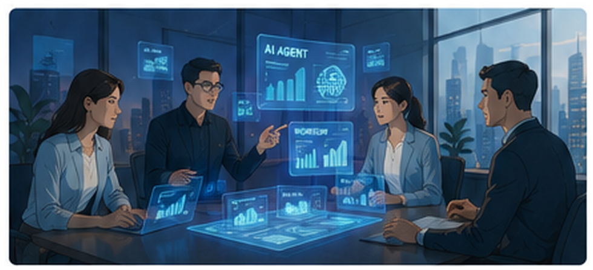
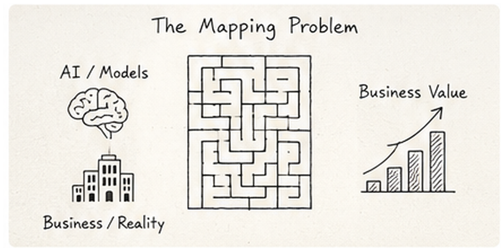
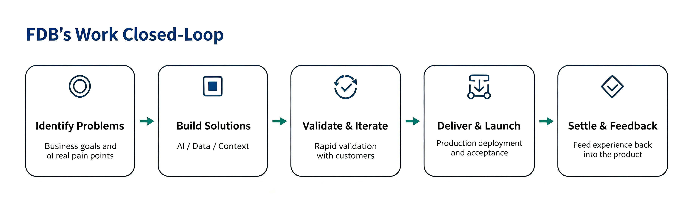
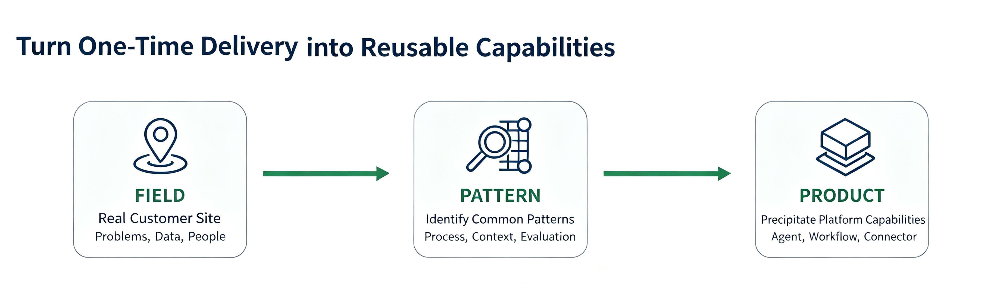
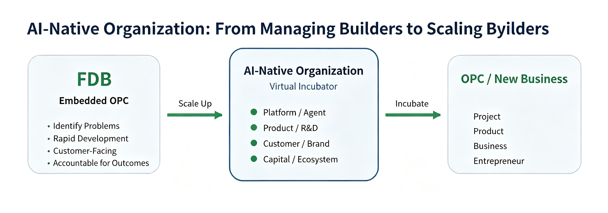

# AI-Native Organization in Practice: From FDE to FDB to an OPC Incubator

> From enterprise AI delivery, to a Builder talent model, to one person leading a digital team

For some time, one question kept coming up as we worked on enterprise AI projects: Should we set up a dedicated FDE team?

The question did not stay at the org-chart level. The deeper the work went, the clearer it became that enterprise AI may change far more than "adding one new role." It is changing how much one person can do. It is changing how projects are organized, how products grow, and even how a company relates to exceptional talent.

We did not create a seperate FDE department. Instead, we began practicing **FDB-Forward Deployed Builder** as a virtual role.

This practice is still in its early days. We are in no position to present it as a proven methodology. Even so, our experience has made one point increasingly clear: as AI continues to expand the limits of what one person can do, a great FDB will increasingly resemble an OPC (One-Person Company)-one that is deeply connected to, and fully empowered by, a larger organization.

**If that is true, an AI-native organization should not stop at asking how to manage its Builders. It should become their incubator.**

*Enterprise AI projects increasingly require business, engineering, product, and the customer to align on the same outcome.*

## 1. Why Enterprise AI Has Put FDE Back in the Spotlight

Forward Deployed Engineer is not a new role. Over the past two years, however, FDEs have become markedly more important at AI companies. [OpenAI now has a dedicated Forward Deployed Engineering career track](https://openai.com/careers/forward-deployed-engineer-%28fde%29-nyc-new-york-city/). The job is to own technical delivery from prototype to stable production: embed with the customer, understand the real need, write code, and remove whatever stands in the way.

In 2026, [ServiceNow and Accenture](https://newsroom.servicenow.com/press-releases/details/2026/ServiceNow-and-Accenture-launch-forward-deployed-engineering-program-to-scale-agentic-AI-across-the-enterprise/default.aspx) jointly launched a Forward Deployed Engineering program, placing FDEs inside customer environments to build agentic AI workflows and take pilots to production scale.

Why is a role that looks so "heavy" back at the center of the conversation? Our reading is simple. We believe it comes down to one crucial difference between AI and traditional software: many requirements only reveal themselves on the ground.

A customer may initially ask for a supply chain Agent. Once you get inside the business, however, you may discover that the real need is to identify delivery risks earlier. Another customer may ask for an enterprise knowledge base, when the real determinant of business outcomes is whether order status, product rules, access permissions, approval history, and human expertise can be assembled-at the right time-into Context that AI can understand.

In both cases, the real need only emerges through close contact with the business. It is difficult to specify fully in a requirements document before the project begins.

[Research by the Harvard Business School AI Institute and INSEAD](https://aiinstitute.hbs.edu/everyone-has-ai-which-firms-are-going-to-win/) gives this challenge a name: the “mapping problem.” One of the biggest constraints on enterprise adoption is figuring out where AI can create value in a company's production process. The study, which covered 515 high-growth startups, found that access to models, APIs, and technical training alone was not enough to ensure that companies discovered as many high-value use cases.

*The mapping problem - access to powerful models does not mean a company has found business value.*

> **What is scarce today is no longer only the ability to use AI. It is the ability to find problems that are truly worth turning into AI.**

That is why people have to get close to the field. It is also why we first took FDE seriously.

## 2. Why We Did Not Create an FDE Department

Inside MatrixOrigin, we debated this many times, because we were running into two kinds of problems.

The first is that projects are becoming too easy to close in on themselves. Under pressure to move quickly, teams could use vibe coding, open-source tools, and a range of AI capabilities to assemble a solution in very little time. That made them highly productive in the short run. But as the number of projects grew, each team risked developing its own stack and drifting ever further from the platform. The project might be delivered successfully without leaving the company with a stronger product.

The second problem is the opposite. Once a project depends deeply on the platform, the field team can rarely move alone when it hits stability, private deployment, underlying capability, or an R&D schedule. Pre-sales, R&D, product, commercial, and delivery all have their own jobs. When a cross-team issue appears, it is hard to find one person who can follow it from beginning to end.

FDE initially seemed to offer a way out of this bind. But the more we discussed it, the more we realized that adding another department could simply turn the chain into Sales → FDE → Product → R&D → Delivery. None of the existing handoffs would disappear; we would merely add another one.

What we were missing was not so much a new org unit as a stronger sense of **ownership**.

For a while, we even called the role FDO — Forward Deployed Owner. As soon as a project entered the PoC stage, one named individual would take responsibility for it through final acceptance. That person would work with both the customer and our internal product, R&D, commercial, and delivery teams. If a cross-functional issue could not be resolved, they could escalate it directly to management. A standing weekly CEO/FDB meeting would give critical issues the shortest possible path to a decision.

We still keep that idea. Later, we felt that "Owner" was still missing something.

## 3. From Owner to Builder

In an enterprise AI project, conventional project management is not enough, because customers themselves often cannot clearly articulate what they need.

When a customer says, “I want an agent,” someone still has to keep asking: Who is it working for? How does this process work today? Which step costs the most? What information actually drives the decision? What outcome would count as success? Which tasks should AI handle, and where is human judgment essential?

After the problem is found, that person should also be able to build. When needed, they can query data, assemble a workflow, create an agent, write some code, connect systems, use vibe coding to get a first version out quickly, and validate it with the customer.

So we renamed the role: **Forward Deployed Builder, FDB**.

Interestingly, "Builder" is also starting to show up in public AI job postings. [Ema is currently hiring Forward Deployed Builders](https://www.ema.ai/careers), with a mandate to go on site, find high-value automation opportunities, and take work from proposal and demo through to production. The title is far from becoming an industry standard the way FDE has. It does, at least, suggest that a new role shape is emerging.

> **For MatrixOrigin, the definition is currently simple: FDB is the role. End-to-end ownership is the operating principle.**

An FDB needs to understand the business, find the problem, make the thing, get it into production, and stay accountable for the result.

AI is central here. [A field experiment by Harvard Business School and P&G](https://aiinstitute.hbs.edu/the-cybernetic-teammate-how-ai-is-reshaping-collaboration-and-expertise-in-the-workplace/) found that, on certain new-product development tasks, individuals using generative AI could reach performance close to a traditional two-person team, and narrow some of the knowledge boundary between commercial and R&D specialists. The researchers called AI a "cybernetic teammate."

One experiment, of course, does not prove that one person will someday replace an entire team. Real enterprises are far more complex than experimental tasks. But it does make a once-unrealistic question worth taking seriously: if a person is beginning to work with a standing digital specialist team around them, should we still design the organization entirely around yesterday's job boundaries?

That is the larger idea behind FDB—and the idea we are now testing in practice.

*An FDB’s work starts with finding the problem and ends with capturing what the project taught us after delivery.*

## 4. After an FDB Finishes a Project, What Remains?

Giving one person this much building power, however, creates a new risk: the FDB model could become little more than a sophisticated form of outsourcing. Paradoxically, the more capable AI becomes, the greater that risk grows.

A highly capable Builder can walk into a project and use vibe coding, models, and open-source tools to produce an impressive system in very little time. The customer is happy, and the project is signed off.

But if the code, context, connectors, workflows, evaluation, and industry knowledge created along the way all stay inside that one project, then doing ten projects is not fundamentally different, for the company, from doing one.

That is why we increasingly value the other half of FDB work: **bringing the field back**.

Why did this need arise? Will other customers run into it? Could a feature built for one customer become part of the platform? Could recurring business concepts within an industry be captured as reusable Context? Could the same method for validating an Agent be used again? And how do we stop the next FDB from repeating the mistakes made on this project?

> **Over time, we hope to establish a simple feedback loop: Field → Pattern → Product.**

*Field experience becomes a durable company capability only after it is turned into a shared pattern and absorbed into the product.*

This is close to OpenAI's public description of Forward Deployed Engineering: bringing field feedback back to Research and Product, and turning what works into tools, playbooks, and reusable building blocks is also a core part of the FDE job.

For an infrastructure company, this matters even more. A platform often matures in the friction of real business, project after project.

## 5. From FDB to OPC: Rethinking What One Person Can Be

The FDB mechanism is still being practiced. Who is best suited for it, how to evaluate it, how to avoid role overload, and how to balance customer-specific needs with platform productization — we are still working through all of this.

We are increasingly confident in the direction, because the change behind FDB is more important than the role itself: **AI is expanding the span of business responsibility one person can carry.**

A [2026 Harvard Business School working paper](https://www.hbs.edu/faculty/Pages/item.aspx?num=69077) studied AI-native startups. In a comparable sample, AI-native firms were smaller on average, with a higher share of engineers and fewer junior roles and management layers. The authors also caution that the results come from a startup sample and should not be casually extended to all mature enterprises.

We are less interested in how many fewer people companies will have in the future. We are more interested in this: as more execution moves into software and models, what organizations ask of people may shift from functional specialization back toward completeness of the problem.

An employee used to own a function. A great FDB is closer to owning a result: starting from the customer's problem, calling on product, R&D, data, models, agents, and organizational resources, and making the outcome happen.

There is an interesting resonance with the rise of the OPC or the One-Person Company. [Yangpu District in Shanghai](https://english.shanghai.gov.cn/en-Latest-TalentsinShanghai/20260701/4a25c602cc384fb686de845c35043f09.html) officially describes an OPC as a single founder using AI as a virtual team to run a full business cycle, usually at very small scale. [Shenzhen](https://www.sz.gov.cn/cn/xxgk/zfxxgj/tzgg/content/post_12602687.html) also launched a two-year action plan in 2026 to build an AI OPC entrepreneurship ecosystem.

An FDB and an OPC founder are not the same identity. But the two are beginning to look alike: both need to find problems, build quickly, face customers, mobilize external capability, and own the result. The difference is that an OPC operates independently in the market, while an FDB remains embedded in the organization.

> **We increasingly see a strong FDB as an OPC embedded in the organization.**

They can take on a more complete responsibility precisely because the organization is behind them: brand, customers, product, R&D, platform, capital, and management systems. AI amplifies individual capability once. The organization should amplify it again.

## 6. An AI-Native Organization Should Be an Incubator for Builders

If FDB is an OPC embedded in the organization, then the job of an AI-native organization is not only to manage Builders. More importantly, it is to give them leverage. One notable conclusion from [Microsoft's 2026 Work Trend Index](https://www.microsoft.com/en-us/worklab/work-trend-index/agents-human-agency-and-the-opportunity-for-every-organization) is that individual AI capability and organizational readiness have to rise together. Only some AI users have both high personal capability and organizational support. Many others have already outrun the company's processes, incentives, and governance.

The implication for us is direct: having a few strong FDBs does not automatically make a company AI-native. After a Builder finds the problem, how quickly they can get data and product capability; whether they can mobilize R&D, agents, workflows, context, memory, and runtime; whether they can get customers, brand, capital, and room to try and fail - that is what decides how far their capability can actually be amplified.

**An AI-native organization should itself be an incubator.**

*The organization gives Builders leverage in platform, product, customers, and capital, and also creates room to incubate new businesses.*

Incubate people first, then incubate projects. After projects succeed repeatedly, they become product. After a product develops its own customers, revenue, and growth logic, it may continue to grow into a business. A person’s path may therefore run from FDB to Business Builder, and then to entrepreneur.

Today, OPC support systems in [Shanghai](https://english.shanghai.gov.cn/en-Latest-TalentsinShanghai/20260701/4a25c602cc384fb686de845c35043f09.html), [Shenzhen](https://www.sz.gov.cn/cn/xxgk/zfxxgj/tzgg/content/post_12602687.html), and elsewhere are already trying to combine compute, models, tools, scenarios, professional services, and capital. Inside a company, there is one advantage a generic incubator can rarely match: real customers and real business fields.

That is why we are also willing to keep the FDB growth path more open. If a Builder goes deep enough in one direction and forms a product or business better suited to independent growth, the company is willing to discuss entrepreneurial coaching, investor introductions, and, under the right conditions, a waiver of non-compete.

This vision is still tentative, and it is far too early to draw firm conclusions. But we believe a healthy AI-native organization should help people become more capable, not simply create more positions. Great people creating value inside the company represent one kind of success. A mature Builder going on to create a new business-or even a new company-can also represent an extension of the organization's capabilities.

> **Is a company ultimately managing a Builder, or amplifying a Builder?**

We increasingly believe it is the latter.

That answer shapes what we want the organization to do. We want the platform to extend a Builder's technical capabilities, the organization to expand their business reach, and repeated exposure to customer environments to sharpen their judgment. Ultimately, we want the very best Builders to be capable of creating new products, new businesses, and even new companies.

Of course, the model is only just getting started. It will undoubtedly run into problems, and some of the ideas we hold today may not stand up in practice. But we are willing to test them.

Why pursue it despite that uncertainty? Because we believe AI-native organizations will ultimately compete on more than the strength of their models or the number of Agents they deploy. What matters more is whether they can give a person with judgment, creativity, and a sense of responsibility the kind of capabilities that once belonged only to entire organizations.

If, one day, people like this emerge from the organization and go on to build products and companies of their own-while their original organization remains their platform, partner, and source of capital-we will see that as proof of the organization's strength, not as a loss of talent.

For now, that is how we think about FDBs, OPCs, and AI-native organizations.

