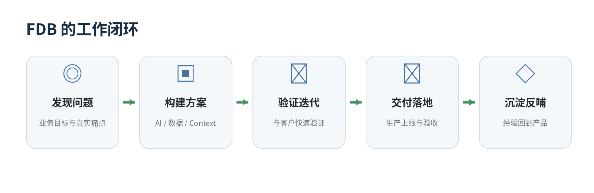
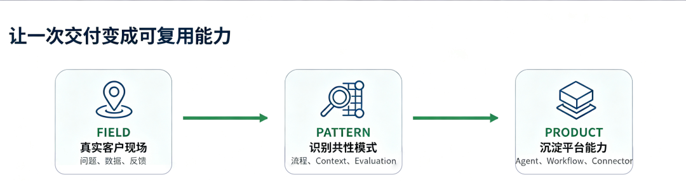
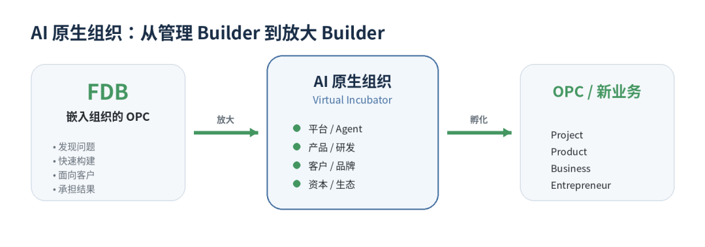

# AI 原生组织实践：从 FDE 到 FDB，再到 OPC 虚拟孵化器

>从企业 AI 交付机制，到 Builder 人才模型，再到一个人带领数字团队

过去一段时间，我们在做企业级 AI 项目时，一直在讨论一个看起来很具体的问题：要不要成立一支独立的 FDE 团队？

这个问题最后没有停留在组织架构上。随着项目做得越来越深，我们逐渐发现，企业 AI 带来的变化可能比“多设一个新岗位”要大得多。它正在改变一个人能做多少事，也在改变项目如何组织、产品如何生长，甚至改变公司与优秀人才之间的关系。

我们最终没有新设独立的 FDE 部门，而是开始实践 **FDB——Forward Deployed Builder** 的虚拟角色机制。

这套机制还很早，我们也远没有资格把它总结成一套已经被证明的方法论。但在实践过程中，一个判断越来越清晰：当 AI 把一个人的能力边界不断放大，一个优秀的 FDB，会越来越像一个与组织紧密连接、被组织充分赋能的 **OPC（One-Person Company）**。

**如果这个判断成立，那么 AI 原生组织需要思考的，也许就不只是如何管理这些 Builder。它应该成为他们的孵化器。**

*企业 AI 项目越来越需要业务、工程、产品与客户在同一个结果上协同。*

## 一、为什么企业 AI 又把 FDE 推到了前台

Forward Deployed Engineer 并不是今天才有的角色。过去两年，它在 AI 公司里的重要性明显上升。[OpenAI 目前已经形成独立的 Forward Deployed Engineering 职系](https://openai.com/careers/forward-deployed-engineer-%28fde%29-nyc-new-york-city/)，岗位要求从原型到稳定生产负责技术交付，深入客户团队、理解需求、直接写代码并清除交付障碍。

[ServiceNow 与 Accenture](https://newsroom.servicenow.com/press-releases/details/2026/ServiceNow-and-Accenture-launch-forward-deployed-engineering-program-to-scale-agentic-AI-across-the-enterprise/default.aspx) 在 2026 年联合推出 Forward Deployed Engineering 项目，明确把 FDE 放进客户环境里，共同构建 Agentic AI 工作流并把试点推进到生产规模。

为什么大家重新重视这样一个看起来很“重”的角色？我们的理解是，AI 和传统软件有一个很大的区别：很多需求只有到了现场，才真正知道是什么。

客户一开始可能说，希望做一个供应链 Agent。真正进去以后，发现核心问题可能是交付风险的提前判断。客户说想做企业知识库，最后真正影响业务结果的，可能是如何把订单状态、产品规则、权限、历史审批以及人的经验，在正确的时间组织成 AI 能够理解的 Context。

这些事情很难仅靠一份需求文档，在项目开始之前完整定义。

[Harvard Business School AI Institute 与 INSEAD 的研究](https://aiinstitute.hbs.edu/everyone-has-ai-which-firms-are-going-to-win/)把这一类难题称为 mapping problem：企业真正的瓶颈之一，是发现“AI 到底应该映射到生产流程的什么地方，才能创造价值”。研究覆盖 515 家高成长创业企业，指出仅仅获得模型、API 和技术培训，并不能保证企业找到同样多的高价值应用。

*Mapping Problem——拥有模型能力，并不等于已经找到业务价值。*

> **今天稀缺的已经不只是“会不会用 AI”，还包括能不能找到真正值得 AI 化的问题。**

所以人必须靠近现场。这也是我们最初认真考虑 FDE 的原因。

## 二、为什么我们最后没有成立一个 FDE 部门

MatrixOrigin 内部为这件事讨论过很多次，因为我们确实遇到了两类问题。

第一类是项目越来越容易“自闭环”。为了赶进度，团队可以借助 Vibe Coding、开源工具和各种 AI 能力，很快把一套方案做出来。短期效率很高，但项目做多以后，如果每个团队都独立发展自己的技术栈，最终会离平台越来越远。项目交付了，公司却不一定因此积累出更强的产品能力。

另一类问题恰好相反。项目深度依赖平台以后，遇到稳定性、私有化部署、底层能力或者研发排期，现场团队又很难单独推动。售前、研发、产品、商务和交付都有自己的职责，但项目出现跨团队问题时，很难找到一个真正能够从头追到尾的人。

所以我们最初想到的是 FDE。但继续往下讨论，发现如果只是再成立一个部门，组织有可能变成 Sales → FDE → Product → R&D → Delivery。原来的交接还在，又多了一层新的交接。

我们真正缺的，与其说是一个新的组织单元，不如说是一种更强的 Ownership。

因此讨论过程中，我们一度把这个角色叫做 FDO——Forward Deployed Owner。一个项目进入 PoC，就指定一个明确的人持续跟到最终验收。他面对客户，也面对内部产品、研发、商务和交付；遇到跨团队无法解决的问题，可以直接升级到管理层；公司通过固定的 CEO/FDB 周会，把关键问题尽量放到最短的决策路径里。

这个思路我们保留到了今天。但后来我们觉得，Owner 还是少了一点东西。

## 三、从 Owner 到 Builder

企业 AI 项目里的负责人，只会管项目是不够的。很多时候客户自己也说不清楚答案。

当客户说“我要一个 Agent”，总要有人继续往下问：它到底替谁工作？今天这个流程是怎么完成的？最昂贵的环节在哪里？哪些信息真正影响这个判断？什么结果代表项目成功？哪些事情适合让 AI 完成，哪些地方必须保留人的判断？

找到问题以后，这个人最好还能自己动手。需要的时候，他能够查数据、搭 Workflow、做 Agent、写一些代码、接系统，用 Vibe Coding 很快做出第一版，然后和客户一起验证。

所以我们后来把这个角色改成了：Forward Deployed Builder，FDB。

有意思的是，Builder 这个叫法也开始出现在 AI 企业的公开岗位中。[Ema 目前就在招聘 Forward Deployed Builder](https://www.ema.ai/careers)，强调深入客户现场寻找高价值自动化机会，从方案、Demo 一直到生产。这个称谓还远没有像 FDE 那样成为行业标准，但它至少反映出一种新的角色形态正在出现。

> **对 MatrixOrigin 来说，目前的定义很简单：FDB 是角色，End-to-End Ownership 是责任原则。**

他需要理解业务，找到问题，把东西做出来，把它送进生产，同时对项目结果保持持续责任。

AI 在这里很关键。[Harvard Business School 与 P&G 的一项现场实验](https://aiinstitute.hbs.edu/the-cybernetic-teammate-how-ai-is-reshaping-collaboration-and-expertise-in-the-workplace/)发现，在特定的新产品开发任务中，使用生成式 AI 的个人能够达到传统两人团队相近的表现，并缩小商业与研发专业人员之间的部分知识边界。研究者把 AI 称为一种“Cybernetic Teammate”。

一个实验当然不能证明“一个人以后可以替代一个团队”。现实企业也远比实验任务复杂。但它让一个过去不太现实的问题变得值得认真讨论：如果一个人的身边开始长期存在一支数字化的专业团队，我们还应该完全按照过去的岗位边界来设计组织吗？

FDB 是我们对此进行的一次很具体的尝试。

*FDB 的工作从发现问题开始，到交付之后的经验沉淀结束。*

## 四、FDB 做完一个项目以后，留下了什么

我们现在最警惕的一件事情，是把 FDB 做成一种高级外包。AI 越强，这个风险反而越大。

因为一个很强的 Builder 完全有可能走进一个项目，利用 Vibe Coding、模型和开源工具，在很短时间内做出一个漂亮的系统。客户满意，项目也验收了。

但如果代码、Context、Connector、Workflow、Evaluation，以及过程中形成的行业经验，都只属于这个项目，那么做十个项目和做一个项目，对公司的长期能力没有本质区别。

因此我们越来越看重 FDB 工作的另一半：把现场带回来。

一个需求为什么出现？其他客户会不会遇到？这次为客户写的功能，有没有可能成为平台能力？一个行业里反复出现的业务语义，能不能沉淀成 Context？一个 Agent 的验证方法，下一次能不能复用？一个项目踩过的坑，如何让下一个 FDB 不再踩一遍？

> **我们内部希望逐渐形成一个很朴素的循环：Field → Pattern → Product。**

*现场经验只有形成共性模式并进入产品，才会变成公司的长期能力。*

这和 OpenAI 对 Forward Deployed Engineering 的公开描述也有相似之处：把现场反馈带回 Research 与 Product，并把有效做法固化成工具、playbook 和可复用 building blocks，同样属于 FDE 团队的重要工作。

对一家做基础设施的公司而言，这件事尤其重要。平台真正的成熟，很多时候是在一次次真实业务摩擦中长出来的。

## 五、从 FDB 到 OPC：我们开始重新理解“一个人”

FDB 机制目前还在实践中。哪些人最适合做，怎样评价，怎样避免角色过载，怎样平衡客户特有需求和平台产品化，这些问题我们都还在继续摸索。

但我们越来越相信方向是对的，因为 FDB 背后的变化，比一个岗位本身更值得关注：AI 正在扩大一个人能够承担的业务责任。

2026 年 [Harvard Business School 的一篇工作论文](https://www.hbs.edu/faculty/Pages/item.aspx?num=69077)研究了 AI-native 创业公司。研究发现，在可比样本中，AI-native 企业平均人员规模更小、工程人员占比更高，初级岗位和管理层级也更少。研究者同时提醒，这些结果来自创业公司样本，不能简单外推到所有成熟企业。

我们关心的不是未来公司究竟会少多少人，而是当越来越多执行能力进入软件和模型以后，组织对人的要求可能开始从岗位专业化，重新向问题完整性移动。

以前一个员工通常负责一个 function。一个优秀的 FDB 更像是在负责一个 result：从客户问题开始，调用产品、研发、数据、模型、Agent 和组织资源，最终把结果做出来。

这和正在兴起的 OPC——One-Person Company 有一个很有意思的共振。[上海杨浦](https://english.shanghai.gov.cn/en-Latest-TalentsinShanghai/20260701/4a25c602cc384fb686de845c35043f09.html)对 OPC 的官方描述，是由单一 Founder 借助 AI 作为虚拟团队经营完整业务周期，通常保持极小规模；[深圳](https://www.sz.gov.cn/cn/xxgk/zfxxgj/tzgg/content/post_12602687.html)也在 2026 年启动了两年行动计划，建设人工智能 OPC 创业生态。

一个 FDB 和一个 OPC founder 当然不是同一种身份。但两个人越来越像：都需要发现问题、快速构建、面对客户、调动外部能力，并对结果负责。区别在于，OPC 面向市场独立经营，而 FDB 仍然嵌入组织。

> **我们越来越倾向于把优秀的 FDB 看作一种“嵌入组织的 OPC”。**

他之所以能承担更完整的责任，恰恰因为背后有组织：品牌、客户、产品、研发、平台、资本和管理体系。AI 把个人能力放大一次，组织应该再把它放大一次。

## 六、AI 原生组织应该成为 Builder 的孵化器

如果 FDB 是一种“嵌入组织的 OPC”，那么 AI 原生组织的任务就不只是管理 Builder，更重要的是为他们提供杠杆。[微软 2026 Work Trend Index](https://www.microsoft.com/en-us/worklab/work-trend-index/agents-human-agency-and-the-opportunity-for-every-organization) 的一个值得注意的结论是：个人 AI 能力与组织准备度必须同时提升；只有一部分 AI 用户同时拥有较高的个人能力和组织支持，还有不少人的能力已经跑在组织流程、激励和治理之前。

对我们来说，这个启发很直接：一个公司有几个很强的 FDB，并不会自动成为 AI 原生组织。Builder 找到问题以后，能不能快速拿到数据和产品能力，能不能调动研发、Agent、Workflow、Context、Memory 和 Runtime，能不能获得客户、品牌、资本和试错空间，决定了他的能力最终能被放大多少。

**AI 原生组织，本身应该是一个孵化器。**

*组织为 Builder 提供平台、产品、客户与资本杠杆，也为新业务提供孵化空间。*

先孵化人，再孵化项目；项目反复成功以后，沉淀成产品；产品形成独立客户、收入和增长逻辑以后，也可能继续长成业务。一个人的路径因此可能从 FDB 走向 Business Builder，再走向 Entrepreneur。

今天[上海](https://english.shanghai.gov.cn/en-Latest-TalentsinShanghai/20260701/4a25c602cc384fb686de845c35043f09.html)、[深圳](https://www.sz.gov.cn/cn/xxgk/zfxxgj/tzgg/content/post_12602687.html)等地的 OPC 支持体系，已经在尝试把算力、模型、工具、场景、专业服务和资本组合起来。企业内部还有一个普通孵化器很难替代的优势：真实客户与真实业务现场。

所以我们也愿意把 FDB 的成长路径设计得更开放。未来如果某个 Builder 在一个方向上积累得足够深，形成更适合独立发展的产品或业务，公司愿意讨论创业指导、投资对接，以及在合适条件下的竞业豁免。

这件事还很早，我们不急着给它下结论。但我们相信，一个健康的 AI 原生组织应该不断长出更强的人，而不只是更多岗位。优秀人才在组织内部创造价值是一种成功；一个成熟的 Builder 最终长出新的业务、甚至新的公司，同样可以是组织能力的延伸。

> **公司到底是在管理一个 Builder，还是在放大一个 Builder？**

我们的答案越来越倾向于后者。

我们希望平台放大他的技术能力，组织放大他的业务能力，客户现场不断训练他的判断，最终让其中最优秀的人有能力创造新的产品、新的业务，甚至新的公司。

这套机制才刚刚开始，其中一定会有很多问题，也可能有一些今天的设想最终并不成立。但我们愿意去实践。

因为我们相信，AI 原生组织最终比拼的，不只是模型有多强、Agent 有多少。更重要的是，它能不能让一个有判断力、创造力和责任感的人，获得过去只有一个组织才能拥有的能力。

如果有一天，这些人从组织中不断成长出来，建立自己的产品和公司，而原来的组织仍然是他们的平台、伙伴和资本支持者——我们会把这看作组织能力的成功，而不是人才的流失。

这也是我们目前对 FDB、OPC，以及 AI 原生组织最朴素的理解。

