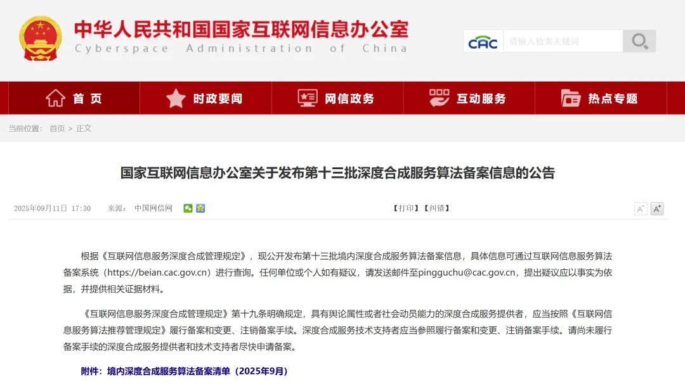
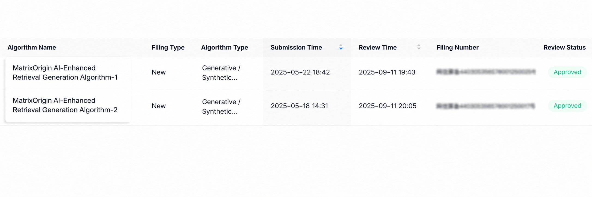

On September 11, 2025, the Cyberspace Administration of China announced the **13th batch of deep synthesis service algorithm filing information**. Two algorithms independently developed by MatrixOrigin, **MatrixOrigin AI Search Generation Algorithm-1** and **MatrixOrigin AI Search Generation Algorithm-2**, **successfully passed** the filing process. This is not only an official certification of the compliance of MatrixOrigin's technology R&D, but also a concrete result of the company's development approach of multimodal data fusion and governance. It marks MatrixOrigin's entry into the small group of domestic technology service providers that have truly implemented data intelligence (Data + AI).

Passing the national deep synthesis algorithm filing means MatrixOrigin now has three key qualifications: **legal commercial use, compliant deployment, and secure controllability**. Looking ahead, MatrixOrigin will use more intelligent and more compliant products and technical solutions to help customers reduce costs, improve efficiency, and promote high-quality development in the artificial intelligence industry.

## About MatrixOrigin

MatrixOrigin is a leading provider of data intelligence (Data & AI) platform technologies and services. Its core team comes from well-known technology companies in China and around the world, with broad industry and international perspectives. MatrixOrigin's core product, MatrixOne Intelligence, is an enterprise-oriented AI-native multimodal data intelligence platform. By using artificial intelligence technologies, including large models, and an innovative hyper-converged data foundation, it helps enterprises uniformly manage and govern multimodal data and transform private-domain data into AI-Ready data assets. It has already served leading enterprises across industries, including StoneCastle, China Mobile IoT, Amway Nutrilite, Jiangxi Copper, and XCMG Hanyun, helping enterprises transform and upgrade from informatization and digitization to intelligence.
