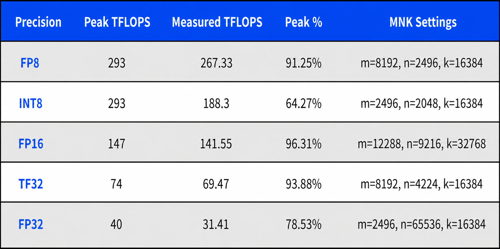

In today's rapidly advancing technology landscape, the importance of computing capability is beyond question. Whether in artificial intelligence, deep learning, or high-performance computing, the strength of compute power determines the speed and effectiveness of innovation. As one of NVIDIA's latest top-tier GPUs, the H20 has attracted broad attention for its powerful hardware configuration and excellent real-world performance.

This article takes an in-depth look at the concept of compute power, methods for evaluating it, and its applications in modern computing tasks, with a particular focus on how to maximize the advantages of the NVIDIA H20 GPU. By combining theory with real data, we analyze the H20's unique value and future development direction.

### The Concept and Historical Evolution of Compute Power

- 1.1 Definition and Basic Concepts of Compute Power

Compute power, or computing capability, refers to the amount of computation a computing device can complete per unit of time. It is typically measured in floating-point operations per second (FLOPS), the standard unit for floating-point computing performance. FLOPS represents how many floating-point operations can be performed per second; the higher the FLOPS value, the stronger the device's computing capability.

In practical applications, computing tasks vary widely, from scientific computing to deep learning model training, from financial data analysis to autonomous driving systems. Different tasks have different requirements for compute power. Computing capability is not only a hardware performance metric; it is also an important factor that determines technical feasibility and application effectiveness. As technology advances, computing tasks are becoming increasingly complex and data volumes continue to grow, making demand for high compute power more urgent than ever.

- 1.2 The Development of Compute Power

The development of computing capability can be traced back to the early history of computers. From the first mechanical computers to electronic computers and then to modern supercomputers, improvements in compute power have accompanied major leaps in hardware technology. Early computing devices such as ENIAC could perform only a few thousand simple addition operations per second, while today's supercomputers can complete tens of quadrillions of floating-point operations per second.

Over time, computing devices evolved from single processors to multi-core processors, and then to parallel and distributed computing. In the field of graphics processing units (GPUs) in particular, companies such as NVIDIA have significantly improved computing capability through continuous hardware architecture optimization. Modern GPUs such as the H20 not only perform well in graphics processing, but also demonstrate powerful compute capabilities in parallel computing, deep learning, scientific simulation, and other fields.

- 1.3 The Importance of Computing Capability

Computing capability is the foundation of modern technological progress. From physics simulations to molecular modeling, from image recognition to natural language processing, powerful compute enables these complex tasks to become practical. In artificial intelligence in particular, training deep learning models depends on massive amounts of data and complex computation, creating extremely high requirements for compute power.

In finance, high-speed trading systems rely on real-time data analysis and decision-making. These operations must be completed at the microsecond level and therefore require extremely high computing capability. Similarly, in autonomous driving, vehicles must process data from multiple sensors and make driving decisions within a very short time, which also requires strong compute support. In this sense, compute power is not only a reflection of hardware performance, but also a key engine driving technological progress.

### Methods for Evaluating and Measuring Compute Power

- 2.1 Standards and Methods for Evaluating Compute Power

Evaluating compute power involves multiple dimensions, including theoretical computing capability, actual execution efficiency, and task-specific performance. The following are several commonly used evaluation criteria:

1. FLOPS (Floating-Point Operations Per Second)

FLOPS is the most direct metric for evaluating computing capability. It indicates how many floating-point operations the hardware can complete in one second. The higher the compute capability, the faster the hardware can process data and execute tasks. FLOPS is typically classified by precision type, such as single precision (FP32), double precision (FP64), and mixed precision (FP16, BFLOAT16, and others). Different tasks use different precision types.

2. Bandwidth

Bandwidth refers to the amount of data that can be transmitted per unit of time. Memory bandwidth is one of the key factors that determine computing device performance, especially in tasks that need to process large volumes of data. High bandwidth can effectively reduce data transfer bottlenecks and improve overall computing efficiency. In GPU computing, bandwidth affects not only data loading speed, but also model training speed directly.

3. Latency

Latency is the time required from input data to output result. Low latency helps reduce waiting time during data transfer and processing. In parallel computing in particular, reducing latency can significantly improve computing efficiency. Latency is often a bottleneck in parallel computing systems, especially in large-scale data processing or multi-GPU collaboration.

4. Efficiency Ratio

The efficiency ratio measures computing capability per unit of power consumption. A high efficiency ratio means that hardware can provide higher compute performance under the same power budget, which is especially important for data centers and high-performance computing clusters. In practical applications, efficiency affects not only computing costs, but also cooling and maintenance requirements.

- 2.2 Compute Power Evaluation in Model Training and Inference

In deep learning and machine learning, compute power evaluation is often tied to specific task requirements. The following are several common evaluation criteria:

1. Training Speed

**Evaluation Unit and Calculation Method**

- Unit:
  Training speed is usually measured by samples per second (SPS) or tokens per second (TPS).

- Calculation method:
  SPS and TPS are calculated as follows:

SPS = total number of processed samples / training time (seconds)

TPS = total number of processed tokens / training time (seconds)

In the calculation, the number of samples refers to the batch size of input data, while the number of tokens is typically used for natural language processing (NLP) model training and refers to the smallest units obtained after input text is split, such as words or subwords.

**Importance and Practical Applications**

Training speed is a key metric for measuring the efficiency of computing devices during model training. Higher training speed means the model can process more data in less time, accelerating the overall training process. This is especially important when working with large datasets or complex models such as deep neural networks and convolutional neural networks.

In practical applications, improving training speed helps:

- Shorten the model development cycle.

- Improve resource utilization and reduce computing costs.

- Run more experiments within the same time window, thereby improving model quality.

In deep learning in particular, using larger batches can significantly improve SPS or TPS. Efficient hardware such as NVIDIA H20 GPUs can support larger batch sizes and faster data processing, thereby improving training speed.

2. Model Convergence

**Evaluation Unit and Calculation Method**

- Unit: There is no unified unit for model convergence. It is usually measured by the number of training epochs, the number of iterations, or the time required to reach a target performance metric.

- Calculation method:

Convergence speed = target performance metric / training time (seconds)

It can also be measured by the number of epochs required for the model's performance to stabilize.

For example, in a deep learning task, convergence speed can be represented by the time required for a model to reach a certain accuracy or loss value. Fewer epochs or iterations indicate faster convergence.

**Importance and Practical Applications**

Convergence measures a model's ability to gradually approach an optimal solution during training. Stronger compute power usually leads to faster convergence, because high-performance devices can support larger batch sizes, more complex optimization algorithms, and faster data processing. This is critical for research and development projects with limited time, because faster convergence allows teams to obtain effective models sooner.

In practical applications, convergence is closely related to the following factors:

- Optimization algorithms: Choices and adjustments of algorithms such as Adam and SGD directly affect convergence speed.

- Batch size: Larger batch sizes often accelerate convergence, but require sufficient GPU memory, which is one of the advantages of high-compute devices.

- Learning rate: Adjusting the learning rate can help a model converge faster, but requires careful tuning to avoid overfitting or underfitting.

Using devices such as NVIDIA H20, which offer high compute power and large GPU memory, can accelerate model convergence while maintaining computational precision.

3. Inference Speed

**Evaluation Unit and Calculation Method**

- Unit: Inference speed is usually measured by samples per second (SPS) or tokens per second (TPS), similar to training speed.

- Calculation method: SPS and TPS are calculated as follows:

SPS = total number of processed samples / inference time (seconds)

TPS = total number of processed tokens / inference time (seconds)

Inference speed evaluates a model's response time in real-world applications, especially in real-time or near-real-time scenarios such as autonomous driving, speech recognition, and online recommendation systems.

**Importance and Practical Applications**

Inference speed is one of the key metrics that determine model performance in production environments. In applications that require real-time processing and responses, inference speed directly affects user experience and system efficiency.

The faster the inference speed, the shorter the system response time. This is especially important in the following scenarios:

- Autonomous driving: Vehicles must process sensor data and make driving decisions within extremely short time windows.

- Real-time translation and speech recognition: Systems must respond quickly after users issue commands.

- Online recommendation systems: Systems must analyze user behavior in real time and recommend personalized content.

NVIDIA H20 GPUs perform especially well in inference tasks. In FP8 low-precision computing in particular, they can provide extremely fast inference while maintaining high efficiency.

4. Balancing Accuracy and Efficiency

**Evaluation Unit and Calculation Method**

- Unit: Accuracy is usually expressed as a percentage (%) or a numerical value such as loss or accuracy; efficiency is measured by processing speed or performance per watt (FLOPS/Watt).

- Calculation method:

Accuracy = model performance metric on the test dataset, such as accuracy or F1 score

Efficiency = computing resources consumed / time or energy required to reach the target performance

In deep learning, accuracy and efficiency often need to be balanced. For example, high-precision computing usually requires more computing resources and time, while low-precision computing can provide higher speed and lower resource usage.

**Importance and Practical Applications**

In real-world applications, balancing accuracy and efficiency is a critical consideration when designing and deploying AI systems. Although higher accuracy is the goal of many AI tasks, it is not always the only consideration. For example:

- Edge computing devices: Limited computing resources and energy budgets may require tradeoffs between accuracy and efficiency.

- Real-time applications: For voice assistants or real-time translation, faster response time may be more important than absolute accuracy.

- Low-cost deployment: In large-scale deployments, achieving "good enough" accuracy at lower cost may be more practical than pursuing maximum precision.

NVIDIA H20 GPUs provide multiple floating-point computation modes, such as FP16 and FP8, allowing developers to choose the right balance between precision and efficiency for each task. For example, FP16 mixed precision can improve training speed, while FP8 can further optimize inference performance while maintaining sufficient prediction accuracy.

### In-Depth Analysis of NVIDIA H20 GPUs

- 3.1 H20 Hardware Architecture and Technical Innovation

The NVIDIA H20 GPU is based on the latest Hopper architecture and leads a new round of technological change in graphics computing and parallel computing. Compared with previous generations based on the Ampere architecture, the H20 brings significant upgrades in many areas. In FP32, FP16, and the newly added FP8 precision computing capabilities in particular, the H20 demonstrates excellent performance across a wide range of complex computing tasks.

According to the provided chart, the H20 reaches 44 TFLOPS in FP32 single-precision floating-point operations, far higher than the 19.5 TFLOPS of previous-generation products based on the Ampere architecture. This improvement is significant for tasks that require high-precision computation, such as media processing and physics simulation.

In FP16 and FP8 Tensor Core performance, the H20 also significantly outperforms previous-generation products. In FP16 operations, the H20 reaches 148 TFLOPS. In FP8 8-bit floating-point operations, its performance reaches 296 TFLOPS. This gives the H20 a major advantage when handling tasks that require extensive parallel computation, such as deep learning model training and inference.

- 3.2 Advantages in GPU Memory and Bandwidth

The H20 GPU is equipped with 96 GB of HBM3 memory, one of the highest-end memory configurations available. This memory significantly exceeds the previous generation's 80 GB HBM2e in capacity, and also reaches an impressive 4 TB/s in memory bandwidth, nearly twice that of the previous generation. Such high memory bandwidth allows the H20 to transfer data faster and reduce processing latency when working with large-scale datasets and high-resolution tasks.

For large model training and deep learning applications, memory capacity and bandwidth directly determine whether hardware can effectively load and process training data. With 96 GB of memory, the H20 can easily handle tasks that require large data batches. Its 4 TB/s bandwidth also ensures that data can be transferred quickly to the GPU for processing, which is especially important for data-intensive tasks such as autonomous driving and image recognition.

- 3.3 H20 Computing Capability and Real-World Performance

By analyzing the H20 compute capability chart, we can see its strong performance under FP8, FP16, and other precision modes. In tasks that require efficient floating-point operations in particular, the H20 Tensor Cores can deliver unprecedented compute performance. For example, in FP8 8-bit floating-point operations, H20 performance reaches 296 TFLOPS, making it suitable for scenarios such as quantized training and model inference.

The H20 also significantly improves NVLink interconnect bandwidth. Compared with the previous generation's 600 GB/s and 400 GB/s, H20 NVLink bandwidth reaches 900 GB/s. This means that multiple H20 GPUs can exchange data more efficiently in multi-GPU interconnect scenarios, reducing latency in multi-GPU collaboration and improving overall computing efficiency.

- 3.4 Floating-Point Computation Modes and H20 Application Scenarios

In NVIDIA H20 GPUs, different floating-point computation modes provide flexible choices for a range of computing tasks. H20 supports modes from double precision (FP64) to the latest FP8 low-precision computation, covering broad application requirements from high-precision scientific computing to efficient inference.

- Double-precision mode (FP64): Typically used in scientific and engineering computing that requires extremely high precision, such as fluid dynamics simulation and climate prediction.

- Single-precision mode (FP32): The mainstay of deep learning, especially when training large AI models. FP32 provides sufficient precision and relatively high computing efficiency.

- Half-precision mode (FP16): Widely used in deep learning acceleration in recent years. In tasks such as convolutional neural networks (CNNs), FP16 can significantly improve training speed and reduce GPU memory usage.

- Low-precision modes (FP8 and INT8): With the development of quantization techniques, FP8 and INT8 are increasingly used in inference tasks. The H20's 296 TFLOPS FP8 compute capability gives it a clear advantage in large-scale model inference.

- 3.5 Choosing Between GPU Models: SXM, PCIe, and NVLink

To meet different user needs, NVIDIA provides multiple H20 GPU models, including SXM, PCIe, and NVLink. These models differ in hardware architecture and connection method, which determines their suitability for different application scenarios.

- SXM version: Through the SXM module design, eight GPUs can be tightly interconnected. It is mainly used in high-density GPU server clusters such as NVIDIA DGX systems. This design does not rely on traditional PCIe interfaces. Instead, it uses NVSwitch to achieve higher bandwidth and lower latency, making it especially suitable for ultra-large-scale AI training and scientific simulation tasks.

- PCIe version: This version uses the traditional PCIe interface and provides a more flexible deployment method. It supports direct communication with the motherboard and CPU, making it suitable for traditional GPU servers and general-purpose computing tasks. Every two GPUs can be connected through an NVLink Bridge. Although its bandwidth is lower than that of the SXM version, it has certain advantages in scalability and compatibility.

- NVLink version: Designed for data-intensive tasks that require ultra-high bandwidth. It provides transmission bandwidth of up to 7.8 TB/s and is suitable for large language model (LLM) training tasks that need real-time processing of massive amounts of data. Through the NVLink interface, multiple H20 GPUs can exchange data at high speed, reducing data transfer bottlenecks during computation and improving overall efficiency.

By combining the characteristics and application scenarios of these different models, users can choose the most suitable GPU type for their specific needs and maximize H20 performance in different computing tasks.

### Practical Applications of H20 in Model Training and Inference

- 4.1 Exploring H20 Applications Through the Llama2 Model

To better understand H20 performance in real-world applications, we can use training and inference data from the Llama2-70B model to analyze its performance. According to the provided chart, H20 GPUs demonstrate excellent compute capability under different precision modes (FP8 and FP16) and different input-output lengths.

In the chart, when the HGX H20 module processes the LLAMA2_70B model with FP8 precision, using an input length of 2048 and output length of 128, the H20 throughput reaches 1.2244595*A tokens per second. With an input length of 128 and output length of 2048, FP8 throughput reaches as high as 2.0981547*B tokens per second. This shows that H20 GPUs can deliver extremely efficient compute performance in high-precision and complex model training and inference tasks.

By contrast, the HGX A1XX module performs significantly worse than the H20 under the same configuration using FP16 precision. This further confirms the H20's advantage in handling large language models. In inference tasks that require complex input-output relationships in particular, H20's high bandwidth and powerful Tensor Core performance allow it to complete inference in less time and provide higher throughput.

- 4.2 H20's Unique Advantages in Inference Tasks

In inference tasks, throughput and response speed are two key metrics. With its FP8 compute capability, the H20 GPU can provide higher token processing speed when handling large-scale models such as LLAMA2_70B. Combined with the data analysis above, the H20's inference performance is not reflected only in raw compute capability. It also benefits from large memory capacity and ultra-high memory bandwidth. These factors work together to allow the H20 to maintain efficient and accurate output when handling complex inference tasks.

With NVLink's high-bandwidth support, multiple H20 GPUs can exchange data and collaborate efficiently in multi-GPU clusters, which is critical for tasks that require real-time data processing and analysis. For example, in autonomous driving systems, H20 GPUs can improve system safety and responsiveness by rapidly processing sensor data and making decisions.

- 4.3 GEMM Performance Analysis of H20

In matrix multiplication (GEMM) tasks, floating-point performance is one of the key metrics for evaluating GPU computing capability. The following table data highlights the GEMM performance of Yidiya H20 under different floating-point precision modes and analyzes it in detail.

**Analysis and Interpretation**

FP8 Precision

- Peak performance: 293 TFLOPS
- Measured performance: 267.33 TFLOPS
- Percentage of peak: 91.25%

Under FP8 precision, the measured performance of Yidiya H20 reaches 267.33 TFLOPS, or 91.25% of peak performance. This result shows that in low-precision floating-point operations, Yidiya H20 performs very close to its theoretical maximum, indicating highly efficient hardware design for FP8 tasks. It is suitable for scenarios such as large-scale model inference and quantized training.

INT8 Precision

- Peak performance: 293 TFLOPS
- Measured performance: 188.30 TFLOPS
- Percentage of peak: 64.27%

Under INT8 precision, the measured performance of Yidiya H20 is 188.30 TFLOPS, or 64.27% of peak performance. Although this is lower than its FP8 result, INT8 still provides efficient compute capability. INT8 precision is widely used in inference tasks that process large volumes of data. In resource-constrained environments in particular, it can reduce computational complexity while maintaining reasonable accuracy.

FP16 Precision

- Peak performance: 147 TFLOPS
- Measured performance: 141.55 TFLOPS
- Percentage of peak: 96.31%

Under FP16 precision, Yidiya H20 nearly reaches its peak performance, with a measured value of 141.55 TFLOPS, or 96.31% of peak. This indicates that Yidiya H20 can fully use its hardware potential in FP16 operations and is well suited for deep learning training tasks, especially models such as convolutional neural networks (CNNs) and recurrent neural networks (RNNs) that require high compute speed.

TF32 Precision

- Peak performance: 74 TFLOPS
- Measured performance: 69.47 TFLOPS
- Percentage of peak: 93.88%

TF32 is a floating-point precision mode between FP16 and FP32. It is designed to provide higher compute efficiency than FP32 while preserving a certain level of computational precision. In this mode, Yidiya H20 reaches measured performance of 69.47 TFLOPS, or 93.88% of peak performance. This result shows that TF32 is an ideal balance between precision and efficiency, especially for demanding scientific computing and AI model training where it can significantly improve compute speed.

FP32 Precision

- Peak performance: 40 TFLOPS
- Measured performance: 31.41 TFLOPS
- Percentage of peak: 78.53%

Under FP32 precision, Yidiya H20 reaches measured performance of 31.41 TFLOPS, or 78.53% of peak performance. Although efficiency is slightly lower than in other precision modes, FP32 remains the preferred precision mode for many AI models and scientific computing tasks. In scenarios that require high-precision results, FP32's stable performance is very important.

From the analysis of H20 GEMM performance under different precision modes, we can see its strong performance across multiple computation modes. Whether in FP8 and INT8 for efficient inference, or FP16 and TF32 for deep learning training, Yidiya H20 can provide real-world performance close to its theoretical peak. This shows that the H20 GPU not only has excellent hardware design, but can also fully use its compute capability in practical applications, making it suitable for a wide range of scenarios from AI model training to large-scale inference.

### In-Depth Comparison Between NVIDIA H20 and H100

- 5.1 Advantages and Application Scenarios of H100 GPUs

The NVIDIA H100 GPU is one of the most powerful GPUs currently on the market. Its theoretical compute capability of up to 1979 TFLOP gives the H100 unmatched advantages when handling high-precision computing tasks. The H100's performance density reaches 19.4, far higher than the H20's 2.9. This allows the H100 to provide higher compute capability per unit area, making it especially suitable for computing environments with limited space but high performance requirements.

In practical applications, H100 GPUs are mainly used in high-precision scientific computing, complex AI model training, and large-scale data analysis. For users who need extreme performance, H100 GPUs are undoubtedly the best choice. For example, in tasks such as climate simulation, molecular dynamics, and high-precision physics simulation, H100 GPUs can significantly accelerate computation and reduce simulation time.

- 5.2 Core Value and Unique Advantages of H20 GPUs

Although the H20 GPU is not as strong as the H100 in theoretical compute capability, its real-world application performance is still excellent. In large-scale low-precision model training and inference in particular, the H20 demonstrates an extremely high performance-price ratio through its large memory, high bandwidth, and lower cost. For tasks that need to process large amounts of data and do not require extremely high computational precision, such as natural language processing, recommendation systems, and image recognition, the H20 is a highly competitive choice.

The core value of the H20 GPU lies in its excellent memory management and efficient computing capability. Under FP8 precision in particular, the H20 can complete training tasks with fewer nodes, thereby reducing overall computing costs. This makes the H20 one of the most cost-effective solutions for budget-sensitive projects.

### Broad Industrial Applications of H20

In addition to its broad use in AI research, the H20 GPU also shows enormous application potential in industry. Whether in autonomous driving, intelligent manufacturing, fintech, or healthcare, the H20 can use its powerful compute capability to provide solutions for a wide range of complex computing tasks.

In autonomous driving, H20's high bandwidth and low latency allow it to process data from multiple sensors in real time and make driving decisions. In intelligent manufacturing, complex process simulation and optimization can also be accelerated with H20's high compute power. In fintech, the H20's fast data processing capability can significantly improve response speed in high-frequency trading systems and reduce market risk.

**Special Offer**

[Neolink.AI](https://www.neolink-ai.com) offers H20 trial access at the lowest price across the web:

- H20 from RMB 4.8 per hour;
- Register and complete real-name verification on Neolink.AI to receive a free 4-hour 4090 coupon plus a 1-hour H20 coupon.
