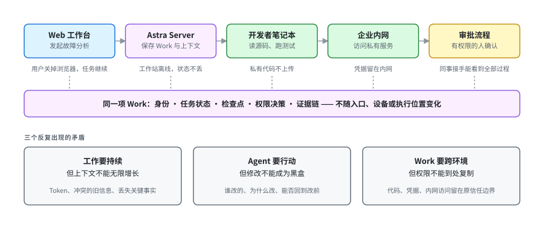
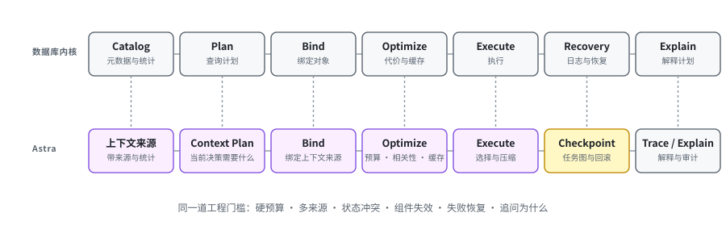
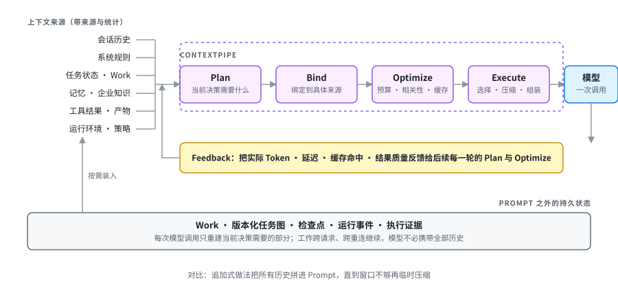
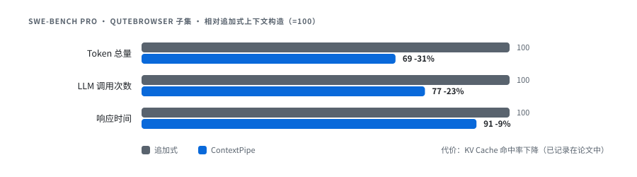
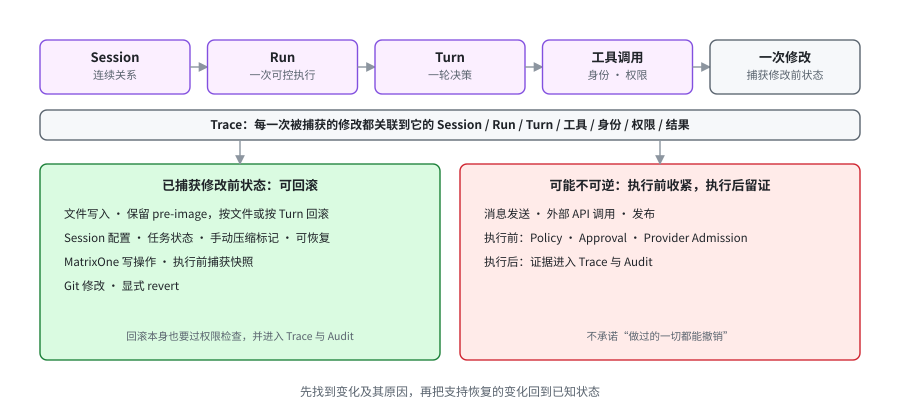
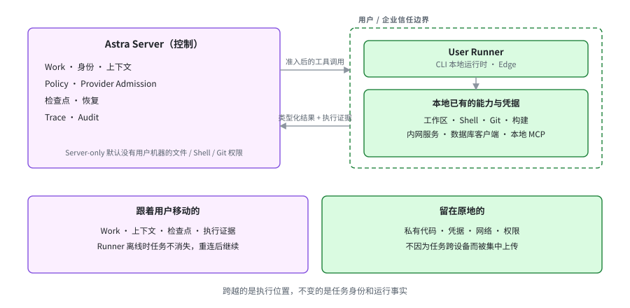
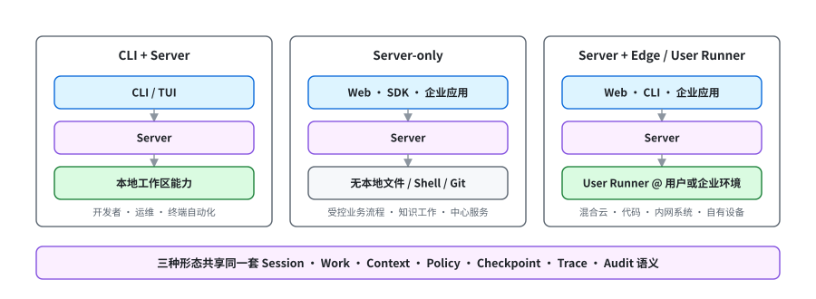
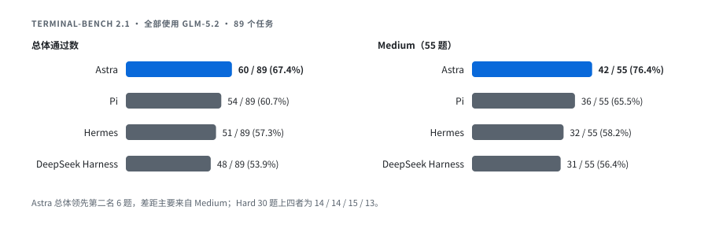

# Astra 正式开源了：面向长期复杂工作的企业级 Agent Runtime

## 我们为什么做 Astra

矩阵起源一直是一家 Data Infra 公司，长期做数据库和数据系统的企业级基础设施。最近几年，模型从回答问题走向调用工具、执行流程，我们的重心也随之明确：支持 Agentic Workload。与此同时，我们自己的数据平台也越来越离不开 Agent。它不再只是产品外面的一层对话入口，而是开始理解意图、组织上下文、选择模型和工具、调度查询与任务，在权限边界内推动执行，正在成为数据基础设施的一种新型控制面。Agent 需要数据基础设施提供持久状态、上下文、事务、治理、恢复和可观测性；数据平台也需要 Agent 把人的目标变成可以持续推进、可以检查和控制的执行过程。两者不能靠几个 API 临时拼接，必须在架构上长在一起。

过去几年，我们参与了大量企业级 Agent 项目，场景覆盖代码开发、数据分析、故障处理、内部运营和企业流程。模型不同，入口不同，连接的数据和工具也不同，但进入真实环境以后，碰到的问题越来越相似：任务持续数小时甚至更久，Agent 会真正修改代码、配置和数据，工作还要在 Web、CLI、云端、开发者电脑和企业内网之间继续。下一节会展开这三个问题。

到 2026 年初，这些问题已经足够集中。我们评估了当时可用的方案：Claude Code、Codex 等 Coding Agent 已经能在终端、IDE 或云端很好地完成代码任务；Pi 这样的开源 Harness 提供了简洁、可扩展的 Agent 循环；LangGraph、OpenAI Agents SDK 等框架提供了状态、工具调用和工作流编排能力。它们各有所长，但我们没有找到一套以解决上述问题为核心目标、又能自托管和替换模型供应商的 Agent Runtime。于是我们在 Coding Agent 的加持下开始自己做 Astra，并把它搬进了我们的数据平台 MatrixOne Intelligence，作为整个平台的 Agent 驱动引擎。顺便说一句，最近听说 GPT-6 可能叫 Astra。模型还没见到，名字先撞上了。

半年多后的今天，我们把 [Astra](https://github.com/matrixorigin/Astra) 正式开源。它是一套面向企业级 Agent 的自托管 Agent Runtime，不绑定模型供应商。Harness 决定模型看到什么上下文、能调用什么工具、怎样推进任务；Agent Runtime 则管理工作的生命周期，让它跨越请求、设备和执行环境继续存在，同时保留清楚的权限边界与证据链。用三句话概括：**让长期工作用更少的 Token 持续推进。让 Agent 的修改可追踪、可回滚。让同一项工作跟着用户跨环境继续。**

## 企业里的 Agent 任务长什么样

设想一项常见的企业任务：用户在 Web 工作台发起一次故障分析。Agent 需要理解历史告警和运行手册，进入用户本地的代码仓库，执行测试，访问私有网络里的服务，再把修复建议送进企业审批流程。用户关掉浏览器以后，任务仍然要继续；本地工作站暂时离线，云端的任务状态不能消失；涉及发布时必须等待有权限的人确认；换一个同事接手时，他需要知道前面做过什么，而不是从一段聊天记录里猜。

这类任务里有三个反复出现的矛盾。

**工作要持续，但上下文不能无限增长。** 企业任务会积累对话、规则、计划、工具结果、运行状态和企业知识。如果每一轮都把全部历史重新交给模型，Token 成本越来越高，互相冲突的旧信息也越来越多。但如果简单截断，又可能丢掉恢复任务所需的关键事实。

**Agent 要行动，但修改不能成为黑盒。** 当 Agent 开始编辑文件、调整 Session 状态、修改数据库或提交代码，"它回答得好不好"已经不是唯一标准。团队还需要知道修改来自哪次运行、经过了什么授权、产生了哪些副作用，以及在结果不对时能否回到修改前的状态。

**Work 要跨环境继续，但权限不能跟着到处复制。** 企业真正有价值的能力往往位于开发者电脑、私有仓库和内部网络。任务需要从 Web 进入本地执行，再回到 Server 持续运行；私有代码、凭据和网络访问却应该留在原来的信任边界里。

这已经不是一次模型调用，而是一项有身份、有状态、有执行位置、有恢复路径，也有责任边界的工作。它可能在云端开始，在本地完成，在移动端查看，在企业系统里审批。这些入口可以有不同的能力边界，但不能拥有彼此矛盾的运行事实。

## 数据库交过的学费

Astra 出自一支长期从事数据库内核工作的团队。我们借鉴数据库，不是因为 Agent 等同于数据库，而是因为数据库已经用几十年走过了从"把计算跑起来"到"让复杂执行可靠运行"的工程过程。一次查询可能很贵，资源永远有限，状态会冲突，组件会失效，用户还会追问为什么慢、为什么选择这个计划、失败后能不能恢复。这些现实逐步沉淀成了 Catalog、Plan、Bind、Optimize、Execute、资源治理、Recovery 和 Explain 等内核机制。

Agent 工程未必会沿着数据库的架构演进，但正在跨过同一道工程门槛。Prompt、工具列表和一个循环足以做出令人惊喜的 Demo；进入生产以后，上下文、状态、权限、执行位置、失败恢复和可解释性都必须成为显式的系统能力，不会靠一段更长的系统提示词自然消失。数据库给 Astra 的是一套经过长期生产实践检验的系统工程方法。我们想做的，是让 Agent 少交一些复杂系统已经交过的学费。

## ContextPipe：把上下文当查询来执行

第一个问题，是怎样让 Work 长期存在，同时减少每一轮需要重新交给模型的上下文。

长任务中的上下文并不是越多越好。会话历史、系统规则、任务状态、记忆、工具结果、企业知识和运行环境都在竞争有限的上下文窗口。最直接的做法是不断向 Prompt 末尾追加内容，直到窗口不够，再临时做一次压缩。它很容易实现，也很容易在任务变长后失控：Token 越来越多，缓存结构频繁变化，旧信息和当前事实发生冲突，失败以后又很难准确重建当时送给模型的输入。

在 ContextPipe 中，我们对上下文组装和查询执行做了具体映射：两者都要在硬预算下，从多种数据源中选择内容、确定顺序、利用统计信息与分层缓存，并解释最终计划。因此，ContextPipe 把上下文处理拆成五个阶段：Plan、Bind、Optimize、Execute 和 Feedback。系统先确定当前任务需要什么，把需求绑定到带来源的上下文数据源，再根据预算、相关性和缓存特征生成计划，执行选择与压缩，最后把实际 Token、延迟、缓存和结果反馈给后续运行。上下文由此不再是一条不断增长的字符串，而是一条可以审计、回放、隔离失败并持续优化的数据管线。

更少的 Token 并不意味着把长期状态一起删掉。Astra 把 Work、任务图、检查点、运行事件和执行证据保存在 Prompt 之外；每次模型调用只重建当前决策真正需要的上下文。工作因此可以跨越请求和重连继续，模型却不必反复携带全部历史。

这项工作形成了论文 [ContextPipe: Database-Inspired Context Assembly for Long-Horizon Agents](https://arxiv.org/abs/2609.00749)，已被与 VLDB 2026 同期举办的 [ADS/DATAI 2026 Workshop](https://vldb-ads.top/)（The 1st International Workshop on Agentic Data Systems 与 The 3rd Workshop on Data-Centric AI 联合举办）接收。

在 SWE-bench Pro 的 Qutebrowser 子集上，与追加式上下文构造相比，ContextPipe 在初步实验中减少了 **31% 的 Token 总量、23% 的 LLM 调用和 9% 的响应时间**。实验也记录了更低的 KV Cache 命中率这一代价。我们愿意把它一起写出来，因为工程优化的价值不在于每个指标都变好，而在于系统能够看见并解释自己做出的取舍。

北京时间 9 月 4 日深夜，张祖羽博士和田丰博士会在波士顿的 ADS/DATAI Workshop 现场讲这篇论文，具体时间地点见[会议日程](https://vldb-ads.top/)，在现场的朋友欢迎来聊。

Context Pipeline 后来成为 Astra 内核的一部分。但上下文只是开始：模型知道什么之后，仍然要解决任务怎样存在、修改如何恢复、能力在哪里，以及动作由谁授权。

## 整体架构：一条骨干，多个执行者

Astra 的核心设计可以概括为：一条共享的 Agent 运行骨干，多种有边界的能力提供者。

运行骨干保存 Session、Run、Turn 和 Work，负责上下文、任务图、检查点、策略、恢复、Trace 与 Audit。Server、User Runner、MCP 和 Sandbox 则提供不同位置、不同权限范围内的执行能力。Web、CLI/TUI、SDK 和企业应用只是进入同一个系统的不同入口，不需要各自再实现一套 Agent 循环。

一次运行从 Context Pipeline 开始：它决定模型此刻应该知道什么。模型作出判断后，Policy 和 Provider Admission 决定动作能不能发生、由哪个环境执行。Server、User Runner、MCP 或隔离环境完成动作，Trace 和 Audit 再把结果送回同一项 Work，成为恢复、解释和下一轮上下文的依据。

这条链回答企业 Agent 最基本的四个问题：它现在知道什么，谁允许它做什么，动作应该在哪里发生，以及事后如何证明发生过什么。模型和工具可以替换，这些运行事实不能随之消失。

## 改错了怎么办：Trace 与回滚

第二个问题，是 Agent 真正开始修改系统以后，怎样把错误的代价控制在可恢复范围内。

Astra 不把 Trace 只当作运行结束后的日志。一次被捕获的修改会和执行它的 Session、Run、Turn、工具、身份、权限与结果关联起来。用户看到的不只是"Agent 调用了某个工具"，还可以追到改动来自哪里，并使用相应的恢复机制处理它。

当前 Astra 已经为几类常见修改提供了明确的恢复边界：文件写入保留 pre-image 和修改记录，可以按文件或 Turn 回滚；Session 配置、任务状态和手动上下文压缩标记可以恢复；通过 Astra 执行的 MatrixOne 写操作会捕获修改前快照；Git 修改可以使用显式 revert。回滚本身同样要经过权限检查，并进入 Trace 与 Audit。

这里的承诺不是"Agent 做过的一切都能撤销"。消息发送、外部 API 调用、发布等动作可能具有不可逆副作用。对于这些动作，Astra 在执行前依靠 Policy、Approval 和 Provider Admission 限制权限，在执行后保留证据。**能够安全回滚的，是 Astra 已经捕获修改前状态并提供恢复契约的变化。**

所以，第二个特点不是泛泛的"有日志"，而是让 Agent 的修改可追踪、可回滚：先找到变化及其原因，再把支持恢复的变化回到已知状态，而不是把所有错误都留给人手工猜测和清理。

## User Runner：执行进入用户环境，权限留在原地

第三个问题，是 Work 怎样进入用户所在的环境继续执行，同时不把私有权限变成 Server 的默认能力。User Runner 是 Astra 回答这个问题的关键边界。

企业真正有价值的工具和数据，往往并不在 Astra Server 所在的环境里。它们存在于员工工作站、代码仓库、内网服务、本地命令行、数据库客户端、企业浏览器会话和现有 IT 系统中。把这些系统全部暴露给托管 Agent 既不现实，也不应该成为默认方案。

Astra 把控制和执行分开：Server 保存共享 Work、身份、上下文、策略和执行决策；User Runner 位于用户或企业自己的信任边界中，使用当地已有的工作区、网络、工具和凭据完成被允许的动作，再把类型化结果与执行证据送回同一条运行骨干。

Server-only 模式默认不会获得用户机器上的文件、Shell 或 Git 权限。只有经过绑定的 Runner 接入以后，这些能力才会出现。这个"默认做不了"不是功能缺失，而是刻意保留的安全边界。

Runner 不是第二个 Agent 大脑，也不等于一条可以随意执行命令的远程 Shell。它不负责重新理解任务，只在用户、工作区和权限边界内执行已经准入的能力。Runner 描述执行角色，Edge 描述它靠近私有系统的部署位置；CLI 本地运行时和 Edge 都可以成为 User Runner。

例如，同一个任务可以在 Web 上创建，由 Server 持续跟踪；需要检查源代码时，任务被路由到开发者笔记本上的 User Runner；需要查询生产信息时，调用企业网络中的受控能力；涉及写操作时进入审批；执行完成后，结果、工具调用、Provider、权限决策和失败重试全部回到原来的 Work 与 Trace 中。即使 Runner 暂时离线，任务和上下文仍然存在，恢复连接后可以继续，而不是重新开始一场聊天。

这也是"云端开始、本地完成、移动端查看、企业系统审批"能够成立的基础。跟着用户移动的是 Work、上下文和执行证据；留在原地的是私有代码、凭据、网络与权限。跨越的是执行位置，不变的是任务身份和运行事实。

## 这三件事为什么要放在一起

Astra 的产品边界没有画在"支持多少个工具"上。工具还会越来越多，而长期工作、恢复边界和执行位置很难在生产以后再补上。

**为什么长任务不必携带全部历史？** Durable Work 让目标脱离某一次请求和聊天连接继续存在；Context Pipeline 只为当前决策组装预算内的上下文。Session 保存连续关系，Run 表示一次可控制的执行，Work 和版本化任务图记录目标、依赖、尝试、验证与交付。

**这次修改出了问题怎么办？** Trace 将修改与执行事实关联，文件记录、Session 状态、数据库快照和 Git 历史提供各自的恢复路径；不具备可靠恢复契约的外部动作则必须在执行前收紧权限。

**换一个设备或环境以后怎样继续？** Server 保存同一项 Work，Runner 提供当前用户和环境实际拥有的能力。执行位置可以变化，任务身份、检查点和证据链保持连续。

Policy、Provider Admission、Trace、Introspect、Explain 和 Audit 贯穿这三个过程：决定动作能不能发生、由谁和在哪里执行，并把等待、降级、阻塞、失败、恢复和副作用变成可以检查的运行事实。这不是在运行结束后补一个日志页面。证据本身就是下一轮上下文、失败恢复、用户解释和企业治理的一部分。

## 三种部署方式

Astra 当前支持三种主要运行形态：

- **CLI + Server**：通过 CLI/TUI 交互，同时使用本地工作区能力，适合开发者、运维和终端自动化。
- **Server-only**：由 Web、SDK 或企业应用访问共享 Server，适合受控的业务流程、知识工作和中心服务。
- **Server + Edge / User Runner**：Server 负责任务和控制，Runner 进入用户或企业环境执行，适合混合云、代码、内网系统与用户自有设备。

这三种形态改变的是可用能力和执行位置，不是 Agent 的身份。它们共享相同的 Session、Work、Context、Policy、Checkpoint、Trace 和 Audit 语义。

这一点很重要。如果 Web 有一套上下文，CLI 有另一套状态，Edge 再维护第三份任务事实，那么产品表面上入口很多，底层其实只是几套无法互相恢复的 Agent。Astra 选择让入口保持轻，让运行骨干成为唯一可信的事实来源。

## 和 Claude Code、Pi 们的区别

Claude Code、Codex、Pi 和 DeepSeek Harness 各有自己的设计中心。Astra 选择的是企业拥有的、自托管 Agent Runtime，并把上面三件事做成同一条运行骨干上的系统能力：Work 和检查点持续存在，ContextPipe 在每个模型边界内只重建真正需要的上下文；被捕获的修改带有来源、身份、执行证据和明确的恢复路径；Server 保存 Work，User Runner 在用户所在的信任边界内提供私有执行能力。

Astra 从一开始就考虑自托管、模型供应商可替换、企业身份、持久状态、User Runner、能力准入、断线恢复和完整证据链。Coding 是一项重要负载，但不是产品的边界。同一条运行骨干也可以进入故障处理、数据分析、内部运营、工单和审批流程。

如果你只需要在一台机器上完成一次 Prompt 与工具循环，更轻的 Agent 框架通常更合适。Astra 面向的是另一个时刻：Agent 开始成为跨用户、跨应用、跨私有环境的共享基础设施。

## Terminal-Bench：同一个模型，不同 Harness

我们也用 [Terminal-Bench 2.1](https://github.com/harbor-framework/terminal-bench) 检验了 Astra 作为 Harness 的实际表现。比较中的所有 Agent 均使用 **GLM-5.2**，共完成 89 个任务：

| Agent | 总体 | Easy | Medium | Hard |
| --- | ---: | ---: | ---: | ---: |
| **Astra** | **60 / 89（67.42%）** | 4 / 4（100%） | **42 / 55（76.36%）** | 14 / 30（46.67%） |
| Pi | 54 / 89（60.67%） | 4 / 4（100%） | 36 / 55（65.45%） | 14 / 30（46.67%） |
| Hermes | 51 / 89（57.30%） | 4 / 4（100%） | 32 / 55（58.18%） | **15 / 30（50.00%）** |
| DeepSeek Harness（DSH） | 48 / 89（53.93%） | 4 / 4（100%） | 31 / 55（56.36%） | 13 / 30（43.33%） |

Astra 总体通过 60 题，领先第二名 6 题；差距主要来自 55 道中等难度任务。Hard 任务上，Astra 与 Pi 持平，比 Hermes 少 1 题，比 DSH 多 1 题。

一份 Benchmark 不能证明普遍意义上的"最好"，也不能替代企业环境中的安全、稳定性和可运维验证。它至少说明了一件有实际意义的事：当底层模型相同时，Harness 如何组织上下文、工具和运行过程，会直接影响任务结果。模型很重要，模型周围的系统同样重要。

## 为什么开源

很多企业问题无法只靠设计文档推演出来。User Runner 一旦进入不同的内网和工作区，就会遇到不同的身份系统、审批方式和工具边界；Policy 应该怎样表达组织规则，Trace 应该保留哪些证据，也必须在真实使用中回答。这些问题适合公开讨论，也需要共同验证。

Astra 因此选择以 Apache 2.0 许可证开源。仓库目前已经包含 Server、CLI/TUI、Web 控制台、HTTP 与流式 API、TypeScript SDK、Edge/User Runner、MCP 接入，以及本地、Docker 和 Kubernetes 部署文档。项目仍在 1.0 之前，公共接口还会继续演进。

- GitHub：[github.com/matrixorigin/Astra](https://github.com/matrixorigin/Astra)
- 快速开始：[README / Quick start](https://github.com/matrixorigin/Astra#quick-start)
- 架构与设计文档：[docs](https://github.com/matrixorigin/Astra/tree/main/docs)
- 论文：[ContextPipe](https://arxiv.org/abs/2609.00749)

如果你正在考虑怎样让 Agent 用更少的 Token 推进长期工作，怎样在它改错以后找到并恢复变化，或者怎样让同一项 Work 在不同设备和私有环境中继续，欢迎来试，也欢迎直接告诉我们哪里还不成立。

## 最后

我们不认为 Agent 最终会"变成数据库"。我们的判断更简单：任何复杂系统真正进入生产以后，都绕不开状态、资源、权限、失败和解释。数据库行业用了几十年把这些问题做成可靠的基础设施；Agent 工程也会越来越系统化。

Astra 是我们把长期工作、可恢复修改和跨环境执行放进同一套 Agent Runtime 的一次尝试。模型会继续变聪明，我们更关心的是它离开聊天窗口以后，工作还能不能可靠地继续。
