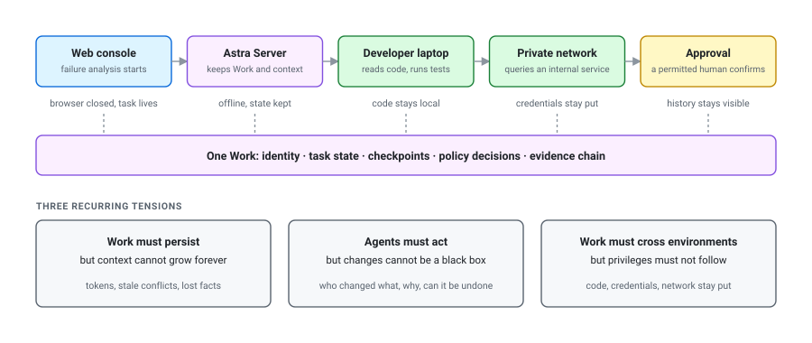
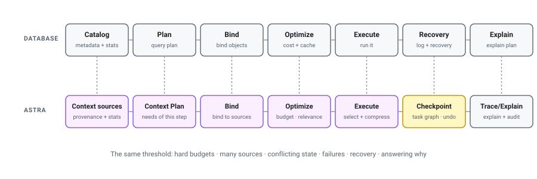
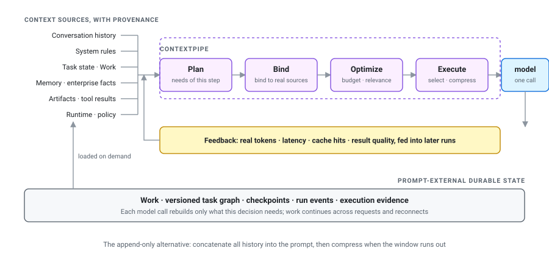
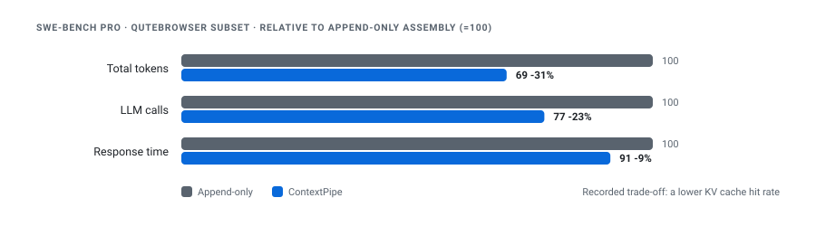
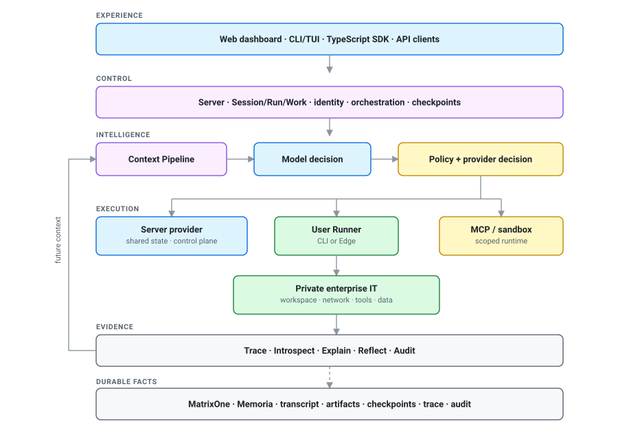
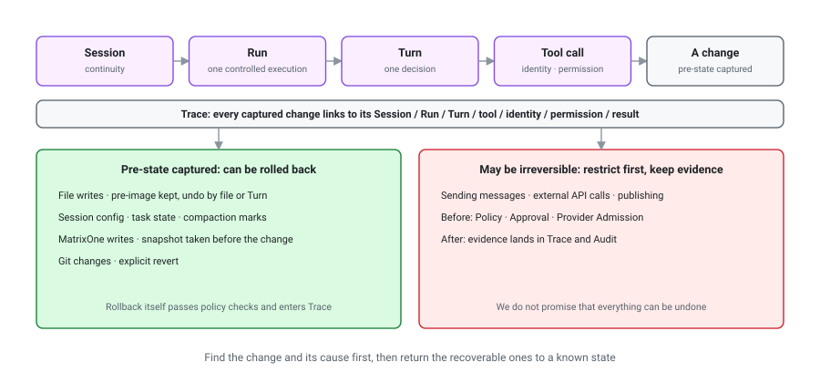
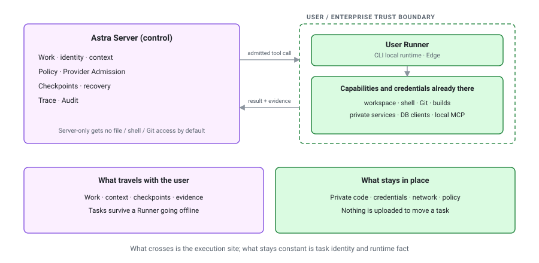
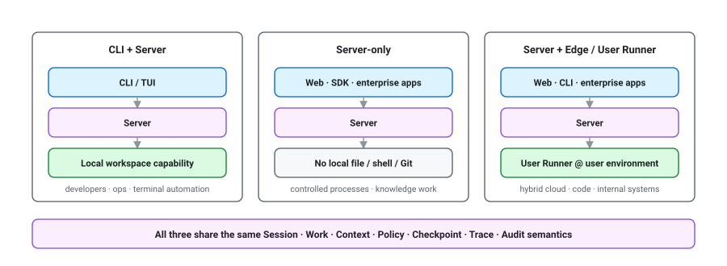
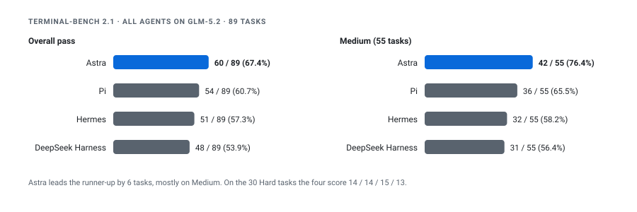

# Astra Is Now Open Source: An Enterprise Agent Runtime for Long-Horizon Work

## Why we built Astra

MatrixOrigin has always been a data infrastructure company. We build databases and enterprise data systems. Over the past few years, as models moved from answering questions to calling tools and executing processes, our focus sharpened into one line: support agentic workloads. At the same time, our own data platform grew increasingly dependent on agents. The agent is no longer a chat box bolted onto the product. It interprets intent, organizes context, picks models and tools, schedules queries and tasks, and drives execution inside a permission boundary. It is becoming a new kind of control plane for data infrastructure. Agents need durable state, context, transactions, governance, recovery, and observability from the data layer; data platforms need agents to turn human goals into execution that can be advanced, inspected, and controlled. The two cannot be stitched together with a few API calls. They have to grow together architecturally.

Over those years we worked on a large number of enterprise agent projects, spanning software development, data analysis, incident response, internal operations, and business process automation. Different models, different entry points, different data and tools. But once these systems met the real world, the problems converged: a task runs for hours or longer, the agent genuinely modifies code, configuration, and data, and the work has to continue across the web, a CLI, the cloud, a developer's laptop, and the corporate network. The next section takes those three apart.

By early 2026 the pattern was clear enough to act on. We evaluated what was available. Coding agents like Claude Code and Codex already help developers well in a terminal, an IDE, or the cloud. Open harnesses like Pi offer a clean, extensible agent loop. Frameworks like LangGraph and the OpenAI Agents SDK provide state, tool calling, and workflow orchestration. Each is strong at what it set out to do. None of them was built primarily to solve the problems above while also being self-hostable with a replaceable model vendor. So we started building Astra ourselves, with heavy help from coding agents, and moved it into our own data platform, MatrixOne Intelligence, as the engine that drives the agent experience there. As an aside: we hear GPT-6 may be called Astra. We have not seen the model yet, but the names have already collided.

A bit over six months later, we are open-sourcing [Astra](https://github.com/matrixorigin/Astra). It is a self-hosted Agent Runtime for enterprise agents, with no model vendor lock-in. A harness decides what context a model sees, what tools it can call, and how a task advances. An Agent Runtime manages the life cycle of the work itself, so that it survives across requests, devices, and execution environments while keeping a clear permission boundary and a clear chain of evidence. Three sentences summarize what Astra is for: **long-horizon work advances on fewer tokens, agent changes can be traced and rolled back, and the same piece of work follows the user across environments.**

## What an enterprise agent task actually looks like

Picture a common enterprise task. A user starts an incident analysis from a web console. The agent needs to read alert history and runbooks, enter the user's local repository, run tests, reach a service on the private network, and then push a proposed fix into an approval process. The task must keep running after the user closes the browser. When the workstation goes offline for a while, the task state in the cloud must not disappear. Anything that touches a release must wait for someone with the authority to confirm it. And when a colleague picks the work up, they need to see what has already been done rather than guess it from a chat log.

Three tensions show up over and over in tasks like this.

**Work must persist, but context cannot grow without bound.** An enterprise task accumulates conversation, rules, plans, tool results, runtime state, and institutional knowledge. Hand the model the entire history on every turn and token cost climbs while contradictory stale information piles up. Truncate naively and you may throw away the facts needed to recover the task.

**Agents must act, but their changes cannot be a black box.** Once an agent edits files, changes session state, writes to a database, or commits code, "did it answer well" is no longer the only question. The team needs to know which run a change came from, what authorized it, what side effects it had, and whether the system can return to the state before it.

**Work must cross environments, but privileges must not be copied everywhere.** The capabilities that matter most in an enterprise usually live on developer machines, in private repositories, and inside internal networks. A task needs to move from the web into local execution and back to the server. Private code, credentials, and network access should stay inside the trust boundary they started in.

This is no longer a single model call. It is a piece of work with an identity, a state, an execution location, a recovery path, and a boundary of accountability. It may start in the cloud, finish locally, be reviewed on a phone, and be approved inside a business system. Those surfaces can have different capability boundaries. They cannot hold contradictory runtime facts.

## The tuition databases already paid

Astra comes from a team that has spent a long time working on database kernels. We borrow from databases not because an agent is a database, but because databases already spent decades making the journey from "get the computation to run" to "make complex execution reliable." A query can be expensive, resources are always finite, state conflicts, components fail, and users still ask why it was slow, why that plan was chosen, and whether it can recover from a failure. Those realities hardened into kernel mechanisms: catalog, plan, bind, optimize, execute, resource governance, recovery, and explain.

Agent engineering will not necessarily evolve into database architecture, but it is crossing the same engineering threshold. A prompt, a tool list, and a loop are enough for a demo that genuinely surprises people. In production, context, state, permission, execution location, failure recovery, and explainability all have to become explicit system capabilities. None of them disappears on its own because the system prompt got longer. What databases give Astra is a systems engineering method proven over a long stretch of production use. What we want is for agents to pay less of the tuition that complex systems have already paid.

## ContextPipe: treating context assembly as query execution

The first problem is how to let work persist while reducing the context that has to be handed to the model on every turn.

In a long task, more context is not better. Conversation history, system rules, task state, memory, tool results, institutional knowledge, and runtime facts all compete for a fixed window. The most direct approach is to append to the end of the prompt until the window runs out, then compress once, in a hurry. It is easy to implement and easy to lose control of as tasks get longer: tokens climb, the cache structure keeps shifting, old information contradicts current fact, and after a failure it is hard to reconstruct exactly what the model was given.

In ContextPipe we made the mapping between context assembly and query execution concrete. Both have to select content from multiple sources under a hard budget, decide an order, exploit statistics and layered caches, and explain the resulting plan. So ContextPipe splits context handling into five stages: plan, bind, optimize, execute, and feedback. The system first determines what the current task needs, binds those needs to context sources that carry provenance, generates a plan from budget, relevance, and cache characteristics, performs selection and compression, and finally feeds actual tokens, latency, cache behavior, and outcomes back into later runs. Context stops being an ever-growing string and becomes a data pipeline that can be audited, replayed, failure-isolated, and continuously optimized.

Fewer tokens does not mean deleting long-lived state along the way. Astra keeps work, the task graph, checkpoints, run events, and execution evidence outside the prompt. Each model call rebuilds only the context that the current decision actually requires. Work therefore continues across requests and reconnects while the model does not have to carry the whole history every time.

This became the paper [ContextPipe: Database-Inspired Context Assembly for Long-Horizon Agents](https://arxiv.org/abs/2609.00749), accepted at the [ADS/DATAI 2026 Workshop](https://vldb-ads.top/) held alongside VLDB 2026, a joint edition of the 1st International Workshop on Agentic Data Systems and the 3rd Workshop on Data-Centric AI.

On the Qutebrowser subset of SWE-bench Pro, compared with append-only context construction, ContextPipe reduced **total tokens by 31%, LLM calls by 23%, and response time by 9%** in preliminary experiments. The experiments also recorded a lower KV cache hit rate as the cost of doing this. We are happy to publish that alongside the wins, because the value of an engineering optimization is not that every metric improves. It is that the system can see and explain the trade-off it made.

Zuyu Zhang and Feng Tian will present the paper in person at the ADS/DATAI Workshop in Boston on September 4; see the [workshop program](https://vldb-ads.top/) for the exact slot. If you are on site, come say hello.

The context pipeline later became part of the Astra kernel. But context is only the beginning. Once you know what the model knows, you still have to answer how the task persists, how a change is recovered, where capability lives, and who authorized an action.

## The architecture: one backbone, many executors

The core design of Astra is one shared agent runtime backbone with several bounded capability providers.

The backbone holds session, run, turn, and work, and is responsible for context, the task graph, checkpoints, policy, recovery, trace, and audit. The server, the user runner, MCP, and sandboxes supply execution capability at different locations and within different permission scopes. Web, CLI/TUI, SDK, and enterprise applications are just different entrances into the same system. None of them needs to implement its own agent loop.

A run starts at the context pipeline, which decides what the model should know at this moment. After the model makes a judgment, policy and provider admission decide whether the action may happen and which environment will carry it out. The server, a user runner, MCP, or an isolated environment performs the action, and trace and audit return the result to the same piece of work, where it becomes the basis for recovery, explanation, and the next round of context.

That chain answers the four most basic questions about an enterprise agent: what it knows right now, who permits it to do what, where the action should happen, and how you prove afterward what happened. Models and tools are replaceable. These runtime facts must not disappear along with them.

## When it changes the wrong thing: trace and rollback

The second problem is how to keep the cost of a mistake inside a recoverable range once the agent really starts modifying systems.

Astra does not treat trace as a log written after the run is over. A captured change is linked to the session, run, turn, tool, identity, permission, and result that produced it. What a user sees is not merely "the agent called some tool." They can follow a change back to where it came from and use the matching recovery mechanism to deal with it.

Astra today provides explicit recovery boundaries for several common classes of change. File writes keep a pre-image and a change record, and can be rolled back by file or by turn. Session configuration, task state, and manual context-compaction marks can be restored. MatrixOne writes performed through Astra capture a snapshot taken before the change. Git changes use an explicit revert. Rollback itself goes through the same permission checks and lands in trace and audit.

The promise here is not that everything an agent has done can be undone. Sending a message, calling an external API, and publishing can all have irreversible side effects. For those actions, Astra restricts privileges before execution through policy, approval, and provider admission, and keeps evidence after it. **What can be safely rolled back is the set of changes for which Astra captured the prior state and offers a recovery contract.**

So the second property is not a vague "we have logs." It is that agent changes can be traced and rolled back: find the change and its cause first, then return the recoverable ones to a known state, instead of leaving every mistake to be guessed at and cleaned up by hand.

## User Runner: execution moves to the user, privileges stay put

The third problem is how work enters the user's own environment to continue executing without turning private privileges into a default capability of the server. The user runner is where Astra draws that line.

The tools and data that matter most in an enterprise are usually not in the environment where the Astra server runs. They live on employee workstations, in code repositories, behind internal services, in local command lines, in database clients, in corporate browser sessions, and inside existing IT systems. Exposing all of that to a hosted agent is neither realistic nor a reasonable default.

Astra separates control from execution. The server holds shared work, identity, context, policy, and execution decisions. The user runner sits inside the user's or the enterprise's own trust boundary, uses the workspace, network, tools, and credentials already present there to perform permitted actions, and returns typed results and execution evidence to the same backbone.

Server-only mode gets no access to files, shell, or Git on a user's machine by default. Those capabilities appear only after a bound runner connects. That "cannot do it by default" is not a missing feature. It is a security boundary we kept on purpose.

A runner is not a second agent brain, and it is not a remote shell that will run anything you send it. It does not re-interpret the task. It executes already-admitted capabilities within the user, workspace, and permission boundary. Runner describes the execution role; edge describes a deployment position close to private systems. Both the local CLI runtime and an edge deployment can act as a user runner.

For example, the same task can be created on the web and tracked continuously by the server. When source code has to be inspected, the task is routed to a user runner on a developer's laptop. When production information has to be queried, it calls a controlled capability inside the corporate network. Anything involving a write enters approval. When execution finishes, results, tool calls, providers, permission decisions, and failed retries all return to the original work and trace. Even if the runner goes offline for a while, the task and its context still exist, and work resumes on reconnect instead of restarting as a fresh conversation.

This is what makes "start in the cloud, finish locally, review on a phone, approve in a business system" actually hold together. What travels with the user is the work, the context, and the execution evidence. What stays in place is private code, credentials, network access, and privilege. The execution site crosses boundaries. Task identity and runtime fact do not change.

## Why these three belong in one runtime

Astra's product boundary is not drawn at "how many tools it supports." There will always be more tools. Long-horizon work, recovery boundaries, and execution location are the things that are hard to retrofit after you are in production.

**Why doesn't a long task have to carry its whole history?** Durable work lets a goal outlive any single request or chat connection, and the context pipeline assembles only what fits the budget for the current decision. Session holds the continuous relationship, run represents one controllable execution, and work plus a versioned task graph records goals, dependencies, attempts, verification, and delivery.

**What happens when this change goes wrong?** Trace ties a change to the facts of its execution, while file records, session state, database snapshots, and Git history each supply a recovery path. External actions with no reliable recovery contract have to be restricted before they run.

**How does it continue on a different device or environment?** The server holds the same piece of work, and the runner supplies the capabilities the current user and environment actually have. The execution site can change while task identity, checkpoints, and the evidence chain stay continuous.

Policy, provider admission, trace, introspect, explain, and audit run through all three: deciding whether an action may happen, by whom and where it executes, and turning waiting, degradation, blocking, failure, recovery, and side effects into runtime facts that can be inspected. This is not a log page bolted on after the run. The evidence is itself part of the next round of context, of failure recovery, of the explanation given to a user, and of enterprise governance.

## Three ways to deploy it

Astra currently supports three main shapes:

- **CLI + Server.** Interact through the CLI/TUI while using local workspace capability. Suited to developers, operations, and terminal automation.
- **Server-only.** Web, SDK, or enterprise applications talk to a shared server. Suited to controlled business processes, knowledge work, and central services.
- **Server + Edge / User Runner.** The server owns the task and control while a runner executes inside the user's or the enterprise's environment. Suited to hybrid cloud, code, internal systems, and user-owned devices.

What changes across these shapes is available capability and execution location, not the identity of the agent. They share the same session, work, context, policy, checkpoint, trace, and audit semantics.

That matters. If the web has one notion of context, the CLI another notion of state, and the edge keeps a third version of task fact, then the product has many entrances on the surface and, underneath, several agents that cannot recover each other's work. Astra chose to keep entrances thin and to make the runtime backbone the single trustworthy source of fact.

## How this differs from Claude Code, Pi, and others

Claude Code, Codex, Pi, and the DeepSeek harness each have their own design center. Astra's is an enterprise-owned, self-hosted Agent Runtime, with those three properties built as system capabilities on one backbone: work and checkpoints persist while ContextPipe rebuilds only what is needed at each model boundary; captured changes carry provenance, identity, execution evidence, and an explicit recovery path; the server holds the work while the user runner supplies private execution inside the user's trust boundary.

Astra was designed from the start around self-hosting, replaceable model vendors, enterprise identity, durable state, user runners, capability admission, reconnection after a drop, and a complete chain of evidence. Coding is an important workload, but it is not the product boundary. The same backbone also serves incident response, data analysis, internal operations, ticketing, and approval flows.

If all you need is one prompt-and-tool loop on a single machine, a lighter agent framework is usually the better fit. Astra is aimed at a different moment: when the agent starts becoming shared infrastructure across users, applications, and private environments.

## Terminal-Bench: same model, different harness

We also used [Terminal-Bench 2.1](https://github.com/harbor-framework/terminal-bench) to check how Astra performs purely as a harness. Every agent in the comparison ran on **GLM-5.2**, across 89 tasks:

| Agent | Overall | Easy | Medium | Hard |
| --- | ---: | ---: | ---: | ---: |
| **Astra** | **60 / 89 (67.42%)** | 4 / 4 (100%) | **42 / 55 (76.36%)** | 14 / 30 (46.67%) |
| Pi | 54 / 89 (60.67%) | 4 / 4 (100%) | 36 / 55 (65.45%) | 14 / 30 (46.67%) |
| Hermes | 51 / 89 (57.30%) | 4 / 4 (100%) | 32 / 55 (58.18%) | **15 / 30 (50.00%)** |
| DeepSeek Harness (DSH) | 48 / 89 (53.93%) | 4 / 4 (100%) | 31 / 55 (56.36%) | 13 / 30 (43.33%) |

Astra passes 60 overall, six ahead of the runner-up, and the gap comes mostly from the 55 medium tasks. On hard tasks Astra ties Pi, trails Hermes by one, and leads DSH by one.

A single benchmark cannot prove "best" in any general sense, and it is no substitute for validating security, stability, and operability in an enterprise environment. It does establish one thing worth knowing: when the underlying model is held constant, how a harness organizes context, tools, and the run has a direct effect on outcomes. The model matters. So does the system around it.

## Why open source

Many enterprise problems cannot be reasoned out from a design document. Once a user runner enters different internal networks and workspaces, it meets different identity systems, approval customs, and tool boundaries. How policy should express organizational rules, and what evidence trace should retain, can only be answered in real use. These questions deserve public discussion and shared validation.

Astra is therefore open source under Apache 2.0. The repository currently includes the server, CLI/TUI, web console, HTTP and streaming APIs, a TypeScript SDK, the edge/user runner, MCP integration, and deployment docs for local, Docker, and Kubernetes. The project is still pre-1.0, and public interfaces will keep evolving.

- GitHub: [github.com/matrixorigin/Astra](https://github.com/matrixorigin/Astra)
- Quick start: [README / Quick start](https://github.com/matrixorigin/Astra#quick-start)
- Architecture and design docs: [docs](https://github.com/matrixorigin/Astra/tree/main/docs)
- Paper: [ContextPipe](https://arxiv.org/abs/2609.00749)

If you are working out how to advance long-horizon work on fewer tokens, how to find and undo a change after an agent gets it wrong, or how to keep one piece of work going across devices and private environments, try it. We would equally like to hear where it does not hold up.

## Finally

We do not think agents will end up "becoming databases." Our claim is simpler: once any complex system reaches production, it cannot avoid state, resources, permission, failure, and explanation. The database industry spent decades turning those into dependable infrastructure. Agent engineering will get more systematic too.

Astra is our attempt to put long-horizon work, recoverable changes, and cross-environment execution into a single Agent Runtime. Models will keep getting smarter. What we care about more is whether the work can reliably continue once the model leaves the chat window.
