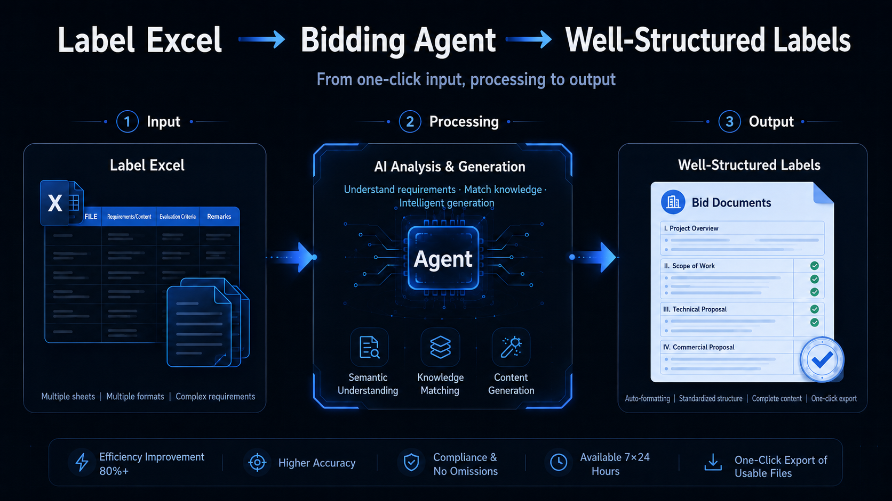
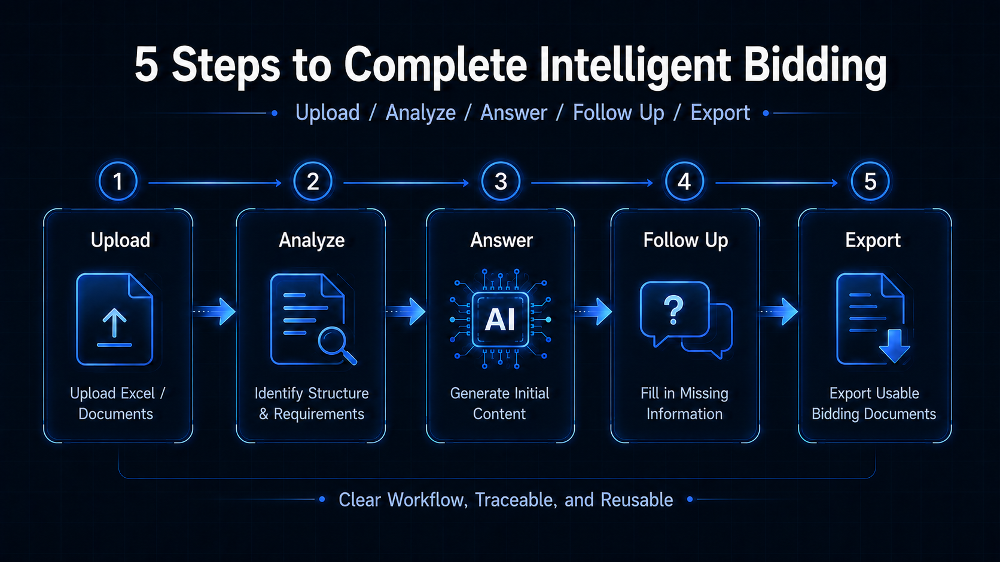
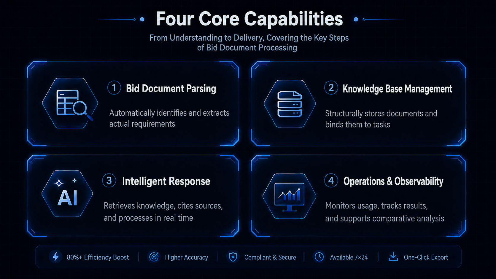
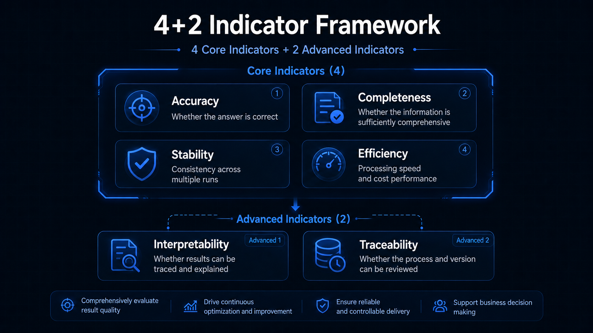
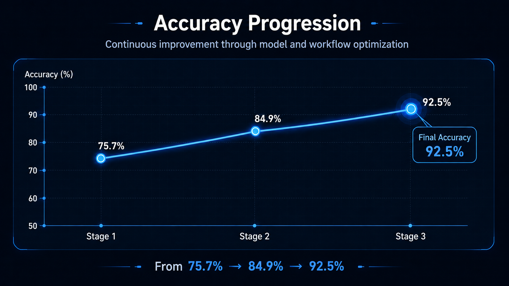

# How We Rebuilt the Most Painful Part of Bidding with an AI Agent

> From a bidding Excel file to item-by-item responses, evidence citations, human review, and result backfilling: a Bidding Agent case study, and the Agent engineering methods behind it.

Anyone who has worked on bidding knows that the most time-consuming part is often not writing a polished solution proposal, but validating the customer’s technical requirements one by one.

A customer sends over a tender document. Once the Excel file is opened, there may be hundreds of rows. Each row is essentially asking: Does your product meet this requirement? Which standards does it support? Are the required certifications available? Can the delivery conditions be fulfilled?

For the bidding team, the task is not simply to mark each item as “Compliant” or “Non-compliant.” Every judgment must be supported by evidence.

That evidence may come from a specific page in a product specification, a table in a chipset manual, a paragraph from a past project, or a clause in a certification document.  
Without evidence, the team cannot make a reliable judgment. A single incorrect answer may affect the customer’s evaluation score. A missed requirement may introduce significant bidding risk.

As a result, it is not uncommon for several people to spend three to five days reviewing a single bid document. The most valuable judgment experience is often concentrated among a small number of senior employees: newcomers struggle to take over, and when experienced team members are unavailable, the entire process can quickly become a bottleneck.

Recently, together with a global leading smart home device manufacturer, we built a **Bidding Agent** for this workflow.

The Agent does far more than draft responses. It restructures one of the most repetitive, time-consuming, and error-prone parts of bid response into an intelligent workflow that is verifiable, traceable, and continuously improvable.

---

## From Blank Bid Template to Evidence-backed Response

The job of this Bidding Agent can be summarized in one sentence:

**Upload a bidding Excel file, and the Bidding Agent compares each requirement against the enterprise knowledge base, determines whether it is “Compliant / Non-compliant,” attaches supporting evidence, and backfills the reviewed results into a standard bid document.**

The overall process consists of five steps:

1. **Upload**: Upload the customer’s Excel bid template into the system.
2. **Parse**: The system automatically identifies which columns correspond to item numbers, requirement descriptions, and response fields, then extracts the actual list of requirements that need to be answered from hundreds of rows.
3. **Respond**: The Bidding Agent checks each requirement against the enterprise knowledge base, determines whether it is “Compliant / Non-compliant,” and attaches supporting evidence.
4. **Clarify**: When the available information is insufficient, the Agent does not fabricate an answer. Instead, it proactively asks a human for clarification.
5. **Export**: After human review, the results are backfilled into a standard Excel file with one click, ready for delivery.

In this process, the role of humans changes.

Previously, people had to search for materials, make judgments, and fill in answers row by row.  
Now, the Agent prepares an evidence-backed response draft, while humans review key conclusions, supplement business judgment, and control risk.

This is not about replacing bidding professionals with AI. It is about letting AI take over repetitive work, so people can focus on the decisions that truly require experience.

---

## Why a Bidding Agent Cannot Be Just Another Chatbot

Bid response is not ordinary Q&A.

In fields such as smart terminals, set-top boxes, and Android TV, bid documents often contain highly technical requirements: main control chips, video codecs, DVB / IP, secure boot, 4K HDR, Dolby, Launcher, broadband gateways, and operator-specific customization capabilities.

These questions cannot be answered based on a model’s general knowledge.

Expressions such as “usually supported,” “generally feasible,” or “most products have this capability” are high-risk in sales and compliance scenarios.  
A production-ready Bidding Agent must meet four requirements:

### 1. Every Answer Must Be Evidence-backed

Every judgment must come with supporting evidence.  
The Agent needs to explain which keywords it searched for, which source text it found, which document the evidence came from, and which page or line it appeared on.

In the workflow, we designed a strict tool sequence: submit evidence first, then make a judgment.  
In other words, the Agent cannot make unsupported claims. It must first complete `submit_evidence` before moving on to `judge_question`.

This may look like a constraint on AI, but in enterprise scenarios, this type of engineering constraint is essential.

### 2. Ask When Evidence Is Insufficient

When there is no direct evidence in the knowledge base, or when the available evidence is not strong enough to support a judgment, the Agent should not force an answer into the form.

It should stop and proactively call `ask_user`.

In bidding scenarios, making an unsupported claim is far riskier than asking for clarification.  
That is why we made “do not make a judgment without evidence” part of the Agent’s behavior rules.

### 3. Understand Original Source Materials

Many enterprise documents are not clean plain text.

Specifications may contain complex tables. PDF parsing may produce garbled text. Key information in chipset manuals may be embedded in images or tables.  
If the Agent relies only on parsed Markdown, it can easily miss important information.

Therefore, the system preserves a multimodal fallback path: when the parsed text is unclear, the Agent can call `read_source` to directly inspect the original PDF images and table contents.

What text extraction misses, visual understanding can help recover.

### 4. Make the Process Observable and Regression-testable

An enterprise-grade Agent cannot be a black box.

We need to know which model it called, what content was retrieved, which tools were used, how long each requirement took to process, and which system version led to measurable improvement.  
Therefore, the system includes operations and observability capabilities, and uses a fixed golden dataset for continuous regression testing.

Whether the system has improved, and by how much, is not determined by intuition. It is measured with metrics.

---

## From One Bidding Agent to Real Agent Engineering

Simply connecting a large language model to a system and allowing it to act freely rarely produces stable results.  
But when the model is embedded in a clear business process, supported by retrievable materials, callable tools, enforced execution order, and verifiable outputs, it can evolve from a conversational model into an Agent that can reliably perform business tasks.

This Bidding Agent is a typical example.

We equipped it with four layers of capability:

- **Bid Document Parsing**:  
It does not rely on rigid templates. The large language model identifies column roles in Excel, automatically classifies content into “title / description / actual requirement,” and extracts only the items that require responses. Even when it encounters unusual templates, if column recognition fails, the system automatically falls back to keyword detection to keep the workflow moving.

- **Knowledge Base Management**:  
PDF / Word documents such as product specifications, chipset manuals, certification documents, and past project cases are parsed into structured content and stored in the knowledge base. Relevant subsets can be bound to specific tasks. The original files remain fully traceable, and the Agent can directly call up original images for verification when necessary.

- **Intelligent Response Generation**:  
The Agent works like a careful engineer: it retrieves from the knowledge base, reads the context, and makes a judgment. Every answer includes citations, including source file, line number, and original excerpt, making the result traceable and reviewable. Multiple large language models can be switched as needed, and the frontend displays processing progress in real time instead of leaving the process hidden inside a black box.

- **Operations and Observability**:  
An independent management backend monitors every model call, retrieval hit, tool use, and processing time. Any change can be compared against a fixed golden dataset with one-click regression testing. Whether the system has improved, and by how much, is measured quantitatively.

The value of this approach is that AI is no longer just generating text. It becomes part of a business workflow that can be operated, reviewed, and continuously improved.

---

## Accuracy Is Not Tuned into Existence. It Is Engineered.

We did not describe the result with a vague statement such as “the overall performance is good.” Instead, we built a 4+2 evaluation framework:

- **4 core metrics**: requirement identification, answer accuracy, coverage rate, and per-requirement processing time;
- **2 advanced metrics**: post-clarification accuracy and post-clarification coverage rate.

On an internal golden benchmark set built from the customer’s real bid documents, this Agent achieved an answer accuracy of **92.5%**.  
This golden benchmark set includes a real bidding template with **78 questions**, along with supporting knowledge base documents such as product specifications and chipset manuals.

More importantly, this was not a one-off result. It was achieved through continuous iteration on the same benchmark:

**75.7% → 84.9% → 92.5%**

This shows that an Agent’s capability can be measured and continuously improved.

In terms of efficiency, a bid document that previously required several people to review over several days can now be processed end to end within tens of minutes.  
More importantly, experience that used to be concentrated among senior employees is being transformed into reusable knowledge bases, prompts, tool workflows, golden samples, and review rules.

This is the real value of bringing AI Agents into enterprise workflows:  
not simply answering a few questions, but turning expert experience into system capability.

> Note: The data above is based on an internal golden benchmark set and continuous regression testing results. It serves as a reference for the project’s current-stage performance and does not constitute an external performance commitment.

---

## The Same Method Also Applies to Everyday AI Tool Collaboration

We have also applied the engineering methods behind the Bidding Agent to everyday workflows using AI tools such as Claude Code, Codex, and Cursor.

When AI tools produce unstable results, the issue is not always model capability. In many cases, the working context, constraints, and inputs are not clearly defined.

### Provide Context Before Execution

In projects, we prepare a knowledge base and system prompt for the Agent.  
In everyday work, the same principle applies:

- Use `CLAUDE.md` / `AGENTS.md` to define project rules;
- Use `@file` to provide all relevant materials at once;
- Use structured input to specify the role, goal, materials, and output requirements;
- Use memory to record long-term preferences.

AI output quality depends heavily on the materials it can access and the rules it is asked to follow.

### Review the Plan Before Letting It Act

In the Bidding Agent, we enforce the workflow through tool order: evidence first, judgment second.  
In everyday coding, document editing, and content creation, it is also useful to ask AI to explain its plan before execution.

For example, at the beginning of the task, ask it to list:

1. Its understanding of the task;
2. Which files it plans to modify;
3. Possible risks;
4. How it plans to verify the result.

The earlier misunderstandings are exposed, the lower the cost of rework.

### Manage Context Instead of Letting the Conversation Drift

A long conversation does not necessarily make AI more effective. In some cases, it can introduce irrelevant or incorrect context.

In projects, we separate static prompts from dynamic questions and process them in parallel through an AgentPool, avoiding the need to place all information in the same context window.  
In everyday AI tool usage, we can also manage context with methods such as `/clear`, `/compact`, `--resume`, and forks.

Context is the AI’s working memory.  
It should be cleared when necessary, compressed when appropriate, and restored to an earlier branch point when a task needs to be rerun.

### Turn One-off Prompts into Team Assets

One-off prompts are consumables. Skills are assets.

If a team repeatedly performs the same type of work, such as drafting compliance emails, reviewing contracts, organizing product messaging, or checking bid responses, it should not rewrite prompts from scratch every time.  
A better approach is to encode the SOP into `SKILL.md`, so that AI can automatically trigger the corresponding workflow in the right scenario.

Similarly, Hooks can move recurring requirements from human memory into the system:  
for example, blocking dangerous operations, automatically running lint checks, injecting context, checking before termination, and loading state at startup.

This is also something we value highly in Agent engineering:  
**do not only optimize for completing one task well once; make good practices reusable.**

---

## AI Does Not Improve in Isolation. Business Teams Improve It Through Use.

Bidding, compliance checks, knowledge retrieval, and technical response all share one common feature:

They are repetitive, time-consuming, and high-risk, while every judgment must remain traceable.

These are precisely the scenarios where AI Agents can create value.  
They have clear inputs and outputs, verifiable evidence, and room for continuous improvement through golden datasets and regression testing.

But we have always believed that AI is not here to replace humans.

The Agent is responsible for taking over repetitive work: retrieving information, organizing evidence, and producing a reviewable draft.  
Humans are responsible for reviewing key conclusions, handling exceptions, adding business judgment, and feeding revised results back into the system.

Next, this type of Agent will increasingly resemble an enterprise’s own business workbench:

- Human revisions will be accumulated as golden samples;
- Reviewed and approved historical bid documents will flow back into reusable materials;
- The knowledge base will be regularly inspected to identify duplicate, outdated, and conflicting content;
- Team SOPs will become Skills and Hooks;
- Every use will make the system better understand the enterprise.

This is not a one-off demo, but a continuously evolving business intelligence workflow.

---

## Final Thoughts

We believe the first places where AI Agents will truly land are often not the flashiest scenarios, but the everyday tasks that continuously consume team time while still requiring rigorous execution.

Bid response is one of them.

It should not continue to rely on manual document lookup, senior employees’ memory, and repetitive Excel filling.  
It should be reorganized into an intelligent workflow that is more efficient, more traceable, and more reusable.

One real bid document, a set of enterprise documents, and a verifiable baseline.  
Whether an AI Agent can create value can be tested quickly.

**Let AI take over repetitive work, and leave humans to the judgments that truly matter.**

This is also how we build Agents.
