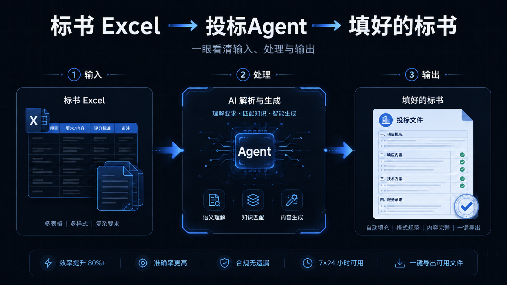
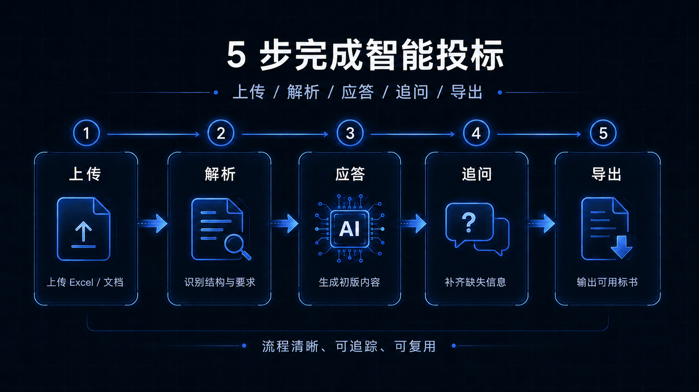
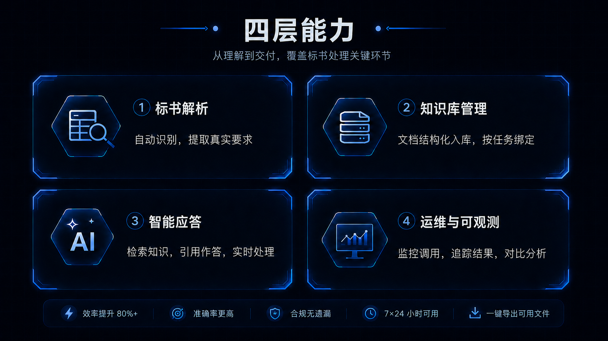
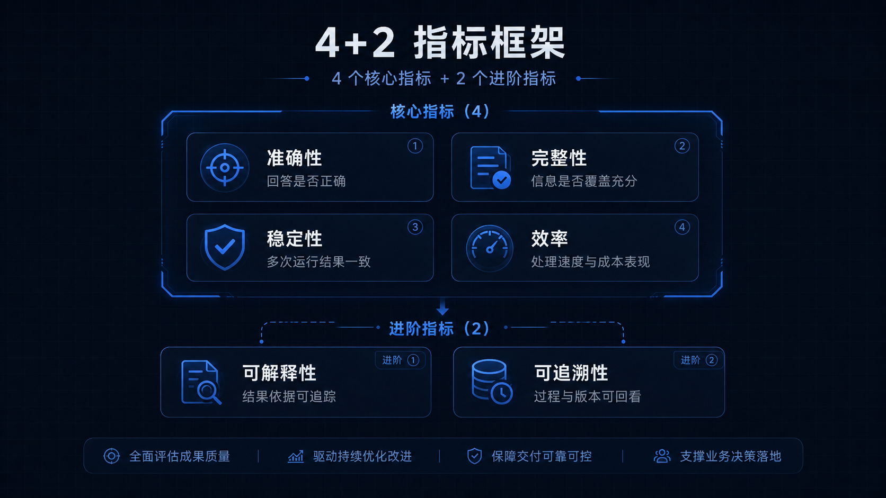
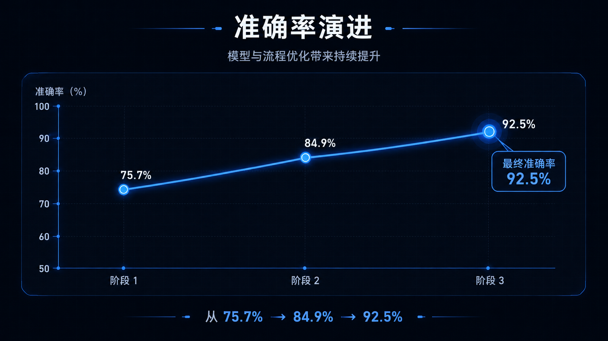

# 投标团队最苦的活，我们用 AI Agent 重做了一遍

> 从一份招标 Excel 到逐条作答、证据引用、人工审核与结果回填：一个投标Agent案例，和它背后的 Agent 工程方法。

做过投标的人都知道，最消耗人的环节，往往不是写一段漂亮的方案介绍，而是逐条核对客户的技术要求。

客户发来一份招标文件，Excel 摊开几百行。每一行都在问：你们的产品能不能做到？支持哪些标准？有没有对应资质？能不能满足交付条件？

投标团队需要做的，不只是回答“满足”或“不满足”，而是，每一个判断都要有依据。

它可能来自产品规格书的某一页、芯片手册的一张表、历史项目的一段说明，或者一份资质文件里的某个条款。  
如果找不到证据，就不能轻易下结论；如果答错一条，可能影响客户评分；如果漏掉一条，可能直接埋下投标风险。

所以，一份标书，几个人对着啃三五天并不稀奇。真正有价值的判断经验，也往往压在少数资深员工身上：新人很难接住，老师傅一忙，整个流程就会变成瓶颈。

我们最近和一家全球领先的智慧家庭设备厂商一起，把这件事交给了一个**投标Agent**。

它不是简单“帮忙写答案”，而是把投标应答中最重复、最耗时、最容易出错的一段流程，重新整理成了一条可验证、可追溯、可持续迭代的智能工作流。

---

## 一份空白标书进去，一份带依据的答复出来

这个投标Agent要做的事情，可以用一句话概括：

**上传一份招标 Excel，投标Agent逐条对照企业知识库，判断“满足 / 不满足”，附上引用依据，并在人工审核后回填成标准标书。**

它背后的流程大致分为五步：

1. **上传**:把客户的 Excel 标书模板传进系统。
2. **解析**:系统自动认出哪些列是题号、题干、答复栏,从几百行里抽取出真正需要回答的需求清单。
3. **应答**:投标 Agent 逐条对照企业知识库,判断"满足 / 不满足",并附上引用依据。
4. **追问**:信息不够时,Agent 不会瞎编,而是主动向人提问。
5. **导出**:人工审核后一键回填成标准 Excel,可直接交付。

在这个过程中，人的角色发生了变化。

过去是“人逐条找资料、逐条判断、逐条填写”。  
现在是“AI 先出答卷，人来审结论、补判断、控风险”。

这不是让 AI 替代投标人员，而是让 AI 接住重复劳动，把人留给真正需要经验的判断。

---

## 这个 Agent 为什么不能只是“会聊天”？

投标答标不是普通问答。

在智能终端、机顶盒、Android TV 等领域，标书里会出现大量硬核技术要求：主控芯片、视频编解码、DVB / IP、安全启动、4K HDR、Dolby、Launcher、宽带网关、运营商定制能力……

这些问题不能靠模型“常识”回答。

“通常支持”“一般可以”“大多数产品具备”这类表述，在销售和合规场景里都是高风险词。  
真正可用的投标Agent，必须做到四件事：

### 1. 答必有据

每一条判断都必须带引用依据。  
Agent 需要说明自己检索了什么关键词、找到了哪段原文、出自哪份文档、哪一页或哪一行。

我们在流程里设计了明确的工具顺序：先提交证据，再进行判断。  
也就是说，Agent 不能直接拍脑袋回答，必须先完成 `submit_evidence`，再进入 `judge_question`。

这看起来像是给 AI “加限制”，但对企业级场景来说，这是必要的工程约束。

### 2. 不懂就问

当知识库中没有直接证据，或者证据不足以支撑判断时，Agent 不应该硬填一个答案。

它应该停下来，主动 `ask_user`。

在投标场景里，“不确定但继续编”比“不确定并提问”危险得多。  
所以，我们把“没有证据就不要判断”写进了 Agent 的行为规则里。

### 3. 看得懂原始资料

很多企业文档不是干净的纯文本。

规格书里可能有复杂表格，PDF 解析后可能出现乱码，芯片手册里关键信息可能藏在图片或表格中。  
如果只依赖 Markdown 解析结果，Agent 很容易漏掉重要信息。

因此，系统保留了多模态降级路径：当解析文本看不清时，Agent 可以调用 `read_source`，直接查看 PDF 原图和表格内容。

文字漏掉的，视觉能力能补回来。

### 4. 过程可观测、结果可回归

企业级 Agent 不能是黑盒。

我们需要知道它每次调用了什么模型、检索命中了哪些内容、用了哪些工具、每条题耗时多久、哪一版改动带来了提升。  
因此，系统配套了运维与可观测能力，并使用固定金标数据集做持续回归测试。

好没好、好了多少，不靠感觉，而是用指标说话。

---

## 从一个投标 Agent，看见真正的 Agent 工程

如果只把大模型接进系统，让它自由发挥，结果通常不会稳定。  
但如果把它放进清晰的业务流程里，给它可检索的资料、可调用的工具、必须遵守的顺序和可验证的结果，它就会从“会聊天的模型”变成“能干活的 Agent”。

这个投标Agent就是一个典型例子。

我们给它装上了四层能力：
- **标书解析**：
不靠死板模板。由大模型识别 Excel 的列角色,自动把内容分成"标题 / 说明 / 真实要求"三类,只把需要回答的挑出来。即便遇到格式奇怪的模板,列识别异常时也会自动回退到关键词检测,保证流程不卡壳。

- **知识库管理**：
产品规格书、芯片手册、资质文件、过往案例等 PDF / Word 文档,经解析转成结构化内容入库,并能按任务绑定相关子集。原始文件全程可追溯,Agent 必要时能直接调出原图核对。

- **智能应答**：
Agent 像一个细致的工程师那样工作:检索知识库、读上下文、给出判断。每一个答案都带引用(来源文件、行号、原文摘录),可追溯、可复核。支持多种大模型按需切换,前端实时显示处理进度,不是一个看不见过程的黑盒。

- **运维与可观测**：
一个独立的管理后台,监控每一次模型调用、检索命中、工具使用和处理耗时。任何一次改动,都能在固定的金标数据集上做一键回归对比。好没好、好了多少,全部用数字说话。

这套方法的意义在于：AI 不再只是“生成一段答案”，而是进入一条可运营、可复盘、可迭代的业务流程。

---

## 准确率不是调出来的，是工程化做出来的

我们没有用一个模糊的“综合效果不错”来描述结果，而是建立了一套 4+2 评估口径：

- **4 个核心指标**：题目识别、答题准确率、覆盖率、单题时间；
- **2 个进阶指标**：追问后准确率、追问后覆盖率。

在客户真实标书构成的内部金标基准集上，这个 Agent 的答题准确率达到 **92.5%**。  
这套金标基准集包含一份 **78 道题**的真实招标模板，以及配套规格书、芯片手册等知识库文档。

更重要的是，它不是一次性跑出来的结果，而是在同一套基准上持续迭代出来的：

**75.7% → 84.9% → 92.5%**

这说明 Agent 的能力可以被度量，也可以被持续改进。

在效率上，过去需要几个人核对数天的一份标书，现在可以被压缩到数十分钟级的端到端处理。  
更关键的是，原本压在资深员工身上的经验，开始被沉淀为可复用的知识库、Prompt、工具流程、金标样本和审核规则。

这才是 AI Agent 真正进入企业流程的价值：  
不是一次性替人回答几个问题，而是把经验变成系统能力。

> 注：以上数据基于内部金标基准集和持续回归测试结果，作为项目阶段性效果参考，不构成对外性能承诺。

---

## 同样的方法，也适用于日常 AI 工具协作

我们把投标 Agent 里的工程方法，迁移到了日常使用 Claude Code、Codex、Cursor 等 AI 工具的工作方式里。

很多人用 AI 工具效果不稳定，不一定是模型不够强，而是没有给它足够清晰的工作条件。

### 给 AI 一份“开会前的资料”

在项目里，我们会给 Agent 准备知识库和系统 Prompt。  
在日常工作里，也可以用类似方式：

- 用 `CLAUDE.md` / `AGENTS.md` 写清项目规则；
- 用 `@file` 一次性贴齐相关资料；
- 用结构化输入说明角色、目标、资料和输出要求；
- 用 memory 记录长期偏好。

AI 不是凭空聪明，它的输出质量取决于它吃过什么资料、记得什么规则。

### 先看方案，再让它动手

在投标 Agent 里，我们用工具顺序锁住流程：先举证，再判断。  
在日常写代码、改文档、做材料时，也可以先让 AI 讲清楚它打算怎么做。

例如开场先要求它列出：

1. 它对任务的理解；
2. 准备修改哪些文件；
3. 可能的风险点；
4. 准备如何验证。

理解偏差越早暴露，返工成本越低。

### 管好上下文，不要让它越聊越乱

长对话不一定更聪明，有时候反而会让 AI 被错误上下文污染。

在项目中，我们会把静态 Prompt 和动态题目拆开，并通过 AgentPool 并行处理，避免所有信息挤在同一个上下文里。  
在日常工具使用中，也可以用 `/clear`、`/compact`、`--resume`、fork 等方式管理上下文。

上下文不是垃圾箱，而是 AI 的工作记忆。  
该清理时清理，该压缩时压缩，该回到分叉点重跑时就重跑。

### 把一次性 Prompt 变成团队资产

一次性 Prompt 是消耗品，Skill 才是资产。

如果团队反复做同一类工作，例如合规邮件起草、合同审查、产品话术整理、投标答复检查，就不应该每次重新写一段提示词。  
更好的方式是把 SOP 写进 `SKILL.md`，让 AI 在合适场景下自动触发对应流程。

同样，Hooks 也可以把“每次都要做的事”从人的记性里挪到系统里：  
例如拦截危险操作、自动 lint、注入上下文、停止前检查、启动时加载状态。

这也是我们在 Agent 工程里非常重视的一点：  
**不要只追求一次任务完成得好，而要让好的做法被留下来。**

---

## AI 不会自己凭空变聪明，是业务团队带着它一起变好

投标、合规核对、知识检索、技术应答，这些工作都有一个共同特点：

重复、耗时、风险高，但判断依据又必须可追溯。

它们恰恰是 AI Agent 很适合进入的场景。  
因为这些任务有明确输入输出，有可查证的依据，也能通过金标集和回归测试持续改进。

但我们始终认为，AI 不是来取代人的。

Agent 负责接住重复劳动，负责先检索、先整理、先给出可审的草稿；  
人负责审核关键结论，处理例外情况，补充业务判断，并把修订结果沉淀回系统。

下一步，这类 Agent 会越来越像企业自己的“业务工作台”：

- 人工修订会沉淀为金标样本；
- 审核通过的历史标书会回流成可复用素材；
- 知识库会定期巡检，发现重复、过期和冲突内容；
- 团队 SOP 会变成 Skills 和 Hooks；
- 每一次使用，都会让系统更懂这家企业。

这不是一个“一次性 Demo”，而是一条持续进化的业务智能链路。

---

## 写在最后

我们相信，AI Agent 最先落地的地方，往往不是最炫的场景，而是那些每天都在消耗团队时间、却又必须严谨完成的工作。

投标答标就是其中之一。

它不该一直依赖人肉翻资料、靠老师傅记忆和 Excel 手工填表。  
它应该被重新整理成一条更高效、更可追溯、更可复用的智能流程。

一份真实标书，一批企业文档，一个可验证的基线。  
AI Agent 能不能帮上忙，答案很快就能跑出来。

**让 AI 接住重复劳动，把人留给真正值钱的判断。**

这也是我们做 Agent 的方式。
