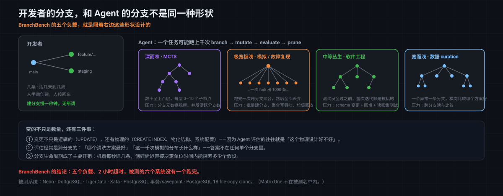
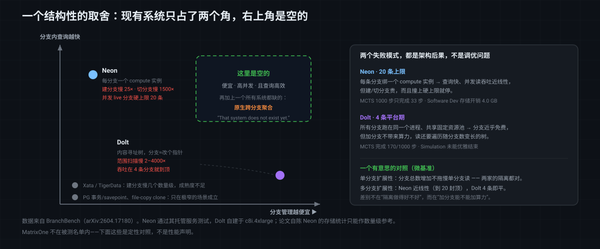

# 没有一个系统跑完：读 BranchBench，以及 Agent 时代数据库分支能力的那把新尺子

先说一个数字。

在 Terminal-Bench 上，给 Agent 加上蒙特卡洛树搜索（MCTS），任务成功率从 **3.4% 提到了 30.6%**。近九倍的提升，**不来自更聪明的模型**——用的是同一个模型。它来自一件更朴素的事：Agent 能够高效地**分叉出很多个候选状态、分别评估、然后丢掉不好的**。

这个结论一旦成立，压力就顺着链路传下来了：如果"能开很多个平行世界"是 Agent 变强的主要途径之一，那么承载这些平行世界的系统——文件系统、进程、以及**数据库**——就成了新的瓶颈。

而数据库这边，"分支"这个词其实已经卖了好几年了：Neon、Dolt、Xata、TigerData 都在讲 zero-copy branching。**问题是，它们讲的分支，和 Agent 需要的分支，是同一种东西吗？**

2026 年 4 月，哥伦比亚大学 DAPLab（Eugene Wu 与 Kostis Kaffes 的组）放出了 [**BranchBench**](https://arxiv.org/abs/2604.17180)，第一个系统性回答这个问题的 benchmark。结论相当不客气：

> **在五个代表性负载、两小时超时的条件下，被测的所有系统，没有一个能跑完。**

这篇文章想做三件事：讲清楚 BranchBench 到底测了什么、它测出来的那个 trade-off 为什么是结构性的，以及它对做数据版本能力的人（包括我们自己）意味着什么。

---

## 一、先厘清：开发者的分支，和 Agent 的分支不是一回事

现有的 branchable database 基本都是照着**开发者**的用法设计的：

```text
开发者：            main ──┬── feature/new-schema     （活几天到几周）
                          └── staging                （长期存在）
                          少数几条、长命、人手动创建、人按回车
```

Agent 的用法是另一个形状：

```text
Agent：   root ──┬── b1 ──┬── b3 ──┬── b7 …          （深、窄，MCTS 几十上百层）
                 │        └── b4                     （活几毫秒到几分钟）
                 ├── b2 …
                 └── （一次 fork 出 1000 条，跑完全丢掉）
                 成百上千条、短命、机器创建、每秒都在开
```

论文把这个循环概括成四拍：**branch → mutate → evaluate → prune**（分叉 → 改 → 评估 → 剪枝）。一个 Agent 完成**一个任务**，就可能跑上千次这个循环。

差别不只是数量。还有三件事变了：

1. **变更不只是逻辑的，还有物理的。** Agent 不只是 `UPDATE` 几行，它还会 `CREATE INDEX`、改物化结构、调系统配置——**因为它在评估的往往就是"这个物理设计好不好"**。这些物理变更也必须是可分叉、可比较、可丢弃的投机状态。
2. **评估经常是跨分支的。** "哪个清洗方案最好""这一千次模拟的分布长什么样"——这些问题的答案不在任何单个分支里，**必须跨分支聚合**。
3. **分支的生命周期是系统的主要开销来源。** 开发者一周建一条分支，创建慢一秒钟无所谓；Agent 每秒建几条，创建延迟直接决定了它每单位时间能探索多少个假设。



---

## 二、"这不就是事务吗？"——为什么嵌套事务和 savepoint 不够

这是听到"数据库分支"时最常见的第一反应，而且值得认真回答。论文给了四条理由，我认为这一节是全文最有价值的部分：

**第一，长事务和 MVCC 打架。** 事务系统是为**短命**的工作单元优化的。一个长期存在的投机事务会一直持有历史版本、阻碍垃圾回收。SAGA、long-lived transaction 这些机制虽然能把长事务拆成可补偿的步骤，但**它们仍然运行在同一条共享的主线上**——而 Agent 需要的是结构上彼此独立的分支。

**第二，事务没有一等公民的"分支"抽象。** 没有持久化的具名分支、没有显式的父子血缘、没有高效的分支切换、也没有像样的合并语义。

**第三，merge 不等于 commit。** 当多个候选分支各自演化之后，"把选中的那条合回父状态"和"提交一个事务"是**根本不同的两件事**。

**第四，事务只回滚逻辑变更，不把物理变更当投机状态。** 索引、物化视图这些东西，在事务模型里是"顺序地建了再撤"，而 Agent 需要的是"**并存地建了几种，然后比较**"。

论文也诚实地给了事务一个位置：如果你的探索树可以**深度优先串行执行**、而且每个分支评估完立刻剪掉（不需要多条分支同时存在），那 savepoint 确实是一个又快又轻的分支机制。实验里 PostgreSQL 的 txn/savepoint 也确实在两个这样的负载上跑通了。**但仅限于此。**

---

## 三、五个负载：BranchBench 到底在测什么

BranchBench 用 TPC-C / TPC-H（CH-benCHmark）的 schema，定义了五个代表性负载。它们**故意选得形状各异**，覆盖深度、扇出、变更强度、生命周期管理这几个维度：

### 1. Agentic Software Engineering（中等丛生树）

一批 Agent 并行改代码和数据库。一次迭代 = 读库 → `ALTER TABLE` / `CREATE INDEX` → 回填数据 → 跑测试。**测试没全过之前，整次迭代都是投机的，必须能整体撤回。**

> 论文的例子很具体：Agent 要加"客户忠诚度分层"。从 main fork 出 B1 加 `tier` 列，再从 B1 fork 出 B2 回填数据。测试发现几乎所有客户都被分到了最低档——阈值定错了。于是从 **B1**（而不是 B2）再 fork 一条 B3，换阈值重新回填，测试通过，B3 合回 main，其余删掉。

这里分支干了两件事：**隔离并行开发的多个 Agent**，以及**给每个会改状态的动作打检查点**。

### 2. Failure Reproduction（宽而平的星形）

线上报错，怀疑是过去某条事务埋的雷。做法很像 `git bisect`：从一个已知良好的历史状态 fork，重放一段事务前缀，跑测试看错误复不复现，二分逼近那条肇事事务。期望创建 log₂(N) 条分支。**压力点：分支创建和重置要快，写吞吐要高。**

### 3. Data Curation（宽而浅的树 + 跨分支比较）

持续监控发现数据异常，为每个异常开一条分支去试不同的清洗方案，每个方案内部再 branch-mutate-validate 地试不同超参（阈值、窗口大小）。**压力点：单分支内高写吞吐 + 高效扫描，以及快速的跨分支读**——因为最后要横向比较哪条清洗路径最好。

> 例子：`customer` 表的 `c_balance` 有缺失、`c_ytd_payment` 有可疑离群值。Agent 开一棵子树试不同的填补策略，一条分支试直接删空值，第三棵子树按不同百分位裁剪离群值；每次清洗后跑数据质量检查，跨分支比较后淘汰差的方案。

熟悉的话，这基本就是我们在 [Git4Data 系列第十一、十二篇](https://github.com/matrixorigin/matrixorigin-blog/blob/main/matrixorigin/git4data-part11-sft-curation-zh/index.md)里用 SQL 手工做的那套 curation 流程——只不过那边按回车的是人，这边是 Agent，而且并发几十条。

### 4. MCTS（深而窄的树）

开头那个 3.4%→30.6% 的场景。选一个有希望的叶子 → 扩展一个没试过的动作（一次 `UPDATE`/`INSERT`）→ 随机 rollout → 用一条分析查询给这个状态打分 → 回传奖励。树可以有**几十到上百层深**，每个节点 3–10 个子节点，还要并行扩展不同子树，后台还有进程在剪枝。

> 例子：Agent 规划哪个仓库发哪个订单来最小化运费。每层对应一个订单，同层的不同分支把订单分给不同仓库，`UPDATE stock` 扣减该仓库库存从而约束后续选择；rollout 之后用 `SELECT SUM(ol_amount) FROM order_line JOIN warehouse` 给整条方案打分。

### 5. Monte Carlo Simulation（极宽、极浅）

一次 fork 出**上千条**分支，每条独立跑几十上百个 `INSERT`/`UPDATE` 模拟一种可能的未来，最后**一次跨分支聚合**算出分布，然后把分支全丢掉。**压力点：批量分支创建、高聚合写吞吐、跨分支聚合查询、以及高效的垃圾回收。**

---

## 四、分类法：现有的"零拷贝分支"其实是四种不同的东西

这一节对做存储引擎的人价值很高。论文按 **CoW 逻辑实现在 DBMS 的哪一层**做了分类：

| 实现层 | 分支机制 | 代表系统 |
|---|---|---|
| 存储底座（Storage Substrate） | 块级 CoW（4–64KB） | TigerData、Xata、Vela、PG file copy |
| 恢复管理器（Recovery Manager） | 基于 WAL 重建（打 LSN 标记） | Neon |
| 存储管理器（Storage Manager） | 页级 CoW | Minuet（研究系统） |
| 存储管理器 | 内容寻址树（Prolly tree） | Dolt |
| 存储管理器 | Delta overlay | Decibel（研究系统） |

**这个分类不是学术分类，它直接决定了系统的性格：**

- **块级 CoW** 把 DBMS 当黑盒，数据面轻但**控制面重**——建完分支要重新拉起计算引擎和连接；而且块边界和数据库页边界不对齐时会有写放大。
- **WAL 重建**（Neon）建分支只是在 WAL 上标一个 LSN、和父分支共享未改动的页。但 Neon 给**每条分支配一个独立的 compute 实例**——这就是它后面所有表现的根因。
- **内容寻址树**（Dolt）像 git：分支就是指向某个 commit 根节点的新指针，改动只需沿路径复制并重算哈希。分支近乎免费，代价在读——每次查询都要遍历这棵树。

### 先看能力清单：谁支持什么

在跑任何性能测试之前，论文先列了一张功能支持表。**这张表比后面的性能数字更值得先看一眼**：

| 系统 | 建分支 | 删分支 | 分支持久化 | 分支内并发操作 | Merge | Diff | **跨分支聚合** | 并发 live 分支 | Schema 变更 | 物理数据操作 |
|---|---|---|---|---|---|---|---|---|---|---|
| Neon | ✓ | ✓ | ✓ | ✓ | ✗ | ✗ | **✗** | ∼ | ✓ | ✓ |
| Dolt | ✓ | ✓ | ✓ | ✓ | ✓ | ✓ | **✗** | ✓ | ∼ | ∼ |
| TigerData | ✓ | ✓ | ✓ | ✓ | ✓ | ✗ | **✗** | ∼ | ✓ | ✓ |
| Xata | ✓ | ✓ | ✓ | ✓ | ✓ | ∼ | **✗** | ∼ | ✓ | ✓ |
| PG file copy | ✓ | ✓ | ✓ | ∼ | ✗ | ✗ | **✗** | ✓ | ✓ | ✓ |
| Txn/Savepoint | ✓ | ✓ | ✗ | ✗ | ∼ | ✗ | **✗** | ✓ | ∼ | ✗ |

（✓ 完整支持；✗ 不支持；∼ 部分支持）

**注意加粗的那一列：跨分支聚合，六个系统全部不支持。** 而 Agent 评估候选状态时问的恰恰就是跨分支的问题——"这一千次模拟的分布是什么""哪条清洗路径最好"。**Merge 只有一半系统有，Diff 更是只有 Dolt 完整支持。** 也就是说，"支持分支"这四个字底下，各家给的其实是差别极大的东西。

---

## 五、结果：没有一个系统跑完

测的是 Neon、DoltgreSQL、TigerData、Xata，加上两条 PostgreSQL 基线（事务/savepoint、PG 18 的 `file_copy_method=clone`）。自建系统跑在 c8i.4xlarge（16 vCPU / 32GB），Neon 用它的托管服务（同区 us-east-1）。每个负载超时设 2 小时。

### 能力矩阵：先看能不能跑，再谈快不快

| 系统 | Software Dev | Failure Repro | Data Cleaning | MCTS | Simulation |
|---|---|---|---|---|---|
| Neon | ∼ | ✓ | ∼ | ∼ | ✗ |
| Dolt | ✓ | ✓ | ✓ | ∼ | ✗ |
| Xata | ✗ | ✗ | ✗ | ✗ | ✗ |
| TigerData | ∼ | ✓ | ∼ | ∼ | ✗ |
| PG Clone | ✗ | ✓ | ✗ | ✗ | ✓ |
| Txn/Savepoint | ✗ | ✓ | ✗ | ✗ | ✓ |

（✓ 完成；✗ 无法执行；∼ 部分完成或报错）

**一列 ✓ 都没有满**。具体失败原因很值得看：

- **Neon**：托管服务**最多 20 条并发 live 分支**（因为每条分支绑一个 compute 实例）。Software Dev、Data Cleaning、MCTS 都需要更多。MCTS 1000 步只完成了 **33 步**；Software Dev 25/100；Data Cleaning 26/200；Simulation 348/1000（因为最后的跨分支聚合没法做，算全败）。
- **Dolt**：读要遍历内容寻址树，而这棵树随**分支数和变更数**一起变长。MCTS 在 2 小时超时前完成了 **170/1000 步**；Simulation 跑到 1000 条并发分支时读慢到没能优雅结束，**连最终统计都没采集到**。
- **TigerData**：除 Failure Repro 外都没完成，Data Cleaning 只跑了 16/200 就卡在等分支上；其余负载栽在**没有文档说明的 API 限流**上。
- **Xata**：实验途中**对方团队把 API 访问关掉了**，之后全是 403。
- **PG txn/savepoint**：只在"评估完立刻剪枝"的两个负载能用——因为切换到另一个 savepoint 意味着丢掉当前状态。
- **PG clone**：源库在克隆时**不能有活跃连接**（PostgreSQL 会阻塞 template 库的所有连接以保证一致性），直接和"多个 Agent 同时在用"冲突。

### 两个极端：Neon 和 Dolt 的性格

只有 Neon 和 Dolt 成熟到能做正经比较。结果非常干净地分成了两个角落：

| | Neon | Dolt |
|---|---|---|
| 分支创建 | 慢 **25×** | 近乎瞬时 |
| 分支切换 | 慢 **1500×** | 近乎瞬时 |
| 分支内点查 | 有网络往返，较慢 | **更快**（本地执行） |
| 分支内范围扫描 | 快 | 慢 **2–4000×** |
| 并发分支扩展性 | 近线性（**但 20 条封顶**） | **4 条就到顶** |
| Software Dev 存储开销 | **4.0 GB** | 93.1 MB |

几个细节值得单独说：

- **Dolt 的 4000× 出现在范围扫描上**，原因是遍历内容寻址树；这也解释了它在 Simulation（1000 条分支 × 每步 50 次变更）上的崩溃——范围查询主导了端到端延迟。
- **Neon 的 43× 存储开销出现在 Software Dev**，因为这个负载做的是"改 schema + 回填数据"，说明 Neon 在 schema 变更时不太会做数据重叠共享。反过来 Data Cleaning 里 Dolt 存储更高（94.1MB vs 4.7MB），是因为那个负载加了带 `DEFAULT FALSE` 的列——PostgreSQL 引擎把它存成元数据，Dolt 则**给所有已有行物化了这一列**。
- **微基准里有一个漂亮的对照**：单分支扩展性上，分支总数增加**不会**拖慢两家的单分支读——说明两家的分支隔离都是做对了的。但多分支扩展性上，Neon 随并发分支数近线性扩展（因为每条分支一个独立实例），**Dolt 在 4 条分支就平了**——所有分支跑在同一个进程里，共享固定的资源池，加分支不带来任何额外算力。
- 论文自己给存储数字打了折扣：**Neon 的存储统计不可靠**（实验开始 15 分钟后才开始采集、整点才更新一次、还有资源回收），只能当数量级参考。这种自我设限，是一篇 benchmark 论文可信度的重要来源。

### 那个结构性的 trade-off

把这些放进一张二维图——**横轴是分支管理有多便宜、纵轴是分支内查询有多快**——现有系统全部聚在两个角落，**右上角是空的**：

```text
 分支内查询快
      ▲
      │   Neon               ← 每分支一个 compute 实例：
      │   （20 条封顶）          查询快，但建/切分支贵、还有硬上限
      │
      │                    ┌──────────────────┐
      │                    │  这里是空的       │
      │                    │  「便宜、并发、    │
      │                    │   且查询高效」    │
      │                    └──────────────────┘
      │
      │                                  Dolt
      │                                  （4 条到顶）
      └──────────────────────────────────────▶
                                    分支管理便宜
```

DAPLab 的原话是：**"That system does not exist yet."**



而且别忘了前面那张功能表里那一整列 ✗：**跨分支聚合，六个被测系统无一原生支持**。这意味着即使某天有系统同时拿下了"分支便宜"和"查询快"，它离 Agent 真正需要的样子还差一步——因为 Agent 最常问的问题，答案不在任何单个分支里。

---

## 六、Dolt 的回应：一个正在形成共识的过程

BranchBench 出来一个月后，DoltHub 写了[一篇回应](https://www.dolthub.com/blog/2026-06-03-branch-bench-database-benchmarking-for-agentic-workflows/)，态度值得称道：**先认，再辩。**

**认的部分**：Dolt 的分支能力确实快得多，但某些负载下查询性能确实差不少；他们承认 Dolt 的存储相比 Postgres 有更高的固有开销。**但他们不认 4000×** 这个量级，打算把 BranchBench 加进常规测试套件，系统性地查瓶颈。

**辩的部分有两条方法论意见，都不是狡辩：**

1. **跨分支查询的实现方式。** BranchBench 是开多个连接、在驱动层拼出跨分支查询的。而 Dolt **原生支持在 SQL 里直接跨分支查询**——join、聚合、窗口函数都能跨分支写。用驱动层模拟，等于没测到这个系统真正的强项。
2. **工作负载的参数化未必贴合真实 Agent 行为。** 固定数量的并发 worker，可能不像真实 Agent：真实场景更可能是"每个 Agent 持有自己的分支头、嵌套的子 Agent 可以阻塞和同步"，这种结构天然会产生跨分支查询和 roll-up 操作的时机。

这两条其实指向同一件事：**benchmark 的第一版必然带着设计者对"Agent 会怎么用数据库"的假设**，而这个假设本身还在演化。Dolt 的第二条意见，某种意义上是在说"你测的探索模式还不够像 Agent"——这比"你测错了"有意思得多。

**这就是一个新领域的 benchmark 应有的样子**：论文把代码和数据开源（[ElaineAng/db-fork](https://github.com/ElaineAng/db-fork)），backend 抽象成一组带计时的原语（建分支、连分支、删分支、执行 SQL），**任何系统实现这组接口就能接进来测**；被测方能公开反驳；下一版继续改。

---

## 七、更大的图景：BranchBench 只是一块拼图

BranchBench 不是孤立的一篇论文。同一批人在推一条完整的研究议程，叫 **Agentic Data Environments（ADE）**（[IEEE Data Engineering Bulletin 2026](https://www.cs.columbia.edu/~kkaffes/papers/agenticdataenvs-ieee2026.pdf)）。它的起点是一个很朴素的等式：

```text
自动化的价值 = 收益 − 成本
```

收益（速度、规模、人力节省）是**渐进累积**的；而成本是**突发、灾难性、难以挽回**的——删掉生产库、触发云故障、数据外泄。论文引了前景理论：人对损失的权重远高于同等的收益。所以：

> **"尽力而为"的安全性是不够的**——平均可靠性再高，只要灾难性后果仍然可能发生，采用率就上不去。

这直接推出 ADE 的两条职责：**Amplify Capability**（主动把异构信息整理成 Agent 可用的表示）和 **Bound Risk**（提供今天的技术栈缺失的保证）。而 Bound Risk 又落在两根支柱上：

- **Branching** —— 保护**状态安全**：让 Agent 在隔离的投机副本里与真实环境交互；
- **Data Flow Control（DFC）** —— 保护**数据安全**：约束信息可以从哪些源流向哪些汇（表、文件、prompt、工具、Agent 记忆、外部 API）。**Agent 有合法访问权，不等于它可以随意组合和外传。**

而且 **branching 不止于数据库**。真实 Agent 用的是数据库 + 文件系统 + 进程内存 + 终端上下文 + 缓存 + 应用运行时。论文举了个很尖锐的例子：Agent 在 Python 里连着数据库探索新 schema——**只分叉数据库，Python 那边的缓存元数据就是脏的；只分叉 Python，投机的数据库改动就会漏到别的分支去**。正确的分支必须捕获跨系统的一致切片。这条线上他们做了 [StateFork / Waypoint](https://daplab.cs.columbia.edu/general/2026/06/04/statefork-give-agents-a-rewind-button.html) 和 Chkpt：只 checkpoint 文件系统 **66 ms**（与大小无关），而容器 checkpoint 2GB 要 **11.21 s**；1GB 内存+文件状态 Chkpt 用 **1.46 s**，Podman+CRIU 要 **8.84 s**。

再往前追一年，这条线的起点是 SOSP'25 SAA workshop 上的 [《Toward Systems Foundations for Agentic Exploration》](https://arxiv.org/abs/2510.05556)，那篇提出的三个开放问题至今没有解决：**fork 语义**（分支怎么暴露或隐藏未定的更新）、**外部副作用**（外部服务要么支持版本化接口，要么得拦截调用）、**原生 fork**（微秒级克隆数据库和运行时，且不做批量拷贝）。

---

## 八、这对我们意味着什么

**先说一句必须说清楚的：BranchBench 没有测 MatrixOne。** 被测名单是 Neon、DoltgreSQL、TigerData、Xata 和 PostgreSQL 基线。所以下面这些是**定性的对照，不是性能声明**——我们手上没有 BranchBench 跑出来的 MatrixOne 数字。

有了这个前提，这篇论文有几条对我们特别有意思：

**第一，它给了一个我们一直缺的坐标系。** 我们讲了 15 篇 [Git4Data 系列](https://github.com/matrixorigin/matrixorigin-blog/blob/main/matrixorigin/git4data-part8-ml-lifecycle-zh/index.md)，讲的都是"能做什么"。BranchBench 讲的是"做得够不够快、能不能撑住"——**在 Agent 这个量级上，能力清单和性能曲线是两回事**，而后者以前没有公认的尺子。

**第二，被测系统的两个失败模式，恰好指向架构选择。** Neon 的 20 条上限来自"每分支绑一个 compute 实例"；Dolt 的 4 条平台期来自"所有分支挤在一个进程里"。**这两条都是架构后果，不是调优问题。** MatrixOne 的 CoW 做在存储引擎层、且是存算分离架构——按论文的分类法，它落在"存储管理器层 CoW"这一格（和 Dolt 同层、但机制不同），而存算分离意味着分支不与固定的计算实例绑定。**这是不是真能同时拿到两边的好处，得测了才知道——这正是我们该做的事。**

**第三，那一整列 ✗ 是个机会。** 跨分支聚合在被测系统里**无一原生支持**，而它是 Agent 评估候选状态的刚需。Git4Data 系列里我们一直在写 `FROM t {SNAPSHOT='v1'}` 这样的查询，跨版本比较对我们是一条普通 SQL——[第十五篇](https://github.com/matrixorigin/matrixorigin-blog/blob/main/matrixorigin/git4data-part15-agent-evolution-zh/index.md)里给三个候选配置打分、按质量和成本双维度决定晋升还是拒绝，本质上就是一次小规模的 MCTS 评估。**但"能写"和"一千条分支上还能跑得动"之间隔着一整个 benchmark。**

**第四，五个负载里有三个我们已经逐篇做过。** Data Curation 是[第十一](https://github.com/matrixorigin/matrixorigin-blog/blob/main/matrixorigin/git4data-part11-sft-curation-zh/index.md)、[十二篇](https://github.com/matrixorigin/matrixorigin-blog/blob/main/matrixorigin/git4data-part12-rlhf-preference-zh/index.md)；Software Engineering 那种"检查点 + 失败整体撤回"是[第七篇 Write-Audit-Publish](https://github.com/matrixorigin/matrixorigin-blog/blob/main/matrixorigin/git4data-part7-write-audit-publish-zh/index.md)；Failure Reproduction 是[第五篇误操作救援](https://github.com/matrixorigin/matrixorigin-blog/blob/main/matrixorigin/git4data-part5-incident-rescue-zh/index.md)的近亲。**区别在并发度和分支数**——我们做的是人的节奏，BranchBench 测的是机器的节奏。

**第五，也是最该记住的一条：这件事的终点不在数据库里。** ADE 那篇说得很清楚——只分叉数据库是不够的，Agent 的状态横跨进程、文件、终端、外部服务。数据库能提供的是这条链路上**语义最清晰、也最容易做对的那一段**：结构化状态的分支、比较与回滚。做好这一段是必要条件，但别把它当充分条件。

**我们接下来该做的事很明确**：BranchBench 是开源的、backend 是可插拔的（实现建分支/连分支/删分支/执行 SQL 这组带计时的原语即可）。**把 MatrixOne 接进去跑一遍，把数字放出来**——不管好看不好看。在一个刚刚立起尺子的领域里，先量了再说，比先讲故事有价值得多。

---

## 参考资料

- Elaine Ang, In Keun Kim, Sam Weldon, Kevin Durand, Kostis Kaffes, Eugene Wu. [BranchBench: Aligning Database Branching with Agentic Demands](https://arxiv.org/abs/2604.17180). arXiv:2604.17180, 2026-04-19. 代码与数据：[ElaineAng/db-fork](https://github.com/ElaineAng/db-fork)
- 短版：BranchBench: An Extensible Benchmark for Agentic Database Branching. CAIS'26 SAO Workshop, 2026-05-26.
- Columbia DAPLab. [Branchable Databases Aren't Ready for Agentic Workloads](https://daplab.cs.columbia.edu/general/2026/05/26/branchable-databases-arent-ready-for-agentic-workloads.html), 2026-05-26
- Columbia DAPLab. [The Need for Agentic Data Environments](https://daplab.cs.columbia.edu/general/2026/05/21/the-need-for-agentic-data-environments.html), 2026-05-21
- Columbia DAPLab. [StateFork: Give Agents a Rewind Button](https://daplab.cs.columbia.edu/general/2026/06/04/statefork-give-agents-a-rewind-button.html), 2026-06-04
- Elaine Ang et al. [Agentic Data Environments](https://www.cs.columbia.edu/~kkaffes/papers/agenticdataenvs-ieee2026.pdf). Bulletin of the IEEE Computer Society TCDE, 2026
- Jiakai Xu, Tianle Zhou, Eugene Wu, Kostis Kaffes. [Toward Systems Foundations for Agentic Exploration](https://arxiv.org/abs/2510.05556). SOSP'25 SAA Workshop
- DoltHub. [BranchBench: Database Benchmarking for Agentic Workflows](https://www.dolthub.com/blog/2026-06-03-branch-bench-database-benchmarking-for-agentic-workflows/), 2026-06-03
