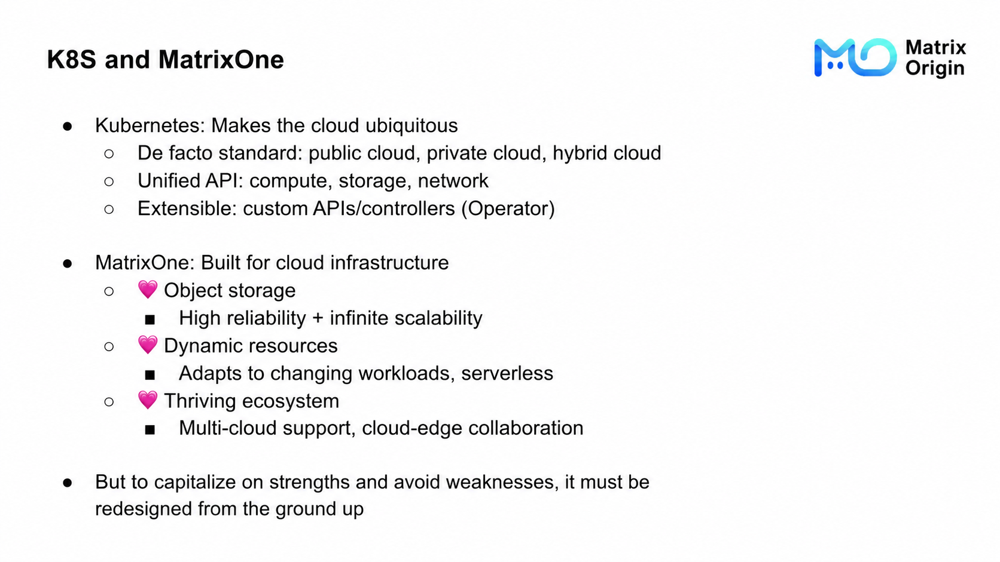
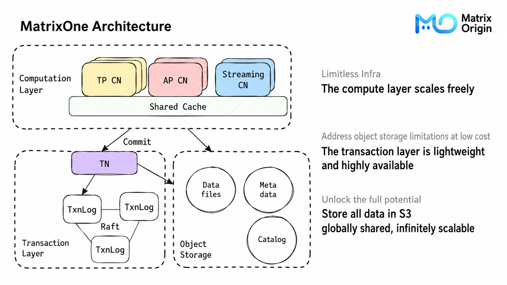
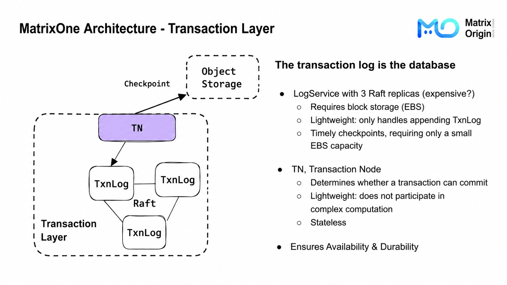
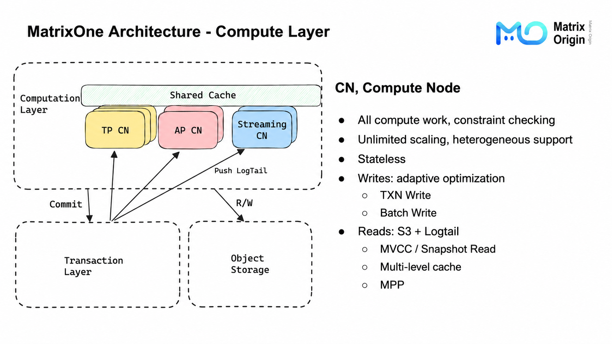
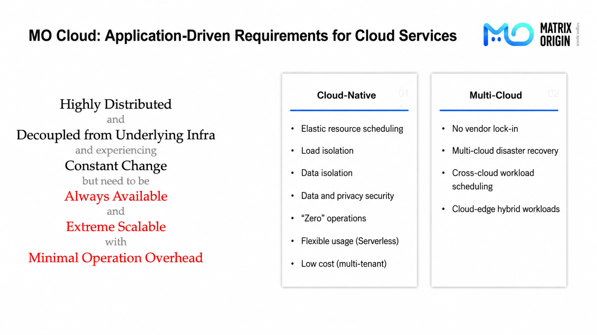
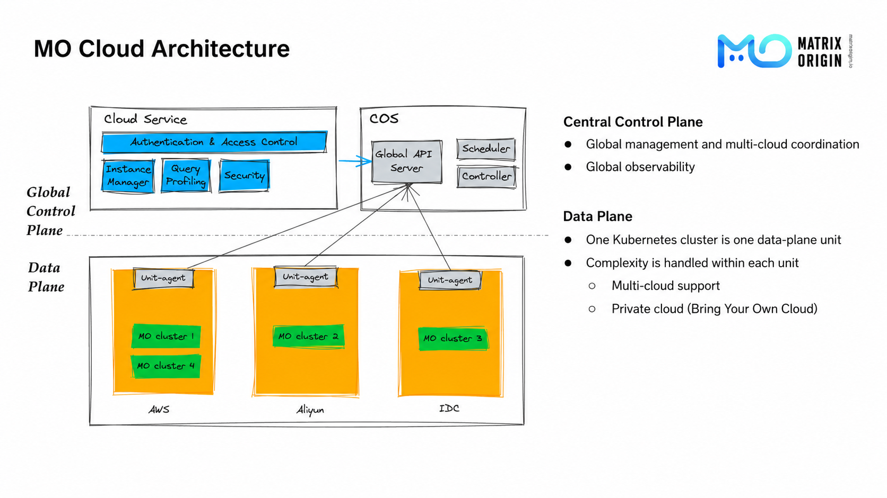
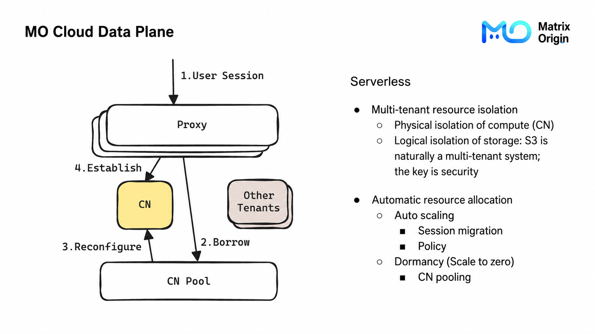
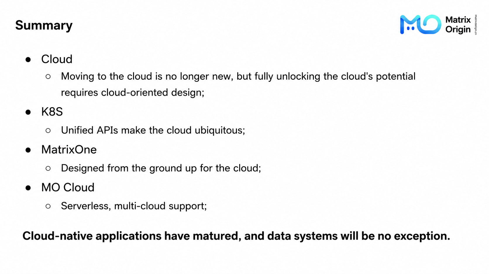

Today's topic is how MatrixOne (MO for short) builds an HTAP database based on K8S + S3. In essence, this is also about how to build a brand-new HTAP system for the cloud. We put K8S and S3 in the title because we believe these are the two technologies that have the greatest impact on database architecture in the cloud-native era.

The following sharing is divided into three parts. First, we will talk about our understanding of the cloud, especially the opportunities and challenges it brings to database design. Second, we will describe how we design a brand-new HTAP database from scratch based on cloud characteristics. Finally, we will share the design of our cloud service, MatrixOne Cloud.

## Cloud Opportunities and Challenges

Regarding the cloud, I will mainly talk about my own experience during development. Cloud computing resources have three characteristics:

- On-demand use and pay-as-you-go billing;
- Nearly unlimited resources within a certain scale;
- Almost complete coverage of all specifications.

When these points are combined, unlimited resources and pay-as-you-go billing mean infinitely elastic scaling of compute power. If you want to scale out, you pay; after scaling in, the cost drops to zero. Pay-as-you-go billing and complete hardware specifications also mean that we can not only find the hardware configuration best suited to a business workload within a broad search space, but also continuously adjust hardware configuration as the workload changes.

Combining these two points, we can safely assume, within a certain scale, that cloud infrastructure has no scalability limit. Looking back at applications, how scalable are they? What we currently see is that stateless applications can already scale very well, while stateful applications, especially database applications, still have a lot of room for improvement. For example, the shared-nothing architecture that originated in the era of virtual machines and block storage theoretically has unlimited horizontal scalability, but it often requires data partitions to be planned in advance. Whether range partitioning or hash partitioning is used, dynamically adjusting the number of replicas involves expensive partition migration. This design is not a problem in data centers where machines are added or removed infrequently, but on the cloud it wastes the natural dynamic scalability of the infrastructure layer.

Next is storage, and the focus is of course S3, or object storage. Since S3 has almost become synonymous with object storage in the cloud, we will use S3 to refer to object storage below. There has already been a lot of discussion about S3. Repeating it here may sound familiar, but for completeness, let us look at the key impacts of object storage on upper-layer applications:

1. 11 nines of reliability and unlimited shared storage space;
2. Exponentially lower storage cost and higher I/O cost compared with block storage;
3. High long-tail latency and severe performance jitter.

S3's reliability and unlimited shared storage solve the storage scalability problem in database design from a unique angle: eliminate the problem by handing storage-layer scalability directly to another system. However, its cost model, which is completely different from block storage (cheap storage, extremely expensive I/O), and its performance model (high throughput, high latency) mean that S3 is not "low-hanging fruit." Directly moving a storage system designed for block storage onto S3 often leads to both performance degradation and exploding bills.

Finally, Kubernetes (K8S). I do not think K8S has an inevitable relationship with the cloud, but the flourishing ecosystem of public cloud, private cloud, and hybrid cloud naturally needs a de facto standard that can encapsulate all cloud infrastructure, and K8S happens to be the choice of history. MO has used K8S as its preferred runtime environment from day one. There are many technical reasons for this, but the most important one is that all infrastructure is integrating with K8S. When an application adapts to K8S, it adapts to all infrastructure through the K8S abstraction layer. Of course, although K8S is almost a "passive" choice, we have indeed gained many benefits from it. For example, K8S natively supports extending automated cluster O&M capabilities with CRDs and custom controllers. This allows us to tightly integrate MO application-layer resource scaling and configuration adjustment with K8S resource-layer adjustment, creating the serverless capabilities discussed in the third part.

Back to MO. We call MO a cloud-native database. For me, as a developer, "cloud-native" here means that when designing MO, we used the computing resources, S3, and K8S described above as basic assumptions. Next, let us see how MO's architecture leverages strengths and avoids weaknesses to make full use of these cloud characteristics.

## MatrixOne Architecture

This is a simplified MatrixOne architecture diagram, divided into three modules. We will analyze them one by one.

Object Storage is one of MO's design foundations. MO chooses to store all data in S3, allowing all data to be globally shared and infinitely scalable. But as we just saw, S3's performance and cost problems both need to be handled at the application layer, which introduces MO's transaction layer.

The Transaction Layer consists of LogService and Transaction Nodes (TN). From an external perspective, the transaction log is essentially the database, because as long as you have the full transaction log, you can restore the state at any time and guarantee data integrity. Therefore, once a transaction is appended to the transaction log, we consider the transaction successfully committed and the modification safely persisted.

To ensure transaction-log durability, we designed a log service based on block storage using the mature Raft three-replica scheme to store MO's transaction logs. People familiar with Raft may ask two questions: first, how can the cost of high-performance three-replica block storage be controlled; second, is the throughput of a single Raft group enough? This leads to our next design decision: the transaction layer must be lightweight enough.

The TN node in the transaction layer only decides whether a transaction can be committed, writes committed transactions into the transaction log, and asynchronously flushes them to S3. After all data before a certain transaction timestamp has been persisted to S3, TN writes a checkpoint to S3 and deletes all transaction logs before the checkpoint. With this design, LogService only needs to store the most recent short period of transaction logs, which MO calls LogTail. In actual production practice, only tens of GB of high-performance block storage are needed to meet LogService storage requirements.

Another design that may sound counterintuitive is that MO's TN currently runs as a single replica. This is also related to the lightweight transaction-layer design. Because TN is stateless, after each failure restart, it only needs to pull some original data from S3 and replay LogTail in memory to start working. This takes sub-second time, which is on the same order of magnitude as health-check timeouts in mature primary-standby protocols. In other words, if TN crashes and restarts, unavailability lasts a few seconds. Raft or other protocols also need a similar amount of time to detect leader failure and switch leaders. Of course, the current design is not friendly to planned restarts such as rolling upgrades, because during planned upgrades we can proactively migrate the TN leader to eliminate downtime. Therefore, MO will support TN running in primary-standby mode, giving MO more choices in balancing cost and availability across different deployment environments. But this does not affect the key point here: the entire transaction layer, including transaction nodes and the log service, is very lightweight.

It is precisely through the transaction layer that MO writes transaction commits directly to the transaction log and asynchronously flushes to S3, avoiding S3's long-tail latency and expensive I/O issues. The lightweight design also ensures that the transaction layer does not become a performance bottleneck or a cost sink.

Finally, the compute layer. MO's Compute Nodes (CN) handle all computation work, including constraint checks. A CN only needs to read the necessary S3 data files and overlay the transaction layer's LogTail to restore the latest state of relevant databases and tables in memory, then begin processing compute tasks. Therefore, CNs are completely stateless. Different CNs can use different hardware resources, execute different computing tasks, and scale horizontally without limit. As a result, MO can provide suitable and isolated hardware resources for TP, AP, and Streaming at the same time, and automatically adjust these resources as workloads change, becoming a true HSTAP system.

On CNs, we face the same S3 performance and cost problems. Therefore, each CN has a portion of memory (L1 cache) and a local storage area (L2 cache) as S3 cache, and CNs exchange cache information with each other through gossip. With this information, on one hand CNs can achieve better cache locality when distributing compute tasks; on the other hand, for data access, a CN first tries to fetch data from another CN that already holds the corresponding cache. Only if no CN holds the corresponding data does it access S3. The local caches of all CNs form a shared cache. This is the key for the compute layer to reduce S3 I/O, improve performance, and lower cost.

There is still one gap to fill. When analyzing the transaction layer, we mentioned whether the throughput of one Raft group in the log service is enough without sharding. Since MO is an HSTAP system, it must not only serve high-frequency but relatively small TP writes, but also handle massive data imports. On one hand, this relies on many engineering optimizations inside the log service. In our tests on AWS c7g with io2 EBS, transaction log throughput reached 800+ MB/s. On the other hand, it relies on adaptive optimization in the CN write path. CN distinguishes transaction writes from batch writes by the number of rows written in a transaction. For batch writes, CN writes data files directly to S3 and, when committing the transaction, no longer commits the data itself but only commits the S3 handles of the data files. This greatly reduces the transaction-log throughput requirement for data import.

Connecting the whole architecture, we can see that MO's compute layer fully uses the elastic capabilities of cloud infrastructure, while the transaction layer solves S3's weaknesses in handling TP workloads. This is why we said in the first section that MO is a database system designed for the cloud. MO was born in the cloud and aims to become reliable and economical cloud-native infrastructure. Perhaps ten years from now, if I share again, the topic will be how to design a cloud-native or "MO-native" application around MO. Next, let us look at MO's cloud service, MO Cloud.

## MatrixOne Cloud

MO Cloud comes from application demands for cloud services. Of course, this does not mean there are no good cloud databases today. But we see two opportunities. First, very few HSTAP systems can truly solve most problems with one system in production practice. Second, many excellent cloud database services have vendor lock-in issues. Therefore, I believe MO Cloud's competitiveness lies in the HSTAP architecture described in the previous section and the multi-cloud support and absence of vendor lock-in described in this section. Let us see how MO Cloud does this.

MO Cloud is similar to a typical multi-K8S federation architecture. It is divided into a central control plane and arbitrarily addable data planes. The control plane and each data plane are K8S clusters.

The central control plane is responsible for global management, multi-cloud collaboration, and global observability. MO Cloud microservices and the central controllers in the orchestration system all run inside the central control plane.

Each data-plane instance is called a Unit in MO Cloud, and each Unit corresponds to a physical K8S cluster. Units are responsible for running MO clusters. One MO cluster can run on one or more Units. Each Unit runs a component called `unit-agent` to communicate with the central control plane, continuously pulling the desired state issued by the control plane and reconciling it locally. You may have noticed that the entire architecture is like an enlarged K8S architecture, and `unit-agent` is similar to kubelet. Therefore, just as K8S can manage heterogeneous nodes, this architecture can easily extend heterogeneous Units: Units on different clouds can be integrated into MO Cloud's orchestration system in a unified way, while the complexity of connecting to specific infrastructure is handled inside each Unit. This means MO Cloud natively supports multi-cloud and cross-cloud scenarios, and can also manage users' own private clouds (Bring Your Own Cloud).

In the specific implementation, `unit-agent` starts a set of general controllers and a set of infrastructure-specific controllers inside each Unit. These controllers jointly complete lifecycle management and automated O&M for infrastructure and MO clusters inside the Unit.

Each MO cluster inside a Unit is multi-tenant. Therefore, in the diagram, we can see CNs in different colors. These are dedicated CNs for different tenants. Compute resources of different tenants are physically isolated in this way.

Second, as mentioned in the previous sections, MO's CN nodes support heterogeneity and elastic scaling. This is certainly an advantage, but it also brings the problem of high complexity in capacity planning. Setting a hardware configuration with some headroom is feasible, but unless the business is very uniform and simple, fixed hardware causes a lot of resource waste. Therefore, MO Cloud's typical service model is Serverless: users pay only for SQL.

In reality, we all know that Serverless does not mean there are truly no servers; it means users do not need to manage them. The logic behind MO Cloud's Serverless model is not only that it helps users manage servers, but also that the declarative-query nature of database systems means MO internally has more information than users, specifically database statistics and query-plan information, to determine the optimal server configuration for the current and upcoming period and continuously adjust it.

One of the most typical scenarios is scale-to-zero: when a tenant no longer has business activity, all CNs for that tenant are shut down directly. Conversely, when the tenant initiates another database connection, MO needs to immediately allocate a dedicated CN for the tenant again.

To handle this scenario, MO Cloud always enables MO's Proxy component. Proxy is responsible for handling user sessions (SQL Sessions). In scale-from-zero scenarios, Proxy takes an idle CN node from a pooled set of CNs, adjusts some label information, marks it as the dedicated CN for that tenant, and then uses this CN to serve the user's session. This logic applies not only to scale-from-zero, but also to temporarily scaling out one or more CNs for specific workloads.

At the same time, Proxy is responsible for MO's external service quality during elastic scaling and configuration changes. Because MySQL sessions are stateful and the MySQL protocol does not include a session-migration design, MO must use a lightweight and stable component like Proxy to maintain user sessions if it wants CN configuration changes not to affect long-lived user connections. Proxy then implements session migration between Proxy and CN. For example, during scale-in, Proxy gradually migrates sessions from the CN to be scaled in to the remaining CNs, and only takes the CN offline after migration is complete. This design ensures that frequent internal configuration changes made by MO to adapt to changing workloads do not affect user connections and queries. Ultimately, it allows MO Cloud Serverless to manage servers on behalf of users smoothly and efficiently.

## Summary

Looking back, today I started from the cloud and used two typical technologies, S3 and K8S, as entry points to share the paradigm changes that cloud brings from our perspective. Moving to the cloud is no longer new. But to fully realize the potential of the cloud, especially for database systems, we need to redesign for the cloud. Then we saw how MO uses a lightweight transaction layer and an infinitely scalable compute layer to leverage cloud strengths and avoid weaknesses, retracing the journey of building a cloud-native HSTAP database kernel. Finally, we reviewed MO Cloud's design principles and technical details around multi-cloud support and Serverless. Today, stateless applications have become mature in cloud-native transformation, and we believe data systems will no longer be an exception. Born in the cloud and becoming the cloud: this is MatrixOne and MatrixOne Cloud.
