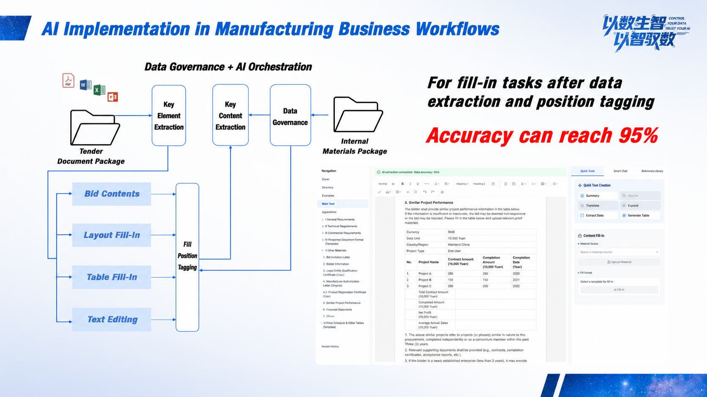
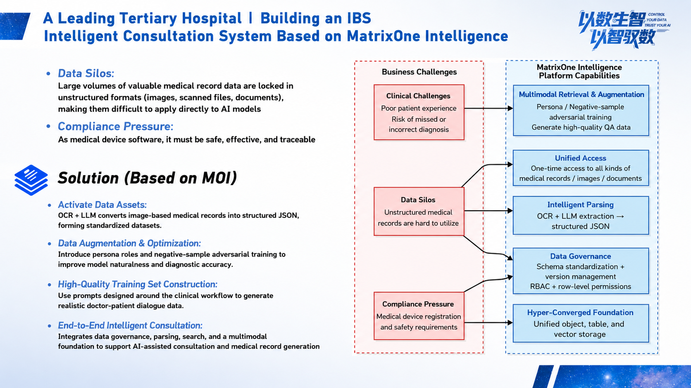

Enterprise enthusiasm for GenAI is being cooled by reality. One harsh fact is that more than 95% of enterprise AI projects stall after completing the PoC stage and cannot truly enter production.

The pilot succeeds, but the project fails. This gap between "PPT" and "production line" is the biggest challenge in enterprise AI implementation today. When model capability is no longer the bottleneck, what is holding back enterprise intelligence?

The answer is hidden in the least noticeable corners behind daily business.

The data that sits silently across enterprises, including large amounts of high-value data such as contracts, drawings, financial reports, and scanned documents, becomes "dormant assets" that AI cannot directly use because it is unstructured and scattered across storage systems. What enterprises may need is not a stronger model, but infrastructure that can wake up these dormant assets and turn them into fuel AI can use.

## Traditional Data Processing Pipelines Are Struggling in the AI Era

When enterprises try to integrate AI into core business, they often face two difficulties:

### Data Readiness Is Hard: The Swamp of Unstructured Data

Most core enterprise knowledge is stored in unstructured forms such as documents, images, and scanned files. Traditional data engineering handles this data like wading into a swamp: the processing flow is complex, time-consuming, and labor-intensive, often requiring dedicated data science teams to spend months. Compliance, desensitization, lineage, and other issues make every step feel like walking on thin ice.

### Model Trust Is Hard: The Gap Between "Smart" and "Business-Aware"

No matter how capable a general large model is, it cannot directly understand the jargon and complex business logic of a specific industry. Without high-quality private-domain data as an anchor, model outputs easily hallucinate and become an unrestrained horse. When a decimal point in a financial statement shifts or a contract clause is misunderstood, this kind of untrustworthy risk is unacceptable to any enterprise.

These two problems often keep enterprise AI projects stuck in peripheral scenarios such as customer service Q&A and document summarization. They struggle to reach core businesses that truly create value, and the return on investment becomes difficult to justify.

## Let AI Feed Back into Data and Use Intelligence to End Complexity

To break this deadlock, thinking must change: enterprises need not only to generate intelligence from data, but also to govern data with intelligence. In other words, use AI capabilities to simplify and automate complex data governance.

This is the core solution of MatrixOrigin MatrixOne Intelligence (MOI), an AI-native multimodal data intelligence platform.

MOI does not follow the traditional linear ETL process of extraction, transformation, and loading. Instead, it builds an AI-driven data processing loop whose architecture can be simplified into three layers:

### Bottom Layer: Unified Management to Build the Data Foundation

Based on the MatrixOne cloud-native hyper-converged database, MOI uses rich connectors to bring together structured and unstructured data scattered across object storage, databases, and knowledge base tools, creating a unified view of data assets. Data versions, lineage, permissions, and other issues are effectively managed from the moment data is connected.

### Middle Layer: AI Workflows Turn Data into AI-Ready Assets

This is MOI's key innovation. Facing massive raw data, enterprises no longer need to build large data engineering teams. Through Agentic Workflow, business users can use natural language to direct AI:

"Analyze the proportion of PDFs and images in this batch of files."

"Extract all Party A names, amounts, and start and end dates from these contracts."

"Clean the data, identify cross-page tables, and merge them."

Based on intent understanding, MOI automatically analyzes data, recommends and generates the best processing workflow. Whether it is document parsing, content extraction, or data augmentation, the entire process is AI-driven, greatly lowering the threshold and cycle time of data processing.

### Top Layer: Trusted Output Becomes a Reliable Business Source

High-quality processed data can directly serve downstream applications, whether building RAG knowledge bases, generating accurate BI reports, or serving as training datasets for fine-tuning vertical-domain models. Because the data source and processing process are fully controlled, the final outputs are more trustworthy and can effectively avoid model hallucinations.

## From Bid Preparation to Intelligent Diagnosis, AI Value Lands in Scenarios

The advancement of a technical architecture ultimately needs to be tested by business value. In practical applications, MOI has already helped enterprises solve multiple core business problems.

### Scenario 1: Reducing 300-Page Bid Preparation from 10 Days to 1 Day

In large manufacturing enterprises, preparing a several-hundred-page bid document requires bidding staff to communicate repeatedly across technical, legal, financial, and other departments, checking product parameters, historical cases, contracts, and qualifications. The process is tedious and highly error-prone.

MOI connects the enterprise's internal data pipeline:

**Intelligent parsing:** automatically extracts key requirements from complex bidding documents.

**Multimodal retrieval:** after entering requirements, users can quickly retrieve the best-matching technical solutions, historical contracts, and qualification files from the enterprise knowledge base.

**Trusted generation:** based on retrieved private-domain data, MOI generates bid content with accuracy above 90% and automatically masks sensitive information such as invoices and contracts.

Work that once required a team more than a week can now be completed in as little as one day. This not only multiplies efficiency, but also turns scattered business knowledge into reusable digital assets.

### Scenario 2: Activating Dormant Medical Records to Support Precise Doctor Decisions

In chronic disease management, a top-tier hospital had accumulated a large number of handwritten or scanned medical record photos. This unstructured data formed data silos, making it difficult for doctors to connect a patient's full-cycle medical history for decision-making.

MOI unified access to these medical record images and used its multimodal parsing capabilities to automatically extract key information, such as medication history and changes in vital signs. Combined with adversarial sample generation, it built a high-quality training dataset. Finally, based on the intelligent consultation model trained from this data, the hospital could automatically connect patient records and provide doctors with more precise diagnosis and treatment suggestions, realizing a closed loop from data silos to intelligent diagnosis for the first time.

So how does this complex data transformation factory work in practice? In a recent sharing session, our product R&D lead Zhao Chenyang gave a complete live demonstration, showing the full process from connecting multiple data sources, to building AI workflows through natural language, to generating final AI-Ready data assets.

Click the link below to watch the full content and demo:

<https://www.bilibili.com/video/BV1Rhs7zHER9/?spm_id_from=333.1387.homepage.video_card.click>

As the GenAI wave moves from technology excitement to deep industrial implementation, the real challenge has shifted from "are the models strong enough" to "can the data be used well." The key to solving the problem of enterprise AI running in circles is to build modern data infrastructure so that data processing no longer blocks AI implementation. Only when data can flow efficiently and reliably can AI truly become a core engine for business growth.

---

## About MatrixOrigin

MatrixOrigin is a leading provider of data intelligence (Data & AI) platform technologies and services. Its core team comes from well-known technology companies in China and around the world, with broad industry and international perspectives. MatrixOrigin's core product, MatrixOne Intelligence, is an enterprise-oriented AI-native multimodal data intelligence platform. By using artificial intelligence technologies, including large models, and an innovative hyper-converged data foundation, it helps enterprises uniformly manage and govern multimodal data and transform private-domain data into AI-Ready data assets. It has already served leading enterprises across industries, including StoneCastle, China Mobile IoT, Amway Nutrilite, Jiangxi Copper, and XCMG Hanyun, helping enterprises transform and upgrade from informatization and digitization to intelligence.
