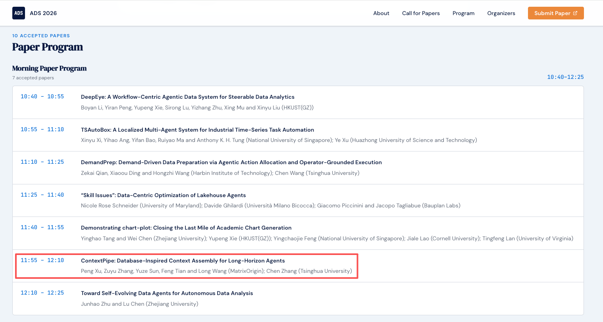

# 当 Agent 的上下文也有了“查询优化器”，矩阵起源论文ContextPipe入选数据库顶会VLDB 2026 Workshop

由矩阵起源与清华大学联合完成的论文 [ContextPipe: Database-Inspired Context Assembly for Long-Horizon Agents](https://arxiv.org/abs/2609.00749)，正式入选VLDB 2026 ADS/DATAI联合Workshop。

该论文是矩阵起源团队与清华大学联合完成的研究成果。其核心思想是借鉴数据库查询执行与优化机制，对长周期Agent的上下文进行规划、组装和反馈优化，让上下文管理更加高效、稳定和可追踪。

## 关于VLDB和ADS/DATAI Workshop

VLDB全称为International Conference on Very Large Data Bases，是数据库与数据管理领域最具影响力的国际学术会议之一。第52届[VLDB 2026](https://www.vldb.org/2026/)于2026年8月31日至9月4日在美国波士顿举行。

[ADS/DATAI](https://vldb-ads.top/)是首届Agentic Data Systems Workshop与第三届Data-Centric AI Workshop的联合研讨会，主要讨论AI Agent与数据系统结合过程中出现的新问题，包括长周期任务、数据工作流、系统可靠性、成本优化、评测和治理等。

## 用数据库查询优化器思路解决Agent上下文问题

Agent执行长周期任务时，会不断积累对话、工具调用结果、文件内容、错误信息和中间状态。每次调用模型前，运行时都需要确定哪些信息应该进入上下文、以什么顺序组织，以及何时压缩历史内容。如果只是持续追加，Token消耗会不断增加，重要信息也容易被大量历史内容淹没。

ContextPipe认为，上下文组装与数据库查询执行有相似的系统结构。数据库面对一次查询时，不会把全部数据直接交给执行引擎，而是根据查询目标、统计信息、资源预算和缓存情况选择执行计划。ContextPipe用同样的思路处理Agent上下文，根据当前任务选择需要的信息，并在上下文窗口、Token成本、响应时间和Prompt Cache之间进行权衡。

论文将这一过程划分为Plan、Bind、Optimize、Execute和Feedback五个阶段。系统先描述本次模型调用需要哪些上下文，再绑定对话、文件、工具结果和记忆等数据源，随后生成可执行的上下文计划，完成模型调用，并记录实际的Token消耗、延迟和执行结果。

ContextPipe还引入了结构化的数据源目录、可感知缓存的优化器和类似数据库EXPLAIN ANALYZE的执行追踪。每次模型调用使用了哪些上下文、为何采用当前组织方式，以及执行过程中发生了什么，都可以被记录和回放。这为Agent的调试、审计和持续优化提供了基础。

评测显示，与追加式上下文策略相比，ContextPipe将总Token使用量降低31%，LLM调用次数降低23%，整体响应时间降低9%。

我们将在后续文章进行论文解读，详细介绍ContextPipe的架构设计、优化机制和实验结果。

## Astra Harness的底层原理

ContextPipe研究的上下文规划、执行追踪和反馈优化，也是矩阵起源自研的 [Astra](https://matrixorigin.cn/astra) Agent Runtime 的底层原理。

Astra面向企业级生产环境中的Agent运行需求，负责上下文组装、状态管理、工具调用、错误恢复和执行审计。矩阵起源正在把数据库领域积累的系统技术用于Agent基础设施建设，提升Agent执行长周期任务时的效率、稳定性和可管理性。

## 9月4日VLDB2026 波士顿现场预告

美国东部时间2026年9月4日11:55至12:10，张祖羽博士和田丰博士将在VLDB 2026 ADS/DATAI Workshop现场介绍ContextPipe。

- 演讲人：张祖羽博士、田丰博士
- 演讲题目：ContextPipe: Database-Inspired Context Assembly for Long-Horizon Agents
- 地点：The Westin Boston Seaport District，Commonwealth A
- 北京时间：9月4日23:55至9月5日00:10

欢迎关注Agent Runtime、Context Engineering和Agentic Data Systems的朋友到现场交流。

- 论文：[ContextPipe on arXiv](https://arxiv.org/abs/2609.00749)
- 会议：[VLDB 2026](https://www.vldb.org/2026/)
- 日程：[ADS/DATAI Workshop](https://vldb-ads.top/)
- 产品：[Astra](https://matrixorigin.cn/astra)
