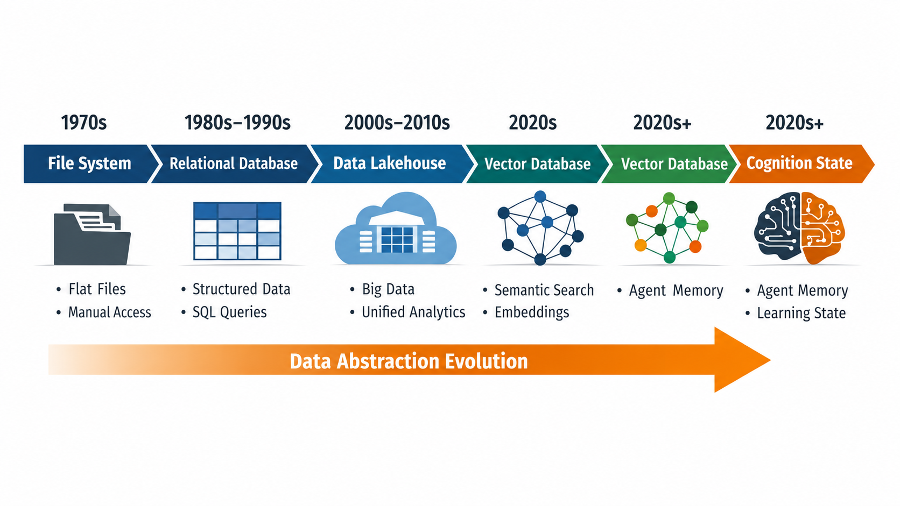
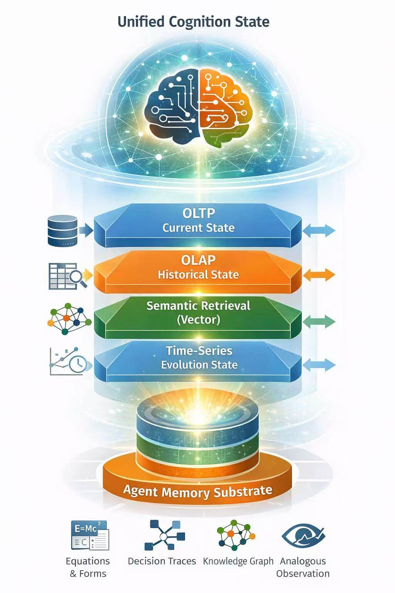
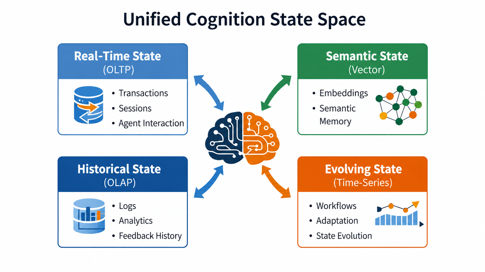

# Databases Are Not Dead; the Paradigm Has Changed

From the evolution of file systems to relational databases, and then to Markdown's next stop in the AI era

Recently, discussions about whether the database industry is disappearing have clearly increased.

The reasons look convincing:

- Agents can directly use Markdown as memory
- Vector databases are replacing relational databases
- More and more applications no longer explicitly design schemas
- Many systems no longer even "choose a database"

If you only look at these phenomena, it is easy to reach one conclusion:

**Databases are exiting the stage.**

But if we extend the time scale, we will find that what is really changing is not the importance of databases, but the migration of the data abstraction layer.

The question we face today is not whether databases are still important. It is whether we are entering a new era of data abstraction layers, just as relational databases emerged when file systems could no longer support application complexity.

**Databases have not disappeared. The paradigm has changed.**

## 1. Relational Databases Were Not a Technical Upgrade, but a New Layer of Abstraction

The emergence of relational databases was not a simple technical improvement, but a leap in abstraction layers.

Early computer systems organized data in a very direct way:

- Applications managed files
- Programs defined format structures
- Programs determined access paths

This approach worked perfectly in the era of single programs. But as system scale grew, structural problems quickly appeared:

- Data could not be shared
- Structural changes affected the entire system
- Concurrent access was uncontrollable
- Complex queries were difficult to implement
- Data structures were hard to evolve

The real problem solved by the relational model was not "how to store data," but:

**How to let multiple programs share state.**

For the first time, it achieved logical data independence, allowing applications to stop depending on underlying storage paths. Around this capability, it built a unified data model, query language, transaction mechanism, consistency guarantees, and indexing system.

From the beginning, databases were a shared state abstraction layer.

Understanding this is very important, because the problem we face today is actually very similar to the file-system era.

## 2. Markdown Is Repeating the Role File Systems Once Played

After entering the AI era, more and more systems have begun using:

- Markdown
- JSON
- Vector indexes
- Object storage

to build the memory layer.

In many scenarios, this really works. For example:

- Personal knowledge bases
- Lightweight Agent memory
- RAG demo systems
- Single-user context management

These systems usually share common characteristics:

- Low concurrency
- Weak consistency
- Append-only writes
- Simple queries

Under these conditions:

Markdown + embedding index

can indeed run.

But this does not mean databases are no longer needed.

It means the system is still in a typical pre-relational stage.

Today's Markdown is much like the flat file of the past.

It solves the expression problem, not the state problem.

It provides:

- Readability
- Exchangeability
- Weak structural expression
- Knowledge recording

But it does not solve:

- Concurrency control
- Transactional consistency
- Permission isolation
- Complex queries
- Schema evolution
- State recovery

Recent Agent memory research has already begun to describe these limitations systematically. For example, ICLR 2025 work on conversational memory points out that the key problem of long-term memory is no longer "how much context to store," but how to construct compressible, retrievable, and evolvable memory units.

This shows that **memory is moving from a text cache toward a structured state system.**

## 3. New Constraints in the Agent Era Have Appeared and Are Rapidly Amplifying

Relational databases were born because file systems could not bear application scale.

Today, similar pressure is emerging again.

But this time, it does not come from programs. It comes from Agents.

If future software systems need to run tens of thousands, hundreds of millions, or even trillions of Agents at the same time, then the objects facing data infrastructure will no longer be programs, but cognitive entities.

Databases will no longer manage data records, but cognitive trajectories:

- context
- reasoning
- tool calls
- knowledge
- observations
- tasks

Databases begin to manage:

state trajectories

rather than:

data rows

At the same time, the concurrency model is changing.

Traditional databases face multi-program concurrency, while future databases will face multi-Agent concurrency.

Programs are usually deterministic, while Agents are usually non-deterministic.

This means:

- State merging
- Version control
- Conflict detection
- Reasoning-path coordination

will all become database-level problems.

MemoryAgentBench has already decomposed Agent memory capabilities into:

- retrieval
- test-time learning
- long-horizon reasoning
- selective forgetting

These capabilities essentially correspond to indexing, updating, compression, and recovery mechanisms in databases.

At the same time, **token cost is becoming a new access-path constraint.**

ICLR 2026 work MEM1 further proves that simply expanding the context window cannot solve the long-term memory problem. The system must maintain a compact internal state.

Another class of research, such as ACON, directly defines context compression as a core system problem for long-horizon Agents.

This shows that:

context engineering is becoming the new schema design

harness engineering is becoming the new transaction system

**A new data abstraction layer is taking shape.**

## 4. Training Is Becoming a New Data Infrastructure Problem

Another change that is happening but often overlooked is that **training itself is changing from a one-time offline process into a continuous online process.**

In traditional machine learning systems, model training happens before deployment, while databases manage business state after deployment.

But in Agent systems:

- retrieval
- reflection
- tool feedback
- test-time learning

are continuously changing model behavior itself.

This means memory is no longer merely an auxiliary component during inference. It is becoming part of the training process.

When learning becomes a continuous state-evolution process, the objects managed by databases expand from business data to cognitive state, and even further to learning state.

In other words:

- In the past, databases managed business state
- Today, databases are beginning to manage cognitive state
- In the future, databases may manage learning state

This is another important signal that the database paradigm shift is happening.

## 5. The Next Generation of Databases Points Toward a Unified Cognitive State Space

If relational databases solved:

multi-program shared state

then the next generation of databases needs to solve:

multi-Agent shared cognition state

This state is not a single type of data, but a multidimensional state space:

- Current state (OLTP)
- Historical state (OLAP)
- Semantic state (Vector)
- Evolutionary state (Time-series)

The database community is already moving in this direction.

PVLDB 2025 research on vector databases explicitly defines vector stores as the long-term memory substrate of LLM systems.

GraphRAG research is beginning to extend retrieval into structured reasoning paths, rather than limiting it to semantic matching.

When data infrastructure needs to support tens of thousands, hundreds of millions, or even trillions of Agents, databases will for the first time become cognitive infrastructure.

Systems must support:

- decision trace
- reasoning history
- tool invocation lineage
- state evolution timeline

Permission models will also change:

from

user -> table

to

- agent -> memory region
- agent -> tool state
- agent -> world model fragment

The role of databases is changing from:

data storage layer

to:

cognition state infrastructure layer

Markdown will not disappear, but it will not be the destination.

It is more likely to become the entry format before the next-generation data abstraction layer appears, and evolve along this path:

Markdown
-> metadata
-> chunking
-> embedding
-> vector index
-> relational state
-> agent memory substrate

In this process:

Markdown changes from storage format to interface format.

**The real data layer still requires a new database abstraction.**

## 6. Databases Have Not Disappeared; They Have Entered a New Position

File systems did not disappear. They simply moved underneath databases.

Relational databases will not disappear either. They may be moving underneath Agent memory.

Markdown is not the endpoint of databases. It is only the entry format before the next layer of databases is born.

**Databases are not dead.**

**The paradigm has changed.**
