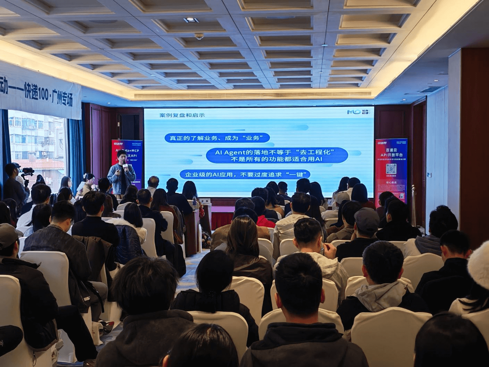
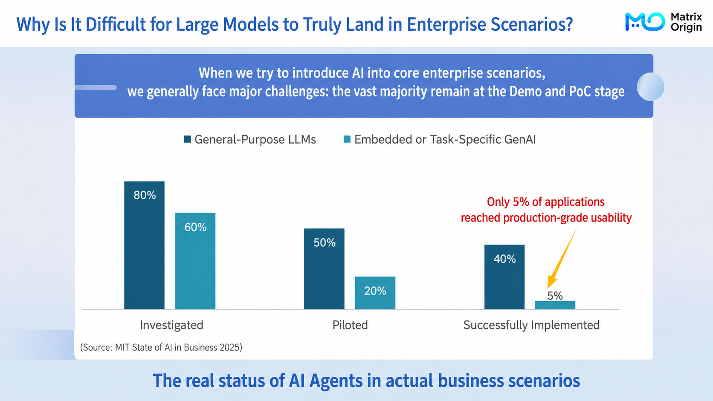
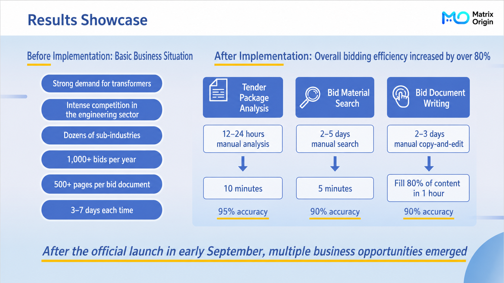
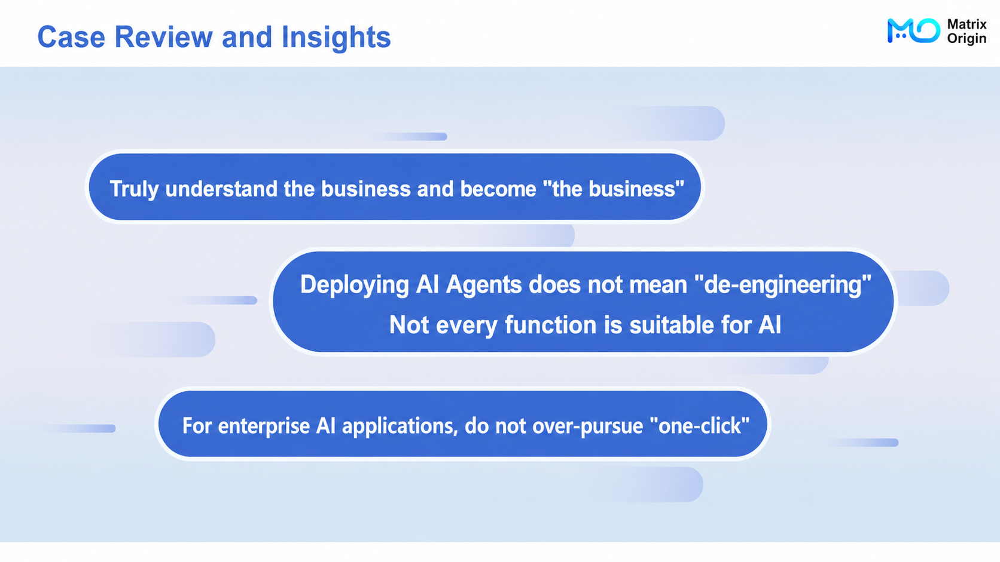

# Event Recap | MatrixOrigin Takes You Deep into Enterprise Agent Implementation Practice

On January 31, the "AI Large Model x Business Needs: Scenario-Based Breakthrough Practices for Product Innovation" salon concluded successfully in Guangzhou.

Wei Xudong from MatrixOrigin was invited to speak and delivered a keynote titled "Building a Trustworthy Enterprise Agent: Starting from Multimodal Data Governance." Drawing on MatrixOrigin's deep experience in Data + AI, he used a real manufacturing case to deeply analyze the core pain points and breakthrough paths for enterprise Agent construction.

## 01 Breaking the Hype: Why Does Enterprise AI Implementation Face a "Trust Crisis"?

At the beginning of the speech, Wei Xudong cited a recent MIT survey: in current enterprise AI projects, only 5% of applications are truly production-ready, while the vast majority remain at the demo and PoC stage.

Wei Xudong pointed out that when enterprises try to bring AI into core business scenarios, they face huge challenges. The core contradiction is that **there is a gap between general large-model capabilities and the current state of enterprise private-domain data.**

Enterprise private-domain data contains a very high proportion of unstructured data in various forms, creating serious data silos. When models face these uncontrollable "data foundations," hallucinations are inevitable, causing results to be non-reproducible and non-traceable, and making them unsuitable for serious business decisions.

He stressed: "**What really blocks AI implementation is often not the model, but messy data.**"

## 02 The Breakthrough: Building a "Business-Aware" Agent on MOI

How do we solve the trust crisis? Wei Xudong believes the key is to "start by governing multimodal data."

He used a large manufacturing enterprise's "intelligent bidding" scenario as an example to share MatrixOrigin's practical solution. The enterprise handles more than 1,000 bids each year, and each bid document can be 500 pages long. Traditional manual processing takes a very long time and is prone to errors. Generic AI tools on the market, because they cannot understand complex bidding documents, only achieve 40%-50% accuracy.

Based on the MatrixOne Intelligence (MOI) platform, MatrixOrigin reshaped the workflow through a hyper-converged architecture of "data governance + multi-Agent collaboration." The results were significant: bid document analysis time dropped from 12 hours to 10 minutes, material search time dropped from 5 days to 5 minutes, and overall bidding efficiency increased by more than 80%.

## 03 Deep Thinking: AI Agent Implementation Does Not Mean "No Engineering"

At the end of the speech, Wei Xudong summarized the "unexpected challenges" and reflections encountered during implementation. He pointed out that many enterprises misunderstand AI as "one-click generation" or fully automatic, and this misunderstanding is itself a barrier to implementation.

He proposed three key insights:

**First, change the mindset.** AI's role is Copilot. Pursuing 100% accuracy with no human involvement is neither realistic nor safe.

**Second, implementation does not mean "no engineering."** Enterprise AI applications should not overpursue "one-click generation." Instead, they require stricter engineering design, including task decomposition, feedback mechanisms, and handling long-tail problems.

**Third, value returns to data.** What truly takes time is often understanding and governing the data, while "generation" only accounts for a small part.

## Conclusion

Only technology that can withstand real business scenarios has lasting vitality.

MatrixOrigin will continue to uphold its mission of "providing a simple and powerful data intelligence operating system for the digital world" and keep refining the MatrixOne Intelligence platform. Through pragmatic technical innovation and multimodal data governance capabilities, we hope to work with more ecosystem partners to help enterprises solve data problems and build secure, efficient, and sustainably evolving intelligent systems.
