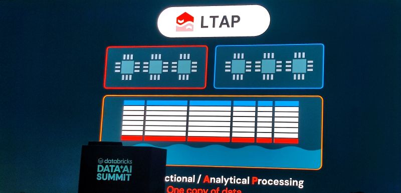
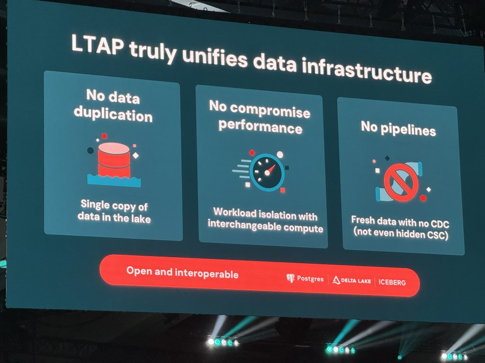
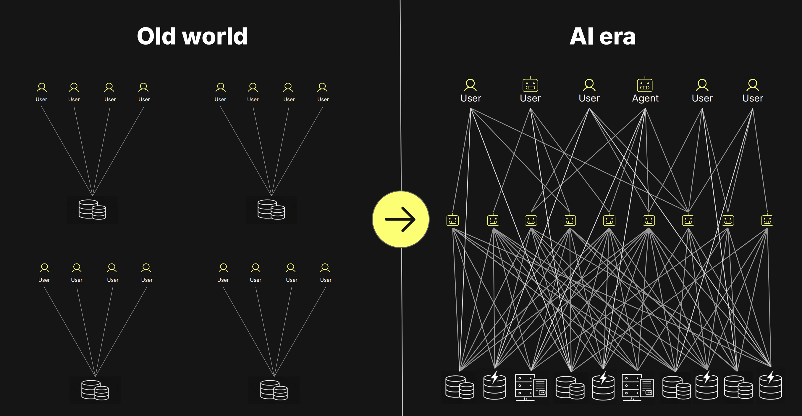

# 旧瓶装新酒：造词大师 Databricks 又来强行造新概念了

文 / 张祖羽 博士（一个看了十年 HTAP 的数据库老兵，文章皆为个人观点）

上周 Databricks 的 Data + AI Summit，Ali Ghodsi 站台上，一脸"我悟了"的表情，宣布自己破解了一个困扰行业 40 年的数据库难题——把事务和分析这两份老死不相往来的数据，合成一份。然后，照例，给它起了个新名字：**LTAP**，Lake Transactional/Analytical Processing。

我盯着这四个字母看了半天，差点没绷住。

倒不是这事儿不对——它当然对。我是说，**这瓶酒，我们这行早就开过了，它叫 HTAP。** Gartner 2014 年就把这词儿造出来了，混合事务/分析处理。Ghodsi 把那个 H（Hybrid）摘下来，换上一个 L（Lake），齐活儿，一个"全新范式"就这么诞生了。

要论造词，Databricks 是这行里的祖师爷，这点我是真服。lakehouse 是它造出来又 popularize 的；Data Intelligence Platform 也是它的话术；这回轮到 LTAP。**这家公司最强的从来不是数据库内核，是市场部的命名能力。** 每隔一阵子，它就能把一个老概念擦干净、贴个新标签、配一场 keynote，然后让全行业跟着它的词儿走。

（不得不说，这招是真好使。你看，连我都忍不住要写篇文章来跟它聊聊。）

## 一、从湖，到仓，再到库——它绕了十年，才挪到"库"这一步

Databricks 这一路，说穿了就是从"湖"往"库"爬。

最早，它是伺候 data scientist 的那个 Spark 集群管家，搞的是 data lake——一个啥都能往里扔、但啥都查不利索的大水坑。后来它琢磨明白了，光有湖不赚钱，CFO 的钱袋子在数仓那头，于是憋出了 lakehouse，湖仓一体，把 warehouse（AP）这条腿补上了。这段它走得漂亮，我承认。

可它一直缺最后那块拼图：库，也就是 transactional 的那个 TP。

为啥缺这么多年？因为 **TP 是这三样里最难啃的骨头。** 湖是存，仓是算，这俩你慢一点、错一点，大不了报表晚出半天。TP 不行——它要严格的事务一致性、毫秒级的点写点读、几千并发同时怼进来还不能把账算错一分钱。这种东西，没法靠在湖边上糊一层 SQL 兼容就给变出来。

所以 Databricks 的"库"是咋来的？**买的。** Lakebase 的底座，是去年收的 Neon，一家做 serverless Postgres 的公司。把一个独立的 Postgres 实例，塞到湖仓旁边，让它俩合用一层存储——这就是它口中的 LTAP："一个 OLAP 引擎读一份数据，一个 OLTP 引擎更新它"。

说白了，**还是两个引擎，只不过让它们共用一个仓库。** 这比过去那种 CDC 任务 + 下游副本 + 一个累到秃头的数据工程师勉强焊在一起的烂摊子，确实强。但"共享个存储"和"真长在一套架构里"，是两码事。两个引擎并着跑，迟早会冒出一份叫《查询路由规范 v4》的文档，而那玩意儿永远是过期的，永远有人半夜被叫起来——因为某条 query 又走错了引擎。

## 二、真正熟了的，是底座

那为啥 LTAP 这事儿，偏偏卡在 2026 年这个节骨眼上才成？

核心就一条：**以 Iceberg 为代表的开放统一存储底座，终于熟了。** 一份躺在对象存储上的开放格式数据，可以同时喂给 TP 和 AP，不用各存一份。存算分离、单一副本、开放格式、一份数据服务混合负载——这套行业现在才真正达成的共识，才是 LTAP 能成立的前提。

值得一提的是，这套设计思路本身并不新。几年前就有人这么想了，只是当年 Iceberg 还没这么硬，业界还在为"湖仓一体"这个词儿吵得不可开交，条件没凑齐。今天这些拼图一块块归位，于是水到渠成——Databricks 做的，是给这个"终于成熟了的结论"换了个新词，再庄严地宣布一遍。

## 三、Agent 时代，底下那个实例必须是 transactional 的

最后说说为啥是现在，因为这才是真正的导火索：Agent。

Ghodsi 自己甩了个数据出来：他们平台上约八成的数据库，如今是 Agent 建的，不是人建的。这数字很说明问题——Agent 把数据库的负载形态给彻底改了。

Agent 不像人。人点一下 dashboard、查一下、走了。Agent 是 24 小时不睡觉的：它扇出、它追问、它一边翻历史一边等着业务往里写新数据，一个 Agent 还能拉起一串 Agent，眨眼给你怼上几千并发。这种 workload，你光塞给它一个"更新鲜的湖"是远远不够的。

它要的是：在高并发、低延迟下，实时拿到准确的业务状态。能扛住这个的，**只能是一个真正事务性的实例**——能边写边读、能保证一致、能在状态变化的那一瞬给出对的答案。一个挂在湖边的只读分析引擎，给不了。

这也是为啥你看大伙儿最近不约而同往 TP 上扑：Databricks 收 Neon 做 Lakebase，Snowflake 收 Crunchy 做 Postgres，全在补 transactional 这一课。而且补法还高度一致——**几乎都是"买一个 Postgres 回来"。** 这件事本身就说明：把一个真正事务性的内核从头长出来，有多难。

## 写在最后

绕回那个新词。

LTAP 不是错的，它指的方向完全正确。企业不想要贴在业务上的过期分析，不想要又长又脆的管道，更不想让 Agent 捧着一份落后一小时的数据替自己拍板。它们要的，就是一份数据，能写、能读、能分析、能实时喂给 Agent。

这事儿没毛病。只是别把"给湖仓拼了个 Postgres"，和"从第一天就把 TP 和 AP 焊死在同一套内核里"，混为一谈。开放表格式有用，共享存储有用，Postgres 兼容也有用——可这仨，单拎出来任何一个，都变不出一个真正的 HTAP 数据库。

Databricks 又造了个好词。但词造得再漂亮，也替代不了真正把那条最难的 TP 路走通。

旧瓶装新酒，酒是好酒。只是别忘了——这瓶，十年前就开过，那时候它就叫 HTAP。
