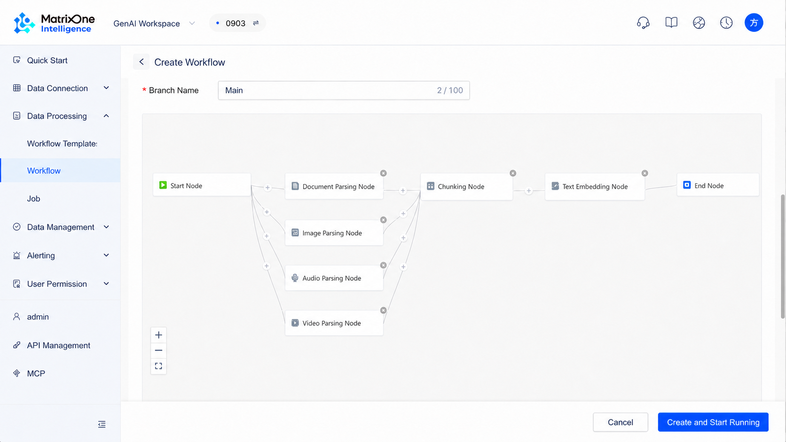
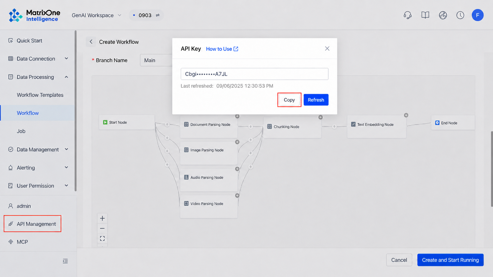
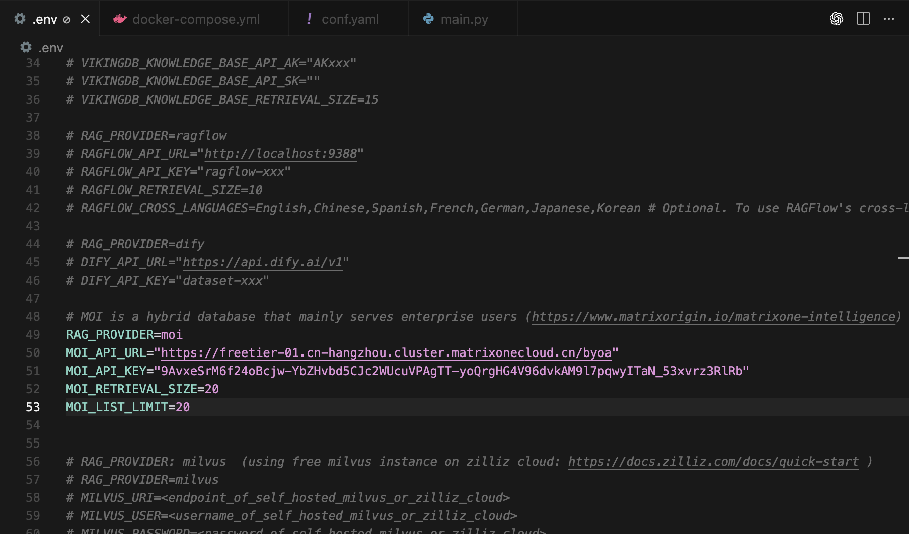
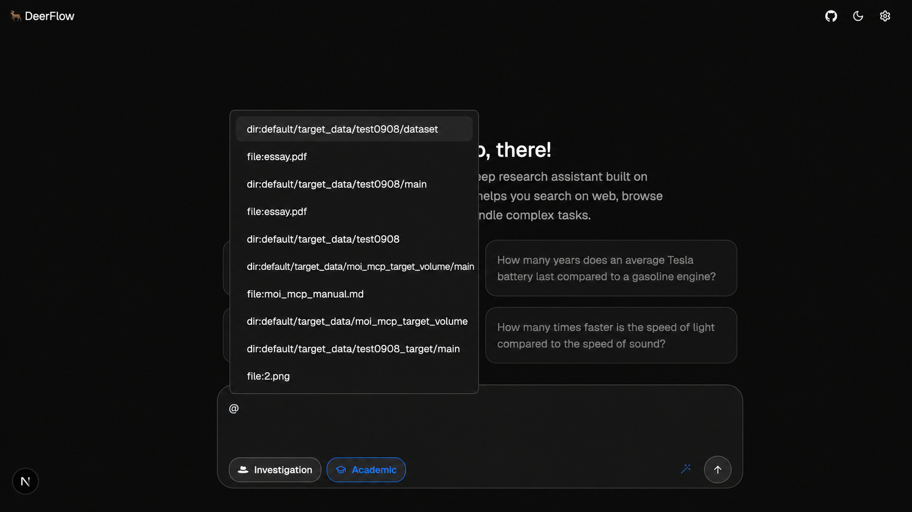

## Video + Tutorial | Unlocking the Potential of RAG Deep Search Applications: A Practical Guide to Integrating Deerflow with MOI

## Introduction

This tutorial provides developers with a clear and detailed guide to integrating the open-source RAG (Retrieval-Augmented Generation) application development engine Deerflow with MOI's RAG service. Through this tutorial, you will learn how to deploy Deerflow, create a data processing workflow in MOI, and connect the two systems to build a powerful, customizable deep retrieval augmented generation application.

### 1. Introduction to Deerflow

Deerflow (https://github.com/bytedance/deer-flow) is an open-source RAG application development engine. It provides a complete backend service and an extensible framework. Its core value is simplifying the RAG application development process, allowing developers to quickly connect RAG data service providers such as MOI, large language models (LLMs), and vector databases through simple configuration. This lets developers focus on business logic instead of low-level integration work.

### 2. Installing and Deploying Deerflow

This tutorial walks through the local deployment process for Deerflow.

#### Recommended Tools

To ensure a smooth installation experience, we recommend using the following tools:

- **uv**: Simplifies Python environment and dependency management. uv automatically creates a virtual environment in the project root and installs all required packages.

- **nvm**: Makes it easy to manage multiple Node.js runtime versions.

- **pnpm**: Installs and manages dependencies for Node.js projects.

#### Environment Requirements

Make sure your system meets the following minimum requirements:

- **Python**: 3.12 or later

- **Node.js**: 22 or later

#### Installation Steps

**Step 1: Clone the repository**

```bash
git clone https://github.com/bytedance/deer-flow.git
cd deer-flow
```

**Step 2: Install Python dependencies**

Use uv to synchronize the environment and install all required Python packages.

```bash
uv sync
```

**Step 3: Initialize configuration files**

Deerflow is configured through `.env` and `conf.yaml` files. Copy them from the template files first.

First, configure the `.env` file, which stores sensitive information such as API keys. We will fill in the MOI information in later steps.

```bash
cp .env.example .env
```

Then configure the `conf.yaml` file, which is used to set up LLM models and related options.

```bash
cp conf.yaml.example conf.yaml
```

**Note**: Before starting the project, read the official configuration guide (`docs/configuration_guide.md`) carefully and update both configuration files according to your needs.

**Step 4: Install optional dependencies**

To support PPT generation, install marp-cli.

```bash
npm install -g @marp-team/marp-cli
```

**Step 5: Optional: Install Web UI dependencies**

If you want to use the Web UI, enter the `web` directory and install the frontend dependencies.

```bash
cd web
pnpm install
cd ..
```

### 3. Creating a RAG Workflow in MOI

Next, log in to the MOI platform and create a workflow for processing and retrieving data.

**Step 1: Create a workflow**

Log in to your MOI account, go to the workflow management page, click **Create Workflow**, and name your new workflow.

**Step 2: Build the workflow**

A basic RAG workflow contains at least three core nodes: data parsing, text chunking, and vector embedding.

1. **Add a parser node**: Drag a parser node from the node list onto the canvas. The node type depends on the data source you want to process. For example, choose a document parser for document files, or an image parser for images.

2. **Add a chunking node**: Drag a chunking node onto the canvas. This node is essential because it splits parsed long text into smaller chunks that are better suited for retrieval.

3. **Add a text embedding node**: Drag a text embedding node onto the canvas. This node is also critical. It calls an embedding model to convert each text chunk into a vector for later similarity calculation and retrieval.

4. **Connect the nodes**: Connect the three nodes in the following order: parser node -> chunking node -> text embedding node. This forms a complete data processing pipeline.



**Step 3: Obtain the API key and URL**

After the workflow is built, obtain the credentials required for API calls.

1. In the lower-left corner of the MOI workspace, find the API-related information.

2. **Copy the API key**: This is a long string and is the unique credential for accessing the workflow.

3. **Get the API URL**: Record the access address of your MOI service, such as `https://freetier-01.cn-hangzhou.cluster.matrixonecloud.cn`. The endpoint required by Deerflow is this address with `/byoa` appended to it.



### 4. Configuring Deerflow to Connect to MOI

Now return to the Deerflow project and configure it with the MOI workflow information.

**Step 1: Open the .env file**

Use your preferred text editor to open the `.env` file in the Deerflow project root.

**Step 2: Fill in the MOI configuration**

Find or add the following configuration items in the file, and replace the placeholders with the information you obtained in the previous step:

```bash
# MOI RAG service configuration
MOI_API_KEY=your_api_key_here
MOI_API_URL=https://your-moi-instance.com/byoa
```

**Configuration example:**



**Step 3: Configure the base model (conf.yaml)**

In addition to the RAG service, you also need to configure a base large language model (LLM) to handle generation tasks. This model can be deployed locally, for example through Ollama, but the key requirement is that it must support tool calling.

Open the `conf.yaml` file in the project root, find or add the `BASIC_MODEL` configuration, and fill in your model information.

```yaml
BASIC_MODEL:
  provider: 'ollama'
  model: 'qwen2.5:7b'
  api_base: 'http://localhost:11434'
```

**Other configuration:**

`.env` under the `web` directory:

```bash
VITE_API_URL=http://localhost:8000
```

### 5. Starting the Service and Running Queries

After all configuration is complete, save the files. You can now start the Deerflow service and begin testing queries.

#### Start the service

Deerflow provides two interaction modes. Choose the one you need.

**Option 1: Console UI**

This is the fastest way to run the project. Execute the following command in the project root:

```bash
uv run python main.py
```

**Option 2: Web UI**

This option provides a more dynamic and engaging interactive experience. Make sure you have completed step 5 in the installation section. In the project root, run the startup script:

```bash
./start.sh
```

#### Verify the integration and perform deep retrieval

After the service starts, we recommend using the Web UI for verification. Follow these steps:

1. **Enter the chat page**: Open `http://localhost:3000` in your browser. After entering the Deerflow welcome page, click **Get Started** to enter the main chat interface.

2. **Verify successful connection**: In the chat box, if the system displays the prompt `You may refer to RAG by using @`, Deerflow has successfully connected to the MOI RAG service you configured.

3. **Perform deep retrieval**:

   a. Enter the `@` symbol in the input box.

   b. The system automatically displays a selectable list containing the files or folders you have processed in MOI.

   c. Select the specific data source you want to retrieve from, then enter your question to start a deep retrieval query against that data source. Note that the user's question should not be too simple or unrelated to research; otherwise, Deerflow may encounter errors.



At this point, you have successfully integrated Deerflow with MOI's RAG service and can begin building deep retrieval augmented generation applications.

---

### Watch the Livestream Replay for a More Detailed Practical Demo and Content Walkthrough

### Livestream Q&A

**Q: Compared with directly using multiple specialized systems, what flexibility advantages does MatrixOne's unified storage strategy provide?**

**A:** This is a deep architectural question. Traditionally, structured and unstructured data are managed by separate specialized databases. However, this separated model faces challenges such as fragmented data, difficulty ensuring consistency, and high costs caused by frequent synchronization between systems. For downstream analytics, training, and query tasks, a multi-system model also requires repeated data movement, which is inefficient. MatrixOne Intelligence (MOI) builds a unified storage engine that seamlessly integrates different data forms, ensuring that data and analytics operate on the same copy of data. This improves data processing efficiency and consistency while preserving flexibility.
