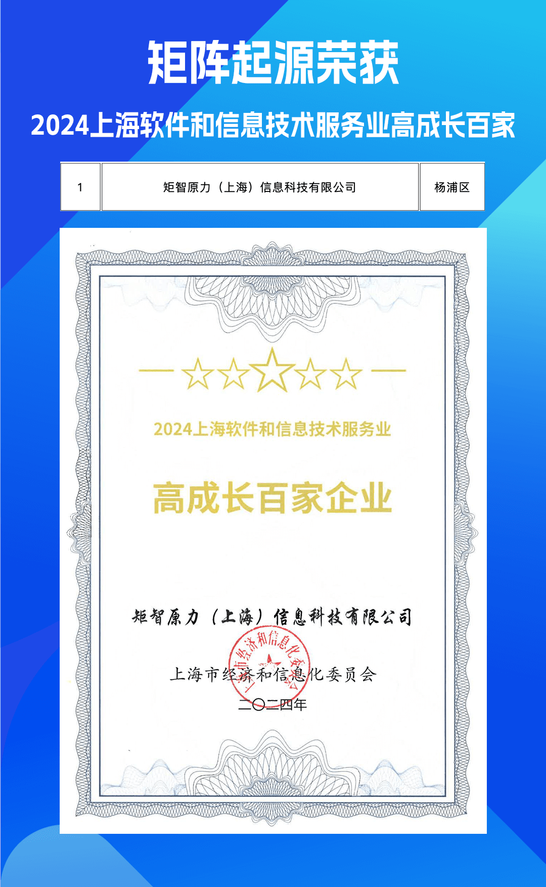
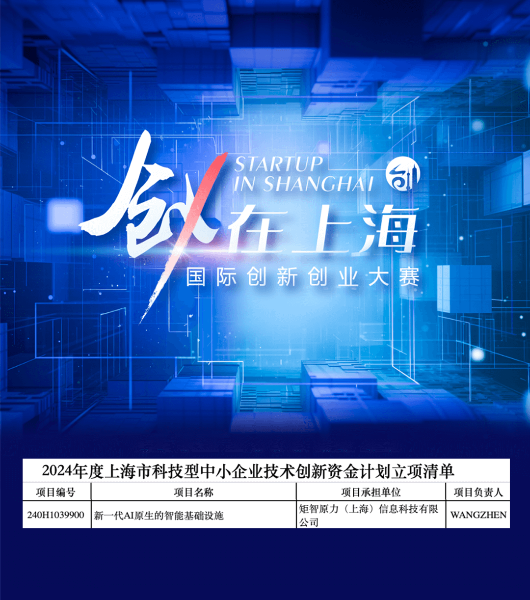

Warmth comes in deep winter, and good news arrives one after another. Congratulations to MatrixOrigin subsidiary Juzhi Yuanli for ranking first among the "2024 Shanghai High-Growth Top 100" and once again receiving project support from the Shanghai Technology Innovation Fund for technology-based enterprises.

**2024 Shanghai High-Growth Top 100**

Recently, the Shanghai Municipal Commission of Economy and Informatization ranked Shanghai software and information technology service enterprises by operating revenue scale and growth speed. Juzhi Yuanli (Shanghai) Information Technology Co., Ltd. proudly topped the "2024 Shanghai Software and Information Technology Service Industry High-Growth Top 100" list. The ranking aims to promote the development of Shanghai's software and information service industry, further support enterprises in growing stronger and larger, and give full play to the leading role of backbone enterprises.

**Shanghai Technology Innovation Fund**

In November 2024, the Science and Technology Commission of Shanghai Municipality launched the annual innovation fund project process together with the "Entrepreneurship in Shanghai" International Innovation and Entrepreneurship Competition. More than 10,000 projects registered for the competition. After intense written reviews and on-site roadshow competition, the Shanghai Science and Technology Commission recently announced the list of projects approved under the "2024 Shanghai Technology-Based Small and Medium-Sized Enterprise Technology Innovation Fund Plan." Juzhi Yuanli once again received project support from the Shanghai Technology Innovation Fund for technology-based enterprises.

This honor is not only high recognition of the company's unremitting efforts in technology R&D, market expansion, and customer service, but also a strong testament to its role in leading industry development trends and driving digital transformation. In the future, Juzhi Yuanli will continue to uphold the development philosophy of innovation-driven growth, contribute more wisdom and strength to industry development, and write a new chapter of success.

[Official announcement link]: ["2024 Shanghai Software and Information Technology Service Industry Top 100" and "2024 Shanghai Software and Information Technology Service Industry High-Growth Top 100" list announcement](https://sheitc.sh.gov.cn/gg/20241128/d5fb78f17ba349eba998ed6d3684a632.html)

[Official announcement link] [Notice on Publishing the 2024 Shanghai Technology-Based Small and Medium-Sized Enterprise Technology Innovation Fund Project Approval Results](https://mp.weixin.qq.com/s/TeWi9n91dOud9CCm-7v7vw)

**Company Introduction**

MatrixOrigin is a national high-tech enterprise and specialized, refined, distinctive, and innovative enterprise that provides AI-native multimodal data intelligence platforms and solutions for enterprises. It is also a leading company in China's artificial intelligence field. The company's main products cover the infrastructure layer, data and knowledge management layer, and AI application layer, providing relational database services, vector database services, lakehouse integrated data analysis services, large-model services, compute services, AI Agent development tools, and more. With "AI+" as its strategic orientation, the company empowers enterprises to fully release the potential of their own data for more efficient and sustainable development. MatrixOrigin is committed to building an open technical open-source community and ecosystem. Through industry-leading technological innovation and engineering capabilities, it builds data infrastructure technologies and products, accelerates industrial digitization and intelligent transformation and upgrading, and has reached cooperation with well-known domestic and international companies including Tencent, VNET, Shenzhen Smart City, China Mobile IoT, and StoneCastle.
