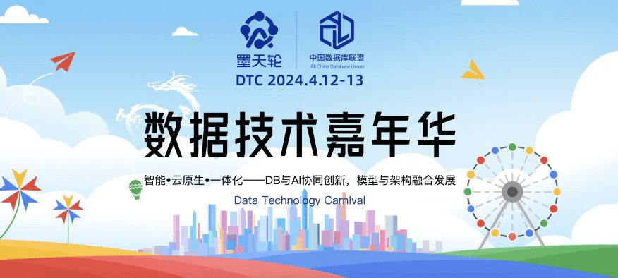
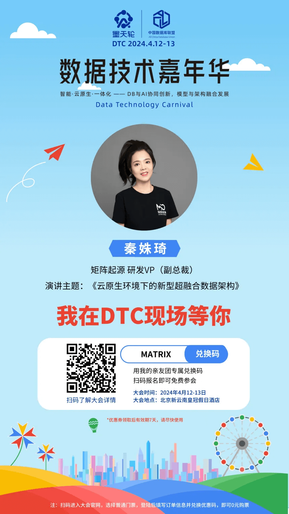

From April 12 to 13, 2024, the 13th Data Technology Carnival, jointly hosted by the China DBA Alliance (ACDU) and the Motianlun community, will kick off at the Crowne Plaza Beijing Sun Palace. One of the highlights of the summit is that **MatrixOrigin VP of R&D Qin Shuqi** will deliver a keynote speech titled "A New Hyper-Converged Data Architecture in Cloud-Native Environments" in the Cloud-Native Database session on the morning of April 13. The speech will take an in-depth look at MatrixOne's innovation path and its future development in the cloud-native database field.

## Product Innovation | A New Direction for HTAP and Cloud-Native

**MatrixOne, MatrixOrigin's flagship product**, has always been guided by the concept of a hyper-converged database since its birth, constantly pushing boundaries and actively responding to industry change. In 2023, as a landmark milestone, MatrixOne entered a new stage of development. Its innovative cloud-native architecture decouples storage, compute, and transactions into three layers, achieving extreme flexibility and efficiency in data processing. From the initial `1.0.0` version to the latest `1.1.0` version, MatrixOne has continuously improved its features and performance. It now supports capabilities such as **vector, streaming, and time series**.

Today, MatrixOne has been applied in industries such as internet, finance, energy, manufacturing, education, and healthcare. MatrixOne helps users reduce hardware and operations and maintenance costs by 70% and increase development efficiency by 3-5 times, empowering them to respond more flexibly to market changes and capture innovation opportunities more efficiently.

## Ecosystem Building | One Size Fits Most

MatrixOne places great importance on cooperation with the ecosystem to realize its product philosophy of "One Size Fits Most." MatrixOne has completed compatibility certifications for Euler open-source operating system, Kylin Software's Galaxy Kylin Advanced Server Operating System (Phytium edition and Kunpeng edition) V10, OpenCloudOS, Galaxy Kylin Advanced Server Operating System, Phytium FT-2000+/64 and S2500 processors, Tencent Cloud, and Kunpeng920, among others, better meeting customers' needs for different operating systems in the domestic software ecosystem. In addition, through compatibility with tools such as DataX, SeaTunnel, and Superset, MatrixOne achieves seamless integration with other tools and provides users with a comprehensive data management solution.

In academic and university cooperation, MatrixOne has also achieved notable results. On one hand, the paper "Edge Fusion of Intelligent Industrial Park Based on MatrixOne and Pravega," co-authored by MatrixOne, Pravega, and Beijing University of Posts and Telecommunications, was selected for the IEEE Broadband Multimedia Systems and Broadcasting conference, or IEEE BMSB. On the other hand, MatrixOne has reached a patent open-recognition cooperation with Shenzhen University. Through this patent licensing model for industry-academia-research cooperation, MatrixOrigin can fully leverage Shenzhen University's rich scientific and technological achievements and integrate them into actual product R&D. This not only helps improve MatrixOrigin's innovation capability, but also enables the application of frontier scientific and technological achievements in MatrixOne product development, building a groundbreaking hyper-converged database and leading the high-end database technology direction in the industry.

## Social Recognition and Honors | Strength Recognized

MatrixOne has received broad recognition and honors in society. With its technical R&D and product innovation, it successfully passed the "Specialized, Refined, Differentiated, and Innovative" evaluation and won the title of "Shenzhen Specialized, Refined, Differentiated, and Innovative SME." MatrixOne also won third prize in the 8th "Maker China" Shenzhen SME Innovation and Entrepreneurship Competition and the Shenzhen Enterprise Innovation (International) Record honor, demonstrating its leading position in technological innovation and industrial development. At the same time, MatrixOne's technical strength has been recognized by international authoritative institutions. It has obtained ISO system certification and recognition from the China Academy of Information and Communications Technology. MatrixOne and Shenzhen Smart City Big Data Center Co., Ltd. jointly applied for the project "One-Stop Transportation Big Data Platform Based on Hyper-Converged Database," which was successfully selected for the 2023 Big Data "Galaxy" database excellence cases by CAICT. MatrixOne also won the title of "2023 Big Data Supporting Industrial Economy" annual innovative product and was successfully included in the "2023 China Database Field Most Commercially Valuable Enterprise List." It is also worth mentioning that MatrixOne received project funding from the Shanghai Science and Technology SME Innovation Fund.

In 2024, MatrixOne will continue to stay innovative and keep promoting the development of hyper-converged database technology. At the upcoming Data Technology Carnival (2024DTC), we look forward to discussing MatrixOne's future path with you and witnessing a new chapter in data technology. Stay tuned for MatrixOne's exciting performance at DTC2024.

