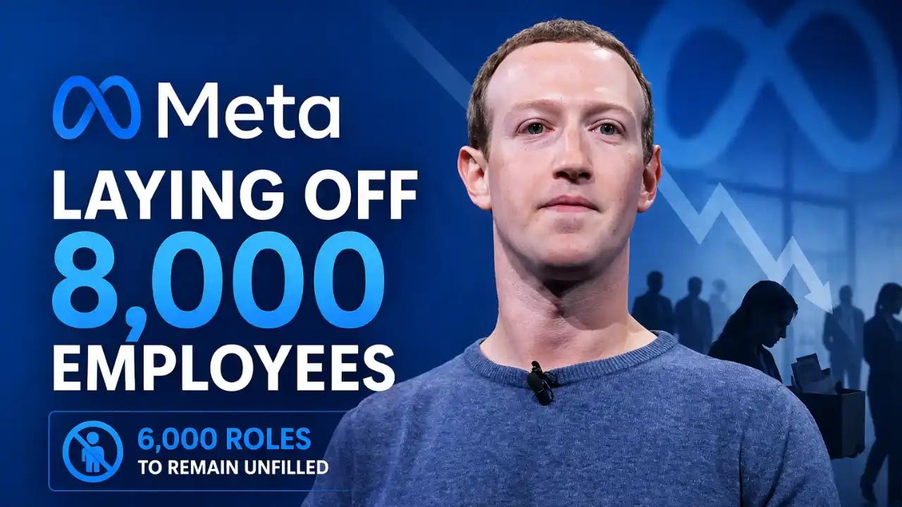
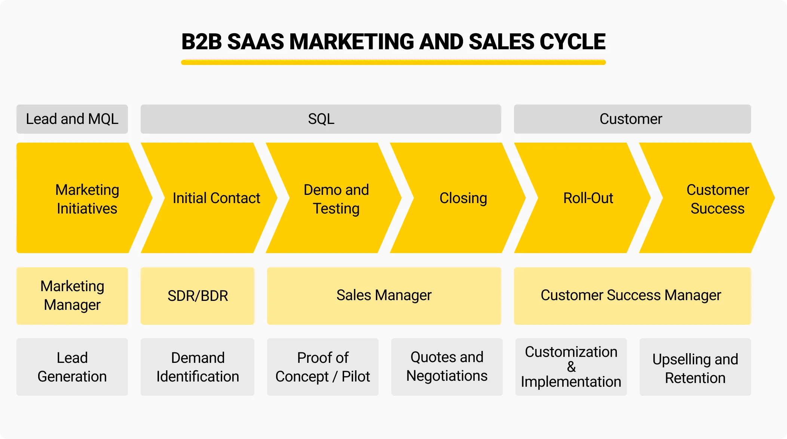
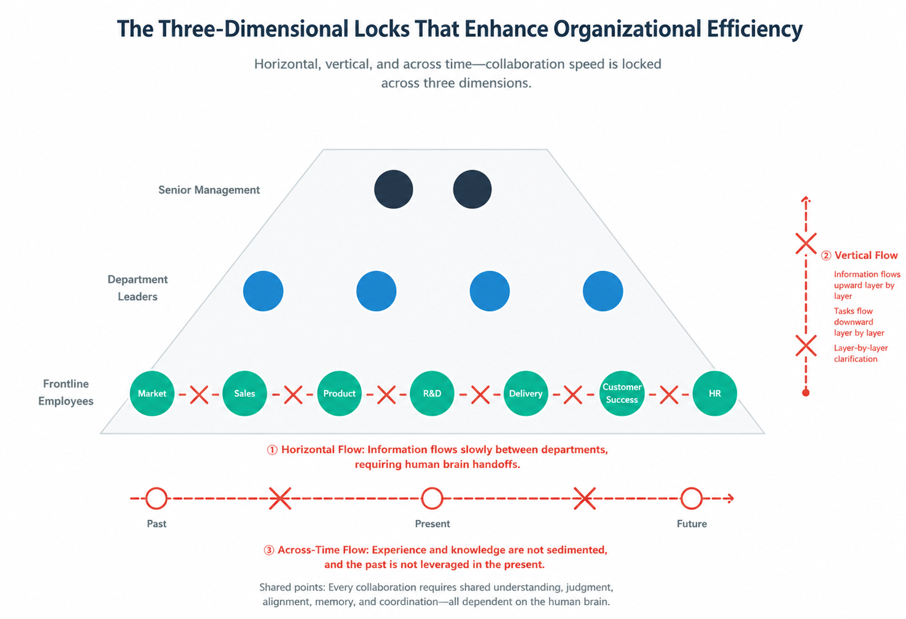
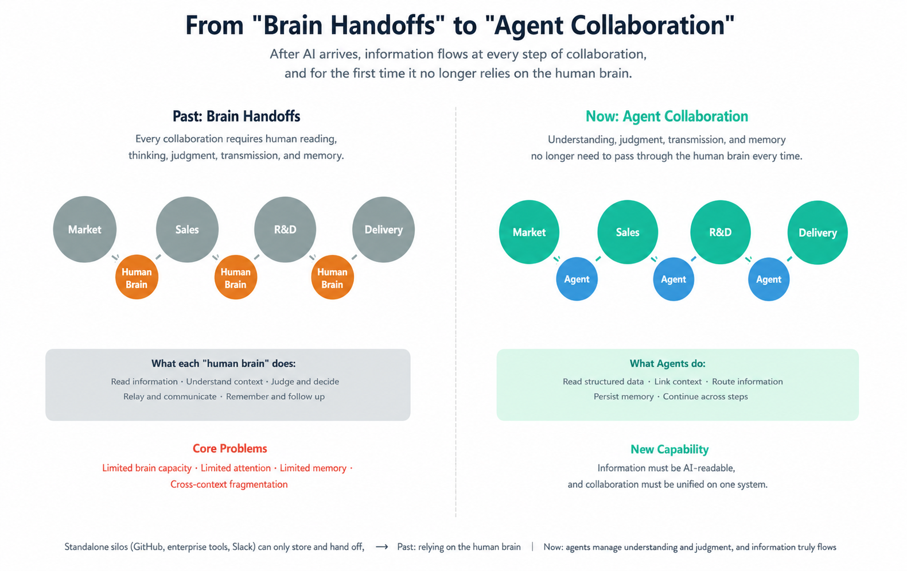
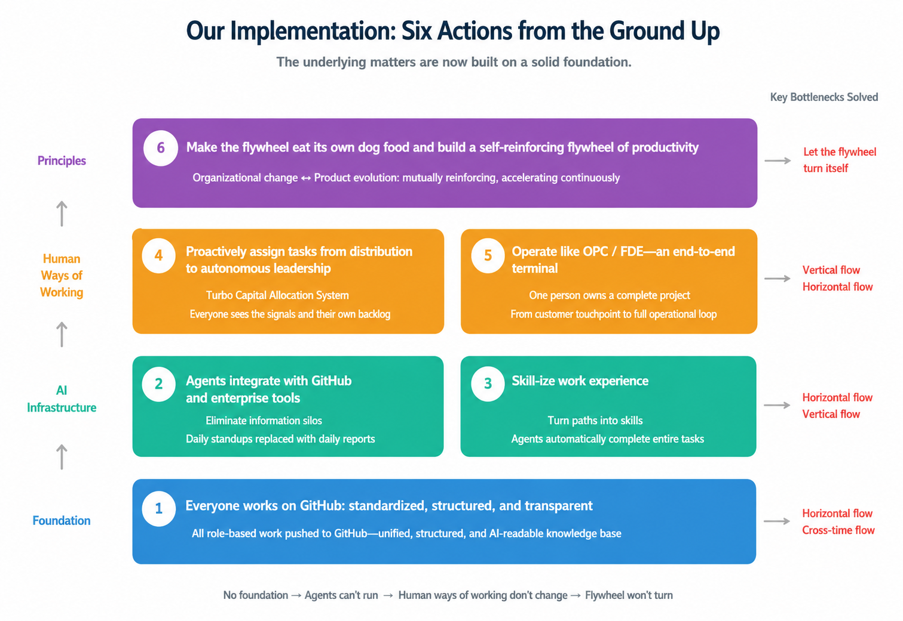
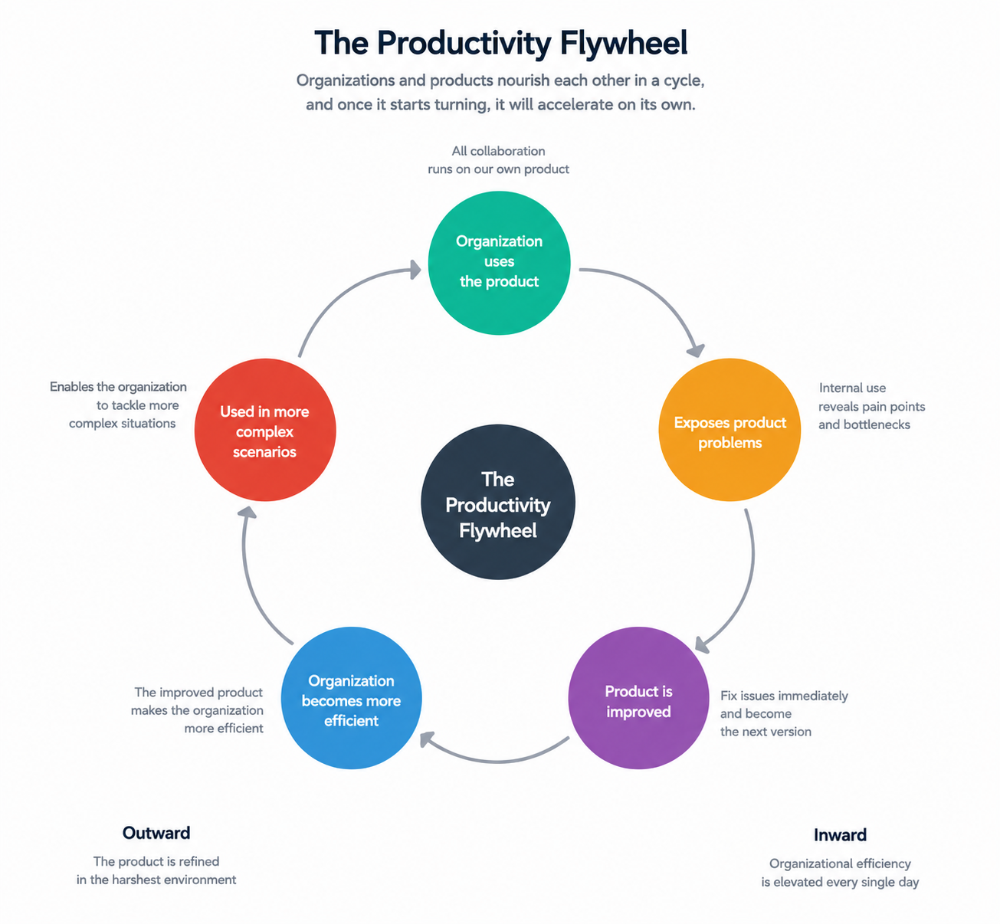
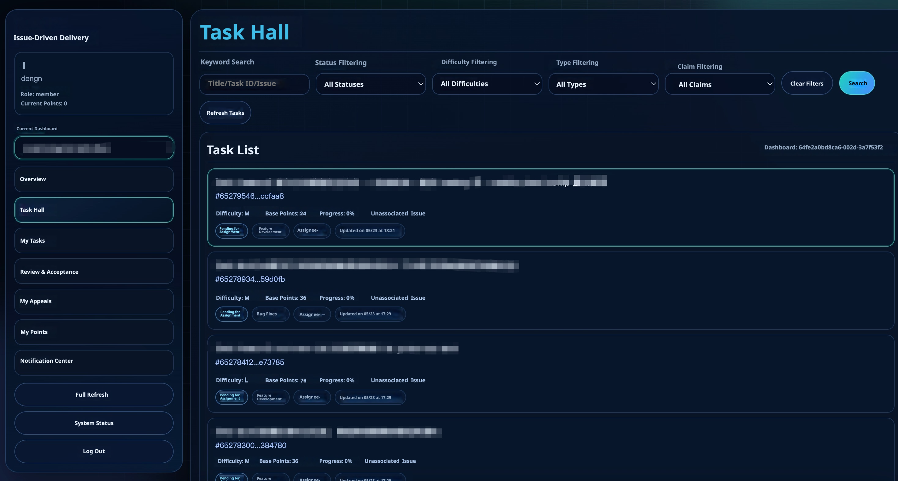
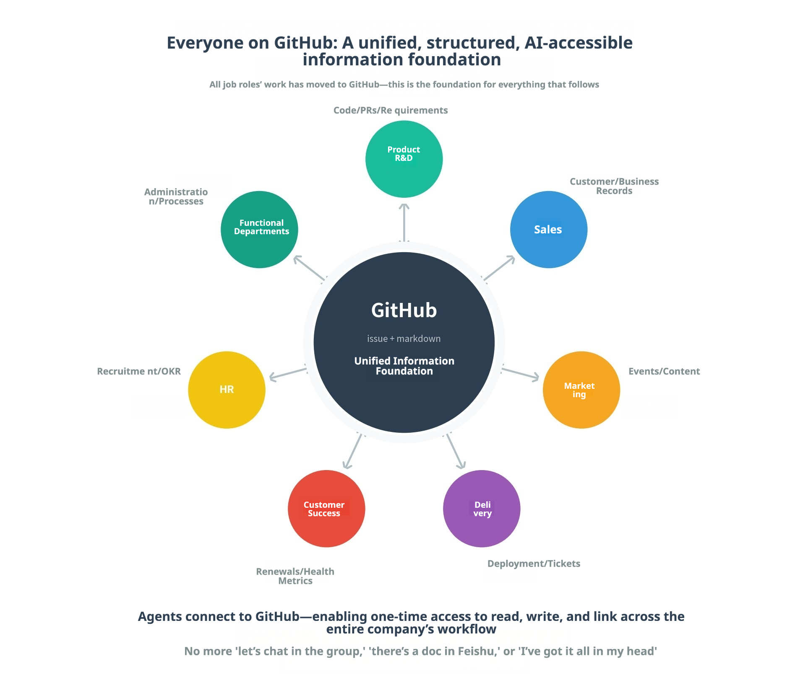

# Rewriting Organizational Source Code: How We're Becoming an AI-Native Company


After publishing the previous two articles in this series, we received a great deal of feedback from peers and customers. It became clear that many people are deeply experiencing the same shifts we are. We are also seeing more and more companies begin adjusting their organizational models to adapt to this new wave of productivity transformation. At the same time, layoffs across Silicon Valley continue to intensify. Just a few days ago, Meta announced another 8,000 layoffs alongside the reassignment of 7,000 employees, which has further amplified the sense of urgency: organizational transformation toward AI-Native has shifted from being an option to becoming a must.



The earlier essays focused on the theory. Now we can talk about our own organizational diagnosis and practical actions-how we have been gradually transforming ourselves toward an AI-Native organization over the past several months. 

## MatrixOrigin's Operating Model

To turn gains in individual productivity into gains in organizational productivity, we first need to understand what kind of organization MatrixOrigin actually is, and how it operates.

MatrixOrigin is a B2B software company-that is, we build and sell software for enterprises. More specifically, we focus on data infrastructure software. Our customers are primarily medium-sized and large enterprises, and our role is to help them store and utilize data effectively so they can build AI applications on top of it.

The B2B software operates very differently from consumer businesses or B2C applications. Its characteristics include:

1. **A Small Number of Customers, High Contract Value, and Long Decision Cycles**. Our company may only serve dozens or hundreds of customers each year, but each contract can range from hundreds of thousands to tens of millions of RMB. Winning or losing a single major customer can directly affect a company's quarterly performance. Customers don't buy B2B software the moment they see an advertisement. They first hear about our products, schedule discussions, watch demos, run POCs, go through internal approval processes, and then sign contracts. This process can take anywhere from a few months to one or two years.

2. **Signing the Contract Is Not the End, It Is the Beginning**. The software needs to be deployed into the customer environment, training needs to be provided, stability needs to be guaranteed, and support teams needs to respond when problems occur. If this service layer fails, the customer simply will not renew next year, and the entire investment from the previous year will lost. No customer will automatically discover, trust, or successfully adopt your product. Marketing, sales, delivery, and customer success are all indispensable parts of the chain.



The operation of the company can therefore be understood as a pipeline: marketing brings in potential customers, sales converts them into signed contracts, engineering turns contracts into usable software, delivery deploys the software into customer environments, and customer success ensures customers continue using and expanding their adoption of the product. If any link in this chain fails to operate smoothly, all the effort before it becomes less effective.

When we say AI delivers tenfold productivity gains, we are usually talking about individuals-engineering producing more code, product managers generating more PRDs. But for a company, individual productivity only becomes organizational productivity when those gains propagate through every link in this operational chain. This is the core question we must answer during organizational transformation.

## The Core Bottlenecks of Organizational Efficiency

As discussed in the previous two articles, we clearly felt that improvements in individual efficiency were not translating into overall organizational efficiency. Everyone felt faster individually, yet the company's key metrics-signed deals, revenue, active customers, renewal rates-were not accelerating in parallel. Why?

Because a company's total output is never simply "the sum of everyone's individual work." It is the sum of how effectively every collaboration point connects together. Although there are only around seventy employees in our company, the whole structure was designed according to the traditional hierarchical pyramid model. Horizontally, we have departments such as sales, marketing, finance, HR, product, engineering, and delivery. Vertically, we have layers of frontline employees, department heads, and senior leadership.

With clear division of labor, clear responsibilities, easy management, this structure was the default organizational model before AI arising. But its cost is that collaboration speed is constrained across three following dimensions:



**First: Bottlenecks in Horizontal Information Flow**

The moment departments exist, information barriers naturally emerge between them. People are inherently more aligned with their own teams, partly due to human nature and partly because of differences in expertise and domain knowledge.

Here is a real example: a marketing colleague wants to write content about a new product feature. To do so, they need to understand what progress the product has made over the past three months, which customers are using it, and how those customers are using it. But marketing don't understand code or interpret commit histories, and no one proactively delivers customer feedback to them. Eventually they have to ask the product manager: "Could you summarize the recent product updates for me?" The PM then spends a full day meeting with engineering and sales, digging through records, and finally sends back a two-page summary. By the time marketing receives the information, the opportunity may already be stale.

**Second: Bottlenecks in Vertical Information Flow**

Vertically, the pyramid-shaped hierarchy creates information bottlenecks as well. Conversations between managers and subordinates are never fully symmetrical. Part of this comes from positional hierarchy, but another part comes from differences in informational context. Employees see the details of the task directly in front of them, while employers sees the broader picture across dozens of parallel issues. Each side is operating with a fundamentally different perspective, and naturally there is an information gap between them.

Another real example: when handling customer support, an engineer notices that several customers in a row are reporting instability in a particular feature under large data loads. The engineer feels this might be important and casually mentions it in a group chat. But their manager is busy with other priorities and misses the signal. Two weeks later, sales starts complaining in another group: "Customers keep asking about this issue and I have no answer." Another week later, the signal finally reaches the product owner, becoming a high-priority item requiring scheduling. This is the bottom-up problem. The same thing happens top-down. Strategic decisions made at the company level become diluted and repeatedly reinterpreted through each management layer until execution at the frontline no longer resembles the original intent.


**Third: Bottlenecks in Information Flow Across Time**

Horizontal and vertical bottlenecks are spatial. There is also a temporal bottleneck. Every organization generates enormous amounts of information every day-customer conversations, architecture discussions, postmortems, cross-team collaboration insights. Yet most of this information is never properly retained. After some time, it simply disappears. Organizational knowledge exists only in the minds of the people currently present. When people leave, the knowledge leaves with them. When people become overloaded, the knowledge becomes inaccessible.

This is why there is such a dramatic difference between long-tenured employees and new hires. Senior employees know the edge cases of the product, the true state of customers, which pitfalls have already been encountered, and which paths have already failed. Much of this knowledge lives only in their heads and has never been transformed into organizational assets. New employees can only learn by asking questions, and they can only ask those same few senior employees. Seniors are constantly interrupted by repetitive questions, slowing their own work, while newcomers require a long time before becoming independent.

Taken together, these three bottlenecks reveal a common pattern: every point of collaboration still relies on the human brain for information "consumption."



Human brains read, think, judge, communicate, remember. We do have systems like WeCom (Enterprise WeChat), GitHub, Slack and so on, but these systems merely store and transmit information. They do not understand it. Humans still do all the interpretation.

Before AI occurring, this was unavoidable. Only humans possessed cross-context understanding, integrated reasoning, and long-term memory. That is why organizational design for the past several decades has fundamentally revolved around one question: "how do we distribute the scarce bandwidth of human cognition in a more structured way?" Hierarchical management, matrix reporting, agile workflows, OKRs, weekly and monthly reports-all of them exist to keep collaboration barely functional despite the limited bandwidth of the human brain.

But AI changes this for the first time. Information flowing horizontally, vertically, and across time no longer needs to pass through human brains at every step.

Returning to the operational chain described earlier: if individual productivity improvements are to truly propagate across every stage, these three bottlenecks must be broken. Otherwise, no matter how fast individuals become, the organization as a whole will remain slow.


## Our Practical Measures

So how exactly do we break these three bottlenecks?

Broadly speaking, we summarize our approach into six major measures. These represent the highest-level and most foundational actions we have taken. If AI-Native transformation is like building a house, these six measures form the construction process from the ground up.



### 1. Move the entire company onto GitHub, turning work into a structured and transparent system.

The first step, the foundation for everything else, is moving everyone's work onto GitHub, regardless of role. Not just engineering and product teams, but marketing, sales, and AI teams as well.

Why GitHub? Returning to the core insight from the previous section: collaboration bottlenecks exist because information understanding, judgment, association, memory, and retrieval still depend on human cognition. For AI to take over these operations, information must exist in a format AI can read, invoke, connect, and continuously track. We realized that product and engineering collaboration already represented the company's largest collaboration system-and it had always been built on GitHub, whose strength is that it structures all product and engineering work into tasks and relationships. The format of GitHub Issues and Markdown includes plain text, structured formatting, hyperlinks, statuses, timelines, and a complete API ecosystem, so that any agent can read and write information, making it extremely easy for Agents to align, summarize, move information, and automate workflows. GitHub therefore became the ideal carrier for the company's Context assets.

Some concrete implementation details:

* Every project, every customer, and every cross-functional collaboration gets its own GitHub repo or set of issues. When sales engages a customer, a customer issue gets created. When marketing runs a campaign, a campaign issue gets created. When HR starts hiring, a recruiting issue gets created. When product teams discuss requirements, a requirements issue gets created.
* Important discussions and decisions must happen inside issue comments. "Discussing it in a chat group" no longer counts. If a discussion is not in an Issue, it effectively never happened.
* All documentation uses Markdown. PRDs, SOPs, retrospectives, customer proposals all become Markdown and store in repos.
* Task states such as open / in progress / done, and customer stages such as potential / negotiating / signed, are represented through labels and project boards.

Once this foundation was established, both humans and AI finally shared a unified, structured, queryable information layer. Every subsequent measure builds on top of this. Employees can now use Agents to know what is happening across the company, identify bottlenecks, and discover work relevant to them.



### 2. Connect Agents to GitHub and WeCom to Eliminate Information Silos

Beyond GitHub, another major information source inside the company is WeCom, where instant communication happens, meetings occur, temporary discussions accumulate, organizational structures are maintained, and external customer interactions take place. GitHub contains "structured work outputs." WeCom contains "unstructured real-time collaboration and organizational state." Only together do they represent the company's true information landscape.

Connecting Agent only to GitHub is insufficient. GitHub may reveal the progress of an issue, but not the conversations related to that issue happening inside WeCom. It may show project status, but not the colleagues related to this project or the collaborating relationships between them. If Agents are to truly understand what is happening inside the company, they must connect to both GitHub and WeCom simultaneously.

So we integrated WeCom into our Agent ecosystem, allowing Agent to read, write, transport, and correlate information across both systems.Some of the Agents are currently running include:

* **Information Routing Agent**: When an issue changes on GitHub, the Agent automatically pushes notifications to relevant people in WeCom; important discussions inside WeCom are automatically archived into corresponding GitHub issues; non-technical employees can even ask Agent to create issues directly for them.
* **Summary Agent**: Every week, the Agent aggregates issue status changes and related discussions to generate project status reports automatically.
* **Reminder Agent**: If an Issue remains inactive too long, the Agent pings the owner; if a customer has not been contacted in two weeks, the Agent reminds sales; if a cross-functional dependency becomes blocked, the Agent automatically escalates it.

To be honest, integrating WeCom is extremely difficult. Their openness, API completeness, and friendliness toward external Agent are nowhere near the level of GitHub. Even today there is no fully functional CLI capable of accessing all required data. We have only partially connected the system so far, and there are still many problems those are difficult to solve.

But one immediate outcome has already been transformative: we eliminated weekly reports. Work progress already exists in GitHub in real time. Discussions and decisions already happen in WeCom in real time. Agent continuously aggregate and distribute summaries automatically.

### 3. Turn Work Experience into Skills, and Let Agent Automates Tasks

Once data and workflows became transparent, we realized something important: A huge amount of company work actually follows repeatable patterns. For example, employees retrieve data from system A and system B, combine them together and analyze them, or summarize the result according to predefined rules. Previously, humans performed these tasks because no other system could access cross-platform data, understand semantics, and perform contextual reasoning. Now that data is connected and Agent can read it, if we can encode human "patterns" into reusable skills, Agent can execute entire workflows automatically. So we began identifying repeatable work, extracting the patterns behind it, converting them into skills, and letting Agents take over entire tasks rather than isolated steps.

Two real examples:

**Example One: CI Bug Analysis and Repair**. Previously, when CI pipelines failed, engineers had to inspect logs, locate problematic code, determine whether the issue was a true bug or an environment problem, and then assign the issue manually. Now this workflow has largely been replaced by skill-powered Agents:

* **Bug Localization Agent**: Once CI fails, the Agent automatically starts analyzing logs while cross-referencing the code and commit history, identifies the most likely problematic code region, determines which PR introduced it, evaluates affected modules, and creates a structured bug issue directly in GitHub, clearly documenting the analysis results, related commits, and impact scope.
* **Fix Strategy Agent**: Once the bug issue exists, another Agent analyzes logs and source code further, proposing fixes. Sometimes,it directly generates patches, or suggests multiple candidate solutions.

**Example Two: Automatically Updating User Documentation After Code Releases**. Previously, documentation updates after releases were tedious and error-prone. APIs changed, parameters were added, behaviors evolved, yet documentation frequently lagged behind product releases. Now this workflow is automated. Agent monitor release events, automatically diff changes against previous versions, identify which documentation sections require updates, and directly generate PRs into the documentation repository. Another review Agent approves straightforward updates automatically, only escalating to humans when ambiguity becomes significant. 

All of these examples follow the same pattern: Identify the task, extract the workflow pattern, convert the pattern into a skill, chain Agents together to execute the entire workflow.

### 4. From Assigned Tasks to Self-Directed Ownership

The first three measures established infrastructure and AI capabilities. With both of them, human working styles have to evolve as well.

Previously, a typical employee's day looked like this: the employee was assigned a task and completed it, then waited for another assignment to complete. There was little need to understand the broader picture. Managers assembled the puzzle; individuals focused only on their segment. This model worked efficiently in the past.

But once information becomes transparent, everyone can see the bigger picture. Every project, customer, and requirement exists openly on GitHub. Any employee willing to spend time exploring can understand what the company is doing, where bottlenecks exist, and where opportunities are emerging. In this environment, waiting passively for assignments becomes wasteful.

To support this transition, we built a system called Turbo, a bounty-hunter framework for engineering teams. After Turbo launched, the engineering team's operating model fundamentally changed. Every task now exists in the GitHub issue and Turbo label without verbal assignments or manually distributed work by managers. Anyone-leaders, PMs, product owners, engineerings - can identify work that needs to create an issue and be done with Turbo label.



After that, turbo automatically evaluates complexity and assigns a point value. Small bugs receive low scores; medium features receive moderate scores; complex modules receive high scores. Then, the issue enters a public "bounty pool", which is visible to all engineerings. Engineerings proactively select work based on their interests, capabilities, and current workload. Once completed, AI automatically evaluates completion quality, including code quality, test coverage, and whether the original problem was truly solved, and then awards points accordingly.

This model created several structural shifts:

* Managers no longer spend energy deciding who should handle which task.
* Engineerings no longer passively wait for assignments; they actively browse the bounty pool.
* Cross-module work becomes organically self-organized instead of manager-coordinated.
* Performance evaluation becomes significantly more objective because contributions are transparently measurable in real time.

### 5. Operate End-to-End Like an OPC or FDE

Changing how people work affects the entire organization. For years we emphasized the importance of end-to-end ownership culturally, but previously this was constrained by limitations in human bandwidth and siloed departmental information. Projects therefore passed through five or six different people, each highly specialized, but every handoff introduced friction and loss.

After implementing the earlier measures, those constraints began loosening. Information bottlenecks weakened: GitHub structured work, Agent connected systems, and employees could finally see complete project, customer, and product contexts. Capability bandwidth also expanded. Engineerings, with purely technical backgrounds, could use AI to understand business contexts, communicate with customers, and create solutions. Salespeople, with purely business backgrounds, could use AI to understand technical product details, design POCs, and handle basic deployments. AI broadened individual capability ranges enough that one person could effectively perform work previously requiring four or five separate roles.

We therefore began encouraging a far more aggressive model: One person owning an entire project end-to-end. He or she can lead the entire lifecycle, from initial customer contact, requirement analysis, POC design, solution development, deployment, to ongoing operations. This person does not necessarily have to come from sales or engineering. Anyone, regardless of role, can become the OPC for a project as long as they have the initiative, the right capabilities, and AI can help fill the gaps in their skill set.

This model is fundamentally similar to the industry trend FDEs (Forward-Deployed Engineers), widely adopted by companies like Anthropic and OpenAI. An FDE serves as the complete interface for a customer relationship. All requests, delivery, and coordination flow through a single owner. Our goal is for everyone to eventually become capable of operating this way.

Interestingly, the earliest people to succeed under this model were younger engineers and product managers. They lacked decades of experience, but they possessed strong initiative and fewer self-imposed boundaries. Once the system opened up, they proactively engaged customers directly and closed entire project loops themselves. According to this situation, we observed two profound changes:

* First, **Response speed increased dramatically**. Many customer issues were resolved immediately at the frontline instead of being escalated through multiple internal layers.
* Second, **Ownership became fundamentally different**. Someone who owns only sales has no incentive to care whether the customer succeeds after signing. But an end-to-end owner bears responsibility for long-term customer success, which changes behavior from the very beginning.


### 6. Deeply Use Our Own Products and Build a Productivity Flywheel

We are a software company. In software, the highest current expression of AI-Native operation is clearly Anthropic. Recent public talks from the Anthropic team demonstrated what happens when a company deeply uses its own AI products internally. Claude Code product lead Cat Wu and founding engineer Boris Cherny both mentioned publicly that **roughly 90% of Anthropic's production code is now generated by Claude Code itself.** One particularly striking example: they reportedly built Claude Cowork-a completely new product-in only ten days using Claude.

How is that level of iteration speed possible? The answer is not merely the model itself. It is the result of **rewriting the organization using its own tools**, creating a self-reinforcing acceleration loop: employees use the product more intensely than anyone else, discover problems fastest, test new versions fastest, and push adoption even further.

Our own business focuses on data infrastructure and Agent infrastructure. In other words, we build the exact systems companies need for AI-Native transformation. This leads to an unavoidable truth: **If we cannot use our own products to transform ourselves into an AI-Native organization, why should anyone believe our products can help others do it**?


So "deeply using our own products" is not a cultural slogan for us, but existential to the product.

At MatrixOrigin, all the infrastructure described earlier are used entirely in our own products. The GitHub data layer, Agent orchestration between WeCom and GitHub, skill management and Turbo operations all run on our own Astra and MOI platforms. Agent memory is powered by our own Memoria system. As we use the products, we discover weaknesses. As we discover weaknesses, we improve the products. As the products improve, organizational efficiency increases again.

This is the **productivity flywheel** we are building:

```
The organization uses the product → Product weaknesses and gaps are exposed through usage → The product improves → Improved products further enhance organizational efficiency → The organization can adopt the product in even deeper scenarios
```



Once this flywheel begins spinning, it accelerates itself increasingly fast. Externally, our products are hardened under the most demanding environment possible. They are used by us everyday over one year so that our customers can easily apply with lower cost. Internally, AI continuously reshapes the organization, raising our efficiency ceiling higher and higher. This is the most important work with the longest term we are doing as an AI-Native company.

## The Pitfalls We Encountered

The experimentation during the past several months has been far from smooth. Facing this comprehensive transformation, our failures have been almost as numerous as our successes. Some of the most common pitfalls include:

* **Human Adaptation Challenges**. While the first five measures appear logical on paper, employees adapt at very different speeds. Some people quickly embraced Turbo, AI collaboration, and end-to-end ownership. Others struggled to shift away from waiting for assigned work, resisted proactively exploring GitHub, or were unwilling to invest time learning to work with AI. We tried training, mentorship, and allowing room for experimentation. But after several months, some people still could not adapt. At that point, we had to communicate honestly. We were not gentle about it-but organizational momentum cannot move forward if parts of the team remain trapped in the old model.

* **System Integration Limitations**. As discussed earlier, WeCom remain difficult to integrate. The openness of WeCom and the maturity of their APIs are nowhere near the level of GitHub. Many critical capabilities, such as reliably reading group messages, correlating information across groups, or retrieving organizational data by role, are either missing, unstable, or only accessible through extremely convoluted APIs. We've already built a number of workarounds, but in many scenarios Agents still operate with an incomplete view of the organization. This is not something we can realistically solve in the short term. We simply have to keep grinding through it.

* **Limitations of Agents Themselves**. Agents are nowhere near as intelligent as people imagine. They misunderstand intent, retrieve incorrect data, generate code that appears correct but contains bugs, and occasionally derail entirely during long task chains. Every Agent requires extensive tuning before deployment and continuous monitoring afterward. Building a demo is easy. Building Agent reliable enough for production environments is ten times harder.
* **Customer-side Organizational Bottlenecks**. We can redesign our own organization, but we cannot redesign our customers' organizations. A workflow that takes ten minutes internally may take weeks externally because customers still depend on slow approval chains, limited availability, or infrastructure constraints. In many cases, customer-side bottlenecks are even more severe than our own internal bottlenecks-and we still do not have a strong solution for that.

## How Far Are We From the Ideal?

Honestly: still very far away. In the ideal AI-Native organization, information flows automatically across horizontal, vertical, and temporal dimensions. Every employee uses AI to operate end-to-end. Agents handle information transfer and preliminary decision-making at every collaboration point. Organizations remain small while producing output vastly disproportionate to their size.

Where are we today? The GitHub foundation is mostly complete. Some Agent workflows are functioning, but coverage remains limited. Truly capable OPC-style operators are still rare. Enterprise messaging integration remains incomplete. Engineering and product teams are far more AI-Native than other departments. Agent reliability still requires human fallback mechanisms. On the customer collaboration side, we have barely begun solving the hardest problems.

We have probably completed only around 30% of the journey. But we are now extremely confident about the direction itself. The challenge ahead is no longer discovering the path-it is steadily walking the path we can already see.

## Conclusion

Returning to the statement from the first article: When tools offer tenfold productivity gains, standing still is equivalent to falling behind. Everything we have done over the past several months has been driven by that reality.

We are far from perfect. Many people are still not fully operating in the new model. Many workflows are not yet managed by Agents. Many bottlenecks remain unresolved. But we do not intend to stop. We will continue deepening our use of GitHub, improving Agent reliability, cultivating more end-to-end operators, and accelerating the flywheel further.

If there is one profound realization we gained through this process, it is this: AI-Native is not a fixed destination. It is the capability to continuously rewrite yourself. Models change. Tools change. Customer demands change. A company's survival in the AI era will not depend on what it looks like today. It will depend on whether it can continuously rewrite itself. Our greatest achievement during this journey is not what we have already become. It is that we have gained the ability to rewrite ourselves.

The road ahead is still very long. We will continue sharing practical experiences across teams, workflows, and organizational scenarios as we move forward.
