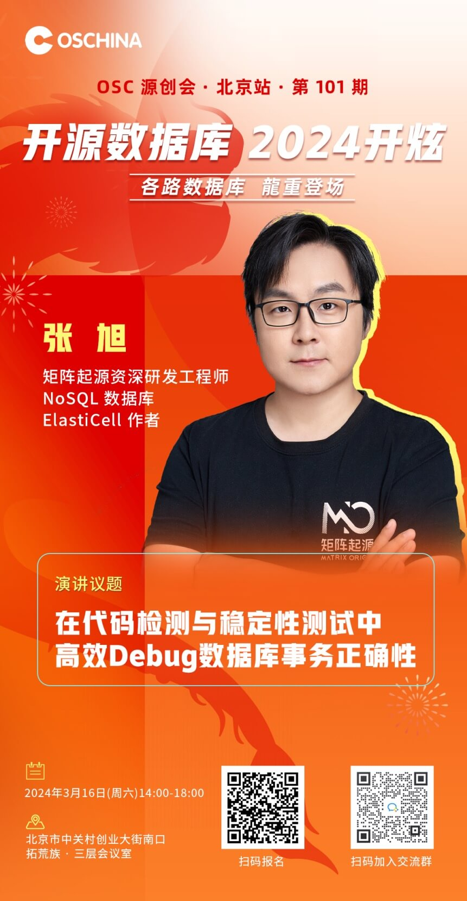

## Speaker Introduction

Zhang Xu is a Senior R&D Engineer at MatrixOrigin. He is the author of [Manba](https://github.com/fagongzi/manba), China's first open source API gateway written in Go; the author of [ElastiCell](https://github.com/deepfabric/elasticell), an elastic, strongly consistent NoSQL database; and a major contributor to [MatrixCube](https://github.com/matrixorigin/matrixcube), a distributed storage framework. He has deep research and practical experience in distributed systems. He is currently responsible for the distributed architecture of MatrixOne, including development work on cluster management, distributed transactions, and distributed consensus logs.

## Talk Topic

Efficiently Debugging Database Transaction Correctness in Code Inspection and Stability Testing

## Talk Outline

- Introduction to the MatrixOne architecture
- Transaction correctness-related bugs and current response plans
- The journey of redemption: how to efficiently debug database transaction correctness

## Event Information

- Date: March 16, 2024
- Time: 16:40-17:15
- Venue: 3rd Floor Conference Room, Tuo Huang Zu, South Entrance of Zhongguancun Entrepreneurship Street, Beijing

### About OSChina Open Source Meetup

OSC Open Source Meetup is a technology salon hosted by the OSChina community (oschina.net), focusing on open source and innovation. The meetup has always upheld the principles of "freedom, openness, and sharing," gathering high-quality technical resources and industry cases, engaging with outstanding technology leaders, and bringing developers the latest open source technologies, frontier technical perspectives, and practical implementation experience.
