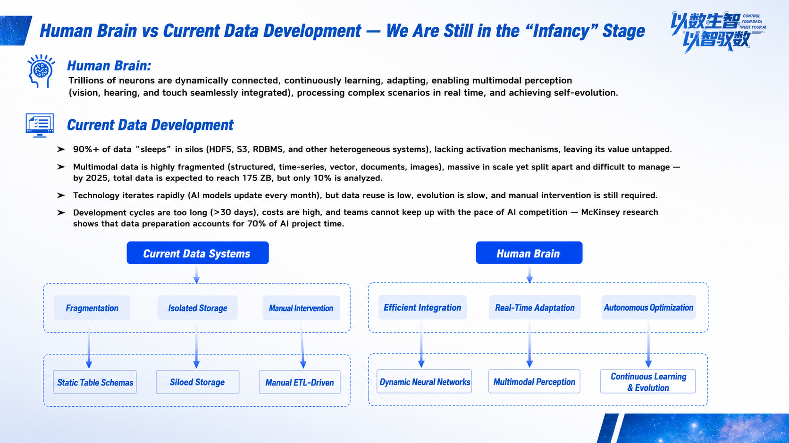
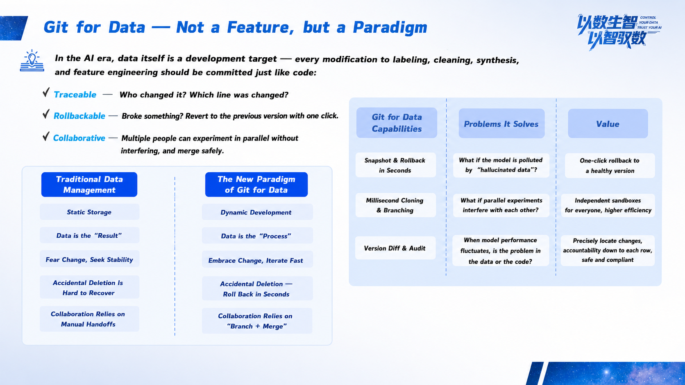

The speed of AI development is creating an increasingly sharp contradiction with enterprise data management capabilities.

On one hand, algorithms and models evolve rapidly, with new breakthroughs reshaping expectations every day. On the other hand, enterprise data remains in poor condition: more than 90% of data sleeps in different systems, with messy formats and varied forms, forming one data silo after another.

This fragmentation leaves AI developers in the awkward position of having everything except the ingredients they need. According to McKinsey research, **data preparation accounts for more than 70% of AI project time**. While algorithms iterate on a daily basis, data preparation cycles often take weeks or even months. When expensive compute resources and algorithm experts are waiting for data to be ready, the high costs and long cycles are enough to drag down any AI project.

Enterprise AI implementation is being slowed by outdated data infrastructure. The key to breaking through may require us to rethink a fundamental question: in the AI era, how should we manage data?

### Software Development Has Walked This Path for 20 Years; Data Engineering May Have Just Begun

Consider software development. Before Git was created, developers relied on manual code backups and collaboration through documents and verbal agreements. Versions were chaotic, conflicts were frequent, and efficiency was low. Git introduced versions, branches, merges, and other mechanisms, bringing software development into an engineering era that is standardized, traceable, and collaborative.

> By contrast, today's data management looks very much like software development before Git:

- **Data changes feel like opening a blind box**: data pollution caused by an accidental operation or model hallucination is often difficult to trace to its source, and rollback is even harder.

- **Version management relies on copy and paste**: to run experiments, data engineers have to copy TB-scale datasets, creating high storage costs and extremely chaotic version management.

- **Team collaboration relies on tacit understanding**: multiple teams run experiments in parallel, interfering with each other as a normal occurrence. Project management depends heavily on human conventions rather than engineering process guarantees.

If data is the "code" of the AI era, what we need most is a "Git" for data.

### Git for Data: Bringing Data Management into a New Engineering Paradigm

We believe Git for Data should not be just a feature, but a new data management paradigm. It applies mature version control ideas from software engineering to the full lifecycle of data management. Its core lies in three capabilities:

**1. Instant Snapshots and Second-Level Rollback**

The reason the traditional "delete the database and run" scenario is disastrous is that once data is modified, it is difficult to restore. Under the Git for Data paradigm, every data change can be recorded. With instant snapshots, we can create an archive point for any version of data.

When model hallucinations pollute data, or an incorrect cleaning operation causes model performance to degrade, we no longer need to spend days investigating and repairing. Instead, we can **roll back to the previous healthy version with one click, completing the entire process in milliseconds or seconds**. Data security no longer depends only on permission control; it also gains the confidence of recoverability at any time.

**2. Millisecond-Level Cloning and Branching**

In the past, parallel experimentation was almost a luxury for ordinary algorithm teams. Cloning a TB-scale dataset was both time-consuming and storage-intensive.

Now, with branching and cloning, we can create an independent and isolated development environment **within milliseconds for every data engineer and every algorithm experiment**. These branches share underlying storage and generate almost no additional cost. Team members can freely clean, annotate, and test models on their own branches without interfering with each other. After an experiment succeeds, modifications can be merged back into the main branch. The entire process is clear, efficient, and safe.

**3. Version Comparison and Auditing**

Through version comparison, we can clearly see all differences between two data versions or two branches and **precisely locate which row and which field caused a problem**. Every data change, including who changed what and when, is traceable. This not only eliminates black boxes in data governance, but also provides a solid foundation for AI application security and compliance.

### MatrixOne: The Solid Foundation Behind the New Paradigm

Implementing the Git for Data paradigm requires a powerful enough data engine. If data remains scattered across different systems, any upper-layer management concept will remain theoretical. MatrixOne, a cloud-native hyper-converged database, is a data engine rebuilt for the AI era. Through a unified architecture, it solves the storage and processing challenges of multimodal data and fundamentally breaks down data silos. Enterprises no longer need to stitch together multiple systems to handle different data types, and they can also avoid the data consistency problems caused by complex ETL and cross-system synchronization.

On this unified foundation, the innovative Git for Data paradigm can be implemented, shortening the cycle of data preparation, model training, and result validation from weeks to days.

When data management becomes as rigorous, efficient, and traceable as code management, the bottleneck in AI development is truly broken. We believe this is not merely an upgrade of the data platform, but a key step for enterprises to build their own core AI competitiveness.

The concept sounds powerful, but how does it work in practice? In a recent technical sharing session, our kernel R&D lead gave an in-depth live demonstration showing how to use branches for parallel data annotation, compare version differences, and use conflict resolution and merging to achieve efficient and safe data collaboration.

Watch the full content and demo:

https://www.bilibili.com/video/BV1v9WvziED2/?spm_id_from=333.1387.homepage.video_card.click

**About MatrixOrigin**

MatrixOrigin is a leading provider of data intelligence (Data & AI) platform technologies and services. Its core team comes from well-known technology companies in China and around the world, with broad industry and international perspectives. MatrixOrigin's core product, MatrixOne Intelligence, is an enterprise-oriented AI-native multimodal data intelligence platform. By using artificial intelligence technologies, including large models, and an innovative hyper-converged data foundation, it helps enterprises uniformly manage and govern multimodal data and transform private-domain data into AI-Ready data assets. It has already served leading enterprises across industries, including StoneCastle, China Mobile IoT, Amway Nutrilite, Jiangxi Copper, and XCMG Hanyun, helping enterprises transform and upgrade from informatization and digitization to intelligence.
