Author | MatrixOrigin

Planning | InfoQ Li Dongmei

When your AI Agent suddenly clears a core database, or quietly injects false data, traditional data recovery methods are often time-consuming and labor-intensive. Git for Data changes this by making recovery as simple as rolling back a code commit.

```sql
DATA-CTL RESET DATABASE `agent1_db` TO TIMESTAMP 2025-08-01 12:00:00.123456;
```

Data instantly rolls back to a specified point in time. This is the power of Git for Data: version control, fast rollback, branching, merging, and change tracking. It is a new data management paradigm for the AI era.

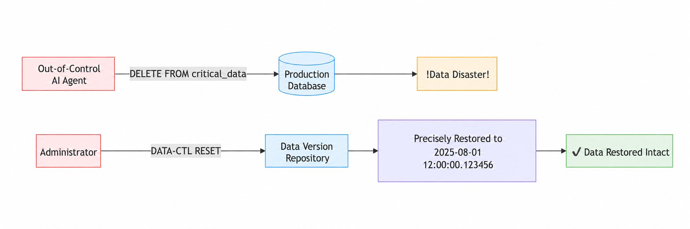

When traditional databases process transactional businesses, such as transaction records and call detail records, data management mainly focuses on TP (transaction processing) and AP (analytical processing) scenarios. In these scenarios, the need for data version management is relatively weak, and data safety is usually ensured through regular backup and recovery or snapshots. However, as AI R&D deepens, data itself has become an R&D object. From data annotation and feature engineering to synthetic data generation, R&D teams need to version, branch, and collaboratively develop data just like code. This data R&D workflow naturally fits a Git-style version management paradigm.

## Why AI Needs Git for Data

### Fighting Hallucinations

**Hallucination prevention:** Improve data quality through data version control and reduce hallucinations.

**Repairing hallucination consequences:** Hallucinations are difficult to avoid. With data version control, data can quickly roll back to a specified version to repair the consequences. The erroneous version can then be used for source tracing analysis to prevent similar errors from happening again.

### Data Lineage

**Version control:** A version control system clearly traces changes in each version, supports collaboration across time and teams, and ensures that update histories for data, models, and code are traceable.

**Data consistency:** Data at each stage can be marked as a specific version, enabling seamless connection between data from different stages, avoiding data drift, and ensuring result reproducibility.

**Lineage efficiency:** When problems occur, teams can quickly locate data issues as if tracing code history, improving error repair efficiency.

**Research and development efficiency:** Change history helps teams understand the impact of each step, improving research and development efficiency.

### Data Sharing

**Team collaboration:** Version control makes team collaboration easier, such as multiple people developing a model together or collaboratively developing a dataset.

**Improving data quality:** Data version iteration makes it easier to improve data quality through data cleaning, data augmentation, and similar processes. Anyone with code iteration experience knows how important code iteration is for improving code quality.

### Data Security

**Branch isolation:** Branch isolation makes data isolation easier.

**Permission control:** Version control makes permission control easier, such as allowing specific users to access only specific versions of data.

**Auditing:** Changes are traceable and auditable.

### Testing and Release

**Production debugging:** Trace back to the problematic data version, create a debugging data branch, and debug in a fully isolated sandbox environment.

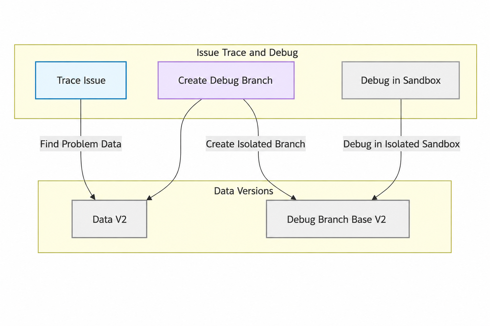

**CI testing:** Easily create and manage multiple test environments, each with its own data version. Parallel testing across multiple versions is also supported.

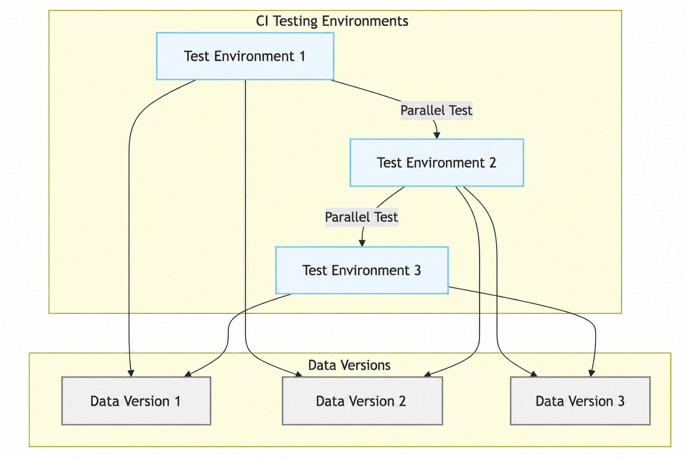

**Business release and rollback:** Data versions and code versions can be released synchronously. When problems occur, data can quickly roll back to a specified version.

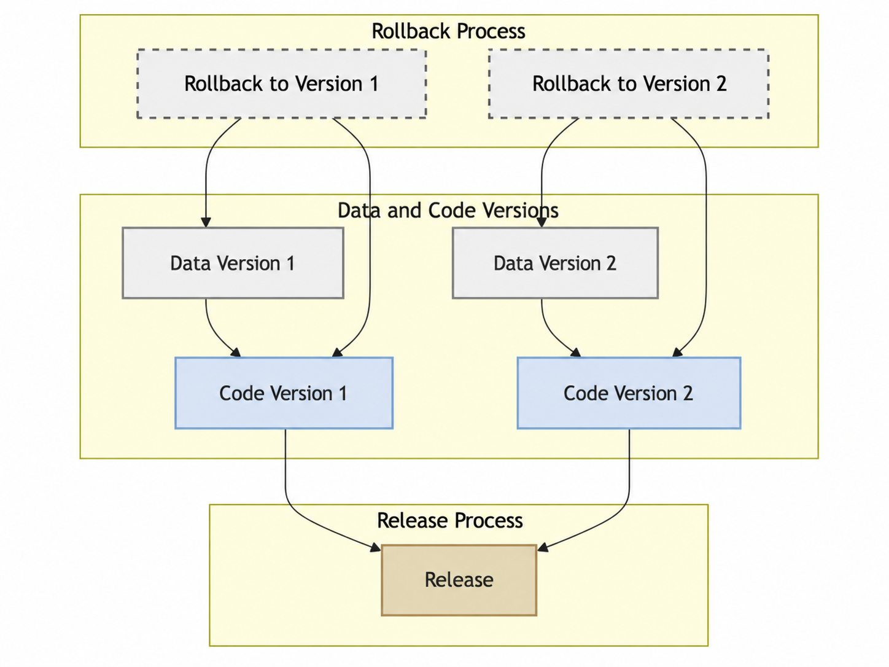

## How to Support Git for Data Capabilities

### Version Control

**Granularity control:** Rollback costs differ greatly across TABLE, DATABASE, TENANT, and CLUSTER levels. Finer-grained rollback costs less and has a smaller impact scope. For example, if an Agent only has write permission on a specific table, only that table needs to be rolled back.

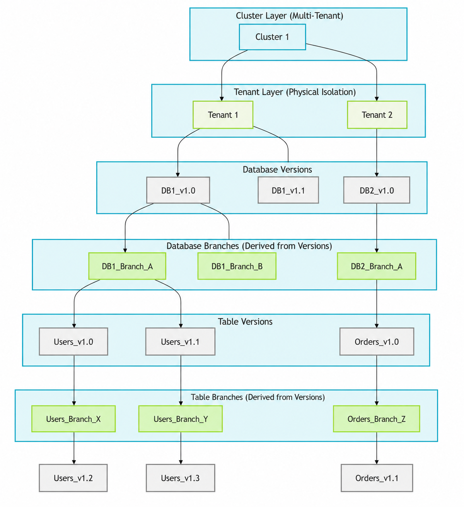

**Recovery window:** Because hallucinations are unpredictable, recovery windows are difficult to determine. Generally, the longer the recovery window, the longer or more expensive recovery becomes. To repair hallucination consequences, the system needs to support a very long recovery window while also supporting second-level recovery. Costs must be controlled while meeting both requirements.

**Data snapshot:** Data snapshots are supported, making data version management easier.

```sql
CREATE SNAPSHOT db1_ss_v1 FOR DATABASE db1;
CREATE SNAPSHOT db1_t1_ss_v1 FOR TABLE db1.t1;
```

**Version comparison (Diff):** Version comparison is supported, allowing quick location of differences and helping users understand the impact of each step. It is also the foundation for data lineage.

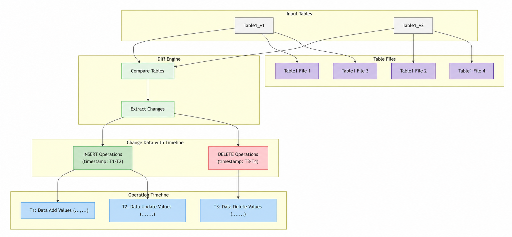

**Data clone:** Data cloning is supported and easy to perform. Clone cost must be low, and latency must be extremely small.

```sql
CREATE TABLE `db1.table2` CLONE FROM `db1.table1`;
```

**Data branch:** Data branching is supported, making data isolation easier. Creating and deleting branches must be low-cost and low-latency.

```sql
CREATE TABLE `db1.table2` BRANCH `branch1` FROM TABLE `db1.table1` {SNAPSHOT = 'V2'};
INSERT INTO `db1.table2` (col1, col2) VALUES (1, 'a');
```

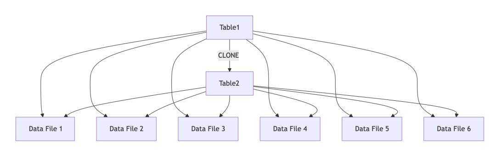

**Data rollback (Reset):** Data rollback is supported for fast and convenient rollback.

```sql
RESTORE DATABASE `db1` FROM SNAPSHOT `db1_ss_v1`;
DATA-CTL RESET DATABASE `db1` TO TIMESTAMP 2025-08-01 12:00:00.123456;
DATA-CTL RESET TABLE `db1.table1` TO TIMESTAMP 2025-08-01 12:00:00.123456;
DATA-CTL RESET BRANCH `db1_dev` TO TIMESTAMP 2025-08-01 12:00:00.123456;
```

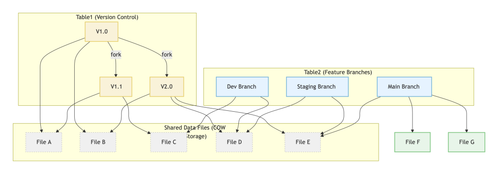

**Branch rebase:** Branch rebase is supported for fast branch merging, based on Diff capabilities.

**Data merge:** Data merge is supported for fast data merging, based on Diff capabilities.

### Permission Control

**Fine-grained permission control:** Fine-grained permission control is supported. For example, a specific Agent user can be allowed to operate only on a specific version of a TABLE or DATABASE.

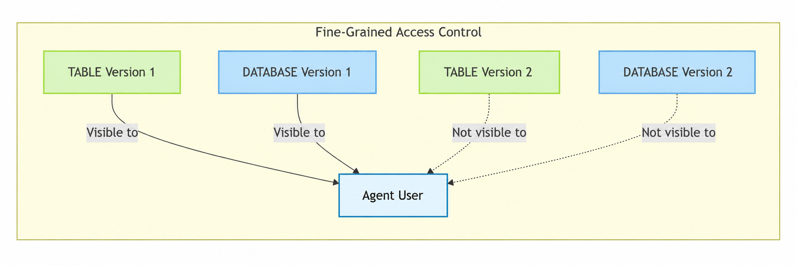

**Cross-tenant permission control:** Cross-tenant permission control is supported. For example, tenant `acc1` can share version `v1` of its `db1.table1` with tenant `acc2`. Tenant `acc2` can create a new branch or clone data based on version `v1` of `db1.table1` shared by tenant `acc1`.

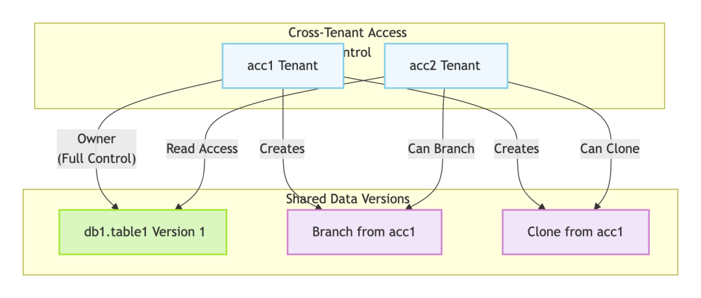

### Storage Optimization

**CLONE:** This is not redundant data copying, but data sharing. The cost is low and latency is extremely small.

```sql
-- Table `db1.table1` contains 100 GB of data
CREATE TABLE `db1.table2` CLONE FROM `db1.table1`;
-- CLONE latency is extremely small because data is shared and does not need to be copied.
-- Table `db1.table2` contains 100 GB of data, but actual storage usage is only 10 GB because it shares 10 GB of data from `db1.table1`.
```

**Data branch storage:** Child branches share main-version data and store only differential data. This depends on CLONE capability.

```sql
-- Table `db1.table1` contains 100 GB of data
CREATE TABLE `db1.table2` BRANCH `branch1` FROM TABLE `db1.table1` {SNAPSHOT = 'V2'};
-- Table `db1.table2` contains 100 GB of data, but actual storage usage is only 10 GB because it shares 10 GB of data from `db1.table1`.
-- BRANCH depends on `CLONE` at the underlying layer. Compared with `CLONE`, it adds `BRANCH` operation management to support branch management.
```

**Recovery window optimization:**

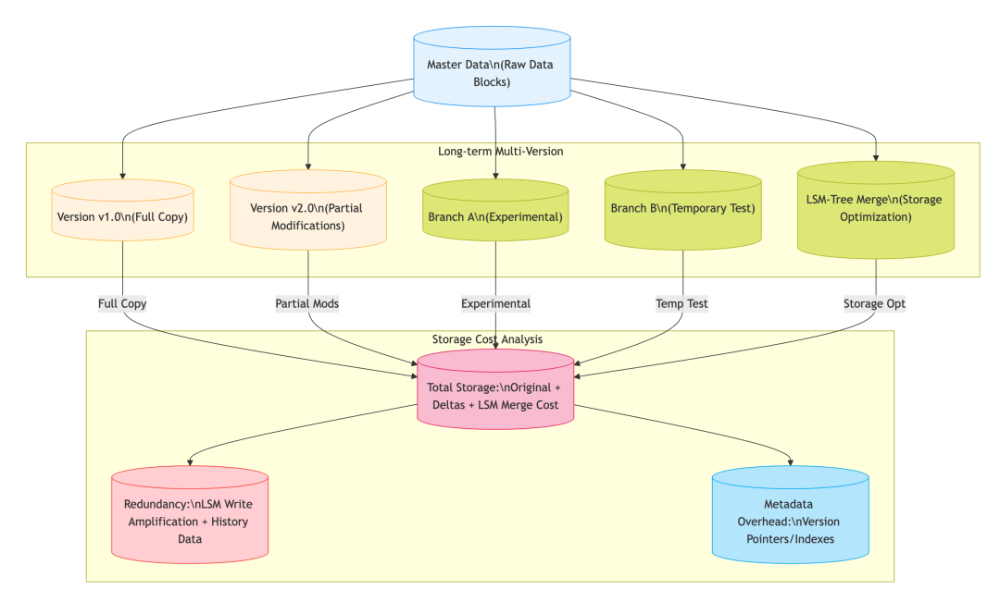

For LSM-Tree storage engines, supporting fast recovery with a long recovery window is a major challenge.

## MatrixOne: A Cloud-Native Hyper-Converged Database and the Best Choice for an AI Data Engine

MatrixOne is a cloud-native hyper-converged database built from scratch, designed to support modern data-intensive applications in cloud environments. It stores structured, semi-structured, and unstructured multimodal data and supports business systems, IoT applications, big data analytics, GenAI, and many other workloads. MatrixOne is compatible with MySQL syntax and protocols. Its hyper-converged nature allows enterprises to develop large and complex data intelligence applications as easily as using MySQL.


Based on a cloud-native architecture using containers and shared storage, MatrixOne provides flexible and agile capabilities such as rapid instance startup, automatic elastic scaling, fully pay-as-you-go billing, and millisecond-level data branching. It can provide unprecedented agility, cost-effectiveness, and manageability for the development, training, and iteration of AI Agent applications in the new era. By providing enterprise-grade high availability, comprehensive security, and auditing capabilities, MatrixOne has served leading enterprises across industries, including StoneCastle, China Mobile IoT, Amway Nutrilite, Jiangxi Copper, and XCMG Hanyun.

## Combining MatrixOne Database with Git for Data

MatrixOne already has core Git for Data capabilities, including:

- **Fast snapshot creation and deletion:** snapshots at CLUSTER, TENANT, DATABASE, and TABLE levels
- **Permission management for data versions:** permission control across various granularities and scopes
- **Custom data recovery windows:** custom recovery windows and second-level recovery for massive data
- **Fast, low-cost data cloning:** millisecond-level cloning for massive data and cross-tenant data cloning
- **Data sharing support:** cross-tenant data sharing
- **Version data Diff:** currently supports Diff for multiple versions of the same table within the recovery window

In the future, MatrixOne will continue enhancing the following capabilities to support the complete Git for Data feature set:

- **Data branch management:** like Git, support creating, deleting, switching, merging, and other operations for data branches
- **Complete data Diff capability**
- **Storage optimization:** as an LSM-Tree storage engine, reduce storage costs for long recovery windows
- **Feature integration:** provide a better product experience

## Conclusion

Git for Data represents a revolutionary data management paradigm. It organically combines declarative data management with the advanced concept of data as code, while introducing powerful Git-like version control capabilities. This innovative architecture fundamentally changes how data is managed, making it more flexible, controllable, and efficient.

This technical paradigm provides a new way to address complex data challenges in modern AI systems. It not only effectively protects data quality and security, but also significantly improves data consistency and development efficiency. Through Git for Data, data management makes a qualitative leap from static storage to dynamic governance, enabling data to achieve precise version tracing, efficient collaboration, instant rollback, and reliable recovery like code.

Looking ahead, adopting Git for Data will bring multiple forms of value. It not only optimizes data management workflows, but more importantly, lays a more efficient and precise foundation for research and applications in AI and big data. This shift means data management is no longer a technical bottleneck that constrains innovation, but becomes a key enabler of technological progress, providing solid support for digital transformation across industries.
