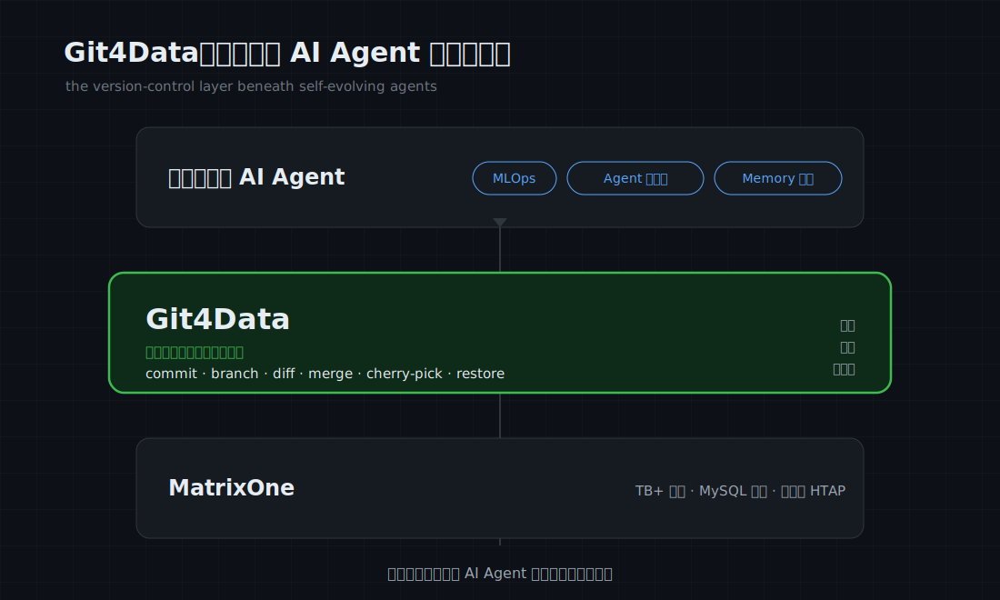
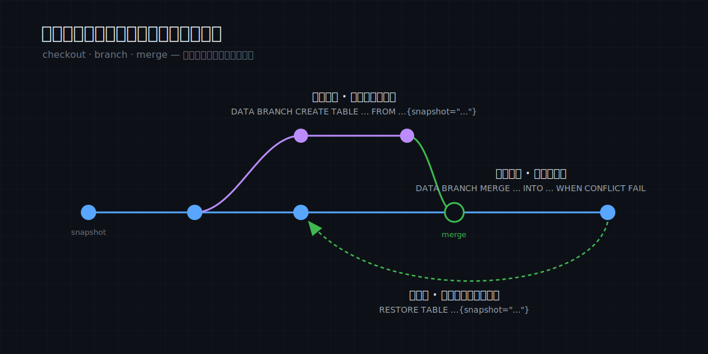
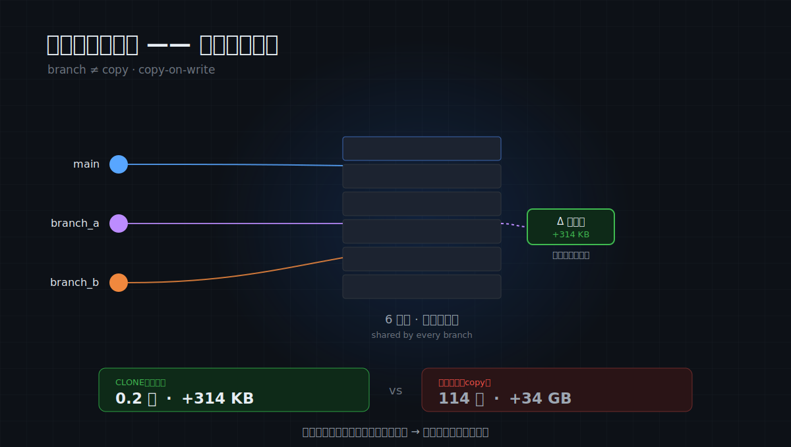

# MatrixOne Git4Data 技术详解（一）：海量数据的 Git 时刻

一年前，我们在自己的开发者大会上，发布了 MatrixOne 的一项重要能力：Git4Data, 让海量数据像代码一样，能被版本控制——可以 commit、branch、diff、merge、cherrypick。一键回到过去，无代价的创建分支，协作。

过去这大半年，我们看到它开始在多个场景上生根发芽，尤其是在 AI 相关的领域，它在MLOps，Agent 的自进化，Memory 的管理上面有了很多应用实践。我们看到 Git4Data 正在成为面向可自我进化的AI Agent的Data Infra的核心底层技术，所以我们将开启一个文章系列，来说透它的能力，原理，应用场景以及业务价值。


*Git4Data 处在 MatrixOne 与自我进化 AI Agent 之间——它们赖以运转的版本控制层。*


## 一件被低估的事

过去三十年，软件生产力经历了一场爆炸。我们习惯把它归功于更好的语言、更快的硬件、云、框架。但其实还有一个容易被大家被忽视的，是版本控制。
严格说，版本控制不是 Git 发明的——它有一条谱系：先有 CVS，再有 SVN，最后才是 Git。但前面那些，给你的主要是
“历史”和“撤销”：你能回到过去某一版，却很难轻松地岔出一条分支、改完再合并回来。在 SVN 里开分支、做合并，是一件
昂贵又痛苦的事，于是大多数团队能不开就不开。真正的跃迁发生在 Git：它把开分支和合并的成本，降到了几乎为零。
正是这一步，把版本控制从“一个存放历史的地方”，变成了“一种大规模并行协作的媒介”。

于是写软件这件事，从一门孤独、危险、串行的手艺，变成了一种可以工业化、规模化、而且无所畏惧的协作。说到底，
它做成了两件事：把“犯错的成本”降到接近零——错了就回退；把“并行的成本”降到接近零——各开各的分支，最后合并。
注意这里的次序：第一件，SVN 时代就大致有了；而真正点燃协作大爆炸的，是第二件。

正因为犯错可逆、并行不互踩，今天才会有上亿素未谋面的开发者，跨时区、跨公司，并发地共建同一套代码——Linux、
整个开源世界，都建立在这个前提之上。在 Git 之前，这是不可想象的。

这里藏着一条“底层规律”：一个领域，一旦同时拿到“廉价的可逆”和“廉价的并行”，就会发生一次相变——从手艺
变成工业，从个人变成协作，从少数变成规模。代码经历过这次相变。而软件工程师面对的另一半——数据——还没有。


## 数据，还活在 Git 之前——因为它太大了

软件工程师每天面对两样东西：代码，和数据。在 AI 时代，数据的分量甚至已经盖过了代码。但这两样东西的工作方式，
停在两个完全不同的年代。

代码这一半，二十年前就被 Git 接管了。数据这一半，至今还活在更早以前：改生产数据前，先手动复制一张备份表，
然后祈祷；出了事，翻出六小时前的备份、半夜叫醒 DBA；几个人要改同一份数据，靠“你先别动、我改完叫你”。

说得更准一点：今天的数据库，大多还停在“SVN 时代”。 备份、时间点恢复（PITR）这些，给了你“历史”和“撤销”
——能把库退回过去某一刻；但它们给不了你廉价的分支与合并：你没法轻松地从“昨天下午三点那个状态”岔出一条活的、
能写的分支，在上面做实验，再把成果合并回主线。它们是数据库的 SVN，不是数据库的 Git。

数据为什么一直没拿到这个原语？不是没人想做，而是它太大了。Git 那套办法，是把整个文件读进内存来做 diff 和
merge——文件小，没问题；可数据动辄几亿行、上 TB，“读进内存”在这个尺度上直接失效。于是过去十五年，“一切皆可
as-code”——基础设施、配置、流水线、策略——几乎征服了整个技术栈，唯独漏掉了最大、也最重要的一块：海量的
数据本身。它成了版本控制这套纪律之外，最后的化外之地。


## 真正难的，是在海量上还便宜

填上这块空缺，数据就拿到了代码二十年前就拿到的三样东西：一扇任意门——出了事，一条 SQL 回到过去的任意一刻；
一个多元宇宙——拿真实生产数据岔出一条平行分支，跑危险改动、做实验，主线毫发无伤，不要了直接丢；一块
协作画布——一群人各开分支并行改，改完看 diff、合并、冲突自动裁决，就是你天天在 GitHub 上走的 PR 流程，
只不过改的是数据。


*任意门、多元宇宙、协作画布——分支、合并、回退，用 git 的提交图画出来，只不过对象是表。*

这些动作，本身都不新。新的是：它们终于能在一个扛得住生产的数据库里，对海量数据、以接近零的代价发生。
MatrixOne 把它们做成了普通 SQL：

```sql
CREATE SNAPSHOT before_update FOR TABLE db1 users;   -- 存档，相当于 git commit
UPDATE users SET status = 'inactive';                -- 手滑，忘了 WHERE
RESTORE TABLE db1.users{snapshot="before_update"};   -- 回去，相当于 git reset --hard
```

> 注：本文 SQL 语法基于 **MatrixOne 4.0** 版本。

它之所以便宜到让你愿意随手就用，靠的和 Git 是同一个把戏：开分支不复制数据，只记一个指向现有数据的指针。所以
——给一张 6 亿行的表开一个完整分支，0.2 秒，多占 314 KB。不是优化得好，是它压根没搬数据，所以开销与
数据有多大无关。


*开分支只记一个指针，不复制数据——所以克隆 6 亿行只要 0.2 秒、314 KB，而不是 114 秒、34 GB。*

这正是关键：难的从来不是版本控制本身，而是在海量数据上还能让它廉价。 在一张表只有几万行时，怎么做都行；
在几亿行、上 TB 时，还能让快照、克隆、行级 diff 和 merge 都是秒级、近乎零成本——这才是过去没人迈过去的那道坎。
Git4Data 之于数据库的备份，正是当年 Git 之于 SVN 的那一跃：从“能回到过去”，到“能在海量数据上廉价地岔出
无数条平行的现在、再合并回来”。


## Git4Data 对现在整个行业的价值

一个诚实的问题：数据没有 Git，也凑合了三十年，为什么偏偏现在要紧？

因为生产和编辑数据的，正在从人，变成 AI。
过去，数据由少数小心的人、缓慢地改。今天，海量的数据由成群的、持续运转的、会犯错的 agent 在生成和修改。而
agent 的三个本质特征——自主、会犯错、需要并行探索——恰恰就是当年 Git 被发明出来、为管理人类开发者而要解决的
那三件事。

一个没有版本控制的 agent，只有两个结局：要么鲁莽，不可逆地乱改；要么瘫痪，什么都不敢动。当数据的修改者从“人”
变成“机器群”，规模和频率都上一个数量级，branch / merge / rollback 对数据，就从“一个利于复现的好功能”，升级成了
“这件事能安全成立的唯一前提”。


所以，让海量数据可版本化，不只是补上一笔三十年的历史欠账。它是 AI 时代数据基础设施的前置条件：智能体要
安全地、可回溯地、能协作地操作数据，数据本身就必须先是可版本化的。

## 总结

Git 用三十年证明了一件事：当你给一个领域装上“廉价的可逆”和“廉价的并行”，它不会线性变好，而会加速的指数级上升。代码经历了这个相变，结果是整个开源世界和我们今天所知的软件工业。

现在轮到数据，而且是海量的数据。这一次，踩下油门的不只是人，还有 AI。

接下来，我们的系列文章会把MatrixOne彻底打开，讲清楚它在底层是怎么把 TB 级数据的
版本做到豪秒级的：快照、克隆、行级 diff 与 merge 的实现原理；再之后，我们再看看这些git原语是如何用在数据运维、模型训练、agent 进化、memory 管理的场景上的。
