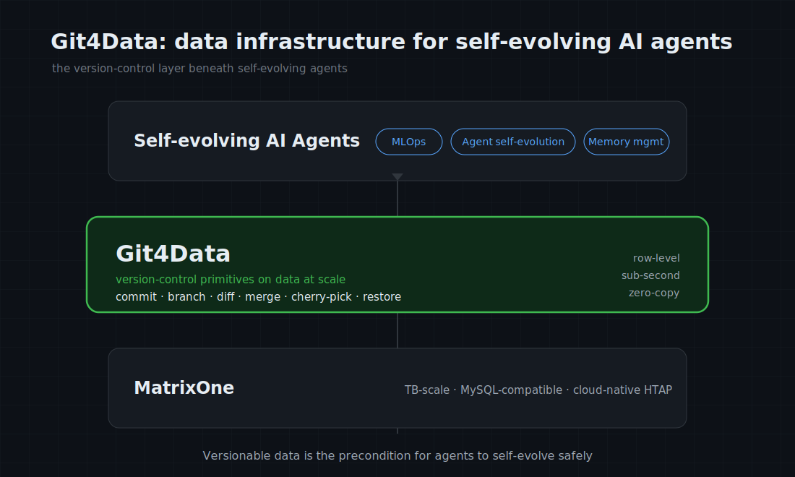
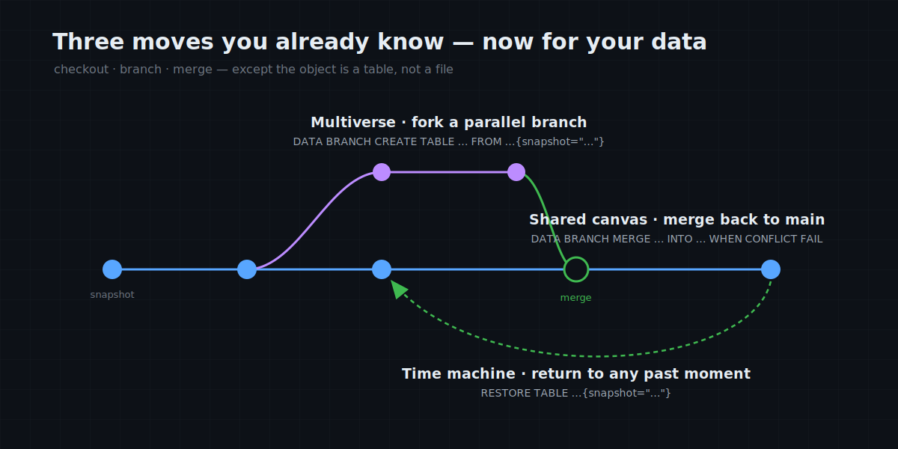
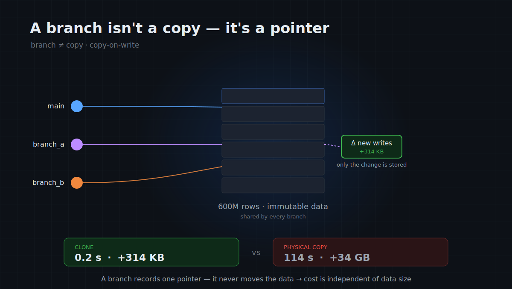

# MatrixOne Git4Data Deep Dive (Part 1): The Git Moment for Data at Scale

A year ago, at our own developer conference, we shipped one of MatrixOne's most important capabilities: **Git4Data** — version control for data at scale, the same way Git does it for code. You can `commit`, `branch`, `diff`, `merge`, `cherry-pick`. Return to any past state with one command. Spin up a branch at zero cost. Collaborate.

Over the past half-year, we've watched it take root across a range of scenarios — and most strikingly, in AI. It's showing up in real practice across **MLOps, agent self-evolution, and memory management**. We've come to see Git4Data turning into a core piece of data infrastructure for **self-evolving AI agents**. So we're kicking off a series of articles to lay it out in full: the capability, the mechanics, the use cases, and the business value.


*Git4Data sits between MatrixOne and self-evolving AI agents — the version-control layer they run on.*

## An underrated fact

Over the last thirty years, software productivity has exploded. We tend to credit better languages, faster hardware, the cloud, frameworks. But there's one cause that's easy to overlook: **version control.**

Strictly speaking, Git didn't invent version control — there's a lineage: first CVS, then SVN, and finally Git. But the earlier ones mostly gave you *history* and *undo*: you could return to a past revision, but branching off and merging back was hard. In SVN, creating a branch and merging it was expensive and painful, so most teams avoided it whenever they could. The real leap came with Git: **it drove the cost of branching and merging down to nearly zero.** That single step turned version control from "a place to store history" into "a medium for large-scale parallel collaboration."

And so writing software went from a lonely, dangerous, serial craft into a kind of collaboration that could be industrialized, scaled, and — crucially — done *without fear*. At bottom, it did just two things: it drove the **cost of mistakes** to near zero (something breaks, you roll back), and it drove the **cost of parallelism** to near zero (everyone works on their own branch, then merges). Note the order: the first was roughly there in the SVN era; what actually ignited the collaboration explosion was the second.

Because mistakes became reversible and parallel work stopped colliding, today hundreds of millions of developers who've never met can build the same codebase concurrently, across time zones and companies. Linux, the entire open-source universe — all of it rests on that premise. Before Git, this was unimaginable.

Hidden in here is something close to a law: **the moment a field gets both "cheap reversibility" and "cheap parallelism," it undergoes a phase transition** — from craft to industry, from individual to collaborative, from a handful of people to massive scale. Code went through that transition. The other half of what an engineer deals with — the data — has not.

## Data still lives before Git — because it's too big

Software engineers face two things every day: code, and data. In the AI era, data has arguably overtaken code in importance. Yet the way we work with these two things is stuck in two entirely different eras.

Code got handed to Git twenty years ago. Data still lives somewhere earlier: before touching production data, you manually copy a backup table and pray; when something breaks, you dig out a six-hour-old backup and wake up the DBA; when several people need to change the same data, you coordinate by saying "don't touch it, I'll ping you when I'm done."

To put it more precisely: **most databases today are still in the "SVN era."** Backups and point-in-time recovery (PITR) give you *history* and *undo* — you can roll the database back to some past moment. But they can't give you cheap branching and merging: you can't easily fork a live, writable branch off "the state as of 3 p.m. yesterday," experiment on it, and merge the results back into the mainline. They're the SVN of databases, not the Git of databases.

Why has data never gotten this primitive? Not because nobody wanted it — because **it's too big.** Git's approach is to load whole files into memory to compute a diff or a merge. For small files, fine; but data routinely runs to hundreds of millions of rows and terabytes, and "load it into memory" simply breaks at that scale. So over the past fifteen years, while "everything as code" — infrastructure, configuration, pipelines, policy — conquered nearly the entire stack, it left out the biggest and most important piece of all: **the massive data itself.** Data became the last holdout, the one substrate outside the discipline of version control.

## The hard part is staying cheap at scale

Fill that gap, and data gets the three things code got twenty years ago. **A time machine** — one SQL statement and you're back at any past moment. **A multiverse** — fork a parallel branch off real production data, run risky changes and experiments on it while the mainline stays untouched, and throw it away if you don't want it. **A shared canvas** — a whole team branches and edits in parallel, then reviews the diff, merges, and lets conflicts be resolved automatically: exactly the pull-request workflow you run every day on GitHub, except what's changing is data.


*A time machine, a multiverse, a shared canvas — branch, merge, and restore, in Git's own graph, now for your tables.*

None of these actions is new. What's new is that they can now happen inside a database that holds up in production, **over massive data, at near-zero cost.** MatrixOne turns them into ordinary SQL:

```sql
CREATE SNAPSHOT before_update FOR TABLE db1 users;   -- save a checkpoint, like git commit
UPDATE users SET status = 'inactive';                -- oops, forgot the WHERE
RESTORE TABLE db1.users{snapshot="before_update"};   -- go back, like git reset --hard
```

> The SQL syntax in this article follows **MatrixOne 4.0**.

The reason it's cheap enough that you'll actually reach for it is the very same trick Git uses: a branch doesn't copy the data, it just records a pointer to the existing data. So cloning a **600-million-row** table takes **0.2 seconds and 314 KB of extra storage**. That isn't clever optimization — it simply never moved the data, which is why the cost is independent of how big the data is.


*A branch records a pointer to the existing data, not a copy of it — which is why cloning 600M rows costs 0.2s and 314KB instead of 114s and 34GB.*

And that's the whole point: **the hard part was never version control itself — it's keeping it cheap on massive data.** When a table has a few thousand rows, anything works; making snapshot, clone, and row-level diff and merge all run in seconds and at near-zero cost when the table has hundreds of millions of rows and spans terabytes — that's the barrier nobody had crossed. **Git4Data is to database backups what Git was to SVN:** going from "you can return to the past" to "you can cheaply fork countless parallel presents off massive data, and merge them back."

## Why Git4Data matters to the industry right now

An honest question: data got by without Git for thirty years — why does it suddenly matter now?

Because the thing producing and editing data is shifting from humans to AI.

In the past, data was changed by a few careful people, slowly. Today, vast amounts of data are generated and modified by swarms of agents that run continuously and make mistakes. And an agent's three defining traits — autonomy, fallibility, and the need to explore in parallel — are exactly the three problems Git was invented to solve for human developers.

An agent without version control has only two outcomes: reckless (changing things irreversibly) or paralyzed (afraid to touch anything). When the editor of data shifts from "people" to "swarms of machines," with scale and frequency up an order of magnitude, `branch` / `merge` / `rollback` for data goes from "a nice feature for reproducibility" to "the only way this can be made safe at all."

So making massive data versionable isn't merely settling a thirty-year-old historical debt. It's a **precondition** for AI-era data infrastructure: for an agent to operate on data safely, reproducibly, and collaboratively, the data itself must first be versionable.

## In closing

Git spent thirty years proving one thing: when you give a field "cheap reversibility" and "cheap parallelism," it doesn't improve linearly — it bends upward, exponentially. Code went through that transition, and the result was the entire open-source world and modern software as we know it.

Now it's data's turn — and massive data at that. This time, the foot on the accelerator isn't only human; it's AI too.

In the articles ahead, this series will open MatrixOne all the way up: how, underneath, it versions TB-scale data in a fraction of a second — the implementation behind snapshot, clone, and row-level diff and merge. After that, we'll look at how these Git primitives play out across real scenarios: data operations, model training, agent self-evolution, and memory management.

It's open source and MySQL-compatible, and it's here today: `github.com/matrixorigin/matrixone`.

The Git moment for data at scale has already begun.
