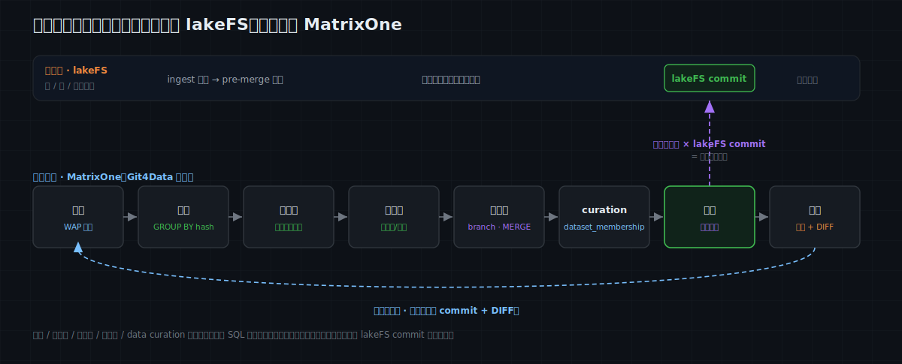

# MatrixOne Git4Data 技术详解（十）·深度学习篇：多模态训练数据怎么管——lakeFS 管字节，MatrixOne 管元数据

前面九篇一直在结构化数据上打转：[前四篇](https://github.com/matrixorigin/matrixorigin-blog/blob/main/matrixorigin/git4data-part1-data-at-scale-zh/index.md)讲清了 Git4Data 是什么、怎么用、和其他方案[分别站在哪一层](https://github.com/matrixorigin/matrixorigin-blog/blob/main/matrixorigin/git4data-part4-landscape-zh/index.md)；第五到第七篇是数据运维；第八、九篇进入 AI 训练，用一个风控模型走通了[全流程总图](https://github.com/matrixorigin/matrixorigin-blog/blob/main/matrixorigin/git4data-part8-ml-lifecycle-zh/index.md)和[数据集发布与泄漏](https://github.com/matrixorigin/matrixorigin-blog/blob/main/matrixorigin/git4data-part9-dataset-release-zh/index.md)。

从这一篇开始，我们转向 **深度学习** 的数据。先厘清一点：深度学习是一个很大的范畴，并不等同于多模态——只处理文本的网络、只看图像的 CNN，都是深度学习。但它和传统机器学习在**数据形态**上有一道共同的分水岭：深度学习往往直接在**大规模非结构化数据**（图像、音频、视频、原始文本）上训练，而多模态模型更是把好几种模态混在一起。

**本篇聚焦的，就是这一类多模态 / 非结构化媒体训练数据该怎么管**——它是深度学习里最典型、也最难版本化的数据形态，而不是深度学习的全部。数据从"表里的行"变成"一堆字节 + 一张巨大的元数据表"，版本管理也得换一套打法。

> 这一篇是**多模态训练数据管理**的开篇总览（深度学习数据这条线的第一篇），结构上对应第八篇之于传统机器学习：先把整张图摊开——多模态训练数据从进入到发布，每一步的真实难题是什么，字节该交给谁、元数据该交给谁。文中元数据侧的 SQL 全部在 MatrixOne `4.1.0` 上实测，可跑版本见 [matrixorigin/git4data-tutorial](https://github.com/matrixorigin/git4data-tutorial) 的 `10-multimodal-lakefs/`。

---

## 深度学习的数据，首先是一个“字节”问题

传统机器学习的一条样本，是表里的一行：几十个结构化字段，天然适合放进数据库，也天然能被 snapshot、diff、merge。

多模态数据不是这样。一条样本的主体是**一堆字节**——一张几 MB 的图、一段几十 MB 的音频、一个上百 MB 的视频片段。整个数据集动辄上千万条、TB 到 PB。你没法、也不该把这些字节塞进数据库。

但请注意一件事：**字节本身不进数据库，关于字节的一切却高度结构化。** 每条样本都有：它存在哪（对象路径）、它的内容 hash、它的感知 hash、配对的文本（caption）、标签、来自哪个源、什么 license、宽高、质量分、属于训练还是测试、被哪个模型版本用过……这些是几千万行、还在不断增删改的结构化记录——正是最需要行级版本语义的地方。

于是这类数据的版本管理，天然分成**两个世界**：

- **字节世界**：图像 / 音频 / 视频本体。放对象存储或 lakeFS，版本化的是“对象 / 文件的版本”。
- **元数据世界（metadata）**：谁指向哪个对象、caption、label、split、各种 hash、来源、license…… 一张（或几张）巨大的结构化表，版本化的是“行”。

一份真正可复现的多模态训练集，是这样一个乘积：

```text
可复现训练集 = 一个确定的元数据版本（metadata snapshot）
             × 一组确定的字节版本（lakeFS commit）
```

两个世界必须**一起被钉住、并且保持一致**：只钉元数据，字节可能已被覆盖；只钉字节，你不知道当时哪些样本、什么标签、怎么切分。这正是 lakeFS（管字节）和 MatrixOne 的 Git4Data 能力（管元数据）各司其职、再组合起来的地方。

---

## 一张总图：多模态数据全流程，字节归 lakeFS，元数据归 MatrixOne

先给结论。多模态训练数据的整个生命周期，可以清晰地劈成“字节侧”和“元数据侧”两条线，各自版本化、在发布时对齐。



| 环节 | 真实问题 | 字节侧（lakeFS） | 元数据侧（MatrixOne Git4Data） |
|---|---|---|---|
| 数据接入 | 新一批媒体质量未知，不能污染主集 | 落到一条 ingest 分支 | 元数据行进入元数据分支，审计通过再 `MERGE` |
| 去重 | 上千万文件里有精确重复和感知近重复 | 对象照存 | `content_hash` / `phash` 上 `GROUP BY`，纯 SQL 找重复 |
| 去污染 | 训练集混进了评测 / 基准样本 | —— | 元数据对基准 hash 表做反连接，`DELETE` 掉重合 |
| 多模态对齐 | 图、文、框、标签必须成对一致 | 对象存在性由 lakeFS 保证 | 元数据上查断裂的对（缺 caption / 缺对象指针） |
| 重标注 / 重描述 | 标签、caption、安全分要迭代 | 字节不变 | 每人一条分支、`MERGE` 冲突、`DIFF` 出改动 |
| 策展 | 按质量 / 安全 / license 筛出干净子集 | —— | 版本化的 `dataset_membership` 子集 |
| 数据集发布 | 冻结“这次训练到底用了哪些字节的哪一版” | 一个 lakeFS commit | 一个库级元数据快照，并把 commit 记进注册表 |
| 训练与评估 | 模型要能反查到确切的数据现场 | commit 定位字节 | 快照 + 注册表建立 `model → metadata snapshot × lakeFS commit × code/env` 血缘 |
| 监控与再训练 | 新数据累积，何时触发下一轮 | 新 commit | 元数据上跑分布统计 + 跨版本 `DIFF` |

一句话分工：

> **lakeFS 让字节可回溯、可回滚；MatrixOne 的 Git4Data 能力让元数据可查询、可行级比对、可原子发布。两者用“元数据快照里记一个 lakeFS commit”对齐成一个可复现的整体。**

下面用一个完整案例把这张图跑通。

---

## 贯穿全文的案例：给一个多模态模型准备图文训练数据

假设我们在为一个图文模型（可以想成一个内容理解 / 审核用的多模态模型）准备训练数据。数据从多个源爬取和采购而来，需要去重、去污染、对齐、重标注，最后策展出一个干净、可复现的训练集。

元数据就是一张 `samples` 表——**注意它不存字节，只存指向字节的指针，加上所有你真正要查询的东西**：

```sql
CREATE TABLE samples (
    sample_id     BIGINT PRIMARY KEY,
    modality      VARCHAR(16),
    object_uri    VARCHAR(512),   -- lakeFS 路径（一个指针，不是字节本身）
    object_commit VARCHAR(64),    -- 钉住这些字节的 lakeFS commit
    content_hash  VARCHAR(64),    -- 字节的 sha256（精确去重键）
    phash         VARCHAR(64),    -- 感知哈希（近重复键）
    caption       TEXT,           -- 配对的文本（第二个模态）
    label         VARCHAR(16),
    source        VARCHAR(32),    -- 来源 / 溯源
    license       VARCHAR(16),
    quality       DOUBLE,
    ingest_batch  VARCHAR(32)
);
```

一份可复现的训练记录，至少要绑定这些：

```text
run = 元数据快照（metadata snapshot）
    + lakeFS commit（字节版本）
    + 策展与切分规则
    + 预处理 / tokenizer 版本
    + 代码 commit + 运行镜像 digest
    + 超参数与随机种子
    + 模型产物 URI 与 hash
    + 评估指标
```

**元数据快照负责“哪些样本、什么标签、怎么切”，lakeFS commit 负责“字节是哪一版”——缺一个，这份记录都复现不出来。**

### 第一站：数据接入——WAP 跨两个世界

星期一，上游送来 5000 条新图文对。字节被推到 lakeFS 的一条 ingest 分支；与此同时，元数据行进入一条元数据分支，先不碰主集：

```sql
DATA BRANCH CREATE TABLE samples_stage FROM samples;
INSERT INTO samples_stage SELECT ... FROM ...;   -- 新批次只进 staging 分支

-- 元数据侧门禁：指针完整？caption 齐不齐？license 明不明？
SELECT
  SUM(CASE WHEN object_uri IS NULL OR object_commit IS NULL THEN 1 ELSE 0 END) AS missing_pointer,
  SUM(CASE WHEN caption IS NULL THEN 1 ELSE 0 END)                             AS missing_caption,
  SUM(CASE WHEN license = 'unknown' THEN 1 ELSE 0 END)                         AS unknown_license
FROM samples_stage WHERE ingest_batch = '2026w30';
--   实测 missing_pointer 0 / missing_caption 250 / unknown_license 1000

DATA BRANCH DIFF samples_stage AGAINST samples OUTPUT SUMMARY;   -- 实测 INSERTED 5000
DATA BRANCH MERGE samples_stage INTO samples;                    -- 全部通过才发布
```

字节侧的对应动作，是 lakeFS 的 pre-merge hook 在那条 ingest 分支上做字节层校验（文件能否解码、尺寸、safety 预扫），通过了才把 lakeFS 分支合并。**两侧各自审计、各自原子合并，谁没过谁不进主线。**

### 第二站：去重——精确 + 感知，纯 SQL，不碰一个字节

上千万文件里，一定有精确重复（同一张图在不同 URL 被爬了两次）和感知近重复（裁剪、压缩、加水印后的“同一张图”）。这两类都能在元数据上用 SQL 查出来，**完全不需要把字节拉回来**：

```sql
-- 精确重复：一个 content_hash 被多条样本共用
SELECT COUNT(*) AS exact_dup_groups FROM (
  SELECT content_hash FROM samples GROUP BY content_hash HAVING COUNT(*) > 1
) t;   -- 实测 3000 组

-- 感知近重复（不是精确重复）：同一个 phash，却有不止一个 content_hash
SELECT COUNT(*) AS near_dup_groups FROM (
  SELECT phash FROM samples GROUP BY phash HAVING COUNT(DISTINCT content_hash) > 1
) t;   -- 实测 2000 组
```

字节侧的 hash 是离线算好、写进元数据的；一旦进了元数据，去重就是几条 `GROUP BY` 的事，而不是一场跨 PB 对象存储的扫描。

### 第三站：去污染——把评测集从训练集里挖出去

这是深度学习、尤其基础模型的命门：**一张测试 / 基准图漏进训练集，下游每一个指标都会虚高**。做法是拿元数据去和已知的评测集 hash 做反连接：

```sql
-- 训练样本里，有多少和评测基准（按内容）重合？
SELECT COUNT(*) AS contaminated FROM samples s
WHERE EXISTS (SELECT 1 FROM eval_hashes e WHERE e.content_hash = s.content_hash);
--   实测 1000（500 个基准原件 + 它们各自被重新爬到的镜像）
```

注意这里 exact 命中 500，但连同镜像一起是 1000——**去污染必须覆盖重复与近重复**，否则漏网的镜像照样把基准喂进了训练。这也是为什么去重和去污染要放在同一张元数据上一起做。

### 第四站：多模态对齐——图文必须是成对一致的一个单元

多模态样本的特殊之处：一条样本是**多个模态的组合**（图 + caption + 可能还有框、标签），它们必须作为一个整体保持一致。最常见的破损是“对断了”——有图没文、有文没图、或指针指向一个已不存在的对象：

```sql
-- 断裂的图文对：有图无 caption
SELECT COUNT(*) AS unaligned_pairs FROM samples WHERE caption IS NULL;
--   实测 550
```

这里要点明一个字节世界和元数据世界之间的陷阱：**删掉 lakeFS 里的一个对象，不会自动删掉元数据里指向它的行；反过来删元数据行，也不会删字节。** 两个世界各自版本化，但对齐要靠纪律——发布前用 SQL 查一遍孤儿指针和断裂对，是最省事的对齐门禁。

### 第五站：重标注与重描述——元数据在演进，字节纹丝不动

标签会被修正，caption 会被重写，安全分会被重新评估——这些都只动**元数据**，字节完全不变。于是又回到了[第六篇](https://github.com/matrixorigin/matrixorigin-blog/blob/main/matrixorigin/git4data-part6-collaborative-dev-zh/index.md)那套并行协作：每人一条分支，冲突自动暴露，改动有据可查。

```sql
DATA BRANCH CREATE TABLE samples_review FROM samples;
UPDATE samples_review SET label = 'nsfw'
WHERE sample_id BETWEEN 1000 AND 1999 AND label = 'safe';
DATA BRANCH DIFF samples_review AGAINST samples OUTPUT SUMMARY;   -- 实测 UPDATED 980
DATA BRANCH MERGE samples_review INTO samples;
```

重标注一轮到底改了什么，是一条 `DIFF` 说清的事；而这一切都没有产生任何一份字节副本。

### 第六站：策展与发布——元数据快照 × lakeFS commit

到了发布时刻。先在元数据上策展出一个干净子集：去掉精确重复（每个 `content_hash` 只留 `sample_id` 最小的一条）、去掉评测重合、去掉断裂对、只保留 license 明确的样本，并写入切分：

```sql
INSERT INTO dataset_membership
SELECT s.sample_id,
       CASE WHEN s.sample_id % 10 < 8 THEN 'train'
            WHEN s.sample_id % 10 = 8 THEN 'valid' ELSE 'test' END,
       'curate:v1 dedup+decontam+aligned+licensed'
FROM samples s
WHERE s.caption IS NOT NULL
  AND s.license <> 'unknown'
  AND NOT EXISTS (SELECT 1 FROM eval_hashes e WHERE e.content_hash = s.content_hash)
  AND s.sample_id = (SELECT MIN(s2.sample_id) FROM samples s2 WHERE s2.content_hash = s.content_hash);
--   实测 train 38474 / valid 4934 / test 4935
```

然后是关键一步——**把元数据快照和 lakeFS commit 钉在一起**：

```sql
CREATE SNAPSHOT mm_dataset_v1 FOR DATABASE mm_train;

-- 把“元数据版本 × 字节版本”登记成一条可执行的绑定
INSERT INTO dataset_registry
SELECT 'mm_v1', 'mm_dataset_v1', 'media', 'commit-2026w30-d4e5f6',
       COUNT(*), 'metadata snapshot × lakeFS commit = reproducible training set'
FROM dataset_membership;
```

从此，“mm_v1 到底用了哪些数据”不再是一句口头描述，而是一个乘积：`mm_dataset_v1`（元数据快照）指明了样本、标签、切分，`commit-2026w30-d4e5f6`（lakeFS commit）指明了字节。三个月后复现，元数据从快照读、字节从 commit 拉：

```sql
SELECT COUNT(*) AS train_rows_v1
FROM samples {SNAPSHOT='mm_dataset_v1'} s
JOIN dataset_membership {SNAPSHOT='mm_dataset_v1'} m ON s.sample_id = m.sample_id
WHERE m.split_name = 'train';
--   实测 38474，逐位一致
```

---

## lakeFS 与 MatrixOne：两个版本世界怎么分工、怎么组合

这一篇必须把两者的边界讲清楚，否则很容易误以为“有一个就够了”。

**lakeFS 管字节。** 它是对象存储上的 git 式版本控制：在 S3 / GCS / Azure 之上提供 branch / commit / merge，把“对象存储在某个时刻的状态”钉成一个可回到的 commit；还能用 pre-merge hook 在合并前做字节层校验。它擅长的是**大文件本体**的版本化与回滚。它不做的是：把上千万条元数据当成一张表来跑 SQL、JOIN、聚合，或者告诉你“这两版之间，哪些**行**的标签变了”。

**MatrixOne 的 Git4Data 能力管元数据。** 它把元数据当成活的、可查询的表：行级 snapshot / branch / diff / merge / restore，随时能 JOIN、聚合、反连接。它擅长的是**结构化元数据**的版本化、行级比对和原子发布。它不做的是：存储和版本化图音视频的字节本体。

**两者怎么组合？** 靠“元数据快照里记一个 lakeFS commit”。发布时，MatrixOne 侧打一个库级元数据快照，同时把当时的 lakeFS commit 写进注册表；复现时，两个 ID 一起用。

| 对象 | 更适合谁 | 它负责什么 | 它不负责什么 |
|---|---|---|---|
| 图 / 音 / 视频 / 大文件字节 | **lakeFS / 对象存储** | 字节的版本、回滚、pre-merge 校验 | 行级元数据查询与 diff |
| 元数据：指针、caption、label、hash、split、来源 | **MatrixOne（Git4Data 能力）** | 行级快照 / 分支 / diff / merge / 恢复，可 JOIN 可聚合 | 存储字节本体 |
| 两者的对齐 | **注册表里的一条绑定** | 元数据快照 × lakeFS commit = 可复现训练集 | —— |

这比“指望一个工具同时管好字节和元数据”更贴近现实。字节有字节的最优解，元数据有元数据的最优解，关键是把它们**显式地钉在一起**。

---

## 把它真跑一遍：lakeFS + MatrixOne 端到端实践

前面都是分开讲。这一节把两个世界真的接起来跑一遍——配套仓库里有可直接执行的 [`run_practice.sh`](https://github.com/matrixorigin/git4data-tutorial/blob/main/10-multimodal-lakefs/run_practice.sh)，下面是它的骨架与实测输出（commit 值每次运行不同，这里给的是一次示例；计数是确定的）。

**先起两个服务**，各一个容器：

```bash
# 字节侧：lakeFS（本地存储 + 预置管理员凭证）
docker run -d --name lakefs -p 8000:8000 \
  -e LAKEFS_INSTALLATION_ACCESS_KEY_ID=... -e LAKEFS_INSTALLATION_SECRET_ACCESS_KEY=... \
  -e LAKEFS_DATABASE_TYPE=local -e LAKEFS_BLOCKSTORE_TYPE=local \
  -e LAKEFS_AUTH_ENCRYPT_SECRET_KEY=... treeverse/lakefs:latest run
# 元数据侧：MatrixOne
docker run -d --name matrixone -p 6001:6001 matrixorigin/matrixone:4.1.0
```

**① 字节进 lakeFS**：建仓库、开 ingest 分支、上传对象、提交、合并到 main，拿到一个真实的 commit（就是“字节版本”）：

```bash
curl -u $KEY:$SECRET -X POST $L/repositories/media/branches/ingest/commits -d '{"message":"ingest 2026w30"}'
curl -u $KEY:$SECRET -X POST $L/repositories/media/refs/ingest/merge/main   -d '{"message":"publish 2026w30"}'
#   -> main commit（字节版本）= ba1693908b37…
```

**② 元数据进 MatrixOne**：每行指向 lakeFS 的对象路径 + 刚拿到的那个 commit，然后在元数据上去重、去污染、对齐、策展、打快照，并把 commit 记进注册表：

```sql
-- samples 每行：object_uri='lakefs://media/main/img/000003.jpg', object_commit='ba1693908b37…',
--               content_hash, phash, caption, label, license
--   实测 exact_dup 1 / near_dup 1 / contaminated 1 / unaligned 1；策展后 train 4 / valid 1 / test 1
CREATE SNAPSHOT mm_dataset_v1 FOR DATABASE mm_practice;
INSERT INTO dataset_registry
SELECT 'mm_v1', 'mm_dataset_v1', 'media', 'ba1693908b37…', COUNT(*) FROM dataset_membership;
```

**③ 复现——两个 ID 一起用**：从元数据快照里读出一条训练样本的指针和 commit，再回 lakeFS 按那个 commit 把**真正的字节**取回来：

```sql
SELECT s.object_uri, s.object_commit
FROM samples {SNAPSHOT='mm_dataset_v1'} s
JOIN dataset_membership {SNAPSHOT='mm_dataset_v1'} m ON s.sample_id = m.sample_id
WHERE m.split_name = 'train' ORDER BY s.sample_id LIMIT 1;
--   -> lakefs://media/main/img/000003.jpg  @  ba1693908b37…
```

```bash
curl -u $KEY:$SECRET "$L/repositories/media/refs/ba1693908b37…/objects?path=img/000003.jpg"
#   -> "img-3-bytes"   ← 元数据快照 × lakeFS commit，把确切的字节复现了出来
```

一个元数据快照 + 一个 lakeFS commit，就把“当时训练用的到底是哪些样本、哪一版字节”完整钉死了——这就是两个版本世界组合起来的全部意义。

---

## 落地时容易踩的坑

- **两个版本会漂移**。最常见的错误是只 pin 了元数据、没记 lakeFS commit——结果元数据复现出来了，字节却对不上（对象可能已被覆盖或删除）。铁律：**元数据快照里一定要记住对应的 lakeFS commit。**

- **别存会被覆盖的裸 URI**。`object_uri` 存的是指针，如果它是一个可被覆盖的地址，快照冻结的只是这串文本、不是字节。要存不可变的对象版本或 lakeFS commit。（注：MatrixOne v4.1.0 的 `datalink` 类型只解析 `file://` / `hdfs://` / `stage://`，不支持 `s3://`；S3 / lakeFS 对象应以 stage 路径或不可变的 object / commit 版本入库。）

- **去重是启发式的**。感知哈希有假阳性也有假阴性；精确去重和近重复要一起查，重要数据集还应人工抽检可疑组。

- **去污染必须覆盖近重复**，不能只做精确匹配——镜像和裁剪版是评测泄漏最常见的漏网之鱼。

- **license 和授权要随样本传播**。元数据里的 `source` / `license` 不是摆设；一旦某个源的授权被撤，你要能一条 SQL 查出所有受影响样本，并在下一版把它们策展出去。

- **对齐靠纪律**。字节世界和元数据世界各自版本化，删除操作不会自动同步；发布前用 SQL 查孤儿指针、断裂对，是最便宜的对齐门禁。

---

## 一个可以直接采用的最小闭环

1. 字节进 lakeFS，元数据进 MatrixOne 的一张 `samples` 表，每行记指针 + `content_hash` + `phash` + 来源 + license。
2. 新批次先上分支：字节上 lakeFS 分支、元数据上 MatrixOne 分支，两侧各自审计，通过才合并。
3. 在元数据上用 SQL 做去重、去污染、对齐检查，把可疑样本挡在策展之外。
4. 策展出干净子集写进 `dataset_membership`，打一个库级元数据快照。
5. **把 lakeFS commit 和元数据快照一起登记进注册表**——这是可复现的锚点。
6. 训练时绑定 `model → metadata snapshot × lakeFS commit × code/env`；下一轮用 `DIFF` 看元数据变化、用新 commit 看字节变化。

---

## 结语

多模态与非结构化数据，把训练数据从“表里的行”变成了“对象存储里的字节 + 一张巨大的元数据表”。这两样东西的最优管理方式不一样：字节要的是大文件的版本与回滚，元数据要的是行级的查询、比对和原子发布。把它们硬塞进同一个工具，总有一头别扭。

更现实的架构，是让 **lakeFS 管字节、MatrixOne 的 Git4Data 能力管元数据**，再用“元数据快照 × lakeFS commit”把两个版本世界钉成一个可复现的整体。去重、去污染、对齐、重标注、策展——这些真正决定多模态数据质量的操作，几乎都发生在元数据上，而元数据，恰好是一张可以用 SQL 版本化管理的表。

下一篇，我们回到大模型的文本世界：**SFT 数据策展**——几十万条指令数据的去重、过滤、去污染，怎么全用 SQL 原地完成，每一刀都有 DIFF 作为收据。

> 📎 可运行 SQL：[github.com/matrixorigin/git4data-tutorial](https://github.com/matrixorigin/git4data-tutorial) ｜ 源码与社区：[github.com/matrixorigin/matrixone](https://github.com/matrixorigin/matrixone)
