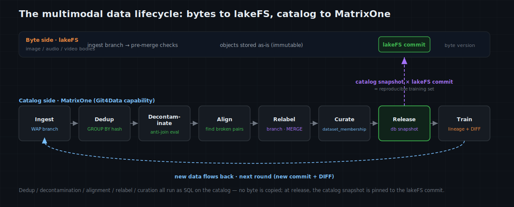

# MatrixOne Git4Data Deep Dive (Part 10) · Deep Learning — Managing Multimodal Training Data: lakeFS for the Bytes, MatrixOne for the Catalog

The first nine parts stayed on structured data: the [first four](https://github.com/matrixorigin/matrixorigin-blog/blob/main/matrixorigin/git4data-part1-data-at-scale/index.md) established what Git4Data is, how to use it, and [where it sits](https://github.com/matrixorigin/matrixorigin-blog/blob/main/matrixorigin/git4data-part4-landscape/index.md) versus other tools; parts five through seven covered data operations; parts eight and nine entered AI training, walking a risk model through the [whole-pipeline map](https://github.com/matrixorigin/matrixorigin-blog/blob/main/matrixorigin/git4data-part8-ml-lifecycle/index.md) and [dataset release & leakage](https://github.com/matrixorigin/matrixorigin-blog/blob/main/matrixorigin/git4data-part9-dataset-release/index.md).

From this part on, we enter **deep learning**. The shape of the training data changes completely here — it's no longer mainly rows in a table, but a mass of images, audio, video, and text. Deep learning, especially multimodal models, feeds precisely on this kind of data. When the data shape changes, so must the playbook for "how to version it."

> This part is the **opening overview** of deep-learning / multimodal data, structurally the counterpart of Part 8 for classical machine learning: lay out the whole picture first — from arrival to release, what the real problem is at each step, and which side owns the bytes versus the catalog. All catalog-side SQL here is verified on MatrixOne `4.1.0`; the runnable version lives in [matrixorigin/git4data-tutorial](https://github.com/matrixorigin/git4data-tutorial) under `10-multimodal-lakefs/`.

---

## Deep learning's data is, first of all, a "bytes" problem

A classical ML sample is a row in a table: a few dozen structured fields, naturally fit for a database, naturally snapshot-able, diff-able, merge-able.

Multimodal data isn't like that. A sample's body is **a pile of bytes** — a few-MB image, a few-tens-of-MB audio clip, a hundred-MB video segment. A whole dataset runs to tens of millions of items, TB to PB. You can't, and shouldn't, stuff those bytes into a database.

But note one thing: **the bytes themselves don't go in the database, yet everything about the bytes is highly structured.** Every sample has: where it lives (object path), its content hash, its perceptual hash, the paired text (caption), its label, which source it came from, what license, width/height, quality score, whether it's train or test, which model version used it… These are tens of millions of rows, still constantly inserted / updated / deleted — exactly where row-level version semantics matter most.

So deep learning's data versioning splits naturally into **two worlds**:

- **The byte world**: the image / audio / video bodies. In object storage or lakeFS, what's versioned is "the object / file version."
- **The catalog world**: who points to which object, caption, label, split, various hashes, source, license… one (or a few) huge structured tables, where what's versioned is "the row."

A truly reproducible multimodal training set is this product:

```text
reproducible training set = one definite catalog version (catalog snapshot)
                          × one definite set of byte versions (lakeFS commit)
```

The two worlds must be **pinned together and kept consistent**: pin only the catalog and the bytes may have been overwritten; pin only the bytes and you don't know which samples, what labels, what split were in play. This is exactly where lakeFS (for the bytes) and MatrixOne's Git4Data capability (for the catalog) each do their job and then compose.

---

## One master map: the multimodal data lifecycle — bytes to lakeFS, catalog to MatrixOne

The conclusion first. The whole lifecycle of multimodal training data splits cleanly into a "byte side" and a "catalog side," each versioned on its own, aligned at release.



| Stage | The real problem | Byte side (lakeFS) | Catalog side (MatrixOne Git4Data) |
|---|---|---|---|
| Ingestion | new media, quality unknown, mustn't poison the set | land on an ingest branch | catalog rows on a branch, `MERGE` only on pass |
| Dedup | exact + perceptual duplicates across tens of millions | objects stored as-is | `GROUP BY` on `content_hash` / `phash`, pure SQL |
| Decontamination | eval / benchmark samples leaked into train | —— | anti-join the catalog to a benchmark-hash table, `DELETE` overlaps |
| Multimodal alignment | image, text, boxes, labels must stay consistent | object existence guaranteed by lakeFS | find broken pairs on the catalog (missing caption / pointer) |
| Relabel / re-caption | labels, captions, safety scores iterate | bytes unchanged | one branch per person, `MERGE` conflicts, `DIFF` the changes |
| Curation | filter a clean subset by quality / safety / license | —— | a versioned `dataset_membership` subset |
| Dataset release | freeze "which version of which bytes this training used" | one lakeFS commit | one database-scope catalog snapshot, commit recorded in a registry |
| Training & evaluation | model must trace back to the exact data scene | commit locates the bytes | snapshot + registry build `model → catalog snapshot × lakeFS commit × code/env` lineage |
| Monitoring & retrain | new data accumulates, when to trigger the next round | new commit | distribution stats on the catalog + cross-version `DIFF` |

The division of labor in one line:

> **lakeFS makes the bytes traceable and reversible; MatrixOne's Git4Data capability makes the catalog queryable, row-level comparable, and atomically publishable. The two align into one reproducible whole via "a lakeFS commit recorded inside a catalog snapshot."**

Below, one complete case runs the whole map.

---

## The running case: preparing image-text training data for a multimodal model

Say we're preparing training data for an image-text model (think a multimodal model for content understanding / moderation). The data is crawled and purchased from several sources; it needs dedup, decontamination, alignment, and relabeling, and finally curation into a clean, reproducible training set.

The catalog is a `samples` table — **note it stores no bytes, only a pointer to the bytes plus everything you actually query on**:

```sql
CREATE TABLE samples (
    sample_id     BIGINT PRIMARY KEY,
    modality      VARCHAR(16),
    object_uri    VARCHAR(512),   -- lakeFS path (a pointer, not the bytes)
    object_commit VARCHAR(64),    -- the lakeFS commit that pins these bytes
    content_hash  VARCHAR(64),    -- sha256 of the bytes (exact-dup key)
    phash         VARCHAR(64),    -- perceptual hash (near-dup key)
    caption       TEXT,           -- the paired text (a second modality)
    label         VARCHAR(16),
    source        VARCHAR(32),    -- provenance
    license       VARCHAR(16),
    quality       DOUBLE,
    ingest_batch  VARCHAR(32)
);
```

A reproducible training record must bind at least these:

```text
run = catalog snapshot
    + lakeFS commit (the byte version)
    + curation & split rules
    + preprocessing / tokenizer version
    + code commit + runtime image digest
    + hyperparameters & random seed
    + model artifact URI & hash
    + evaluation metrics
```

**The catalog snapshot owns "which samples, what labels, how split"; the lakeFS commit owns "which version of the bytes" — drop either and this record can't be reproduced.**

### Stop 1: Ingestion — WAP across two worlds

Monday, upstream delivers 5,000 new image-text pairs. The bytes are pushed to a lakeFS ingest branch; meanwhile the catalog rows enter a catalog branch, not yet touching the set:

```sql
DATA BRANCH CREATE TABLE samples_stage FROM samples;
INSERT INTO samples_stage SELECT ... FROM ...;   -- the batch enters staging only

-- catalog-side gate: pointers complete? captions present? license known?
SELECT
  SUM(CASE WHEN object_uri IS NULL OR object_commit IS NULL THEN 1 ELSE 0 END) AS missing_pointer,
  SUM(CASE WHEN caption IS NULL THEN 1 ELSE 0 END)                             AS missing_caption,
  SUM(CASE WHEN license = 'unknown' THEN 1 ELSE 0 END)                         AS unknown_license
FROM samples_stage WHERE ingest_batch = '2026w30';
--   measured missing_pointer 0 / missing_caption 250 / unknown_license 1000

DATA BRANCH DIFF samples_stage AGAINST samples OUTPUT SUMMARY;   -- measured INSERTED 5000
DATA BRANCH MERGE samples_stage INTO samples;                    -- publish only on full pass
```

The byte-side counterpart is a lakeFS pre-merge hook on that ingest branch doing byte-level checks (can the file decode, dimensions, a safety pre-scan), merging the lakeFS branch only on pass. **Each side audits and merges atomically; whatever fails on either side doesn't reach the mainline.**

### Stop 2: Dedup — exact + perceptual, pure SQL, not one byte touched

Across tens of millions of files there will be exact duplicates (the same image crawled twice at different URLs) and perceptual near-duplicates (the "same image" after cropping, compression, or a watermark). Both can be found on the catalog with SQL, **without pulling a single byte back**:

```sql
-- exact duplicates: one content_hash owned by more than one sample
SELECT COUNT(*) AS exact_dup_groups FROM (
  SELECT content_hash FROM samples GROUP BY content_hash HAVING COUNT(*) > 1
) t;   -- measured 3000 groups

-- perceptual near-dups (not exact dups): same phash, more than one content_hash
SELECT COUNT(*) AS near_dup_groups FROM (
  SELECT phash FROM samples GROUP BY phash HAVING COUNT(DISTINCT content_hash) > 1
) t;   -- measured 2000 groups
```

The byte-side hashes are computed offline and written into the catalog; once in the catalog, dedup is a few `GROUP BY`s, not a sweep across PB of object storage.

### Stop 3: Decontamination — dig the eval set out of the training set

This is the sore spot of deep learning, foundation models especially: **one test / benchmark image leaking into the training set inflates every downstream number.** The move is to anti-join the catalog against known eval-set hashes:

```sql
-- how many training samples overlap the benchmark (by content)?
SELECT COUNT(*) AS contaminated FROM samples s
WHERE EXISTS (SELECT 1 FROM eval_hashes e WHERE e.content_hash = s.content_hash);
--   measured 1000 (500 benchmark originals + their re-crawled mirrors)
```

Note the exact hits are 500, but with mirrors it's 1000 — **decontamination must cover duplicates and near-duplicates**, or an escaped mirror feeds the benchmark into training anyway. That's why dedup and decontamination belong on the same catalog, done together.

### Stop 4: Multimodal alignment — the image-text pair must be one consistent unit

What's special about a multimodal sample: one sample is a **combination of modalities** (image + caption + maybe boxes, labels), and they must stay consistent as a whole. The commonest break is a "snapped pair" — an image with no text, text with no image, or a pointer to an object that no longer exists:

```sql
-- broken image-text pairs: an image with no caption
SELECT COUNT(*) AS unaligned_pairs FROM samples WHERE caption IS NULL;
--   measured 550
```

Here's a trap between the byte world and the catalog world: **deleting an object in lakeFS does not automatically delete the catalog rows pointing to it; and deleting a catalog row doesn't delete the bytes.** The two worlds are versioned independently, but alignment rides on discipline — an SQL sweep for orphan pointers and broken pairs before release is the cheapest alignment gate.

### Stop 5: Relabel and re-caption — the catalog evolves, the bytes don't budge

Labels get corrected, captions get rewritten, safety scores get re-assessed — all of these touch only the **catalog**; the bytes are untouched. So we're back to the parallel collaboration of [Part 6](https://github.com/matrixorigin/matrixorigin-blog/blob/main/matrixorigin/git4data-part6-collaborative-dev/index.md): one branch per person, conflicts surface themselves, changes are on the record.

```sql
DATA BRANCH CREATE TABLE samples_review FROM samples;
UPDATE samples_review SET label = 'nsfw'
WHERE sample_id BETWEEN 1000 AND 1999 AND label = 'safe';
DATA BRANCH DIFF samples_review AGAINST samples OUTPUT SUMMARY;   -- measured UPDATED 980
DATA BRANCH MERGE samples_review INTO samples;
```

What a relabeling round changed is one `DIFF` away — and none of it produced a single byte copy.

### Stop 6: Curation and release — catalog snapshot × lakeFS commit

Release time. First curate a clean subset on the catalog: drop exact duplicates (keep the lowest `sample_id` per `content_hash`), drop eval overlaps, drop broken pairs, keep only clearly-licensed samples, and write the split:

```sql
INSERT INTO dataset_membership
SELECT s.sample_id,
       CASE WHEN s.sample_id % 10 < 8 THEN 'train'
            WHEN s.sample_id % 10 = 8 THEN 'valid' ELSE 'test' END,
       'curate:v1 dedup+decontam+aligned+licensed'
FROM samples s
WHERE s.caption IS NOT NULL
  AND s.license <> 'unknown'
  AND NOT EXISTS (SELECT 1 FROM eval_hashes e WHERE e.content_hash = s.content_hash)
  AND s.sample_id = (SELECT MIN(s2.sample_id) FROM samples s2 WHERE s2.content_hash = s.content_hash);
--   measured train 38474 / valid 4934 / test 4935
```

Then the key step — **pin the catalog snapshot together with the lakeFS commit**:

```sql
CREATE SNAPSHOT mm_dataset_v1 FOR DATABASE mm_train;

-- register "catalog version × byte version" as an executable binding
INSERT INTO dataset_registry
SELECT 'mm_v1', 'mm_dataset_v1', 'media', 'commit-2026w30-d4e5f6',
       COUNT(*), 'catalog snapshot × lakeFS commit = reproducible training set'
FROM dataset_membership;
```

From now on, "what data did mm_v1 use" is no longer a verbal description but a product: `mm_dataset_v1` (the catalog snapshot) names the samples, labels, and split, and `commit-2026w30-d4e5f6` (the lakeFS commit) names the bytes. To reproduce three months later, read the catalog from the snapshot and pull the bytes from the commit:

```sql
SELECT COUNT(*) AS train_rows_v1
FROM samples {SNAPSHOT='mm_dataset_v1'} s
JOIN dataset_membership {SNAPSHOT='mm_dataset_v1'} m ON s.sample_id = m.sample_id
WHERE m.split_name = 'train';
--   measured 38474, bit-for-bit
```

---

## lakeFS and MatrixOne: how the two version worlds divide the work and compose

This part has to make the boundary clear, or it's easy to assume "one of them is enough."

**lakeFS manages the bytes.** It's git-style version control over object storage: branch / commit / merge on top of S3 / GCS / Azure, pinning "the state of object storage at a moment" as a commit you can return to; plus pre-merge hooks for byte-level checks before a merge. It excels at versioning and rolling back **large file bodies**. What it doesn't do: treat tens of millions of catalog entries as a table to run SQL / JOIN / aggregate on, or tell you "between these two versions, which **rows'** labels changed."

**MatrixOne's Git4Data capability manages the catalog.** It treats the catalog as a live, queryable table: row-level snapshot / branch / diff / merge / restore, JOIN-able, aggregate-able, anti-join-able any time. It excels at versioning, row-level comparison, and atomic publishing of a **structured catalog**. What it doesn't do: store and version the byte bodies of images/audio/video.

**How do they compose?** Via "a lakeFS commit recorded inside a catalog snapshot." At release, the MatrixOne side takes a database-scope catalog snapshot and writes the current lakeFS commit into a registry; to reproduce, you use both IDs together.

| Object | Better suited to | What it owns | What it doesn't |
|---|---|---|---|
| Image / audio / video / large-file bytes | **lakeFS / object storage** | byte versioning, rollback, pre-merge checks | row-level catalog query & diff |
| Catalog: pointers, caption, label, hash, split, source | **MatrixOne (Git4Data capability)** | row-level snapshot / branch / diff / merge / restore, JOIN & aggregate | storing the byte bodies |
| Alignment of the two | **a binding in the registry** | catalog snapshot × lakeFS commit = reproducible training set | —— |

This is more realistic than "hoping one tool manages both bytes and catalog well." Bytes have their optimal solution, the catalog has its own; the key is to **pin them together explicitly**.

---

## Pitfalls to watch for

- **The two versions drift.** The commonest mistake is pinning only the catalog and not recording the lakeFS commit — the catalog reproduces, but the bytes don't match (an object may have been overwritten or deleted). The iron rule: **the catalog snapshot must remember its corresponding lakeFS commit.**

- **Don't store a bare, overwritable URI.** `object_uri` holds a pointer; if it's an address that can be overwritten, the snapshot freezes only that string, not the bytes. Store an immutable object version or a lakeFS commit. (Note: MatrixOne v4.1.0's `datalink` type only parses `file://` / `hdfs://` / `stage://`, not `s3://`; S3 / lakeFS objects should be stored as a stage path or an immutable object / commit version.)

- **Dedup is heuristic.** Perceptual hashes have false positives and false negatives; check exact and near-duplicates together, and sample suspicious groups by hand on important datasets.

- **Decontamination must cover near-duplicates**, not just exact matches — mirrors and crops are the commonest escapees for eval leakage.

- **License and consent must propagate with the sample.** The catalog's `source` / `license` aren't decoration; the moment a source's license is revoked, you must be able to find every affected sample in one SQL and curate them out in the next version.

- **Alignment rides on discipline.** The byte world and the catalog world are versioned independently; deletes don't sync automatically. An SQL sweep for orphan pointers and broken pairs before release is the cheapest alignment gate.

---

## A minimal loop you can adopt directly

1. Bytes to lakeFS, catalog to a MatrixOne `samples` table, each row recording a pointer + `content_hash` + `phash` + source + license.
2. New batches go to a branch first: bytes on a lakeFS branch, catalog on a catalog branch; each side audits, merge only on pass.
3. On the catalog, use SQL for dedup, decontamination, and alignment checks, keeping suspicious samples out of curation.
4. Curate a clean subset into `dataset_membership`, take a database-scope catalog snapshot.
5. **Register the lakeFS commit together with the catalog snapshot** — that's the reproducibility anchor.
6. At training, bind `model → catalog snapshot × lakeFS commit × code/env`; next round, use `DIFF` for catalog changes and a new commit for byte changes.

---

## Closing

Deep learning turned training data from "rows in a table" into "bytes in object storage + a huge catalog." The optimal way to manage the two differs: the bytes want large-file versioning and rollback, the catalog wants row-level query, comparison, and atomic publishing. Force them into one tool and one end always chafes.

The more realistic architecture lets **lakeFS manage the bytes and MatrixOne's Git4Data capability manage the catalog**, then pins the two version worlds into one reproducible whole via "catalog snapshot × lakeFS commit." Dedup, decontamination, alignment, relabeling, curation — the operations that actually decide multimodal data quality happen almost entirely on the catalog, and the catalog happens to be a table you can version with SQL.

Next, we return to the text world of large models: **SFT data curation** — how to dedup, filter, and decontaminate hundreds of thousands of instruction records entirely in SQL, with a DIFF as the receipt for every cut.

> 📎 Runnable SQL: [github.com/matrixorigin/git4data-tutorial](https://github.com/matrixorigin/git4data-tutorial) ｜ Source & community: [github.com/matrixorigin/matrixone](https://github.com/matrixorigin/matrixone)
