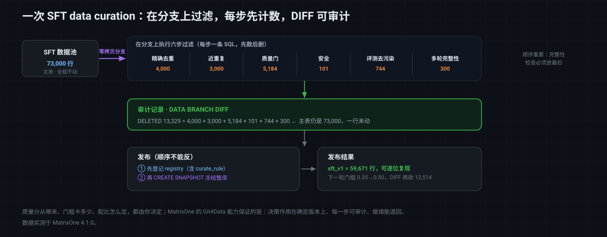

# MatrixOne Git4Data 技术详解（十一）·大模型篇：SFT 数据 curation——可审计、可复现的数据清洗

前十篇里，我们把 MatrixOne 的 Git4Data 能力从概念一路带到了 AI 训练现场：[前四篇](https://github.com/matrixorigin/matrixorigin-blog/blob/main/matrixorigin/git4data-part1-data-at-scale-zh/index.md)建立技术坐标，第五到第七篇是数据运维（[误操作救援](https://github.com/matrixorigin/matrixorigin-blog/blob/main/matrixorigin/git4data-part5-incident-rescue-zh/index.md)、[多人协作](https://github.com/matrixorigin/matrixorigin-blog/blob/main/matrixorigin/git4data-part6-collaborative-dev-zh/index.md)、[Write-Audit-Publish](https://github.com/matrixorigin/matrixorigin-blog/blob/main/matrixorigin/git4data-part7-write-audit-publish-zh/index.md)），第八、九篇讲传统机器学习（[全流程总图](https://github.com/matrixorigin/matrixorigin-blog/blob/main/matrixorigin/git4data-part8-ml-lifecycle-zh/index.md)、[数据集发布与泄漏](https://github.com/matrixorigin/matrixorigin-blog/blob/main/matrixorigin/git4data-part9-dataset-release-zh/index.md)），[第十篇](https://github.com/matrixorigin/matrixorigin-blog/blob/main/matrixorigin/git4data-part10-multimodal-zh/index.md)转向深度学习的文件型数据，让 lakeFS 管文件、MatrixOne 管元数据。

这一篇进入**大模型**。具体说，是大模型训练里最讲究、也最依赖人工判断的一步：**SFT（Supervised Fine-Tuning，监督微调）的数据 curation**。

先说清楚它在整条链路里的位置。一个大模型通常要经过三段：**预训练**（在海量文本上学语言和世界知识）、**SFT**（用高质量的「指令 → 回答」样本，教会它按人的期望回话）、**偏好对齐**（RLHF / DPO 等，让它在多个像样的回答里挑更好的那个）。SFT 是承上启下的一段，也是**数据量最小、单条价值最高**的一段——预训练动辄几万亿 token，SFT 常常只有几万到几十万条。

正因为量小，**每一条的质量、每一次的取舍，都会直接印在模型行为上**。而这些取舍，几乎全是人在做决定：这批合成数据留不留？这个来源的数据质量掉了要不要下架？code 和 chat 的比例调成多少？质量分的门槛卡在 0.35 还是 0.50？

> 这一篇把一次完整的 SFT data curation 从头到尾做一遍：数据池长什么样、要下哪几刀、每一刀怎么留下审计记录、最后怎么发布成一个可复现的版本，以及业内其他做法各自卡在哪。文中 SQL 全部在 MatrixOne `4.1.0` 上实测，可跑版本见 [matrixorigin/git4data-tutorial](https://github.com/matrixorigin/git4data-tutorial) 的 `11-sft-curation/`。

---

## SFT 数据的特殊之处：数据回到了数据库的主场

[第十篇](https://github.com/matrixorigin/matrixorigin-blog/blob/main/matrixorigin/git4data-part10-multimodal-zh/index.md)里，图像训练数据不得不劈成两个世界：文件交给 lakeFS，元数据交给 MatrixOne。因为一张 JPEG 没有行、没有列，数据库拿它没办法。

SFT 数据不一样。一条 SFT 样本长这样：

```json
{"instruction": "解释一下什么是数据库快照", "response": "快照是数据库在某个时刻的...", "domain": "chat"}
```

它是**文本，但高度结构化**：instruction 一列、response 一列，外加来源、语种、领域、质量分、安全标记、长度……**整条样本，包括正文本身，都能直接住进一张表里**。几十万条记录、每条几百到几千字符，对数据库来说完全是舒适区。

这意味着 SFT 的 curation 有一个第十篇没有的好处：**不需要“文件 + 元数据”两个世界的对齐，所有操作都在同一张表上，用 SQL 完成，并且天然被行级版本语义覆盖**。

而 SFT curation 的动作，恰好全是行级的增删改：

```text
去掉重复的样本            = DELETE 一批行
砍掉质量不达标的           = DELETE 一批行
剔除和评测集重合的         = DELETE 一批行
下架某个来源的数据         = DELETE 一批行
调整领域配比              = 有选择地 DELETE / 保留
修正某些回答              = UPDATE 一批行
```

**每一刀都是一次行级变更**——这正是 Git4Data 这套能力最擅长的东西。于是整篇文章的主张可以先摆出来：

> **SFT curation 不该是一串跑完就没影的脚本，而应该是一次「在分支上做完、用 DIFF 留下审计记录、原子发布成一个版本」的受控变更。**

---

## 为什么 curation 必须可审计

先看一个几乎每个大模型团队都遇到过的场景。

模型 `sft-v7` 上线后，团队发现它在代码题上明显不如 `sft-v6`——但两版之间训练代码没动、超参没动，只是数据「按惯例清洗了一遍」。于是问题变成：**这轮清洗到底删了什么？**

如果 curation 是一串 Python 脚本跑完就完事，你能拿到的通常只有：清洗前 73 万条、清洗后 60 万条。中间少的那 13 万条是什么，谁也说不清——是去重删的？是质量分门槛卡掉的？还是某个 domain 被整体误删了？想复现 `sft-v6` 那一版数据集，更是无从下手，因为原始池这个月又进了新数据。

这就是「可审计」的意义。curation 的每一刀都应该能回答三个问题：

1. **删了多少、删了哪些**（可审计）；
2. **为什么删**（规则可查）；
3. **这一版能不能原样复现**（可回溯）。

下面就用一个完整的案例，把这三件事都落实。

---

## 贯穿全文的案例：给一个对话模型做一轮 SFT 数据 curation

假设我们在维护一个通用对话模型的 SFT 数据池。数据来自三个渠道：**采购的供应商数据**、**模型合成的数据**、**人工撰写的数据**；覆盖 code / math / chat / safety 四个领域；既有单轮样本，也有多轮对话。

数据池就是一张表——注意**正文（instruction / response）就在表里**，旁边是所有用来做取舍的字段：

```sql
CREATE TABLE sft_records (
    record_id     BIGINT PRIMARY KEY,
    conv_id       BIGINT,          -- 多轮对话：同一个 conv_id 下有多行
    turn_no       INT,             -- 对话内的第几轮
    instruction   VARCHAR(512),
    response      VARCHAR(1024),
    norm_hash     VARCHAR(64),     -- 归一化后 instruction 的哈希（近重复键）
    exact_hash    VARCHAR(64),     -- instruction+response 的哈希（精确去重键）
    domain        VARCHAR(24),     -- code / math / chat / safety
    source        VARCHAR(32),     -- 供应商 / 合成 / 人工
    lang          VARCHAR(8),
    resp_len      INT,
    quality_score DOUBLE,          -- 打分模型或启发式规则给的质量分
    is_safe       TINYINT,         -- 1 = 通过安全分类器
    ingest_batch  VARCHAR(32)
);
```

两个 hash 列值得解释一下，它们是去重的两把不同的刀：

- **`exact_hash`**：instruction + response 一起算哈希，抓的是**完全一样的样本**——同一条数据被两个供应商都卖给你了，或者同一批数据被导入了两次。
- **`norm_hash`**：只对 instruction 做**归一化**（统一大小写、去掉多余标点和空白）后算哈希，抓的是**问题其实是同一个、但回答不同**的近重复——合成数据里这类特别多，同一个 prompt 被反复采样出好几个版本。

案例的池子：60000 条单轮样本 + 4000 条精确重复 + 3000 条近重复 + 2000 组三轮对话（6000 行），另有 800 条回答被截断成空串，以及 150 组多轮对话里第 2 轮被截断——**实测共 73,000 行**。

---

## 在分支上做 curation：六刀，刀刀有数

关键的第一步：**不要在数据池主表上直接删**。先拉一条分支，整轮 curation 都在分支上做——主池一行不动，随时可以对照、可以丢弃重来。这就是[第七篇 Write-Audit-Publish](https://github.com/matrixorigin/matrixorigin-blog/blob/main/matrixorigin/git4data-part7-write-audit-publish-zh/index.md) 的思路，用在 curation 上：

```sql
DATA BRANCH CREATE TABLE sft_curated FROM sft_records;
```

分支是零拷贝的（[第三篇](https://github.com/matrixorigin/matrixorigin-blog/blob/main/matrixorigin/git4data-part3-under-the-hood-zh/index.md)讲过原理），所以哪怕池子有几百万条，这一步也是毫秒级、不产生数据副本。

### 第一刀：精确去重

同一条「指令 + 回答」在池子里出现多次，训练时会让模型对这条样本过度拟合。按 `exact_hash` 分组，每组只留 `record_id` 最小的一条：

```sql
-- 先看要删多少
SELECT COUNT(*) AS exact_dup_rows FROM sft_curated c
WHERE c.record_id > (SELECT MIN(c2.record_id) FROM sft_curated c2
                     WHERE c2.exact_hash = c.exact_hash);
--   实测 4000

DELETE FROM sft_curated
WHERE record_id > (SELECT MIN(c2.record_id) FROM sft_curated c2
                   WHERE c2.exact_hash = sft_curated.exact_hash);
```

### 第二刀：近重复去重

比精确重复更隐蔽、也更常见：**同一个问题，被合成了好几个不同的回答**。它们的 `exact_hash` 各不相同，但归一化后的 `norm_hash` 是一样的。留哪一条是个策略问题（这里取 `record_id` 最小；实践中更常见的是**留质量分最高的那条**）：

```sql
SELECT COUNT(*) AS near_dup_rows FROM sft_curated c
WHERE c.record_id > (SELECT MIN(c2.record_id) FROM sft_curated c2
                     WHERE c2.norm_hash = c.norm_hash);
--   实测 3000

DELETE FROM sft_curated
WHERE record_id > (SELECT MIN(c2.record_id) FROM sft_curated c2
                   WHERE c2.norm_hash = sft_curated.norm_hash);
```

要说清楚边界：`norm_hash` 只能抓「归一化后完全相同」的近重复。**语义相同但措辞不同**的那一类（「什么是快照」vs「快照是什么意思」），哈希抓不到，需要向量相似度或 MinHash/SimHash 这类方法——它们能算出候选对，但**最终「删哪条、留哪条」仍然是一次行级删除**，照样走这里的流程。

### 第三刀：质量门

空回答、被截断的生成、打分模型给出的低分样本，都要挡在训练之外：

```sql
SELECT COUNT(*) AS low_quality FROM sft_curated
WHERE resp_len < 10 OR quality_score < 0.35;
--   实测 5184

DELETE FROM sft_curated WHERE resp_len < 10 OR quality_score < 0.35;
```

注意这里的门槛（长度 10、质量分 0.35）**是这次 curation 的一个决策**，不是自然规律。它必须被记录下来——后面发布时会写进 curation 规则里，因为下一版很可能会调整它（本文最后就会调到 0.50）。

### 第四刀：安全过滤

被安全分类器标记为不安全的样本直接剔除：

```sql
SELECT COUNT(*) AS unsafe FROM sft_curated WHERE is_safe = 0;   -- 实测 101
DELETE FROM sft_curated WHERE is_safe = 0;
```

### 第五刀：评测集去污染

这是大模型 curation 里最要命的一刀。**如果评测基准里的题目混进了 SFT 训练集，模型是背下了答案，而不是学会了能力**——所有 benchmark 分数都会虚高，而且你不会收到任何报错。做法是拿评测集的 prompt 哈希做反连接：

```sql
SELECT COUNT(*) AS contaminated FROM sft_curated c
WHERE EXISTS (SELECT 1 FROM eval_prompts e WHERE e.norm_hash = c.norm_hash);
--   实测 744

DELETE FROM sft_curated
WHERE EXISTS (SELECT 1 FROM eval_prompts e WHERE e.norm_hash = sft_curated.norm_hash);
```

和[第十篇](https://github.com/matrixorigin/matrixorigin-blog/blob/main/matrixorigin/git4data-part10-multimodal-zh/index.md)一样要诚实说明：这条反连接匹配的是**归一化后完全相同**的 prompt。改写过、翻译过、换了表述的污染样本它抓不到——那需要在评测集上再建一层语义相似度检索。**哈希去污染是底线，不是全部。**

### 第六刀：多轮对话完整性

这一刀是 SFT 特有的，也是最容易被脚本漏掉的。**多轮对话必须整体进、整体出**：如果第 2 轮因为回答被截断而在第三刀里被删了，只剩第 1、3 轮的对话是**残缺且有害**的——模型会学到跳跃、不连贯的对话结构。

所以在所有过滤之后，要再扫一遍：哪些 `conv_id` 的轮次不完整了，整组删掉：

```sql
SELECT COUNT(*) AS broken_conv_rows FROM sft_curated c
WHERE c.conv_id IN (
  SELECT conv_id FROM sft_curated GROUP BY conv_id HAVING COUNT(*) < MAX(turn_no)
);
--   实测 300（150 组对话，各自被删掉一轮后还剩两轮）

DELETE FROM sft_curated WHERE conv_id IN (
  SELECT conv_id FROM (
    SELECT conv_id FROM sft_curated GROUP BY conv_id HAVING COUNT(*) < MAX(turn_no)
  ) t
);
```

**这就是为什么 curation 的顺序很重要**：完整性检查必须放在所有过滤之后，因为它要清理的正是前面几刀造成的连带损伤。

六刀过后：**实测 73,000 → 59,671 行**。



---

## 审计记录：一条 DIFF 说清这一轮到底删了什么

整轮 curation 做完，最重要的动作来了——**留下这一轮的审计记录**：

```sql
DATA BRANCH DIFF sft_curated AGAINST sft_records OUTPUT SUMMARY;
--   实测 INSERTED 0 / DELETED 13329 / UPDATED 0
```

`13329` 这个数字不是估算，它就是六刀之和：`4000 + 3000 + 5184 + 101 + 744 + 300 = 13329`。**主池一行没动，而这一轮的全部影响被压缩成一行摘要。**

比总数更有用的是，你随时可以把差异**展开到行**——想知道具体删了哪些、某个 domain 被删了多少、某个来源是不是被砍得特别狠，都是普通 SQL：

```sql
-- 发布前先看一眼配比：领域和来源的比例，本身就是一次 curation 决策
SELECT domain, COUNT(*) AS n,
       ROUND(100.0 * COUNT(*) / (SELECT COUNT(*) FROM sft_curated), 1) AS pct
FROM sft_curated GROUP BY domain ORDER BY domain;
--   实测 chat 19346 (32.2%) / code 13247 (22.0%) / math 13764 (22.9%) / safety 13764 (22.9%)

SELECT source, COUNT(*) AS n FROM sft_curated GROUP BY source ORDER BY source;
--   实测 human_written 24041 / synthetic_gpt 18040 / vendor_a 18040
```

这两条查询点出了一个容易被忽略的事实：**配比也是 curation 的一部分**。chat 占到 32% 而 code 只有 22%，是不是符合这次训练的目标？合成数据占了三成，比例是否过高？这些判断没有标准答案，但它们必须在**发布之前**被看到——而不是训练完拿到一个奇怪的模型再回头猜。

---

## 发布：原子合并 + 先登记后快照

审计通过，才轮到发布。这里有两个细节值得强调。

**第一，登记要在快照之前。** 我们要把「这一版数据集 = 哪个快照 + 用了什么 curation 规则」记成一条可查的绑定。顺序必须是**先写注册表、再打快照**——否则绑定只躺在可变的活库里，没被冻进版本：

```sql
CREATE TABLE dataset_registry (
    dataset_version   VARCHAR(32) PRIMARY KEY,
    metadata_snapshot VARCHAR(64),
    n_records         BIGINT,
    curate_rule       VARCHAR(256)
);

-- 先登记（快照名提前定好，所以这行可以写上它）
INSERT INTO dataset_registry
SELECT 'sft_v1', 'sft_v1', COUNT(*),
       'exact+near dedup, len>=10, score>=0.35, safe only, eval-decontam, whole-conv'
FROM sft_curated;
```

注意 `curate_rule` 这一列：**它把「这一版是按什么规则筛出来的」变成了数据的一部分**。三个月后有人问「v1 的质量分门槛是多少」，不用去翻脚本仓库的 git log，一条 SELECT 就够了。

**第二，发布是原子的。** 用 curated 分支替换主池，然后打快照冻住整个版本：

```sql
DROP TABLE sft_records;
ALTER TABLE sft_curated RENAME TO sft_records;   -- 用策展后的池子替换主池
CREATE SNAPSHOT sft_v1 FOR DATABASE sft_pool;

-- 绑定现在在快照里了，不只是活库里
SELECT n_records FROM dataset_registry {SNAPSHOT='sft_v1'} WHERE dataset_version = 'sft_v1';
--   实测 59671
```

---

## 下一轮：v2 的审计记录，和 v1 的可复现

几周后，团队决定收紧质量门槛——从 0.35 提到 0.50。同样的流程再走一遍，而这一次，**DIFF 直接告诉你这个决策的代价**：

```sql
DATA BRANCH CREATE TABLE sft_v2_wip FROM sft_records;
DELETE FROM sft_v2_wip WHERE quality_score < 0.50;

DATA BRANCH DIFF sft_v2_wip AGAINST sft_records OUTPUT SUMMARY;
--   实测 DELETED 12514
SELECT COUNT(*) AS v2_rows FROM sft_v2_wip;   -- 实测 47157
```

一个门槛从 0.35 调到 0.50，代价是再砍掉 **12,514** 条、数据集从 59,671 降到 47,157——**少了 21%**。这个数字应该在训练之前就摆到桌面上讨论，而不是训练完发现模型变笨了再去猜。

与此同时，v1 始终原样可查：

```sql
SELECT COUNT(*) AS v1_rows FROM sft_records {SNAPSHOT='sft_v1'};   -- 实测 59671
```

于是「`sft-v7` 在代码题上掉点」这个开头的问题，现在有了可执行的排查路径：把 v7 用的数据快照和 v6 的 DIFF 一下，看 code 域少了哪些行、是被哪一刀删的。**模型的退步，第一次能落到具体的数据变更上。**

---

## 行业里的其他做法：SFT curation 一般怎么管，各自卡在哪

把 SFT curation 做成「可审计、可复现、可回退」的版本化流程，业内有几种常见路径，各自解决了一部分：

**做法一：一串 Python 清洗脚本 + 落一个新文件。** 最普遍。`clean_v3.py` 跑完输出 `sft_train_v3.jsonl`。优点是灵活；代价是**结果和过程都不可查**——你有一个 60 万行的文件，但没有「删了哪 13,329 条、分别因为什么」的记录；想复现上一版，得指望脚本和原始池都没变过。

**做法二：脚本 + 把每一步的中间产物都存下来。** 有纪律的团队会这么做：`step1_dedup.jsonl`、`step2_quality.jsonl`……确实能回溯了，代价是**每一步一份全量副本**（N 倍存储），而且比对两个版本要写额外的脚本，不能直接 JOIN 或聚合。

**做法三：HuggingFace Datasets + 版本化到 Hub。** 数据集有了版本和 revision，社区生态也好。但它的粒度是**数据集版本级**：能告诉你 v3 和 v2 不是同一份，但不能行级告诉你「哪 300 行因为多轮残缺被删了」；筛选逻辑仍在外部脚本里。

**做法四：DVC / lakeFS 等数据版本工具。** 能把 JSONL 文件钉成可回到的版本，这点很扎实。但它们看到的是**文件**：diff 是文件级或对象级的，而 SFT curation 的语义全是行级的；而且数据在文件里，做一次「按 domain 统计配比」还得先读回来。

**做法五：数据仓库（Spark / BigQuery 等）里跑 curation。** 用 SQL 做筛选，这一步和本文思路是一致的，也是大团队常见的做法。差别在于**版本语义**：Spark 表要留住每一版通常靠「写到一张带日期后缀的新表」或 Delta/Iceberg 的表版本；行级的 branch / diff / merge 不是原生语义，「在分支上试一轮 curation，不行就丢掉」这件事要自己拼装。

放进一张表里：

| 做法 | 行级审计记录（删了哪些） | 筛选逻辑在哪 | 版本可复现 | 试错成本 | 额外副本 |
|---|---|---|---|---|---|
| Python 脚本 + 输出文件 | 无 | 脚本 | 靠自觉 | 重跑全流程 | 每版一份 |
| 脚本 + 存中间产物 | 半（靠比对文件） | 脚本 | 是 | 重跑 | **N 倍** |
| HF Datasets + Hub | 否（数据集级） | 外部脚本 | 是 | 重新上传 | 每版一份 |
| DVC / lakeFS | 否（文件级） | 外部脚本 | 是 | 重跑 | 内容去重后较省 |
| 数仓 SQL（Spark 等） | 否（表版本级） | **SQL** ✅ | 是 | 建新表 | 每版一张表 |
| **MatrixOne（Git4Data 能力）** | **是（`DATA BRANCH DIFF`）** | **SQL** ✅ | **是（快照）** | **零拷贝分支，丢弃即可** | **无** |

一句话：其他做法要么把筛选逻辑锁在脚本里、结果只剩一个文件（脚本类），要么能版本化却看不到行级语义（文件版本工具），要么能用 SQL 筛却没有原生的分支 / 行级 diff（数仓）。MatrixOne 的不同在于**这三件事在同一张表上同时成立**：curation 用 SQL 写、在零拷贝分支上试、每一刀的结果由 `DATA BRANCH DIFF` 出具审计记录、通过后原子发布并快照。

---

## 边界与适用范围

- **Git4Data 这套能力不替你判断质量。** 质量分从哪来（打分模型、规则、人工）、门槛卡在哪、配比怎么定，都是你的决策。它保证的是：这些决策作用在确定的数据版本上、结果可审计、做错了能退回。

- **哈希去重和哈希去污染都是底线，不是全部。** 语义级的近重复和改写过的污染样本，需要向量检索或 MinHash 这类方法先算出候选；但候选算出来之后的「删哪些行」，仍然回到本文这套行级流程。

- **多轮对话的完整性要显式检查。** 它不会自己成立，而且必须放在所有过滤之后——本文实测的那 300 行就是前面几刀的连带损伤。

- **快照有保留成本。** 每个上线模型对应的 `sft_vN` 建议长期保留，废弃的中间试验版本要设清理策略，否则历史版本会一直占着存储。

- **curation 规则要跟着版本走。** 把门槛、规则写进注册表（本文的 `curate_rule` 列），比写在某个脚本的注释里可靠得多。

---

## 结语

SFT 是大模型里数据量最小、但单条价值最高的一段。正因如此，curation 的每一次取舍都会直接印在模型行为上——而这些取舍，长期以来是整条链路上**最不透明**的一环：一串脚本跑完，池子小了一大截，至于删了什么、为什么删、能不能退回，全靠人的记忆和纪律。

把它换成「分支上做、DIFF 留审计记录、原子发布、快照冻结」之后，这一环就变成了和代码评审一样可控的东西：**73,000 → 59,671，中间那 13,329 条的去向，一条 SQL 就能说清楚**；把门槛从 0.35 提到 0.50 要付出 21% 的数据量，这个代价在训练开始之前就摆在桌面上；而任何一个历史版本，随时可以逐位复原。

> 📎 可运行 SQL：[github.com/matrixorigin/git4data-tutorial](https://github.com/matrixorigin/git4data-tutorial) ｜ 源码与社区：[github.com/matrixorigin/matrixone](https://github.com/matrixorigin/matrixone)
