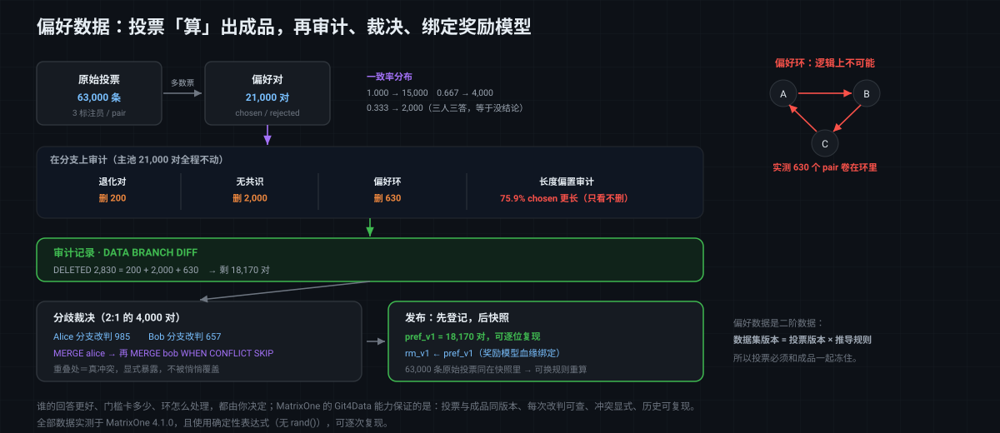

# MatrixOne Git4Data 技术详解（十二）·大模型篇：RLHF 偏好数据——分歧、裁决与可复现

[上一篇](https://github.com/matrixorigin/matrixorigin-blog/blob/main/matrixorigin/git4data-part11-sft-curation-zh/index.md)我们做了一轮完整的 SFT 数据 curation：在分支上下六刀，每刀有数，DIFF 出收据，先登记后快照发布。这一篇沿着大模型的训练链路往下走一步，进入**偏好对齐**——RLHF / DPO 依赖的那份**偏好数据**。

[第十一篇](https://github.com/matrixorigin/matrixorigin-blog/blob/main/matrixorigin/git4data-part11-sft-curation-zh/index.md)讲过，SFT 教模型「按人期望的方式回答」。但 SFT 有个天花板：它只能学「这是一个好回答」，学不了「**这两个都还行的回答里，哪个更好**」。而后者恰恰是把模型从"能用"推到"好用"的关键。偏好对齐要解决的就是这个：让人（或模型）在多个候选回答之间做比较，用这些比较训练一个**奖励模型（Reward Model）**，再用它去指导策略模型。

于是训练数据的形态又变了一次。这一次的变化，比前面几篇都更根本。

> 这一篇讲清楚偏好数据特殊在哪、它会以什么方式坏掉（退化对、无共识、偏好环、长度偏置）、多个标注员的分歧怎么裁决、以及一份偏好数据集怎么和奖励模型绑成可复现的一对。文中 SQL 全部在 MatrixOne `4.1.0` 上实测，且**全部使用确定性表达式**（没有 `rand()`），每个数字都可逐次复现；可跑版本见 [matrixorigin/git4data-tutorial](https://github.com/matrixorigin/git4data-tutorial) 的 `12-rlhf-preference/`。

---

## 偏好数据的两个特殊之处

### 一、单位不是「行」，而是「对」

前面几篇里，一条样本就是一行：一条 SFT 记录、一张图的元数据。偏好数据不是——它的最小单位是一个**三元组**：

```text
（prompt，chosen 更好的回答，rejected 较差的回答）
```

**一条偏好记录天生是关系型的**：它把同一个 prompt 下的两个候选**关联**起来，说的是它们之间的**相对关系**。这带来一串前面没有的问题：

- 两个候选是同一段文本，这条"偏好"就没有信息量（**退化对**）；
- 同一个 prompt 下的多个对之间，可能互相**矛盾**（A>B、B>C，却又 C>A）；
- 你没法孤立地看一行判断它对不对，**必须放在同一个 prompt 的上下文里看**。

### 二、偏好数据不是「采集」来的，是「算」出来的

这一点更关键。SFT 数据是拿来的：供应商给你一条，它就是一条。偏好数据不是——你拿到的原始物料是**投票**：

```text
pair #1024   标注员 anno_1: 选 A     标注员 anno_2: 选 A     标注员 anno_3: 选 B
```

真正用来训练的那条 `(chosen, rejected)`，是从这些投票**推导**出来的：多数票是谁？三个人各执一词怎么办？有人投了"平局"算不算数？**推导规则本身就是一次决策**。

所以偏好数据集是一份**二阶数据**：

```text
偏好数据集版本 = 原始投票的版本  ×  推导规则（多数票 / 一致率门槛 / 平局处理）
```

换了门槛，同一批投票能算出不同的数据集。这意味着「这份偏好数据是怎么来的」必须和数据一起被版本化——否则半年后没人能说清 `rm_v1` 到底是用什么规则、从哪一批投票里算出来的。

---

## 一个真实会发生的故障：奖励模型学会了「话长就是好」

先看一个 RLHF 里非常经典、也非常隐蔽的翻车。

团队训完奖励模型 `rm_v1`，接上 PPO 跑策略优化。几轮之后发现：模型的回答**越来越长**，废话越来越多，但奖励分一路走高。人工看反而觉得变差了。

问题不在 PPO，在偏好数据。人类标注员（以及用来打标的模型）有一个众所周知的倾向：**在两个都还行的回答之间，倾向于选更长、更详细的那个**。如果这个倾向没被察觉，偏好数据里就会系统性地出现「chosen 比 rejected 长」，于是奖励模型学到的其实是**长度**这个捷径特征，而不是质量。策略模型再顺着这个奖励爬——就爬成了废话生成器。

这个问题的可怕之处在于：**它不会报错，各项指标看着都在涨**。唯一能提前发现它的方式，是**在训练之前，对偏好数据做一次统计审计**——而这，恰好是一条 SQL 的事。

后面我们会看到：本文这份数据池实测 **75.9% 的 chosen 比 rejected 长，平均长 95.2 个字符**。这个数字必须在训练之前被摆到桌面上。

---

## 贯穿全文的案例：一轮偏好数据的构建与发布

案例设定：为一个对话模型准备偏好数据。**20,000 个 prompt，每个 prompt 有 3 个候选回答**（分别来自不同版本的策略模型），标注员在候选之间两两比较。

数据分三张表，对应"原料 → 投票 → 成品"：

```sql
-- ① 候选回答（原料）
CREATE TABLE candidates (
    cand_id   BIGINT PRIMARY KEY,
    prompt_id BIGINT,
    slot      CHAR(1),          -- A / B / C
    response  VARCHAR(512),
    resp_len  INT,              -- 长度：后面审计长度偏置要用
    model_tag VARCHAR(32)       -- 哪个策略版本生成的
);

-- ② 原始投票（每个标注员对每个 pair 投一票）
CREATE TABLE annotations (
    anno_id   BIGINT PRIMARY KEY,
    pair_id   BIGINT,
    prompt_id BIGINT,
    cand_a    BIGINT,
    cand_b    BIGINT,
    annotator VARCHAR(16),
    verdict   CHAR(1)           -- 'a' / 'b' / 't'(平局)
);

-- ③ 推导出的偏好对（成品，真正拿去训奖励模型的）
CREATE TABLE preference_pairs (
    pair_id     BIGINT PRIMARY KEY,
    prompt_id   BIGINT,
    chosen_id   BIGINT,
    rejected_id BIGINT,
    n_votes     INT,
    top_votes   INT,
    agree_rate  DOUBLE          -- 一致率 = 最高票 / 总票数
);
```

**保留 ② 这张原始投票表非常重要**。很多团队只存最终的 `(chosen, rejected)`，把投票扔了——一旦要换推导规则（比如把一致率门槛从 0.6 提到 0.8），就再也算不回去了。原始投票是这份数据的"源代码"。

案例规模：60,000 个候选、**63,000 条投票、21,000 个 pair**（20,000 个主 pair，加上给 500 个 prompt 额外构造的 B-vs-C、C-vs-A，用来演示偏好环）。

---

## 第一步：从投票推导偏好对

推导本身就是一条 SQL——按 pair 聚合投票，取多数，同时算出一致率：

```sql
INSERT INTO preference_pairs
SELECT v.pair_id, v.prompt_id,
       CASE WHEN v.a_votes >= v.b_votes THEN v.cand_a ELSE v.cand_b END,   -- chosen
       CASE WHEN v.a_votes >= v.b_votes THEN v.cand_b ELSE v.cand_a END,   -- rejected
       v.n_votes,
       GREATEST(v.a_votes, v.b_votes, v.t_votes),
       ROUND(GREATEST(v.a_votes, v.b_votes, v.t_votes) / v.n_votes, 3)     -- 一致率
FROM (
  SELECT pair_id, MIN(prompt_id) AS prompt_id, MIN(cand_a) AS cand_a, MIN(cand_b) AS cand_b,
         COUNT(*) AS n_votes,
         SUM(CASE WHEN verdict = 'a' THEN 1 ELSE 0 END) AS a_votes,
         SUM(CASE WHEN verdict = 'b' THEN 1 ELSE 0 END) AS b_votes,
         SUM(CASE WHEN verdict = 't' THEN 1 ELSE 0 END) AS t_votes
  FROM annotations GROUP BY pair_id
) v;
--   实测得到 21,000 个 pair
```

一致率的分布，是这份数据质量的第一张体检表：

```sql
SELECT agree_rate, COUNT(*) AS n FROM preference_pairs GROUP BY agree_rate ORDER BY agree_rate;
--   实测 0.333 → 2,000    （三个人各执一词，等于没结论）
--        0.667 → 4,000    （2:1，有多数但有分歧）
--        1.000 → 15,000   （一致通过）
```

**这张表本身就在说话**：有 2,000 个 pair 三个标注员完全没达成共识，还有 4,000 个存在分歧。前者基本是噪声，后者需要裁决——两件事后面分别处理。

---

## 第二步：在分支上审计与 curation

和[第十一篇](https://github.com/matrixorigin/matrixorigin-blog/blob/main/matrixorigin/git4data-part11-sft-curation-zh/index.md)一样，先拉分支，主池一行不动：

```sql
DATA BRANCH CREATE TABLE pairs_curated FROM preference_pairs;
```

### 检查一：退化对——两个候选是同一段文本

同一个回答被两个 slot 采到（或者候选生成时撞了），这条"偏好"就毫无信息量，还会给奖励模型灌进矛盾梯度：

```sql
SELECT COUNT(*) AS degenerate FROM pairs_curated p
JOIN candidates c1 ON p.chosen_id   = c1.cand_id
JOIN candidates c2 ON p.rejected_id = c2.cand_id
WHERE c1.response = c2.response;
--   实测 200
```

注意这条检查**必须 JOIN 回候选表**——光看 `preference_pairs` 是发现不了的，因为 `chosen_id` 和 `rejected_id` 是两个不同的 ID，只有正文才知道它们其实一样。这正是"偏好数据是关系型的"的直接体现。

### 检查二：无共识——标注员等于在扔硬币

一致率 0.333 意味着三个人给出了三种答案。这种 pair 训不出任何有用的信号，反而是纯噪声：

```sql
SELECT COUNT(*) AS no_consensus FROM pairs_curated WHERE agree_rate < 0.6;
--   实测 2,000
DELETE FROM pairs_curated WHERE agree_rate < 0.6;
```

**0.6 这个门槛是一次决策**，不是自然规律：卡得高，数据更干净但更少、且会系统性丢掉"难题"（越难的问题越容易有分歧）；卡得低，噪声更多。所以它必须被记进版本规则里。

### 检查三：偏好环——A>B，B>C，却又 C>A

这是偏好数据独有、也最有意思的一类问题。单看每一条都是合法的判断，但**放在一起在逻辑上不可能成立**：

```text
        A ────▶ B          A 比 B 好
        ▲       │          B 比 C 好
        │       ▼          C 比 A 好   ← 矛盾
        └────── C
```

它是怎么产生的？通常不是标注员在犯傻，而是：不同的对由**不同的人**判断；或者这三个回答本来就在伯仲之间，比较标准在细微处不一致（一个人重视准确、一个人重视简洁）。**环的存在，本身就说明这组比较不可靠。**

奖励模型如果吃进一个环，等于同时被告知 A>B>C>A——它只能在矛盾中学出一个平庸的折中。检测方法是在同一个 prompt 内做三段自连接：

```sql
SELECT COUNT(DISTINCT p1.pair_id) AS pairs_in_cycles
FROM pairs_curated p1
JOIN pairs_curated p2 ON p1.prompt_id = p2.prompt_id AND p1.rejected_id = p2.chosen_id
JOIN pairs_curated p3 ON p2.prompt_id = p3.prompt_id AND p2.rejected_id = p3.chosen_id
WHERE p3.rejected_id = p1.chosen_id;
--   实测 630 个 pair 卷在环里
```

处理方式有两种：**整环丢弃**（本文的做法，干净），或者**送回人工重裁**（更贵但保留了难样本）。无论选哪种，前提都是你**能把它们查出来**。

### 检查四：长度偏置——这一刀不是删，是「看」

前面那个「奖励模型学会话长就是好」的故障，就在这里被拦下：

```sql
SELECT
  COUNT(*) AS pairs,
  SUM(CASE WHEN c1.resp_len > c2.resp_len THEN 1 ELSE 0 END) AS chosen_longer,
  ROUND(100.0 * SUM(CASE WHEN c1.resp_len > c2.resp_len THEN 1 ELSE 0 END) / COUNT(*), 1) AS pct_longer,
  ROUND(AVG(c1.resp_len - c2.resp_len), 1) AS avg_len_gap
FROM pairs_curated p
JOIN candidates c1 ON p.chosen_id   = c1.cand_id
JOIN candidates c2 ON p.rejected_id = c2.cand_id;
--   实测 pairs 18170 / chosen_longer 13790 / pct_longer 75.9 / avg_len_gap 95.2
```

**75.9%**。也就是说，如果你只按"谁长选谁"这个规则去猜，就能猜对四分之三——奖励模型当然会先学会这个捷径。

要强调的是：**这一步不应该直接删数据**。长回答有时确实更好，粗暴地砍掉会误伤真实信号。它是一个**必须被看见的信号**，可选的应对包括：按长度分层采样、让奖励模型显式做长度去偏、或者干脆接受并在评估时单独盯住长度指标。**Git4Data 的职责是让这个数字在发布之前一定会被看到，而不是替你决定怎么办。**

---

## 收据：这一轮到底动了什么

```sql
DATA BRANCH DIFF pairs_curated AGAINST preference_pairs OUTPUT SUMMARY;
--   实测 INSERTED 0 / DELETED 2830 / UPDATED 0
```

`2830 = 200（退化）+ 2000（无共识）+ 630（环）`，主池 21,000 个 pair 一行没动。剩下 **18,170** 个 pair 进入下一步。



---

## 第三步：分歧的裁决——分支、冲突、只挑裁决过的行

现在回头处理那 4,000 个 2:1 的分歧 pair。这类样本恰恰是**最有价值也最危险**的：分歧往往出现在真正的难题上，直接丢掉可惜，照单全收又可能是错的。

标准做法是送资深评审重裁。而"多个评审并行改同一批数据"，正是[第六篇](https://github.com/matrixorigin/matrixorigin-blog/blob/main/matrixorigin/git4data-part6-collaborative-dev-zh/index.md)那套并行协作的场景——每人一条分支：

```sql
DATA BRANCH CREATE TABLE pairs_alice FROM pairs_curated;
DATA BRANCH CREATE TABLE pairs_bob   FROM pairs_curated;

-- 评审改判 = 把 chosen / rejected 对调
UPDATE pairs_alice SET chosen_id = rejected_id, rejected_id = chosen_id
WHERE agree_rate < 0.7 AND pair_id % 4 = 0;

UPDATE pairs_bob   SET chosen_id = rejected_id, rejected_id = chosen_id
WHERE agree_rate < 0.7 AND pair_id % 6 = 0;
```

每个人改了多少，各自一条 DIFF 就能说清：

```sql
DATA BRANCH DIFF pairs_alice AGAINST pairs_curated OUTPUT SUMMARY;   -- 实测 UPDATED 985
DATA BRANCH DIFF pairs_bob   AGAINST pairs_curated OUTPUT SUMMARY;   -- 实测 UPDATED 657
```

两人改判的集合是**部分重叠**的（`pair_id` 同时被 4 和 6 整除的那些）。合并时，重叠部分就是真正的冲突：

```sql
DATA BRANCH MERGE pairs_alice INTO pairs_curated;                    -- 先合入
DATA BRANCH MERGE pairs_bob   INTO pairs_curated WHEN CONFLICT SKIP; -- 冲突处保留主线已有裁决
```

`SKIP` 的语义是：Bob 改到的行如果主线已经被 Alice 改过，就保留主线的版本、跳过 Bob 的；不冲突的部分照常合入。**分歧不会被悄悄覆盖，而是被显式地暴露和处理**——这是偏好数据里尤其重要的一点，因为"谁的判断算数"本身就是需要留痕的决策。

如果流程上要求"只有终审裁决过的行才能进主线"，那就该用 `PICK`，只把评审队列里那批行挑回去，而不是整条分支合并。

---

## 第四步：发布，并把奖励模型绑上去

发布的顺序和[第十一篇](https://github.com/matrixorigin/matrixorigin-blog/blob/main/matrixorigin/git4data-part11-sft-curation-zh/index.md)一样——**先登记、后快照**，这样绑定才会被冻进版本里，而不是只躺在活库中：

```sql
INSERT INTO dataset_registry
SELECT 'pref_v1', 'pref_v1', COUNT(*),
       'drop degenerate, agree_rate>=0.6, drop cycle pairs, length bias reported'
FROM pairs_curated;

-- 偏好数据特有的一条：把奖励模型和它吃的那份偏好数据绑起来
INSERT INTO reward_model_registry
VALUES ('rm_v1', 'pref_v1', 'pref_v1', 'policy_v3-base', '9c41ab');

DROP TABLE preference_pairs;
ALTER TABLE pairs_curated RENAME TO preference_pairs;
CREATE SNAPSHOT pref_v1 FOR DATABASE rlhf_pool;
```

`reward_model_registry` 这张表是偏好数据这一环特有的。RLHF 的链路很长——**偏好数据 → 奖励模型 → 策略模型**——中间任何一环出问题，症状都表现在最末端的策略模型上。有了这条绑定，"策略模型开始说废话"这个现象，才能一路回溯到"`rm_v1` 是用 `pref_v1` 训的，而 `pref_v1` 的长度偏置是 75.9%"。

发布后验证绑定确实在版本里：

```sql
SELECT n_pairs FROM dataset_registry {SNAPSHOT='pref_v1'} WHERE dataset_version = 'pref_v1';
--   实测 18170
SELECT rm_version, pref_snapshot FROM reward_model_registry {SNAPSHOT='pref_v1'};
--   实测 rm_v1 / pref_v1
SELECT COUNT(*) AS v1_pairs FROM preference_pairs {SNAPSHOT='pref_v1'};
--   实测 18170
```

于是整条血缘链闭合了：

```text
rm_v1
  ├── pref_version  = pref_v1
  ├── pref_snapshot = pref_v1          ← 18,170 个 pair，可逐位复现
  ├── curate_rule   = agree>=0.6, 去环, 去退化…
  ├── base_model    = policy_v3-base
  └── code_commit   = 9c41ab
```

而原始投票（63,000 条）也一并冻在同一个快照里——这意味着**换一套推导规则重算，随时可以**：把一致率门槛提到 0.8 再推一遍，和 `pref_v1` DIFF 一下，就知道这个决策会改变多少个 pair。

---

## 行业里的其他做法，各自卡在哪

偏好数据的管理，业内常见这么几种：

**做法一：标注平台导出 JSONL，训练脚本直接读。** 最常见。标注平台（Label Studio、Argilla、或自研）负责收集，导出成 `pref_v1.jsonl`。问题是导出即**断链**：一致率、谁投的票、后来谁改判过，都留在平台里；数据集这边只剩最终的 `(chosen, rejected)`，想换推导规则得回平台重导，想查偏好环得另写脚本把 JSONL 读回来。

**做法二：把原始投票留在标注平台，只把成品进仓库。** 比做法一好，至少投票没丢。但**投票和成品分处两个系统**，版本对不齐——你没法说清"`pref_v1` 是从哪一时刻的投票算出来的"，因为平台里的标注还在继续增加和修改。

**做法三：HuggingFace Datasets + Hub 管版本。** 数据集有 revision，生态好用。粒度仍是数据集级：能告诉你 v2 不是 v1，但说不出"这 630 个 pair 因为构成偏好环被删了"；而且推导规则、审计查询依然在外部脚本里。

**做法四：数仓（Spark / BigQuery）里做推导和审计。** 用 SQL 做聚合投票、查环、算长度偏置——这条路和本文完全一致，也是大团队的常见选择。差别还是在版本语义：留住每一版靠新表或表版本，**行级的分支 / DIFF / 冲突合并不是原生能力**，而"多个评审并行改判、冲突要显式暴露"这件事，用表版本很难表达。

| 做法 | 原始投票与成品同版本 | 行级收据 | 并行裁决与冲突 | 关系型审计（环 / 退化对） | 换推导规则重算 |
|---|---|---|---|---|---|
| 平台导出 JSONL | 否（断链） | 否 | 平台内，外部不可见 | 另写脚本 | 要回平台重导 |
| 投票留平台 + 成品进仓 | 否（跨系统） | 否 | 平台内 | 半（成品侧可查） | 版本对不齐 |
| HF Datasets + Hub | 否 | 否（数据集级） | 否 | 外部脚本 | 重新上传 |
| 数仓 SQL | 是（同库） | 否（表版本级） | **无原生冲突语义** | **SQL** ✅ | 是 |
| **MatrixOne（Git4Data 能力）** | **是（同一个库级快照）** | **是（`DATA BRANCH DIFF`）** | **分支 + `MERGE` 冲突 / `PICK`** | **SQL** ✅ | **是（投票也在快照里）** |

一句话：偏好数据同时需要**关系型查询**（查环、查退化对、算偏置）、**行级版本语义**（谁改判了哪些行）和**冲突语义**（两个评审判得不一样）。前两者数仓能给一半，第三者几乎没有工具原生支持——而它们恰好是同一张表上的同一件事。

---

## 边界与适用范围

- **一致率不等于质量。** 一致率高只说明标注员们看法一致，不代表他们判对了；系统性的偏见（比如都偏爱长回答）会以很高的一致率通过。**所以一致率门槛和偏置审计必须同时做**，缺一个都会漏。

- **偏好环不总是噪声。** 有些环反映的是候选之间**真的没有全序关系**（各有各的好）。整环丢弃是最省事的处理，但如果这类样本占比很高，说明该重新设计标注标准，而不是一直删。

- **长度偏置不要靠删数据来"修"。** 直接砍掉"chosen 更长"的样本会连真实信号一起砍掉。审计的价值是让它被看见，具体怎么去偏是建模侧的决策。

- **Git4Data 不做语义判断。** 谁的回答更好、门槛卡多少、环怎么处理，都是你的决策。它保证的是：投票和成品在同一个版本里、每次改判有据可查、冲突显式暴露、任何历史版本可复现。

- **原始投票要长期保留。** 它是这份数据的源代码。删了它，你就永远失去了换规则重算的能力。

---

## 结语

偏好数据是整个大模型训练链路里**最"软"的一环**：它不是采集来的事实，而是从一堆人类判断里推导出来的结论；它的最小单位不是一行，而是一对；它坏掉的方式也不是缺字段，而是**逻辑上自相矛盾（偏好环）或系统性地偏向某个捷径特征（长度偏置）**。

也正因如此，它特别需要「可查、可裁、可复现」：**21,000 个 pair 里 630 个卷在偏好环里、2,000 个根本没达成共识、75.9% 的 chosen 比 rejected 长**——这三个数字都是一条 SQL 的事，而且都应该在奖励模型开训之前就被看到。两位评审并行改判的 985 和 657 条，冲突在合并时显式暴露而不是被悄悄覆盖。最后 `rm_v1` 和 `pref_v1` 绑在同一个快照里，连 63,000 条原始投票一起冻住——换个推导规则重算，随时可以。

> 📎 可运行 SQL：[github.com/matrixorigin/git4data-tutorial](https://github.com/matrixorigin/git4data-tutorial) ｜ 源码与社区：[github.com/matrixorigin/matrixone](https://github.com/matrixorigin/matrixone)
