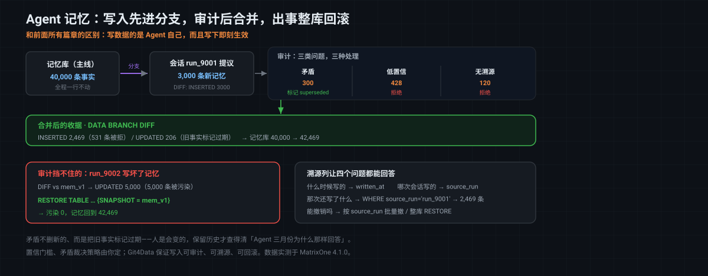

# MatrixOne Git4Data 技术详解（十三）·Agent 篇：Memory——从行业方案到可治理的长期记忆

在 Git4Data 系列的前十二篇里，我们讨论过数据运维、机器学习数据集、多模态数据、SFT 和 RLHF。场景不断变化，但有一件事始终没有变：**决定修改数据、执行修改并检查结果的，最终还是人。**

到了 Agent，这条边界开始消失。

一个 Agent 可以在对话中发现事实、形成判断，再把这些内容写入自己的长期状态。写入完成后，不需要重新训练，也不需要等待下一次发布；它可能在几秒后就读到这条信息，并据此回答问题或调用工具。

这让数据版本控制面对了一类新的数据：**写入者是 Agent，使用者也是 Agent；数据一旦写下，就可能立刻改变它后续的行为。**

先看一个很普通的场景。

一个编程 Agent 今天完成了三件事：确认项目统一使用 pnpm，发现鉴权模块有一个历史兼容约束，并决定下一步迁移数据库连接层。

第二天重新打开会话，它却再次建议 npm，重复踩进同一个兼容问题，也不知道迁移做到哪一步。

模型没有突然变笨。真正缺失的是一层能跨会话保存、检索和更新状态的系统：**Memory**。

Memory 经常被理解成"把聊天记录存下来"，但这远远不够。一个可用的 Agent Memory 不仅要记住信息，还要回答一组更难的问题：什么值得记、什么时候取出来、旧信息如何更新、互相冲突的记忆如何处理、错误写入能否撤销，以及多个 Agent 共享记忆时如何追溯来源。

所以，Git4Data 系列进入 Agent 篇后，首先要回答的不是"Agent 能调用哪些工具"，而是一个更基础的问题：**Agent 的记忆应该如何保存，又怎样才能安全地变化？**

这篇文章先从 Memory 的本质和作用讲起，再梳理行业里的主要做法，最后介绍 MatrixOne 为什么适合承载 Agent Memory，以及它的 Git4Data 能力（分支、DIFF、快照与回滚）能为长期记忆带来什么。

> 文中的示例 SQL 已在 MatrixOne `4.1.0` 上验证。完整脚本见 [git4data-tutorial](https://github.com/matrixorigin/git4data-tutorial/blob/354b9cff424cafb50d0b58128e78cc36970fe211/13-agent-memory/agent_memory_demo.sql)。

---

## 一、Memory 是什么：Agent 的长期状态层

对 Agent 而言，Memory 是一组能够**跨会话保存，并在未来任务中被检索、更新或遗忘的信息**。它不是某一种固定的数据结构，而是一套持续运行的状态机制。

常见的记忆大致可以分为几类：

| 类型 | 记录什么 | 示例 | 生命周期 |
|---|---|---|---|
| 工作记忆 | 当前任务的临时状态 | "正在排查 auth 模块的 token 过期问题" | 任务结束后可清理 |
| 语义记忆 | 相对稳定的事实与知识 | "服务端使用 Go 1.22" | 长期保存，随事实变化而更新 |
| 情景记忆 | 过去发生过的事件 | "上次迁移因旧版驱动不兼容而回退" | 可归档、压缩或总结 |
| 程序记忆 | 可复用的做事方法 | "发布前先运行集成测试，再执行灰度部署" | 长期保存，可被新流程替代 |
| 用户画像 | 偏好、权限与交互习惯 | "用户偏好简洁回答" | 长期保存，但必须可查看和删除 |

这张表不是理论分类。后面会看到，把这几类记忆**显式建模成不同的类型、配上各自的生命周期**，正是一个生产级 Memory 系统和"一个大文件"之间最实际的差别之一。

Memory 还容易和三个概念混淆。

### Memory 不是上下文窗口

上下文窗口是模型在**当前一次推理**中能看到的内容。它容量有限，也不天然跨会话。Memory 则在模型之外持久保存，需要时再把相关内容送入上下文。

### Memory 不是训练数据

训练数据通过训练或微调改变模型参数，周期长、成本高。Memory 不改模型权重，而是在推理时提供外部状态，因此可以即时写入、即时生效，也可以被更新或删除。

### Memory 也不等于 RAG 知识库

RAG 通常帮助模型从文档、代码或知识库中"查资料"。Memory 更强调 Agent 自己在工作过程中形成的状态：用户偏好、任务进度、过去的决策、成功或失败的经验。两者会共享检索技术，但数据的来源、变化频率和治理要求不同。

更准确地说，Agent Memory 不是一个"存储盒子"，而是一条完整链路：

> 捕获信息 → 判断是否值得记忆 → 结构化或总结 → 检索 → 使用 → 更新、合并或遗忘 → 审计与恢复

只完成"存"和"搜"，还不等于建立了可靠的 Memory。

---

## 二、Memory 对 Agent 有多重要

Memory 的价值并不只是让 Agent "更懂你"。它直接影响 Agent 能否从一次性问答工具，变成能够持续工作的系统。

### 1. 让任务跨越上下文窗口和会话

复杂的编码、研究、运维或客户服务任务，往往无法在一个会话里结束。Memory 可以保留目标、阶段结果、已尝试方案和未解决问题，让 Agent 在新的会话中继续工作，而不是从头重建上下文。

### 2. 避免重复探索，积累可复用经验

Agent 如果能记住"哪种方案在这个项目里失败过、为什么失败"，就能减少重复试错。长期来看，系统积累的不只是事实，还有对特定用户、项目和环境有效的工作方式。

### 3. 支持个性化和一致性

用户偏好、业务约束和团队规范如果只能靠每次提示重复输入，Agent 的表现就很难稳定。Memory 让这些信息能够跨任务持续生效，同时允许用户查看、修正和删除。

### 4. 让多个 Agent 共享状态

当编程、测试、研究和运维 Agent 协同工作时，共享记忆可以减少上下文搬运。不过，共享也带来了新的治理问题：谁写入了这条事实，其他 Agent 是否应该信任它，它影响过哪些任务？

### 5. 精准召回还直接省下上下文预算

这一点常被当成附带收益，但它其实是可量化的。如果没有 Memory，维持连续性的常见做法是把历史全量注入上下文——**注入量会随对话轮次滚雪球**。我们在 Memoria 上做过一组对照：

| | 第 1 轮 | 第 3 轮 | 第 5 轮 | 第 10 轮 |
|---|---|---|---|---|
| 全量注入历史 | 500 | 1,900 | 4,200 | **10,000+** |
| 按需召回（每轮 3–5 条相关记忆） | 500 | 800 | 900 | **~2,500** |

差别不只是账单。上下文窗口里每一个无关 token 都在稀释模型对相关内容的注意力，所以**"取回该取的、不取不该取的"同时改善成本和质量**。

### 6. Memory 也会放大错误

上下文中的一次误解，通常会随着会话结束而消失；长期记忆中的一次误解，却可能在未来几个月反复被检索，持续影响回答和行动。

这意味着 Memory 同时是 Agent 的能力放大器和风险放大器。Agent 越自主、记忆保存得越久、共享范围越大，审计与恢复就越重要。OWASP 已把持久记忆与上下文投毒列为 Agent 系统的重要风险之一：[Memory & Context Poisoning](https://genai.owasp.org/2025/12/09/owasp-top-10-for-agentic-applications-the-benchmark-for-agentic-security-in-the-age-of-autonomous-ai/)。

---

## 三、行业里如何构建 Agent Memory

今天并不存在一种适合所有场景的 Memory 方案。行业实践大致可以分成以下几类，它们解决的是不同层次的问题。

### 1. 提示词与 Markdown 文件

典型代表是 `AGENTS.md`、`CLAUDE.md` 和各类 rules 文件。它们透明、易编辑、能随代码一起进入 Git，非常适合保存编码规范、常用命令和架构原则等**变化较慢的护栏**。Claude Code 官方文档也把项目规则和用户偏好作为文件型 Memory 的主要用途：[Manage Claude's memory](https://docs.anthropic.com/zh-CN/docs/claude-code/memory)。

它的局限同样明显：内容通常需要人工维护；动态事实容易过期；文件变长后只能全量加载或人工拆分；不同生命周期和权限的数据也难以独立管理。

因此，Markdown 不是"错误方案"，而是更适合静态规则，不适合独自承担持续变化的长期记忆。

### 2. 对话历史与自动摘要

把最近的消息保留在窗口里，较早的内容压缩成摘要，是最常见的短期记忆方式。它实现简单，适合保持一次任务的连续性。

但摘要是一种有损压缩。随着会话拉长，早期细节、因果关系和少数关键约束可能被逐步丢失；它也很难支持精确查询、选择性更新和跨用户隔离。

### 3. 向量库与 RAG

将历史对话、笔记和经验切分后做向量化，再按语义相关性检索，可以避免每次全量加载。这是处理大规模非结构化记忆的有效方式。

但相似度只能回答"哪段内容看起来相关"，不能天然回答"哪条是最新事实""两条记忆是否冲突""是谁写的""能否撤销某次写入"。如果只追加、不更新，旧结论和新结论可能同时被检索出来。

### 4. 结构化数据库或知识图谱

把用户、项目、实体、关系、时间和来源显式建模，可以进行精确过滤、冲突检查、权限控制和统计分析。知识图谱尤其适合表达复杂关系。

代价是需要设计 schema、实体解析与更新策略；仅有结构化存储，也不能自动解决语义检索和版本治理问题。

### 5. 专用 Memory 框架或平台内建记忆

Letta 等 Memory 框架会组合常驻记忆块、文件和可检索的归档记忆，并让 Agent 通过工具主动管理它们：[Letta Context Hierarchy](https://docs.letta.com/guides/core-concepts/memory/context-hierarchy)。GitHub Copilot Memory 则会保存仓库事实和用户偏好，在使用仓库事实前验证其代码引用，并对长期未验证的记忆设置过期机制：[About GitHub Copilot Memory](https://docs.github.com/en/copilot/concepts/agents/copilot-memory)。

这类方案降低了接入成本，也说明行业正在从"保存更多文本"走向"验证、更新和治理记忆"。局限在于平台绑定、数据控制范围和治理策略的可定制程度各不相同。

### 这些方案不是互斥的

生产系统通常会分层组合：

- 静态规范放在 Markdown 中；
- 当前任务状态放在短期工作记忆中；
- 文档和历史事件通过向量检索召回；
- 用户、项目、来源和有效期进入结构化存储；
- 版本、审计和恢复由数据基础设施负责。

问题的核心并不是"文件还是向量库"，而是能否覆盖 Memory 的完整生命周期。

---

## 四、生产级 Memory 需要哪些能力

当 Agent 开始自主写入长期记忆时，至少需要七类能力：

1. **持久化**：跨会话、跨进程保存状态。
2. **相关性检索**：综合语义相似度、关键词、实体、时间、类型和权限，取回当前任务真正需要的内容。
3. **记忆分型与生命周期**：工作记忆可以自动过期，稳定规则长期保存，旧决策可被新决策替代。
4. **来源与时间**：知道哪个用户、Agent 或任务在什么时候写入了什么。
5. **冲突与更新**：识别重复、过期和互相矛盾的记忆，保留必要的历史。
6. **写入隔离与审计**：高风险写入先进入隔离区，确认变化范围后再生效。
7. **版本与恢复**：发生误写、批量污染或渐进漂移时，可以回到已知良好的状态。

传统向量检索主要解决第 2 条；schema 与应用逻辑可以解决第 3、4、5 条的一部分；而第 6、7 条要求底层数据系统本身具备版本化能力。

这正是 MatrixOne 的 Git4Data 能力的切入点。

---

## 五、在 MatrixOne 上构建 Memory，带来了什么

[Memoria](https://thememoria.ai) 是我们基于 MatrixOne 构建的开源 Agent Memory 项目（Apache-2.0，[GitHub](https://github.com/matrixorigin/Memoria)）。做它的出发点很简单：

> Git 让代码可以安全修改。我们希望记忆也一样。

它通过 MCP 向 Agent 暴露 `memory_store`、`memory_retrieve`、`memory_correct`、`memory_purge`、`memory_snapshot`、`memory_branch`、`memory_diff` 和 `memory_rollback` 等工具。Agent 使用的是 Memory 工具，而不是直接操作数据库；MatrixOne 则在底层提供统一的数据与版本能力：

```text
你的 Agent                    Memoria                 MatrixOne
Kiro / Cursor /   ──MCP──▶   MCP Server   ──────▶    CoW Engine
Claude Code /     REST       记忆分型 / 检索          零拷贝分支
Codex / OpenClaw  stdio·SSE  治理 / 快照管理          即时快照 · 回滚
```

接入是工具无关的：Kiro、Cursor、Claude Code、Codex 有现成配置，OpenClaw 有插件，自建 Agent 走 MCP 或 REST API。**换模型、换 Agent 工具时，Memory 不必跟着迁移。**

下面几点是"建在 MatrixOne 上"带来的实际差别。

### 1. 一份数据，同时支持精确查询与混合检索

Agent Memory 往往既包含结构化字段，也包含自然语言内容。MatrixOne 在同一套引擎中提供关系查询、向量检索和全文检索，可以把"语义上相关"与"属于这个项目、由这个用户创建、仍处于有效期内"等条件组合起来，而不必在关系数据库和向量库之间维护两份状态。MatrixOne 官方文档列出了内建的向量、全文检索及 Git for Data 能力：[MatrixOne Documentation](https://docs.matrixorigin.cn/)。

混合检索解决的是纯关键词匹配的一个典型失败：记忆里存的是「black formatter」，用户问的是「格式化工具」——关键词匹配不上，语义检索能找到。而反过来，精确的项目名、路径、版本号又需要全文检索来兜底。**两者在同一份数据上同时可用，才不用在召回率和精确率之间二选一。**

### 2. 记忆分型不是标签，而是不同的生命周期

在 Memoria 里，我们把第一节那张表落成了六种显式类型：`semantic`、`profile`、`procedural`、`working`、`tool_result`、`episodic`。类型不只是一个用于过滤的字段——它决定了这条记忆**该活多久**：`working` 记忆在任务结束后应当被清理，`profile` 应当长期保存并可被用户查看和删除，`semantic` 会随事实变化被新版本替代。

这正是 Markdown 文件做不到的地方：同一个文件里的所有内容共享同一个生命周期，你没法让其中三行自动过期。

### 3. 自治治理：矛盾检测、低置信隔离、自动去重

记忆库如果只增不减，检索质量会随时间下降。所以我们在 Memoria 里内置了矛盾检测、低置信度隔离和自动去重。这条管线是**专用实现、不额外调用 LLM**——这是个有意的取舍：治理如果每条记忆都要过一次模型，规模一上来就跑不动了。

### 4. 规模与检索性能

记忆库不会一直是几百条。按我们目前覆盖的量级：个人助手约 100 条、团队级 10K、企业级 1M（GPU 加速），十亿级走 DiskANN；GPU 检索由 NVIDIA cuVS 驱动，约 **12× 加速**。

这里想说明的不是具体倍数，而是一个结构性事实：**Memory 的检索路径最终是数据库问题**。当记忆规模从"能塞进上下文"跨过"必须索引"这条线之后，它需要的就是一个真正的检索引擎，而不是一个更大的文件。

### 5. Git4Data 能力让记忆变更可隔离、可比较、可恢复

这是 MatrixOne 与普通"数据库 + 向量索引"方案最不同的地方：记忆不仅能存和搜，还能像代码一样先开分支、查看差异、合并，并在出错时恢复——`snapshot → branch → diff → merge → rollback` 这条链路由 MatrixOne 原生的 Copy-on-Write 引擎驱动，是毫秒级的元数据操作，不产生数据副本。

需要把边界说清楚：

- `confidence`、`source_run`、记忆类型和冲突判定，是 **Memoria 或业务应用的模型与策略**；
- branch、DIFF、merge、snapshot 和 restore，是 **MatrixOne 通过 Git4Data 这项能力提供的底层机制**。

这项能力不替 Agent 判断"什么应该被记住"，但它能保证这个判断过程有隔离区、有变更记录，并且可以撤销。

### 6. 和其他方案放在一起看

和几种常见方案放在一起看是这样——需要说明的是，这里比较的是各方案的**默认路径**，不是产品能力的全部：

| 能力维度 | Memoria | Mem0 | Letta | Markdown 文件 |
|---|---|---|---|---|
| 版本控制（快照/分支/回滚） | **原生 CoW** | 无 | Git 版本控制 | 无 |
| 隔离实验（分支沙盒） | **用户可操作，一键创建** | 无 | Agent 内部 worktree | 无 |
| 完整审计追踪 | **每次变更可溯源** | 有限日志 | Git 提交历史 | 无 |
| 语义搜索 | 向量 + 全文混合 | 向量 + 图 + KV | 文件系统导航 | 仅关键词 |
| 自治治理 | 专用管线（无 LLM 开销） | LLM 驱动自动化 | Git 合并 + 整理 | 无 |
| 结构化记忆类型 | **6 种类型 + 生命周期** | 扁平 KV | 纯文本块 | 非结构化文本 |
| Token 效率 | 按需召回（3–5 条） | 按需召回 | 按需召回 | 全文件注入 |
| 多 Agent 共享 | **每用户共享记忆池** | 按 Agent 隔离 | 按 Agent 隔离 | 手动复制文件 |

对比里最值得注意的是前三行：**语义检索这件事，几个方案都做了；真正拉开差距的是版本、隔离和审计**——而这三件事恰好不是 Memory 层能靠自己补上的，它取决于底层数据系统是否原生支持。


---

## 六、Git4Data 能力如何让 Agent Memory 更安全

下面用一个客服 Agent 的长期记忆库说明完整流程。

### 1. 先为记忆补上应用层的治理字段

```sql
CREATE TABLE agent_memory (
    mem_id      BIGINT PRIMARY KEY,
    subject_key VARCHAR(64),
    fact_key    VARCHAR(64),
    fact_value  VARCHAR(256),
    confidence  DOUBLE,
    source_run  VARCHAR(32),
    written_at  DATETIME,
    status      VARCHAR(16)     -- active / superseded
);
```

这里的 `source_run` 和 `written_at` 用于追溯来源，`confidence` 支持风险策略，`status` 保留事实被替代的历史。这些字段属于 Memory 的应用设计。

### 2. Agent 不直接写主记忆库，而是写入分支

假设主记忆库已有 40,000 条事实，一次运行 `run_9001` 准备写入 3,000 条新记忆：

```sql
DATA BRANCH CREATE TABLE memory_staging FROM agent_memory;

INSERT INTO memory_staging SELECT ...;

DATA BRANCH DIFF memory_staging AGAINST agent_memory OUTPUT SUMMARY;
-- INSERTED 3000
```

分支提供了一个与主记忆隔离的写入空间。Agent 可以先写，主线数据在审核通过前保持不变。

### 3. 在分支上执行治理策略

在示例数据中，审计发现：

- 300 条新事实与现有活跃事实冲突；
- 428 条置信度低于阈值；
- 120 条缺少来源信息。

低置信和无来源的记忆被拒绝；对于冲突，不直接删除旧事实，而是根据业务策略把旧记录标记为 `superseded`，保留"Agent 在某个时间点曾经相信什么"的历史。

```sql
DELETE FROM memory_staging
WHERE mem_id >= 500000
  AND (confidence < 0.5 OR source_run IS NULL);

UPDATE memory_staging m
SET status = 'superseded'
WHERE m.mem_id < 500000
  AND m.status = 'active'
  AND EXISTS (
      SELECT 1
      FROM memory_staging s
      WHERE s.mem_id >= 500000
        AND s.subject_key = m.subject_key
        AND s.fact_key = m.fact_key
        AND s.fact_value <> m.fact_value
  );
```

这里需要再次区分：**冲突规则由应用定义，Git4Data 能力负责让规则在隔离分支上运行。**

### 4. 用 DIFF 查看净变化，通过后再合并

```sql
DATA BRANCH DIFF memory_staging AGAINST agent_memory OUTPUT SUMMARY;
-- INSERTED 2469 / UPDATED 206

DATA BRANCH MERGE memory_staging INTO agent_memory;
-- 40,000 → 42,469
```

DIFF 提供的不是一条模糊的"写入成功"日志，而是主线即将发生的实际变化。它可以接入自动规则，也可以在高风险场景下进入人工审批。

### 5. 用快照处理批量污染和渐进漂移

在一个已知良好的状态创建快照：

```sql
CREATE SNAPSHOT mem_v1 FOR TABLE agent_mem agent_memory;
```

如果后续某次运行污染了 5,000 条记忆，可以先用 DIFF 评估影响，再恢复：

```sql
DATA BRANCH DIFF agent_memory
AGAINST agent_memory {SNAPSHOT='mem_v1'}
OUTPUT SUMMARY;
-- UPDATED 5000

RESTORE TABLE agent_mem.agent_memory {SNAPSHOT = mem_v1};
```

回滚不仅适用于"某次运行明显写坏了 5,000 行"的事故，也适用于更难定位的渐进漂移：Agent 每次只学错一点，几周后整体行为开始偏离预期，却找不到唯一的故障会话。此时，回到一个已知良好的版本，比逐条猜测该删哪条记忆更可靠。

反过来说，**能回滚也改变了做事方式**：知道随时能退回一个已知良好的状态，你才敢让 Agent 去试新的工作流、新的提示词策略。我们把这条单独当成一个价值来讲，就是因为分支和快照的意义不只是救火，更是让实验的成本变得可承受。



### Git4Data 能力带来的核心变化

| 过去的问题 | 用上 Git4Data 能力后 |
|---|---|
| Agent 写入后立即影响主记忆 | 先写分支，审核后合并 |
| 不知道一次运行到底改了什么 | 用 DIFF 查看净变化 |
| 批量污染只能逐条清理 | 用快照和 RESTORE 回到已知版本 |
| 新策略只能直接在线试 | 在独立分支试验，成功后合并 |
| 多 Agent 写入难以复盘 | 应用层来源字段 + 数据版本共同形成审计链 |

因此，Git4Data 这项能力对 Memory 的价值不是"让检索更聪明"，而是**让记忆可以安全地变化**。

---

## 七、哪些场景适合这套方案

### 适合

- **长期运行的编程、研究和运维 Agent**：任务跨越多次会话，需要保存决策、进度和经验。
- **客服、销售和个人助理**：用户偏好与历史状态会持续影响后续交互，错误记忆可能产生长期影响。
- **多 Agent 协作系统**：多个写入者共享记忆，需要来源、权限、冲突处理和统一恢复点。
- **Agent 可以自主写入的生产系统**：人工无法逐条审核，必须限制错误写入的影响范围。
- **有审计、合规或数据主权要求的行业**：需要解释 Agent 为什么在某个时间点做出某种回答或行动。
- **需要试验不同 Agent 策略的团队**：可以让不同分支积累不同记忆，比较效果后再选择是否合并。再往前一步是"训练一个 Agent，把记忆 Fork 给每个队友"——一位资深工程师调教出来的工作方式，可以直接复制给团队里的其他人。

### 不适合

- **一次性、短时任务**：会话结束后不再使用的上下文，摘要或工作记忆已经足够。
- **变化很慢的静态规范**：编码风格、目录规则和安全护栏放在 Markdown 中更透明。
- **单人、单 Agent、数据量很小的项目**：人工可以清楚查看和修正全部记忆时，引入完整治理流程可能得不偿失。
- **只读知识问答**：如果 Agent 只检索经过人工维护的文档，不会自主修改知识库，普通 RAG 已能解决大部分问题。

务实的架构通常是分层的：Markdown 管静态护栏，短期缓冲管当前任务，向量与全文检索负责召回，结构化表负责状态与权限，MatrixOne 的 Git4Data 能力负责高价值长期记忆的版本和恢复。

---

## 结语

Agent Memory 的本质，是 Agent 在模型之外持续维护的一层状态。它决定了 Agent 能否跨会话推进任务、积累经验、保持个性化并与其他 Agent 协作。

行业已经形成了多种路径：Markdown 适合透明的静态规则，对话摘要适合短期连续性，向量检索适合大规模语义召回，结构化数据库适合状态与关系，专用平台负责把这些能力封装成 Agent 可以调用的工具。真正进入生产后，问题会从"如何记住"继续走向"如何更新、审计、隔离和恢复"。

MatrixOne 的价值，在于把结构化数据、向量与全文检索，以及 Git4Data 这项版本能力放在同一套系统里。Memoria 在上层负责记忆类型、提取、检索与治理策略；MatrixOne 在底层用 Git4Data 能力提供分支、DIFF、合并、快照和回滚。

它不替 Agent 决定什么是真相，但能让每一次记忆变化都有边界、有记录、可撤销。

对于会长期运行、持续学习并自主写入状态的 Agent，这不是锦上添花，而是让它从"能记住"走向"可以被信任"的基础设施。
