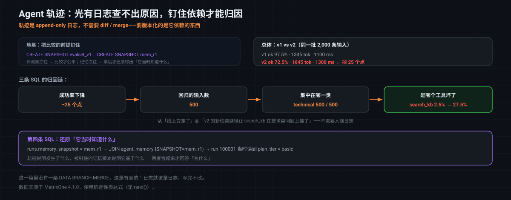

# MatrixOne Git4Data 技术详解（十四）·Agent 篇：运行轨迹——光有日志，查不出原因

[上一篇](https://github.com/matrixorigin/matrixorigin-blog/blob/main/matrixorigin/git4data-part13-agent-memory-zh/index.md)讲了 Agent 的**记忆**：由 Agent 自己写入、立刻生效，所以需要分支审计和回滚。这一篇讲 Agent 跑起来之后留下的另一样东西——**运行轨迹（trace）**。

先把话说在前面，因为这一篇和前面几篇有个重要区别：

> **轨迹是 append-only 的日志，它不需要、也不适合做行级 diff 和 merge。** 你不会去"修改"一条已经发生的运行记录。
>
> 所以这一篇要解决的不是"怎么给日志做版本"，而是另一个更棘手的问题：**光有日志，你查不出原因。**

> 文中 SQL 全部在 MatrixOne `4.1.0` 上实测，使用确定性表达式（无 `rand()`）；可跑版本见 [matrixorigin/git4data-tutorial](https://github.com/matrixorigin/git4data-tutorial) 的 `14-agent-trace/`。

---

## 为什么"有完整日志"还是查不出原因

假设你的 Agent 可观测性做得很好：每一次运行的每一步都记下来了——调了哪个工具、传了什么参数、返回了什么、花了多少 token、耗时多久。

现在 Agent 从 v1 升到 v2，线上反馈变差了。你打开日志，看到某次运行在第 3 步调用 `search_kb` 失败了。然后呢？

**你会立刻卡在两个问题上：**

**第一，这次失败是不是普遍现象？** 要回答它，你得让 v1 和 v2 在**同一批输入**上各跑一遍再比。可如果那批评测输入本身在这期间被人加过、改过——比较就不成立了。你以为在比两个 Agent 版本，其实在比两批不同的题。

**第二，为什么它会那样做？** 这是更根本的。Agent 的行为不只由代码决定，还由它**当时读到的东西**决定：

```text
一次运行的行为 = 代码/模型 × 配置 × 它当时读到的记忆 × 输入
```

日志忠实地记录了"发生了什么"，但记忆是**一直在变**的（[上一篇](https://github.com/matrixorigin/matrixorigin-blog/blob/main/matrixorigin/git4data-part13-agent-memory-zh/index.md)的主题）。等你三天后回来查，记忆库已经不是当时那个样子了。**你能看到 Agent 做了什么，却永远还原不出它当时"知道"什么。**

这一篇要补的，就是这两个缺口：**把评测集钉住**，让比较成立；**把每次运行读到的记忆/配置版本记下来**，让原因可还原。

---

## 贯穿全文的案例：一次 v1 → v2 的回归排查

案例：还是那个客服 Agent。2,000 条评测输入，在 v1 和 v2 下各跑一遍，共 4,000 次运行、16,000 个步骤。

### 先钉住评测集和记忆

这两条 SQL 是整篇的地基：

```sql
CREATE SNAPSHOT evalset_v1 FOR TABLE agent_trace eval_inputs;   -- 题目冻住
CREATE SNAPSHOT mem_r1     FOR TABLE agent_trace agent_memory;  -- 记忆冻住
```

### 轨迹表：注意 `memory_snapshot` 这一列

```sql
CREATE TABLE runs (
    run_id          BIGINT PRIMARY KEY,
    agent_version   VARCHAR(16),
    input_id        BIGINT,
    memory_snapshot VARCHAR(32),   -- 这次运行读的是哪一版记忆  ← 关键
    config_version  VARCHAR(16),   -- 用的哪一版配置
    status          VARCHAR(12),
    n_steps         INT,
    total_tokens    INT,
    latency_ms      INT
);

CREATE TABLE run_steps (
    step_id    BIGINT PRIMARY KEY,
    run_id     BIGINT,
    step_no    INT,
    step_type  VARCHAR(12),        -- llm / tool
    tool_name  VARCHAR(32),
    ok         TINYINT,
    latency_ms INT
);
```

`memory_snapshot` 这一列只是一个字符串，但它把轨迹和[第十三篇](https://github.com/matrixorigin/matrixorigin-blog/blob/main/matrixorigin/git4data-part13-agent-memory-zh/index.md)的记忆版本**连了起来**。后面会看到它的价值。

---

## 第一步：看总体——差多少

```sql
SELECT agent_version,
       COUNT(*) AS runs,
       SUM(CASE WHEN status = 'ok' THEN 1 ELSE 0 END) AS ok_runs,
       ROUND(100.0 * SUM(CASE WHEN status='ok' THEN 1 ELSE 0 END)/COUNT(*), 1) AS ok_pct,
       ROUND(AVG(total_tokens), 0) AS avg_tokens,
       ROUND(AVG(latency_ms), 0)   AS avg_latency_ms
FROM runs GROUP BY agent_version ORDER BY agent_version;
```

实测结果：

| agent_version | runs | ok_pct | avg_tokens | avg_latency_ms |
|---|---|---|---|---|
| v1 | 2000 | **97.5** | 1345 | 1100 |
| v2 | 2000 | **72.5** | 1645 | 1300 |

成功率掉了 25 个百分点，token 还涨了 22%。**因为评测集被 `evalset_v1` 冻住了，这个对比是成立的**——两个版本回答的是同一批题，一道不多、一道不少。

但到这里你只知道"变差了"，不知道"差在哪"。

---

## 第二步：归因到输入——是哪些题变差了

```sql
SELECT COUNT(*) AS regressed_inputs
FROM runs a JOIN runs b ON a.input_id = b.input_id
WHERE a.agent_version = 'v1' AND b.agent_version = 'v2'
  AND a.status = 'ok' AND b.status = 'failed';
--   实测 500
```

500 条输入从"通过"变成了"失败"。再按类别拆一层：

```sql
SELECT e.category, COUNT(*) AS regressed
FROM runs a
JOIN runs b ON a.input_id = b.input_id
JOIN eval_inputs e ON e.input_id = a.input_id
WHERE a.agent_version = 'v1' AND b.agent_version = 'v2'
  AND a.status = 'ok' AND b.status = 'failed'
GROUP BY e.category ORDER BY regressed DESC;
--   实测 technical → 500，其他类别 0
```

**500 条全部集中在 `technical` 一类**。这一下范围就收窄了——不是普遍退化，是某一类问题上的定向失效。

---

## 第三步：归因到步骤——是哪个工具坏了

```sql
SELECT r.agent_version, s.tool_name,
       COUNT(*) AS calls,
       SUM(CASE WHEN s.ok = 0 THEN 1 ELSE 0 END) AS failures,
       ROUND(100.0 * SUM(CASE WHEN s.ok=0 THEN 1 ELSE 0 END)/COUNT(*), 1) AS fail_pct
FROM run_steps s JOIN runs r ON s.run_id = r.run_id
WHERE s.step_type = 'tool'
GROUP BY r.agent_version, s.tool_name ORDER BY r.agent_version;
```

| agent_version | tool_name | calls | failures | fail_pct |
|---|---|---|---|---|
| v1 | search_kb | 2000 | 50 | **2.5** |
| v2 | search_kb | 2000 | 550 | **27.5** |

**`search_kb` 这个工具的失败率从 2.5% 涨到了 27.5%。** 至此，一条完整的归因链就出来了：

```text
v2 成功率 −25 个点
   └─ 500 条输入回归
        └─ 全部在 technical 类
             └─ search_kb 工具失败率 2.5% → 27.5%
```

从"线上变差了"到"是 v2 新的检索路径让 search_kb 在技术类问题上挂了"，全程三条 SQL，**不需要人去翻日志**。



---

## 第四步：还原「它当时知道什么」

前面三步靠的是结构化的轨迹表和被冻住的评测集。但最开头那个更根本的问题——**为什么**——还需要最后一样东西。

因为每次运行都记下了 `memory_snapshot`，几个月后依然可以精确还原它当时读到的记忆：

```sql
SELECT r.run_id, r.memory_snapshot, m.fact_key, m.fact_value
FROM runs r
JOIN agent_memory {SNAPSHOT='mem_r1'} m       -- 时间旅行回那一版记忆
  ON m.subject_key = CONCAT('cust_', r.input_id)
WHERE r.run_id = 100001;
--   实测 100001 / mem_r1 / plan_tier / basic
```

这一句是这篇的关键。**它把"日志"升级成了"可还原的现场"**：轨迹告诉你 Agent 做了什么，被钉住的记忆版本告诉你它当时基于什么在做。二者一起，才回答得了"为什么"。

同样地，评测集也可以随时回看，证明比较确实公平：

```sql
SELECT COUNT(*) AS eval_inputs_at_v1 FROM eval_inputs {SNAPSHOT='evalset_v1'};   -- 实测 2000
```

---

## 说清楚 Git4Data 在这里做什么、不做什么

这一篇必须把边界划清楚，否则容易过度包装：

**它不做的**：给 append-only 的日志做行级 diff / merge。日志就该是日志——写完不改，用列存和分区去扛量、用 TTL 去做保留策略。**这一篇里没有一条 `DATA BRANCH MERGE`，这是有意的。**

**它做的，是让轨迹能被"解释"**：

| 缺口 | 补法 |
|---|---|
| 比较不公平（评测集在变） | 给评测集打快照，比较双方读同一版 |
| 还原不出当时的认知 | 每次运行记 `memory_snapshot`，事后时间旅行回去读 |
| 归因靠翻日志 | 轨迹结构化进表，归因就是 JOIN 和 GROUP BY |
| 证据会过期 | 把这一轮评测的轨迹和它依赖的数据版本一起冻住 |

一句话：**轨迹本身不需要版本控制，但轨迹要有意义，它依赖的东西必须被版本控制。**

---

## 边界与适用范围

- **轨迹量很大，要分开考虑存储策略。** 一次运行几十个步骤，线上每天几十万次运行，轨迹表的增长远快于业务表。快照适合钉住"某一轮评测"的证据，不适合无差别地给所有生产轨迹长期留版本。

- **成功率不等于质量。** `status = 'ok'` 只说明流程跑完了，不代表答得好。真实评测还需要人工评分或模型评分，那些分数同样应该和这批轨迹绑在一起。

- **别把 `memory_snapshot` 写成"当前"。** 记的必须是运行开始那一刻的确切版本号，而不是 `latest` 这种会漂移的引用——否则等于没记。

- **快照有保留成本。** 每一轮评测钉一个快照，废弃的评测轮次要有清理策略。

---

## 结语

Agent 的可观测性，通常被理解成"把日志记全"。但记全只解决了一半：**日志告诉你发生了什么，却还原不出它当时基于什么发生**——因为 Agent 读的记忆和配置一直在变。

把评测集和记忆钉成版本、每次运行记下它读的是哪一版，之后排查就从"翻日志"变成了"查数据"：**成功率 97.5% → 72.5%，500 条回归输入全部落在 technical 类，根因是 search_kb 失败率从 2.5% 涨到 27.5%**——三条 SQL；而"这次运行当时到底知道什么"，是第四条。

> 📎 可运行 SQL：[github.com/matrixorigin/git4data-tutorial](https://github.com/matrixorigin/git4data-tutorial) ｜ 源码与社区：[github.com/matrixorigin/matrixone](https://github.com/matrixorigin/matrixone)
