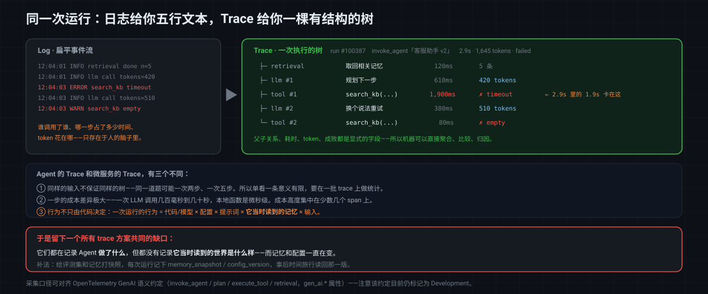

# MatrixOne Git4Data 技术详解（十四）·Agent 篇：运行轨迹——从"可观测"到"可归因"

[上一篇](https://github.com/matrixorigin/matrixorigin-blog/blob/main/matrixorigin/git4data-part13-agent-memory-zh/index.md)讲了 Agent 的 **Memory**：由 Agent 自己写入、立刻生效，所以需要隔离、审计和回滚。这一篇讲 Agent 跑起来之后留下的另一样东西——**运行轨迹（Trace）**。

和 Memory 相比，Trace 是一个更"技术"、也更容易被含糊带过的词。很多团队都说自己"接了 trace"，但真被问到"你这条 trace 里到底有什么、能回答什么问题"，答案往往就不那么清楚了。所以这一篇会先花一些篇幅把 Trace 讲清楚：**它从哪来、一条 Agent trace 长什么样、它和日志到底差在哪**；然后再谈它为什么对 Agent 特别重要、行业里都是怎么做的、以及在 MatrixOne 上做这件事能多出什么。

> 文中 SQL 全部在 MatrixOne `4.1.0` 上实测，使用确定性表达式（无 `rand()`）；可跑版本见 [git4data-tutorial](https://github.com/matrixorigin/git4data-tutorial/blob/354b9cff424cafb50d0b58128e78cc36970fe211/14-agent-trace/agent_trace_demo.sql)。

---

## 一、Trace 是什么：一次执行的完整结构，而不是一堆时间戳

### 它从哪来

Trace 不是 AI 时代的新发明。它来自**分布式追踪**：一个请求打进来，穿过网关、若干微服务、缓存和数据库，最后返回。每个服务单独打日志的话，你手里是十几份互不相干的记录；而 Trace 的做法是给这次请求分配一个 **trace id**，让它流经的每一段都记成一个 **span**（跨度），span 之间保留父子关系。

于是你得到的不是一堆日志行，而是**一棵树**：谁调用了谁、每段花了多久、哪一段失败了。这套模型由 Google 的 Dapper 论文奠定，今天的事实标准是 [OpenTelemetry](https://opentelemetry.io/)。

在可观测性的语境里，通常把它和另外两样并列：

| | 回答的问题 | 形态 | 例子 |
|---|---|---|---|
| **Metric（指标）** | 有多少、多快 | 时间序列上的数字 | 每分钟请求数、P99 延迟 |
| **Log（日志）** | 发生了什么 | 离散的、扁平的事件流 | `2026-08-19 ERROR search_kb timeout` |
| **Trace（轨迹）** | 一次执行经历了什么，各段之间是什么关系 | **有结构的树** | 一次请求的完整调用树 |

**Trace 和 Log 最本质的差别不是"更详细"，而是"有结构"。** 日志是一行一行的，它们之间的因果关系存在于人的脑子里；trace 把这层关系显式记了下来，所以机器可以直接聚合、比较和归因。

### 一条 Agent trace 长什么样

Agent 的执行天然就是树形的：一次运行里，模型先想，再决定调什么工具，工具返回后再想，可能再调一次，直到收敛。把它记成 trace 就是这样：

```text
run  #100387   invoke_agent  "客服助手 v2"           2.9s  · 1,645 tokens · failed
├─ retrieval        取回相关记忆                       120ms · 5 条
├─ llm  #1          规划下一步                         610ms ·   420 tokens
├─ tool #1          search_kb(q="SSL 证书 过期")     1,900ms · ✗ timeout   ← 失败在这
├─ llm  #2          换个说法重试                       380ms ·   510 tokens
└─ tool #2          search_kb(q="证书续期")             80ms · ✗ empty
```

一眼就能看出：慢在哪（`tool #1` 占了 2.9s 里的 1.9s）、token 花在哪（两次 llm 调用）、失败在哪（`search_kb` 两次都没成功），以及**这些之间的先后与从属关系**。

如果只有日志，你拿到的是五行文本；要复原上面这棵树，得靠人去拼。



### 有标准吗：OpenTelemetry 的 GenAI 语义约定

有，而且正在成型。OpenTelemetry 的 [GenAI 语义约定](https://github.com/open-telemetry/semantic-conventions-genai)已经把 Agent 的整个执行建模成了 span 树，而不只是单次 LLM 调用。`gen_ai.operation.name` 覆盖了完整的生命周期：

```text
create_agent · invoke_agent · invoke_workflow · plan · execute_tool · retrieval
```

配套的属性也已经定义好了一批，比如 `gen_ai.agent.name`、`gen_ai.conversation.id`、`gen_ai.provider.name`、`gen_ai.request.model`、`gen_ai.tool.definitions`，以及 token 口径 `gen_ai.usage.input_tokens` / `output_tokens` / `cache_read.input_tokens`。MCP 的工具调用约定也并入了同一个仓库，意味着 Agent 和它调用的 MCP 工具会出现在同一套 trace 词汇表里。

需要注意的是：**这套约定目前整体仍标记为 Development（实验性）**，属性名和结构还可能变。所以采集侧对齐 OTel 是对的，但不要指望它现在就是一个冻结的契约。

### Agent trace 和传统微服务 trace 的三个不同

这一点很关键，因为它决定了后面所有做法上的差异：

**第一，同样的输入不保证同样的树。** 微服务调用链基本是确定的：同一个接口，调用路径几乎不变。Agent 不是——同一道题跑两次，可能一次两步、一次五步，可能调不同的工具。**所以单看一条 trace 意义有限，你需要在一批 trace 上做统计。**

**第二，一步的成本差异极大。** 微服务里各段耗时通常在一个量级；Agent 里一次 LLM 调用可能是几百毫秒到几十秒、几百到几万 token，而一次本地函数调用是微秒级。**成本和延迟高度集中在少数几个 span 上。**

**第三，最重要的一点：行为不只由代码决定。** 微服务的行为由代码和入参决定，代码不变、入参不变，行为就不变。Agent 不是这样：

```text
一次运行的行为 = 代码/模型 × 配置 × 提示词 × 它当时读到的记忆 × 输入
```

上一篇讲的 Memory 一直在变，配置也可能在变。**这意味着一条 trace 只记录了"做了什么"，却不足以还原"为什么"**——除非你同时记下它当时读的是哪一版记忆、哪一版配置。

这个缺口，正是本文后半部分要补的。

---

## 二、Trace 对 Agent 有多重要

### 1. 没有 trace，Agent 就是彻底的黑盒

传统程序出错会抛异常、有堆栈。Agent 不会——它只是**给了一个不太对的答案**，而中间经历了多少步、调了什么工具、每一步拿到了什么，全部不可见。可观测性对普通服务是"锦上添花"，对 Agent 更接近**基本可调试性**。

### 2. 成本和延迟必须能归因到步骤

Agent 的账单不是均匀分布的。一次运行 1,645 个 token，可能 80% 花在某一次重试上；一次 2.9 秒的响应，可能 1.9 秒卡在一个超时的工具上。**只有把 token 和耗时记到 span 粒度，"为什么这个月账单翻倍了"才有答案**——否则只能看到总量涨了。

### 3. 失败要能落到具体的一步

"成功率从 97.5% 掉到 72.5%"是一个现象，不是一个可修的问题。可修的问题长这样：**"`search_kb` 在技术类问题上的失败率从 2.5% 涨到了 27.5%"**。从前者走到后者，靠的就是结构化的 trace。

### 4. 版本对比与回归排查

这是本文的重点场景。改了提示词、换了模型、调了检索策略之后，**新版到底是变好了还是变差了、差在哪**——这个问题几乎每天都要回答一次。它需要两样东西：一批被固定住的输入，和两个版本上可比较的 trace。

### 5. 评测的证据基础

评测报告说"v2 得分 82"，三个月后有人问"这 82 分是在哪批题、哪一版记忆上跑出来的"。**如果答不上来，这个分数就只是一个数字。** trace 是评测结论背后的证据，而证据要能被复查才算数。

---

## 三、行业里如何做 Agent Trace

### 1. 自己打结构化日志，落到日志系统

最朴素的做法：每一步打一条 JSON 日志，写进 ELK、Loki 或 ClickHouse。灵活、成本可控、数据完全在自己手里。

代价是**树形结构要自己维护**：trace id、span id、parent id 都得自己串；聚合分析要自己写查询；而且日志系统通常按时间保留（比如 30 天），**过期即失**——这对"三个月后复查一次评测"是致命的。

### 2. 在现有 APM 上扩展

Datadog、New Relic 这类平台已经有成熟的分布式追踪，直接把 LLM 调用当 span 上报即可，和既有的基础设施监控在一处。对已经在用 APM 的团队，接入成本最低。

局限在于这类平台的模型是围绕**服务健康度**建的：它擅长回答"延迟涨了吗、错误率多少"，但"这次回答质量怎么样""换个提示词后好了还是坏了"不在它的原生语义里。

### 3. LLM / Agent 专用的观测与评测平台

这几年长出来一批专门做这件事的产品，大致可以按侧重分几类：

- **[Langfuse](https://langfuse.com/docs/observability/overview)**：开源、可自托管，把 trace（提示词、响应、token、成本、延迟、检索与工具步骤）和**数据集、实验、LLM-as-a-Judge 评测**放在一起，适合有数据驻留要求或偏好自托管的团队。
- **LangSmith**：和 LangChain / LangGraph 生态结合最紧，完整展开一次运行的每一步与工具调用。
- **Arize Phoenix**：开源，评测指标丰富（忠实度、相关性、安全性、幻觉检测等）。
- **Braintrust**：以评测驱动开发为核心，强调把评测接进 CI/CD 做发布门禁。
- **W&B Weave**：适合已经在用 Weights & Biases 的团队，和实验管理连在一起。

这类工具解决了很多真问题：开箱即用的 span 树、成本归因、评测数据集、人工与模型评分。**如果你在选型，它们通常是正确的起点。**

它们的共同边界也比较清楚：trace 数据在平台内，**和你自己的业务数据、记忆库、配置表分处两个系统**；数据保留期由套餐决定；跨越"trace × 业务数据"的分析要么导出、要么放弃。

### 4. 对齐 OpenTelemetry 标准

用 OTel 的 GenAI 语义约定采集，后端可以自由替换——这是目前最健康的方向，上面几家也大多支持 OTel 摄入。要留意的还是那句：**约定本身仍在 Development 阶段**。

### 这些做法共同没解决的那件事

把上面几类放在一起看，它们在"记录得全不全、看得方不方便"上差异很大，但有一个缺口是共同的：

> **它们都在记录 Agent 做了什么，但都没有记录"它当时读到的世界是什么样"。**

trace 里有 `memory_snapshot` 这样一列的产品，我目前没有见到。原因也不难理解——**这需要记忆本身是可版本化的**，而这恰恰是一个数据库问题，不是一个观测平台的问题。

---

## 四、生产级 Agent Trace 需要哪些能力

把上面的场景收敛一下，至少需要这么几条：

1. **结构化的执行树**：span 之间的父子关系、每个 span 的类型（llm / tool / retrieval）、耗时、token、成败。
2. **能按维度聚合**：按版本、按输入类别、按工具名做统计，而不是逐条翻。
3. **成本与延迟归因到 span**：知道钱和时间花在哪一步。
4. **可比较的输入基线**：对比两个版本时，双方必须跑同一批输入，而且这批输入在比较期间不能变。
5. **能还原当时的依赖版本**：这次运行读的是哪一版记忆、哪一版配置、哪一版提示词。
6. **证据可长期保留**：评测轮次的 trace 和它依赖的数据，要能在几个月后原样复查。
7. **能和业务数据一起查**：trace 里的 `input_id` 要能 JOIN 回评测集，`subject_key` 要能 JOIN 回记忆库。

第 1、2、3 条，上面那些专用平台做得都不错，很多比手写要好。**第 4、5、6 条，本质上是版本化问题；第 7 条，本质上是"数据在不在一起"的问题。** 这两类恰好是数据库的地盘。

---

## 五、在 MatrixOne 上做 Trace，带来了什么

### 先说清楚不做什么

这一篇必须把边界划在前面，否则很容易过度包装：

> **Trace 是 append-only 的，它不需要、也不适合做行级 diff 和 merge。** 你不会去"修改"一条已经发生的运行记录。

所以**全文没有一条 `DATA BRANCH MERGE`，这是有意的**。轨迹表就该按日志来对待：用列存和分区扛量、用 TTL 做保留策略。

### 那么多出来的是什么

**轨迹本身不需要版本控制，但轨迹要有意义，它依赖的东西必须被版本控制。**

一次有意义的排查，需要同时看四样东西：**轨迹、评测集、记忆、配置**。前面那些方案的困难在于这四样分散在不同系统里——trace 在观测平台，评测集在某个 CSV 或数据集服务，记忆在向量库，配置在 Git 或配置中心。跨系统的"当时对当时"很难对齐。

在 MatrixOne 上，它们可以是同一个库里的几张表：

```text
runs / run_steps  ──JOIN──▶  eval_inputs      （这次跑的是哪道题、什么类别）
       │
       └── memory_snapshot ──时间旅行──▶  agent_memory {SNAPSHOT='mem_r1'}
       └── config_version  ──────────▶  agent_config
```

于是多出来三件事：

**第一，评测集可以被钉住。** 一条 `CREATE SNAPSHOT` 把这批输入冻成一个确定版本，比较双方读的是同一版，"到底在比什么"这个问题就消失了。

**第二，"当时读到什么"可以被还原。** 每次运行记下 `memory_snapshot`，几个月后用时间旅行读回那一版记忆——这正是上一篇 Memory 版本化带来的红利，在这一篇兑现。

**第三，归因就是普通 SQL。** trace 和业务数据在同一个库里，"哪些题变差了"是一次 JOIN，"哪个工具坏了"是一次 GROUP BY，不需要先导出再分析。

这三件事里，第一和第二用到的是 MatrixOne 的 Git4Data 能力（快照与时间旅行），第三件事靠的是"数据本来就在一起"。

下面把这套流程完整走一遍。

---

## 六、实操：一次 v1 → v2 的回归排查

案例：一个客服 Agent。2,000 条评测输入，在 v1 和 v2 下各跑一遍，共 **4,000 次运行、16,000 个步骤**。

### 先钉住评测集和记忆

这两条 SQL 是整篇的地基：

```sql
CREATE SNAPSHOT evalset_v1 FOR TABLE agent_trace eval_inputs;   -- 题目冻住
CREATE SNAPSHOT mem_r1     FOR TABLE agent_trace agent_memory;  -- 记忆冻住
```

### 轨迹表：注意 `memory_snapshot` 这一列

```sql
CREATE TABLE runs (
    run_id          BIGINT PRIMARY KEY,
    agent_version   VARCHAR(16),
    input_id        BIGINT,
    memory_snapshot VARCHAR(32),   -- 这次运行读的是哪一版记忆  ← 关键
    config_version  VARCHAR(16),   -- 用的哪一版配置
    status          VARCHAR(12),
    n_steps         INT,
    total_tokens    INT,
    latency_ms      INT
);

CREATE TABLE run_steps (
    step_id    BIGINT PRIMARY KEY,
    run_id     BIGINT,
    step_no    INT,
    step_type  VARCHAR(12),        -- llm / tool
    tool_name  VARCHAR(32),
    ok         TINYINT,
    latency_ms INT
);
```

这就是第一节那棵执行树落到表里的样子：`runs` 是根 span，`run_steps` 是子 span。而 `memory_snapshot` 这一列只是一个字符串，却把轨迹和[上一篇](https://github.com/matrixorigin/matrixorigin-blog/blob/main/matrixorigin/git4data-part13-agent-memory-zh/index.md)的记忆版本**连了起来**——第四步会看到它的价值。

### 第一步：看总体——差多少

```sql
SELECT agent_version,
       COUNT(*) AS runs,
       SUM(CASE WHEN status = 'ok' THEN 1 ELSE 0 END) AS ok_runs,
       ROUND(100.0 * SUM(CASE WHEN status='ok' THEN 1 ELSE 0 END)/COUNT(*), 1) AS ok_pct,
       ROUND(AVG(total_tokens), 0) AS avg_tokens,
       ROUND(AVG(latency_ms), 0)   AS avg_latency_ms
FROM runs GROUP BY agent_version ORDER BY agent_version;
```

实测结果：

| agent_version | runs | ok_pct | avg_tokens | avg_latency_ms |
|---|---|---|---|---|
| v1 | 2000 | **97.5** | 1345 | 1100 |
| v2 | 2000 | **72.5** | 1645 | 1300 |

成功率掉了 25 个百分点，token 还涨了 22%。**因为评测集被 `evalset_v1` 冻住了，这个对比是成立的**——两个版本回答的是同一批题，一道不多、一道不少。

但到这里你只知道"变差了"，不知道"差在哪"。

### 第二步：归因到输入——是哪些题变差了

```sql
SELECT COUNT(*) AS regressed_inputs
FROM runs a JOIN runs b ON a.input_id = b.input_id
WHERE a.agent_version = 'v1' AND b.agent_version = 'v2'
  AND a.status = 'ok' AND b.status = 'failed';
--   实测 500
```

500 条输入从"通过"变成了"失败"。再按类别拆一层：

```sql
SELECT e.category, COUNT(*) AS regressed
FROM runs a
JOIN runs b ON a.input_id = b.input_id
JOIN eval_inputs e ON e.input_id = a.input_id
WHERE a.agent_version = 'v1' AND b.agent_version = 'v2'
  AND a.status = 'ok' AND b.status = 'failed'
GROUP BY e.category ORDER BY regressed DESC;
--   实测 technical → 500，其他类别 0
```

**500 条全部集中在 `technical` 一类**。范围一下就收窄了——不是普遍退化，是某一类问题上的定向失效。

### 第三步：归因到步骤——是哪个工具坏了

```sql
SELECT r.agent_version, s.tool_name,
       COUNT(*) AS calls,
       SUM(CASE WHEN s.ok = 0 THEN 1 ELSE 0 END) AS failures,
       ROUND(100.0 * SUM(CASE WHEN s.ok=0 THEN 1 ELSE 0 END)/COUNT(*), 1) AS fail_pct
FROM run_steps s JOIN runs r ON s.run_id = r.run_id
WHERE s.step_type = 'tool'
GROUP BY r.agent_version, s.tool_name ORDER BY r.agent_version;
```

| agent_version | tool_name | calls | failures | fail_pct |
|---|---|---|---|---|
| v1 | search_kb | 2000 | 50 | **2.5** |
| v2 | search_kb | 2000 | 550 | **27.5** |

**`search_kb` 的失败率从 2.5% 涨到了 27.5%。** 至此，一条完整的归因链就出来了：

```text
v2 成功率 −25 个点
   └─ 500 条输入回归
        └─ 全部在 technical 类
             └─ search_kb 工具失败率 2.5% → 27.5%
```

从"线上变差了"到"是 v2 新的检索路径让 search_kb 在技术类问题上挂了"，全程三条 SQL，**不需要人去翻日志**。


### 第四步：还原「它当时知道什么」

前面三步靠的是结构化的轨迹表和被冻住的评测集。但第一节留下的那个更根本的问题——**为什么**——还需要最后一样东西。

因为每次运行都记下了 `memory_snapshot`，几个月后依然可以精确还原它当时读到的记忆：

```sql
SELECT r.run_id, r.memory_snapshot, m.fact_key, m.fact_value
FROM runs r
JOIN agent_memory {SNAPSHOT='mem_r1'} m       -- 时间旅行回那一版记忆
  ON m.subject_key = CONCAT('cust_', r.input_id)
WHERE r.run_id = 100001;
--   实测 100001 / mem_r1 / plan_tier / basic
```

这一句是这篇的关键。**它把"日志"升级成了"可还原的现场"**：轨迹告诉你 Agent 做了什么，被钉住的记忆版本告诉你它当时基于什么在做。二者一起，才回答得了"为什么"。

同样地，评测集也可以随时回看，证明比较确实公平：

```sql
SELECT COUNT(*) AS eval_inputs_at_v1 FROM eval_inputs {SNAPSHOT='evalset_v1'};   -- 实测 2000
```

### 这一节补上的四个缺口

| 缺口 | 补法 |
|---|---|
| 比较不公平（评测集在变） | 给评测集打快照，比较双方读同一版 |
| 还原不出当时的认知 | 每次运行记 `memory_snapshot`，事后时间旅行回去读 |
| 归因靠翻日志 | 轨迹结构化进表，归因就是 JOIN 和 GROUP BY |
| 证据会过期 | 把这一轮评测的轨迹和它依赖的数据版本一起冻住 |

---

## 七、哪些场景适合这套做法

### 适合

- **需要做版本对比和回归排查的团队**：只要你会问"新版比旧版好还是坏"，就需要一个被钉住的评测集，否则比较不成立。
- **评测结论需要长期复查的场景**：模型上线要留证据、要向客户或监管解释"这个分数怎么来的"。
- **Agent 会读长期记忆或动态配置**：行为不只由代码决定时，`memory_snapshot` 这类列是还原"为什么"的唯一途径。
- **需要把 trace 和业务数据一起分析**：比如按客户等级、按订单金额、按渠道拆解失败率——这类查询要求 trace 和业务表在一起。
- **有数据驻留或自建要求**：不希望运行数据离开自己的基础设施。

### 不适合

- **只需要看健康度**：如果你要的只是"延迟涨没涨、错误率多少"，现有 APM 或专用观测平台已经够用，不必自己建表。
- **原型阶段的单人项目**：先用一个开箱即用的观测平台，把注意力放在 Agent 本身上。
- **无差别地给所有生产轨迹留版本**：一次运行几十个步骤、线上每天几十万次运行，轨迹表的增长远快于业务表。**快照适合钉住"某一轮评测"的证据，不适合对全量生产轨迹长期留版本。**
- **想给日志做 diff / merge**：前面说过，这条路本身就不成立。

### 还有几条务实的提醒

- **成功率不等于质量。** `status = 'ok'` 只说明流程跑完了，不代表答得好。真实评测还需要人工评分或模型评分，那些分数同样应该和这批轨迹绑在一起。
- **别把 `memory_snapshot` 写成"当前"。** 记的必须是运行开始那一刻的确切版本号，而不是 `latest` 这种会漂移的引用——否则等于没记。
- **采集侧尽量对齐 OpenTelemetry。** 即使存储在自己这边，字段口径跟着 GenAI 语义约定走，换后端和接生态都会容易得多。

---

## 结语

Agent 的可观测性，常被理解成"把日志记全"。但 Trace 比日志多的从来不是数据量，而是**结构**——它把一次执行还原成一棵有因果、有耗时、有成本的树，于是归因可以交给机器做。

而对 Agent 来说，光有结构还不够。因为它的行为不只由代码决定，还由它当时读到的记忆和配置决定，**而那些东西一直在变**。这就是为什么"记全了日志还是查不出原因"：你能看到它做了什么，却还原不出它当时知道什么。

把评测集和记忆钉成版本、每次运行记下它读的是哪一版，之后排查就从"翻日志"变成了"查数据"：**成功率 97.5% → 72.5%，500 条回归输入全部落在 technical 类，根因是 search_kb 失败率从 2.5% 涨到 27.5%**——三条 SQL；而"这次运行当时到底知道什么"，是第四条。

**轨迹本身不需要版本控制，但轨迹要有意义，它依赖的东西必须被版本控制。**
