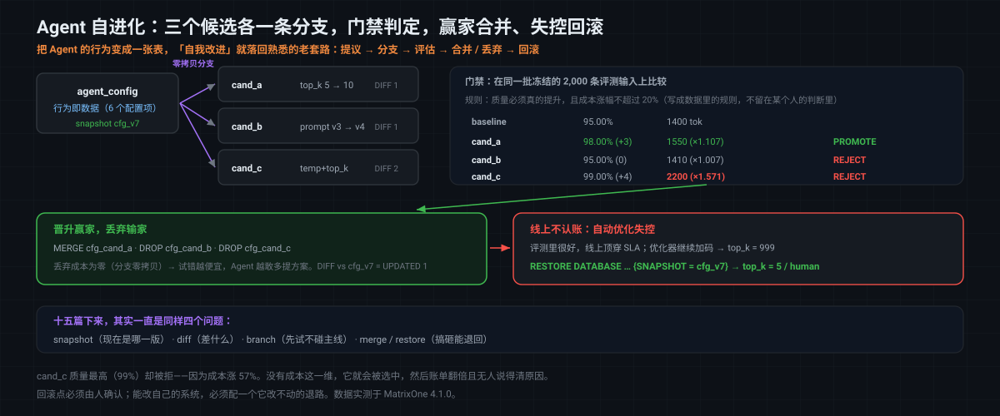

# MatrixOne Git4Data 技术详解（十五·终章）·Agent 篇：自进化——把 Agent 的行为变成可评审、可回滚的数据

这是这个系列的最后一篇。

[第十三篇](https://github.com/matrixorigin/matrixorigin-blog/blob/main/matrixorigin/git4data-part13-agent-memory-zh/index.md)讲了 Agent 的**记忆**——它自己写下的事实；[第十四篇](https://github.com/matrixorigin/matrixorigin-blog/blob/main/matrixorigin/git4data-part14-agent-trace-zh/index.md)讲了它的**轨迹**——它跑过的每一步。这一篇讲最后一样，也是最有意思的一样：**Agent 的行为本身**。

当一个 Agent 开始尝试改进自己——换个系统提示词、调一下检索条数、改一个阈值——它其实是在**修改自己的行为定义**。而如果这份定义是一张表，那么"Agent 自我进化"这件听起来很前沿的事，就落回到了一个我们在这个系列里已经用了十四篇的老套路上：

```text
提议 → 分支 → 评估 → 通过就合并 / 不通过就丢弃 → 出问题就回滚
```

> 文中 SQL 全部在 MatrixOne `4.1.0` 上实测，使用确定性表达式（无 `rand()`）；可跑版本见 [matrixorigin/git4data-tutorial](https://github.com/matrixorigin/git4data-tutorial) 的 `15-agent-evolution/`。

---

## 先把"Agent 的行为"变成数据

一个 Agent 的行为，很大一部分并不在代码里，而在一堆**可调的配置**里：

```sql
CREATE TABLE agent_config (
    config_key   VARCHAR(48) PRIMARY KEY,
    config_value VARCHAR(256),
    value_type   VARCHAR(12),
    changed_by   VARCHAR(32),     -- human / agent_optimizer  ← 谁改的
    rationale    VARCHAR(256)     -- 为什么改                  ← 改的理由
);

INSERT INTO agent_config VALUES
 ('system_prompt_version', 'sp_v3', 'string', 'human', 'baseline in production'),
 ('retrieval_top_k',       '5',     'int',    'human', 'baseline'),
 ('temperature',           '0.7',   'float',  'human', 'baseline'),
 ('tool_timeout_ms',       '2000',  'int',    'human', 'baseline'),
 ('max_steps',             '8',     'int',    'human', 'baseline'),
 ('escalate_threshold',    '0.45',  'float',  'human', 'baseline');
```

改一行，Agent 的行为就变了。**所以这张表不是配置文件，它是 Agent 的"基因"。**

`changed_by` 和 `rationale` 这两列很关键：当提议者可能是 Agent 自己（`agent_optimizer`）时，你必须能一眼看出**哪些改动是人做的、哪些是机器自己做的**，以及它给出的理由是什么。

先给生产基线打一个快照——它是这一轮的回滚点：

```sql
CREATE SNAPSHOT cfg_v7 FOR DATABASE agent_eco;
```

---

## 第一步：三个候选，各是一条分支

Agent（或一个自动优化器）提出三个改进方案。每一个都是一条分支——**它们互不干扰，也都碰不到生产配置**：

```sql
DATA BRANCH CREATE TABLE cfg_cand_a FROM agent_config;
DATA BRANCH CREATE TABLE cfg_cand_b FROM agent_config;
DATA BRANCH CREATE TABLE cfg_cand_c FROM agent_config;

-- 候选 A：多检索一些上下文
UPDATE cfg_cand_a SET config_value = '10', changed_by = 'agent_optimizer',
       rationale = '更多上下文应该能减少技术类问题答不上来的情况'
WHERE config_key = 'retrieval_top_k';

-- 候选 B：换一版系统提示词
UPDATE cfg_cand_b SET config_value = 'sp_v4', changed_by = 'agent_optimizer',
       rationale = '对工具使用给出更严格的指令'
WHERE config_key = 'system_prompt_version';

-- 候选 C：同时降温度、加检索（两处改动）
UPDATE cfg_cand_c SET config_value = '0.3' WHERE config_key = 'temperature';
UPDATE cfg_cand_c SET config_value = '8'   WHERE config_key = 'retrieval_top_k';
```

每个候选到底改了什么，各自一条 DIFF：

```sql
DATA BRANCH DIFF cfg_cand_a AGAINST agent_config OUTPUT SUMMARY;   -- 实测 UPDATED 1
DATA BRANCH DIFF cfg_cand_b AGAINST agent_config OUTPUT SUMMARY;   -- 实测 UPDATED 1
DATA BRANCH DIFF cfg_cand_c AGAINST agent_config OUTPUT SUMMARY;   -- 实测 UPDATED 2
```

**这就是"Agent 提交了一个 PR"。** 它改了什么、改了几处，一目了然——而不是某个进程在后台悄悄把线上参数动了。

---

## 第二步：在同一批题上评估

三个候选各自跑那 2,000 条**冻住的**评测输入（[第十四篇](https://github.com/matrixorigin/matrixorigin-blog/blob/main/matrixorigin/git4data-part14-agent-trace-zh/index.md)讲过为什么必须冻住）：

```sql
SELECT candidate,
       ROUND(100.0 * SUM(ok) / COUNT(*), 2) AS ok_pct,
       ROUND(AVG(total_tokens), 0)          AS avg_tokens
FROM eval_results GROUP BY candidate ORDER BY candidate;
```

| candidate | ok_pct | avg_tokens |
|---|---|---|
| baseline | 95.00 | 1400 |
| cand_a | **98.00** | 1550 |
| cand_b | 95.00 | 1410 |
| cand_c | **99.00** | 2200 |

粗看之下，`cand_c` 效果最好（99%）。但只看质量是不够的。

---

## 第三步：门禁——质量要涨，成本不能失控

**这是整篇最重要的一节。** 自进化如果只以"指标涨了"为准入条件，Agent 会很快学会用堆资源换指标：多检索、多推理、多重试——分数是涨了，成本和延迟也一起爆炸。

所以门禁必须是**多维**的，而且要写成可执行的规则：

```sql
INSERT INTO promotion_gate
SELECT c.candidate, c.ok_pct, c.avg_tokens,
       ROUND(c.ok_pct - b.ok_pct, 2)          AS ok_delta,
       ROUND(c.avg_tokens / b.avg_tokens, 3)  AS cost_ratio,
       CASE WHEN c.ok_pct > b.ok_pct              -- 质量必须真的提升
                 AND c.avg_tokens <= b.avg_tokens * 1.2   -- 成本涨幅不超过 20%
            THEN 'PROMOTE' ELSE 'REJECT' END
FROM (...) c CROSS JOIN (...) b;
```

实测结果：

| candidate | ok_pct | avg_tokens | ok_delta | cost_ratio | verdict |
|---|---|---|---|---|---|
| cand_a | 98.00 | 1550 | **+3.00** | 1.107 | **PROMOTE** |
| cand_b | 95.00 | 1410 | 0.00 | 1.007 | REJECT |
| cand_c | 99.00 | 2200 | +4.00 | **1.571** | REJECT |

- **cand_a**：质量 +3 个点，成本只涨 10.7% → **通过**。
- **cand_b**：完全没提升 → 拒绝。
- **cand_c**：质量最高（+4 个点），但**成本涨了 57%** → 拒绝。

`cand_c` 被拒这一条最值得说。**如果没有成本这一维，它就会被选中**——然后线上账单翻一倍多，而没人说得清是哪次"自动优化"造成的。**门禁写成数据里的规则，而不是留在某个人的判断里，正是为了这个。**



---

## 第四步：晋升赢家，丢弃输家

```sql
DATA BRANCH MERGE cfg_cand_a INTO agent_config;   -- 唯一的 PROMOTE
DROP TABLE cfg_cand_b;                            -- 拒绝：没提升
DROP TABLE cfg_cand_c;                            -- 拒绝：成本 +57%
```

**丢弃输家的成本是零**——分支是零拷贝的（[第三篇](https://github.com/matrixorigin/matrixorigin-blog/blob/main/matrixorigin/git4data-part3-under-the-hood-zh/index.md)），没通过的候选 `DROP` 掉就完了，不留任何痕迹在生产配置上。这一点对自进化特别重要：**试错的代价越低，Agent 越敢多提方案。**

合并之后，看看这一轮 Agent 到底把自己改成了什么样：

```sql
SELECT config_key, config_value, changed_by FROM agent_config
WHERE config_key IN ('retrieval_top_k', 'temperature', 'system_prompt_version');
--   实测 retrieval_top_k = 10 / agent_optimizer   ← 机器改的
--        system_prompt_version = sp_v3 / human    ← 人定的，没动
--        temperature = 0.7 / human                ← 人定的，没动

DATA BRANCH DIFF agent_config AGAINST agent_config {SNAPSHOT='cfg_v7'} OUTPUT SUMMARY;
--   实测 UPDATED 1 —— 这一轮自进化的完整变更集

CREATE SNAPSHOT cfg_v8 FOR DATABASE agent_eco;   -- 新的生产版本
```

`changed_by` 那一列让"人的决定"和"机器的决定"泾渭分明——这在自进化系统里是必须的边界。

---

## 第五步：线上不认账——一条语句回滚

评测集永远不等于真实流量。`top_k=10` 在评测里效果很好，上线后却让 P99 延迟顶穿了 SLA；更糟的是，自动优化器"看到"延迟指标后继续加码，把它调到了 999：

```sql
UPDATE agent_config SET config_value = '999', changed_by = 'agent_optimizer',
       rationale = 'runaway self-tuning'
WHERE config_key = 'retrieval_top_k';
SELECT config_value AS runaway_top_k FROM agent_config WHERE config_key='retrieval_top_k';
--   实测 999
```

回滚到人定的基线，一条语句：

```sql
RESTORE DATABASE agent_eco {SNAPSHOT = cfg_v7};
SELECT config_key, config_value, changed_by FROM agent_config WHERE config_key='retrieval_top_k';
--   实测 5 / human
```

而两个历史版本永远都还查得到：

```sql
SELECT config_value FROM agent_config {SNAPSHOT='cfg_v7'} WHERE config_key='retrieval_top_k';  -- 实测 5
SELECT config_value FROM agent_config {SNAPSHOT='cfg_v8'} WHERE config_key='retrieval_top_k';  -- 实测 10
```

**这是自进化系统的安全带。** 一个能改自己的系统，必须配一个它改不动的回退点——否则"自我改进"和"自我损坏"之间就没有护栏了。

---

## 回看整个系列：十五篇其实在讲同一件事

写到这里，可以把整条线收起来了。

| 篇章 | 数据是什么 | 谁在改 |
|---|---|---|
| 1–4 | 结构化业务数据 | 人（工程师） |
| 5–7 | 生产数据、ETL 批次 | 人（运维 / 数据工程） |
| 8–9 | 机器学习样本、标签、切分 | 人（数据科学家） |
| 10 | 图像文件 + 元数据 | 人（标注 / 策展） |
| 11–12 | SFT 记录、偏好投票 | 人（curator / 标注员 / 评审） |
| 13 | Agent 记忆 | **Agent 自己** |
| 14 | 运行轨迹 | Agent（只写不改） |
| 15 | **Agent 的行为定义** | **Agent 自己** |

数据的形态一路在变——从表里的行，到对象存储里的文件，到偏好对，到 Agent 的记忆和行为。**但每一篇要回答的，始终是同样的四个问题：**

```text
现在是哪一版？        → snapshot
这一版和上一版差什么？ → diff
能不能先试试不影响主线？→ branch
搞砸了能退回吗？       → merge / restore
```

十五篇下来，真正的结论其实很朴素：**当数据开始频繁变化、并且变化会直接影响一个正在运行的系统时，你就需要版本控制。** 代码在几十年前就想明白了这件事，数据一直没有——而 AI 把这件事的紧迫性推到了顶点，因为现在改数据的，已经不只是人了。

---

## 边界与适用范围

- **自进化的范围必须显式限定。** 让 Agent 调 `retrieval_top_k` 是一回事，让它改 `escalate_threshold`（什么时候转人工）是另一回事。**哪些配置项允许机器改、哪些只能人改，应该是一条明确规则**，而不是靠 Agent 自觉。

- **门禁必须多维，且必须包含成本。** 只看质量指标，Agent 一定会学会用资源换分数。本文的 `cand_c` 就是这个模式的缩影。

- **评测集会被"过拟合"。** 同一批题反复用来做晋升门禁，Agent 会逐渐针对它优化。评测集需要定期轮换，并保留一份不参与门禁的固定 holdout（[第九篇](https://github.com/matrixorigin/matrixorigin-blog/blob/main/matrixorigin/git4data-part9-dataset-release-zh/index.md)讲过同一个道理）。

- **回滚点必须是人定的。** `cfg_v7` 之所以是安全的回退目标，是因为它由人确认过。如果回退点也由 Agent 自己选，安全带就形同虚设。

- **Git4Data 不做决策。** 提什么方案、门槛卡多少、要不要上线，都是你的策略。它保证的是：每个方案隔离试验、每次变更可审计、任何一版可回滚。

---

## 结语

这个系列从"海量数据为什么需要 Git 式版本控制"开始，走到了"Agent 修改自己的行为"结束。

看起来跨度很大，但底层是同一件事：**只要数据在变，就需要知道它变成了什么样、和之前差在哪、能不能退回去。** 区别只在于，写数据的从工程师变成了标注员，从标注员变成了训练流程，最后变成了 Agent 自己——而随着写入方越来越自动、越来越快，"能退回去"这件事的价值也就越来越高。

这一篇的实测数字，正是这句话的注脚：**三个候选并行试验、零拷贝、失败即丢；门禁按质量和成本两维判定，把一个 99% 但贵 57% 的方案挡在了门外；而当自动优化失控把参数调到 999 时，一条 `RESTORE` 就回到了人定的基线。**

Agent 可以改自己。但它改的每一步，都应该像代码一样——**看得见、评得了、退得回。**

> 📎 可运行 SQL：[github.com/matrixorigin/git4data-tutorial](https://github.com/matrixorigin/git4data-tutorial) ｜ 源码与社区：[github.com/matrixorigin/matrixone](https://github.com/matrixorigin/matrixone)
