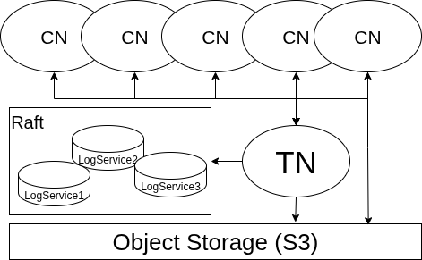
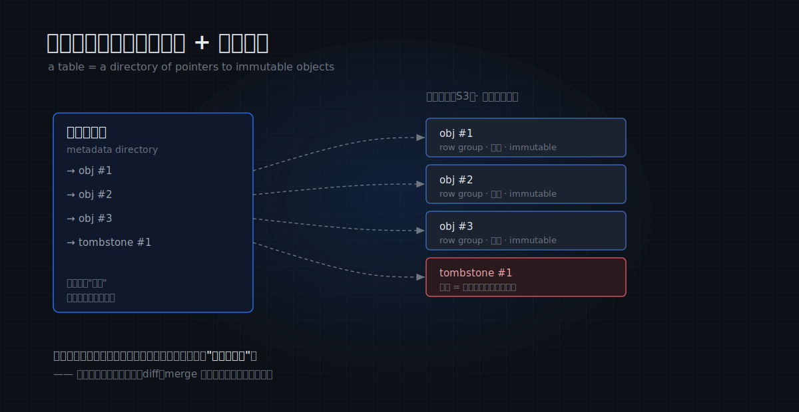
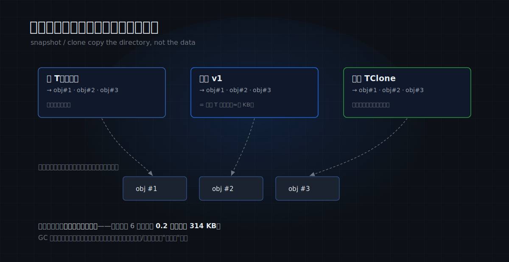
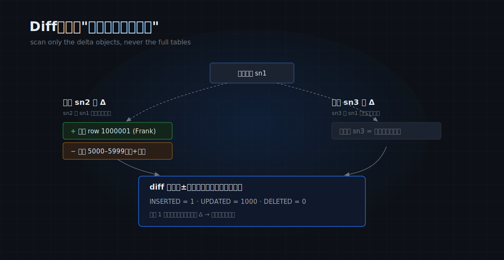

# MatrixOne Git4Data 技术详解（三）：MatrixOne 架构及 Git4Data 原理解析，快照、Diff、Merge 凭什么这么快

前两篇里，我们先讲了**为什么**数据需要 Git，又**动手**把所有 Git 原语在百万行上跑了一遍。动手那篇结尾留下一张让人有点意外的表：

| 表规模 | `CREATE SNAPSHOT` | `CLONE` | `DATA BRANCH DIFF`（改 1000 行） |
|---|---|---|---|
| 100 万行 | 6 ms | 6 ms | 13 ms |
| 1000 万行 | 8 ms | 8 ms | 21 ms |
| 1 亿行 | 5 ms | 25 ms | 23 ms |

数据涨了 100 倍，打快照的耗时**几乎恒定**，克隆只从 6 毫秒升到 25 毫秒，diff 基本只随你改了多少行变化。

第一眼看上去这不太合理——复制 1 亿行，怎么可能在眨眼之间完成？这一篇我们把引擎盖掀开，讲清楚底层到底是怎么做到的。先把结论放在前面：

> **在 MatrixOne 里，版本控制不是叠加在数据库之上的一层功能，而是它存储引擎的自然产物。** 一旦你理解了数据是怎么存的，"毫秒级版本"就不再像魔法，而几乎是唯一合理的结果。

---

## 先认识 MatrixOne：存算分离的三类节点

讲版本控制之前，得先认识 MatrixOne 的架构——正是它，决定了后面这些操作为什么能这么便宜。

MatrixOne 是一个**云原生、存算分离**的 HTAP 数据库。"存算分离"指的是把**计算**和**存储**彻底解耦：计算节点本身不长期持有数据，数据统一存放在底层的对象存储里。整个系统由三类节点 + 一层对象存储构成（见下图）：

- **CN（Compute Node，计算节点）**：执行 SQL 的地方。它是**无状态**的——本地不长期持有数据，需要时去对象存储读取、只把本地当缓存。正因为无状态，CN 可以随负载**横向扩展**，加机器即加算力。图中顶部那一排就是 CN。
- **TN（Transaction Node，事务节点）**：事务的决策者。它决定一个事务能否提交、把已提交的日志串成一条有序的流，并把这条 **WAL（预写日志）** 推送给订阅了相关表的 CN。
- **LogService（日志服务）**：以 **Raft** 协议组成一组（通常 3 个），可靠地保存 WAL。它是系统的"真相来源"——只要日志在，崩溃后就能据此恢复。
- **对象存储（S3）**：所有表数据最终的存放处，廉价、近乎无限、自带多副本。

一次写入的完整路径是这样的：事务在 CN 上执行，改动先暂存在它的私有工作区；提交时，TN 决策通过、把 WAL 写入 LogService 落定，再把这条 WAL 流给所有订阅的 CN，让它们各自更新对该表的视图。大批量数据则由 CN **直接写入对象存储**，只把"写了哪些对象"的元数据交给 TN。

这套架构有两个对后文至关重要的特性：

1. **数据与计算解耦**——数据独立存在于对象存储中，CN 只是读取它。所以"给数据派生一个分支、让另一拨计算去运行"这件事，本身就不需要复制数据。
2. **底层是不可变对象 + 日志**——这恰好是做版本控制最理想的地基。下一节我们深入存储层来看。

---

## 数据怎么存：不可变对象 + 一份目录

要理解快照为什么便宜，需要再深入一层：CN 把一张表写进对象存储时，它在物理上是什么样子。记住下面几条规则：

- 表数据被切成一个个**对象（object）**，每个对象内部以列存方式保存一批行。
- **对象一旦写入便不可变（immutable）**——这是整个机制的基石。要新增数据，就写一个新对象。
- 对象的组织是 **LSM 式**的：不可变对象 + 后台 compaction。有主键或排序键（sort key / cluster by）的表，数据按键有序，扫描时可借 zone map 等元信息做裁剪；没有主键的表则走内部的 fake-PK / 全行比对路径。
- **删除一行不是去对象里抹掉它**（对象不可变，做不到），而是向一个单独的**墓碑对象（tombstone）** 写入一条记录，标记"这一行已删除"。
- 最关键的一条：一张表**当前由哪些对象组成**，记录在一份**元数据目录（metadata directory）** 里。可以把这份目录理解成一张"清单"——它列出此刻这张表指向哪些数据对象、哪些墓碑对象。

把这几条串起来：一张表此刻"长什么样"，**完全由这份目录决定**。真实的数据字节静静躺在不可变对象里、自身不变；**变的只是"目录指向谁"**。

*一张表 = 一份指向不可变对象的目录；删除是写一条墓碑记录，而不是去修改对象本身。*

再叠加一层 **MVCC**（多版本并发控制，与 PostgreSQL 类似）：每行带一个事务时间戳，读取时按时间戳过滤，就能还原出"某一时刻的表"。

**记住这个模型：不可变的数据对象 + 一份会变的目录。** 接下来所有"魔法"，本质上都是在这份目录上做文章，几乎不触碰真实数据。

---

## 快照与克隆：不搬数据，只动元数据

到这里，"快照为什么便宜"几乎是显而易见的了。不过快照和克隆虽然都不搬数据，**实现机制并不相同**，值得分开讲：

- **快照**（`CREATE SNAPSHOT v1 FOR TABLE …`）的核心动作是**记录一个时间戳**，并通知 GC："这个时刻可见的对象版本，都保护起来。"它并不真的去复制什么目录——**与表里装了 100 万行还是 1 亿行无关**，所以快照永远是几毫秒。（一个细节：命名快照前，系统会先把还驻留在内存、未落盘的数据 flush 成对象——这就是上一篇提到的"第一次快照略慢"的来源，属于一次性开销。）
- 基于时间戳的版本则更直接：根本无需提前保存任何东西——读取时按 MVCC 时间戳过滤对象，就能还原出任意时刻的表。这正是 PITR（任意时间点恢复）的基础，相当于系统自动替你打了一连串 Git commit。
- **克隆**（`CLONE` / `DATA BRANCH CREATE`）复制的是**对象元数据引用**——新表记下"我指向哪些数据对象、哪些墓碑对象"（以及它们的统计信息），**对象文件本身一个都不复制**。克隆出的新表与原表从此各自演化、互不影响，但起始时它们**共享同一批底层数据对象**。这正是"克隆 6 亿行只要 0.2 秒、仅多占 314 KB"的全部原因：那 314 KB 是新表的引用元数据，6 亿行数据一个字节都没有移动。

*快照记录时刻并保护对象，克隆复制对象引用——都指向同一批不可变对象，所以 6 亿行也只要 0.2 秒。*

这里还有一个容易被忽略、却很关键的设计——**垃圾回收（GC）感知快照**。MatrixOne 平时会在后台做 compaction、回收不再需要的旧对象；但**被命名快照或分支保护的对象版本，不会被回收**。这也给"成本"加一个诚实的注脚：**创建**分支/快照是近似常数成本、零数据拷贝；但**长期持有**并不完全免费——被钉住的历史对象会一直占着存储，直到快照/分支删除后 GC 才能回收。短生命周期的分支几乎无感，长期保留的快照则要把这笔存储保留成本算进去。

至此，前两篇说的"毫秒级快照""秒级分支"就都落到了实处——**因为创建它们根本不移动数据。**

---

## Diff：只扫描"发生了变更的那部分对象"

快照和克隆便宜，是因为它们只动目录、不读数据。那 diff 呢？比对两个版本的差异，总得真的去读数据吧？

是要读，但**需要读取的范围小得惊人**——这是整套机制中最精巧的一环。

回到上一篇那个工作流：表 `T` 从快照 `sn1` 克隆出 `TClone`，两边各自修改，`T` 推进到 `sn2`、`TClone` 推进到 `sn3`，它们的**共同祖先**是 `sn1`。

关键的观察是：因为对象只增不改，**一条分支从 `sn1` 到现在的全部修改，都体现为"它比共同祖先多出了哪些对象"**——插入产生新的数据对象，删除产生新的墓碑对象，更新则是"删除 + 插入"。我们把"`sn2` 相对 `sn1` 多出的那批对象"记作 **Δ_sn2**（delta，即增量），同理有 Δ_sn3。

> **所以——只要两张表之间存在血缘、能定位到共同祖先（LCA）——diff `sn2` 和 `sn3` 就只需读取各自的增量 Δ_sn2 和 Δ_sn3，完全不必扫描两张全表。**（血缘不可用时会退化到另一条慢路径，"两方合并"一节细说。）

这就是为什么：表里有 1 亿行、你只改了 1000 行时，diff 也只要二十几毫秒——它只读取了那 1000 行所在的几个增量对象。

*diff 只读两个分支各自的增量 Δ，给删除/插入标上 ± 号，相同的改动两两抵消，剩下就是差异。*

具体分两步：

1. **扫描并折叠**：扫描 Δ_sn2，把同一主键上的多次物理操作折叠成一个逻辑操作（删除 / 插入 / 更新），并给**删除标 "−"、插入标 "+"**。这一步几乎就是普通的 LSM 树扫描，区别只在于：不是把被删的行屏蔽掉，而是把删除操作本身也扫描出来。
2. **diff 聚合**：把 Δ_sn2 与 Δ_sn3 中**完全相同的改动**两两抵消（例如两边都删了同一行、或都插入了一模一样的行）。抵消后剩下的，就是两条分支之间真正的差异。

> 一个省 IO 的细节：墓碑记录里只有主键、没有其它列的值。所以扫描出的被删行先用 NULL 占位，**仅当确实需要展示完整行时**，才回到共同祖先 `sn1` 取回原值。

你在上一篇看到的 `DATA BRANCH DIFF … OUTPUT SUMMARY`（给出 INSERTED / DELETED / UPDATED 各自的行数），就是这套聚合的结果。

---

## Merge：三方合并，以及如何自动区分真假冲突

合并比 diff 多做一件事：**遇到冲突要能判定、能裁决。**

`DATA BRANCH MERGE TClone INTO T` 执行的是**三方合并**——以共同祖先 `sn1` 为基准，结合 `T(sn2)` 和 `TClone(sn3)` 各自相对 `sn1` 的修改（也就是前面算出的 Δ 和 ± 号），逐行判定。

**核心规则只有一句：**

> **只有"两条分支都独立修改了同一行、且改法不同"，才算真冲突。**

有主键时，比较该主键在三个版本（共同祖先、目标、源）中的情况：
- 只有一边修改了这行、另一边未动 → **假冲突**，直接采用修改方的结果，无需人工介入。
- 两边都修改了同一主键、且结果不同 → **真冲突**，按 `WHEN CONFLICT` 裁决：`FAIL` 中止、`SKIP` 保留目标、`ACCEPT` 采用源。

正因为"只有真冲突才需要裁决"，即便一次合并涉及上百万行改动，真正需要人工定夺的，往往就是少数真正撞在一起的那些行，其余的由数据库自动合并。

这里有一个**特别精巧的细节**：后台 compaction 在整理存储时，可能把一行**移动到不同的物理位置、但值完全不变**。这在底层表现为"删除 + 插入"，看起来很像一次修改，容易被误判为冲突。MatrixOne 会识别出"值未变、仅位置改变"，将其判为**假冲突**，从而不会因为一次存储重组就挡掉另一分支对该行的合法更新。这是整个合并过程中唯一需要回读完整行来比对值的情形——好在 compaction 之后才会发生，相当罕见。

无主键时，行无法被唯一标识，MatrixOne 改用**多重集计数**：统计"完全相同的若干行"在三个版本各有多少条，用计数差判断是哪边改了、是否两边都改。原理一致，只是把"按主键比对"换成了"按数量比对"。

---

## 两方合并：为什么你从不需要指定"共同祖先"

细心的你可能注意到：上面的三方合并要用到共同祖先 `sn1`，但我们在上一篇 `DATA BRANCH MERGE` 时**从未指定过它**。

因为 MatrixOne **自己记录了血缘**。`DATA BRANCH CREATE` 在派生分支时就记下了"它从哪张快照分出"，所以合并时能**自动回溯到共同祖先**——你看到的"两方合并"，底层其实是一次"自动补齐了共同祖先的三方合并"。

万一血缘断了呢（例如原表及其快照都被删除，LCA 无从定位）？MatrixOne 会退化为**全历史比对**——从最早可见的时间点开始收集两张表的变化再做聚合。**正确性依然有保证，但性能不再等价于有 LCA 的增量快路径**：本质上接近于比对两张表的完整历史。所以一个实用建议是：想长期享受快路径，就用 `DATA BRANCH CREATE` 建分支、并保留好血缘上游的快照，别让 LCA 失联。

这一点也恰好点出了 git4data 与"自己写 SQL 比对两张表"的本质差距：后者每次都要**扫描两张全表**；而 git4data 在血缘可用时，**只读取沿 LCA 到两侧端点之间的那一小部分变更**。

---

## 数字说话

把原理对回到数字，一切就都说得通了。

在一台 64 核 / 256GB 的机器上、用约 **6 亿行**的大表（TPC-H 100GB 的 lineitem）实测：

| 操作 | git4data 内置 | 等价的纯 SQL 实现 |
|---|---|---|
| 克隆 | **0.2 秒 / 多占 314 KB** | `INSERT … SELECT *`：114.6 秒 / 多占 34 GB |
| Diff（改 100 万行） | **3.3 秒** | 431 秒 |
| Merge（改 100 万行） | **16 秒** | 471 秒 |

内置 diff/merge 比纯 SQL 实现快 **100–500 倍**——原因正如前面所说：纯 SQL 实现每次都要扫描两张全表，与改动多少无关地恒慢；而内置实现只扫描增量 Δ。

我们自己在一台单机 Docker（4.0.0-rc1）上的实测也复现了同一规律：快照 5–8 毫秒**恒定**，克隆 6→25 毫秒（随对象数量轻微上升，但始终只是在复制几 MB 的目录），diff/merge 只随**改动行数**变化。大机器、小机器，同一个道理。

---

## 边界：它现在还做不到什么

把引擎盖掀开，也要如实说清它**目前还不支持什么**（均经实测确认）：

- **目前只支持两方 diff。** 通用的三方 diff 在技术上可行（± 号里已含所需信息），但日常的"查看改动"用两方就足够，所以暂未对外暴露。
- **冲突裁决是行级，而非单元格级。** 只要两边都改了同一行，即便改的是不同列，也算冲突。单元格级的自动合并是未来工作。
- **diff/merge 要求 schema 一致。** 一旦你 `ALTER` 改了某张表的结构，它就无法再与另一张做行级 diff/merge——所以若要使用版本控制，**应先改 schema、再克隆**。
- **它管理的是结构化的行，而非海量非结构化字节。** 后者（如原始图像、视频的内容级版本）仍是 lakeFS 这类工具的主场——git4data 通过 `STAGE`/`datalink` 版本化的是文件的"引用"，而非字节本身。

把这些边界讲清楚，恰恰是"将版本控制做进数据库内核"这条路最清晰的轮廓。

---

## 结语

引擎盖掀开之后，开头那张"反直觉"的表就一点也不反直觉了：

> 打快照，本质是**记录一个时刻**并保护当时的对象版本，所以与数据量无关；克隆，只复制**对象元数据引用**、共享同一批底层对象，所以 6 亿行也只要 0.2 秒；diff/merge，在血缘可用时只读取**增量对象 Δ**、用带 ± 号的聚合判定真假冲突，所以只随改动行数变化。**不可变对象 + 元数据引用 + 沿血缘只读增量**——版本控制就是从这三件事里自然生长出来的。

这也解释了一件更大的事：为什么最终是**数据库**、而非文件版本工具，扛起了"海量数据的版本控制"。因为只有数据库这种"既理解每一行的语义、又能把改动表达成不可变增量"的系统，才能让分支、diff、合并在 TB 级数据上廉价到可以随手就用。

接下来一篇，我们先把这条赛道理清楚——同样叫 "git4data / git for data"，MatrixOne 和 lakeFS、Dolt、Snowflake 们到底有什么不同；随后转入实践篇：从数据运维（误操作急救、团队协作开发、发布门禁），到 AI 训练（持续学习、SFT 策展、标注协作、RLHF、多模态数据），一路走到开篇就埋下的那条线——**让会自我进化的 AI agent，在版本化的数据上安全地探索、评估、合并、回滚。** 那才是 git4data 真正想去的地方。

> 📎 可运行的配套 SQL 见 [github.com/matrixorigin/git4data-tutorial](https://github.com/matrixorigin/git4data-tutorial)。
> 📎 源码与社区：[github.com/matrixorigin/matrixone](https://github.com/matrixorigin/matrixone)
