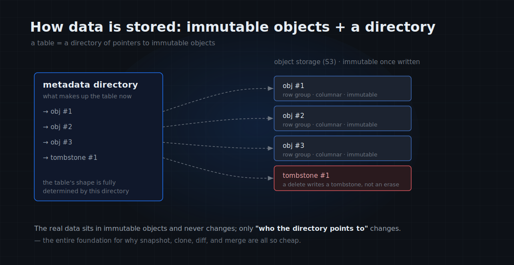
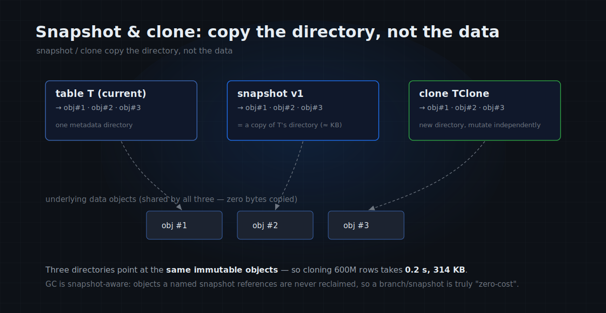
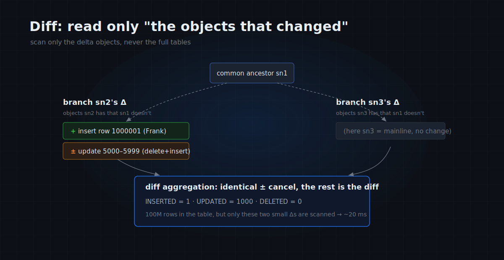

# MatrixOne Git4Data Deep Dive (Part 3): Under the Hood — Why Snapshot, Diff, and Merge Are This Fast

In the first two parts we covered **why** data needs Git, then went **hands-on** and ran every Git primitive on a million rows. That hands-on piece ended with a slightly surprising table:

| Table size | `CREATE SNAPSHOT` | `CLONE` | `DATA BRANCH DIFF` (1000 rows changed) |
|---|---|---|---|
| 1,000,000 | 6 ms | 6 ms | 13 ms |
| 10,000,000 | 8 ms | 8 ms | 21 ms |
| 100,000,000 | 5 ms | 25 ms | 23 ms |

The data grew 100×, yet snapshot time stays essentially constant, clone rises only from 6 ms to 25 ms, and diff basically tracks how many rows you changed. On a larger dataset it's even clearer: on a **600-million-row** table, a clone takes **0.2 seconds**.

At first glance this doesn't add up — how can copying 600 million rows finish in the blink of an eye? In this part we lift the hood and explain how the storage layer pulls it off. The conclusion up front:

> **In MatrixOne, version control isn't a layer bolted on top of the database — it's a natural product of its storage engine.** Once you understand how the data is stored, "version in milliseconds" stops looking like magic and becomes almost the only sensible outcome.

---

## Meet MatrixOne first: three node types, storage and compute separated

Before version control, you need a picture of MatrixOne's architecture — it's exactly what makes the operations below so cheap.

MatrixOne is a **cloud-native, storage-compute-separated** HTAP database. "Storage-compute separation" means **compute** and **storage** are fully decoupled: compute nodes don't durably hold data; the data lives in a shared object store underneath. The system is made of three node types plus a storage layer (see the figure):

- **CN (Compute Node)**: where SQL runs. A CN is **stateless** — it doesn't durably hold data; it reads from object storage when needed and uses local storage only as a cache. Because it's stateless, CNs **scale out** with load: add machines, add compute. The row at the top of the figure are the CNs.
- **TN (Transaction Node)**: the transaction decision-maker. It decides whether a transaction may commit, serializes committed logs into one ordered stream, and pushes that **WAL (write-ahead log)** to the CNs subscribed to the relevant tables.
- **LogService**: a **Raft** group (usually 3 nodes) that durably stores the WAL. It's the system's source of truth — as long as the log survives, a crash can be recovered from it.
- **Object Storage (S3)**: the final home of all table data — cheap, near-infinite, replicated by default.

The full path of a write: a transaction runs on a CN, staging its changes in a private workspace; on commit, the TN approves, writes the WAL into LogService to make it durable, then streams that WAL to all subscribing CNs so each updates its view of the table. Bulk data, though, is written **directly to object storage by the CN**, which hands the TN only the metadata of "which objects I wrote."

This architecture has two properties that matter for everything below:

1. **Data and compute are decoupled** — data exists independently in object storage, and a CN merely reads it. So "derive a branch of the data and let another set of compute run on it" inherently needs no data copy.
2. **The substrate is immutable objects + a log** — which happens to be the ideal foundation for version control. The next section goes into the storage layer.

---

## How data is stored: immutable objects + a directory

To understand why snapshots are cheap, go one level deeper: when a CN writes a table into object storage, what does it look like physically? Keep these rules in mind:

- Table data is sliced into **objects**, each holding a batch of rows in columnar form.
- **Once an object is written, it is immutable** — the cornerstone of the whole mechanism. To add data, you write a new object.
- Objects are organized **LSM-style**: immutable objects plus background compaction. Tables with a primary key or sort key (sort key / cluster by) keep data ordered by key, letting scans prune via zone maps and similar metadata; tables without a primary key take an internal fake-PK / full-row path.
- **Deleting a row doesn't erase it from an object** (objects are immutable, so you can't); instead a record is written to a separate **tombstone object**, marking "this row is deleted."
- The key one: **which objects make up the table right now** is recorded in a **metadata directory** — think of it as a manifest listing which data objects and tombstone objects this table points to at the moment.

Put these together: what a table "looks like" right now is **entirely determined by that directory**. The real data bytes sit quietly in immutable objects and never change; **what changes is only "who the directory points to."**

*A table = a directory of pointers to immutable objects; a delete writes a tombstone record rather than modifying the object.*

Add a layer of **MVCC** (multi-version concurrency control, like PostgreSQL): each row carries a transaction timestamp, and reading with a timestamp filter reconstructs "the table as of a moment."

**Hold this model: immutable data objects + one changing directory.** Every "trick" below is, at heart, working on that directory and barely touching the real data.

---

## Snapshot and clone: no data moves, only metadata

By now, "why snapshots are cheap" is almost self-evident. But although neither snapshot nor clone moves data, **their mechanisms differ**, and they're worth separating:

- A **snapshot** (`CREATE SNAPSHOT v1 FOR TABLE …`) is, at its core, **recording a timestamp** and telling GC: "protect the object versions visible at this moment." It doesn't actually copy a directory — **independent of whether the table holds a million or a hundred million rows** — so a snapshot is always a few milliseconds. (One detail: before saving a named snapshot, the system first flushes still-in-memory, not-yet-persisted data into objects — the source of the "first snapshot is slightly slower" from Part 2, a one-time cost.)
- Timestamp-based versions are even more direct: nothing needs to be saved up front at all — reading just filters objects by an MVCC timestamp to reconstruct the table at any moment. This is the foundation of PITR (point-in-time recovery), like having the system auto-commit for you continuously.
- A **clone** (`CLONE` / `DATA BRANCH CREATE`) copies **object metadata references** — the new table records "which data objects and tombstone objects I point to" (plus their statistics), while **the object files themselves are not copied at all**. The clone and the original evolve independently from then on, but at the start they **share the same underlying data objects**. That's the entire reason "clone 600M rows in 0.2 s, 314 KB extra": those 314 KB are the new table's reference metadata; not one byte of the 600 million rows moved.

*A snapshot records a moment and protects its objects; a clone copies object references — both point at the same immutable objects, so even 600M rows take 0.2 s.*

There's an easily-missed but crucial design point — **garbage collection is snapshot-aware.** MatrixOne compacts in the background and reclaims objects no longer needed; but **object versions protected by a named snapshot or a branch are not reclaimed.** This also adds an honest footnote on cost: **creating** a branch/snapshot is near-constant-cost and zero-copy; **holding** one long-term is not entirely free — the pinned historical objects keep occupying storage until the snapshot/branch is dropped and GC can reclaim them. Short-lived branches are essentially free; long-retained snapshots should budget for that retention cost.

So the "millisecond snapshots" and "second-scale branches" from the first two parts all land here — **because creating them moves no data.**

---

## Diff: scan only "the part of the objects that changed"

Snapshot and clone are cheap because they only touch the directory and never read data. What about diff? Comparing two versions surely has to read data?

It does — but **the amount it needs to read is astonishingly small.** This is the most elegant piece of the whole mechanism.

Back to Part 2's workflow: table `T` is cloned into `TClone` at snapshot `sn1`, both sides modify it, `T` advances to `sn2` and `TClone` to `sn3`, and their **common ancestor** is `sn1`.

The key observation: because objects are append-only, **everything a branch changed from `sn1` to now shows up as "which objects it has beyond the common ancestor"** — an insert produces a new data object, a delete a new tombstone object, an update is a delete-plus-insert. We call "the objects `sn2` has beyond `sn1`" **Δ_sn2** (delta, the increment), and likewise Δ_sn3.

> **So — as long as lineage exists between the two tables and the common ancestor (LCA) can be located — diffing `sn2` against `sn3` only needs to read each branch's increment, Δ_sn2 and Δ_sn3, never scanning either full table.** (When lineage is unavailable, it falls back to a slower path — detailed in the "Two-way merge" section.)

That's why, with 100 million rows in the table but only 1,000 changed, the diff is twenty-odd milliseconds — it reads only the few increment objects holding those 1,000 rows.

*Diff reads only each branch's increment Δ, signs deletes/inserts with ±, cancels the identical changes, and what's left is the difference.*

Two steps, concretely:

1. **Scan and collapse**: scan Δ_sn2, collapsing multiple physical operations on the same primary key into one logical operation (delete / insert / update), signing **deletes "−" and inserts "+"**. This is almost an ordinary LSM-tree scan — the only difference is that instead of masking off deleted rows, it scans out the delete operations as well.
2. **Diff aggregation**: cancel **identical changes** between Δ_sn2 and Δ_sn3 pairwise (e.g. both deleted the same row, or both inserted an identical row). What remains uncancelled is the genuine difference between the two branches.

> An I/O-saving detail: a tombstone record holds only the primary key, not the other columns' values. So a scanned-out deleted row is filled with NULL placeholders, and **only when a full row actually needs to be shown** does it return to the common ancestor `sn1` to fetch the original values.

The `DATA BRANCH DIFF … OUTPUT SUMMARY` from Part 2 (the INSERTED / DELETED / UPDATED counts) is exactly the result of this aggregation.

---

## Merge: three-way merge, and how it tells true conflicts from false

Merge does one more thing than diff: **on a conflict, it has to judge and resolve.**

`DATA BRANCH MERGE TClone INTO T` performs a **three-way merge** — using the common ancestor `sn1` as the baseline, combined with what `T(sn2)` and `TClone(sn3)` each changed relative to `sn1` (the Δs and ± signs computed above), it judges row by row.

**The core rule is a single sentence:**

> **It's a true conflict only when "both branches independently modified the same row, and modified it differently."**

With a primary key, compare that key across the three versions (common ancestor, target, source):
- Only one side modified the row, the other didn't → **false conflict**; just take the modifying side's result, no human intervention needed.
- Both sides modified the same key, with different results → **true conflict**; resolved by `WHEN CONFLICT`: `FAIL` aborts, `SKIP` keeps the target, `ACCEPT` takes the source.

Because "only a true conflict needs resolution," even a merge of a million changed rows usually needs a human call on just the few that genuinely collide; the database auto-merges the rest.

There's a **particularly elegant detail** here: during compaction, the storage layer may **move a row to a different physical position while its values stay unchanged**. At the bottom this appears as a "delete + insert," which looks like a modification and is easily mistaken for a conflict. MatrixOne recognizes "values unchanged, only the position changed" and classifies it as a **false conflict**, so a storage reorganization doesn't block the other branch's legitimate update to that row. This is the only case in the entire merge that needs to re-read the full row to compare values — and fortunately it only happens after compaction, so it's rare.

Without a primary key, rows can't be uniquely identified, so MatrixOne uses **multiset counts**: it counts how many fully-identical rows each of the three versions has, and uses the count delta to decide which side changed it and whether both did. Same principle, with "compare by key" replaced by "compare by count."

---

## Two-way merge: why you never specify the "common ancestor"

A careful reader will have noticed: the three-way merge above needs the common ancestor `sn1`, yet in Part 2 we **never specified it** when running `DATA BRANCH MERGE`.

Because MatrixOne **records the lineage itself.** When `DATA BRANCH CREATE` derives a branch, it records "which snapshot it branched from," so at merge time it can **trace back to the common ancestor automatically** — the "two-way merge" you see is, underneath, "a three-way merge with the common ancestor filled in for you."

What if the lineage is broken (say the original table and its snapshots were deleted, so no LCA can be located)? MatrixOne falls back to a **whole-history comparison** — collecting both tables' changes from the earliest visible point and then aggregating. **Correctness is still guaranteed, but performance is no longer equivalent to the LCA-based incremental fast path**: it's essentially comparing the two tables' full histories. The practical advice: if you want the fast path long-term, create branches with `DATA BRANCH CREATE` and keep the upstream snapshots alive — don't let the LCA go missing.

This also pinpoints the fundamental gap between git4data and "comparing two tables with hand-written SQL": the latter has to **scan two full tables** every time; git4data, when lineage is available, **reads only the small window of changes along the path from the LCA to each endpoint.**

---

## Let the numbers talk

Map the principles back to numbers and it all makes sense.

On a 64-core / 256 GB machine, using a roughly **600-million-row** table (TPC-H 100GB lineitem), measured:

| Operation | git4data built-in | Equivalent pure-SQL |
|---|---|---|
| Clone | **0.2 s / 314 KB extra** | `INSERT … SELECT *`: 114.6 s / 34 GB extra |
| Diff (1M rows changed) | **3.3 s** | 431 s |
| Merge (1M rows changed) | **16 s** | 471 s |

Built-in diff/merge is **100–500× faster** than the pure-SQL implementation — for the reason above: the SQL implementation scans two full tables every time, staying slow regardless of how much changed; the built-in implementation scans only the increment Δ.

Our own measurements on a single-node Docker (4.0.0-rc1) reproduce the same law: snapshot **constant** at 5–8 ms, clone 6→25 ms (creeping up slightly with object count, but always just copying a few MB of directory), diff/merge tracking only the **number of rows changed**. Big machine, small machine, one and the same principle.

---

## Boundaries: what it can't do yet

Lifting the hood also means being honest about what it **doesn't yet support** (all confirmed by testing):

- **Only two-way diff today.** A general three-way diff is technically feasible (the ± signs already carry the needed information), but everyday "review the changes" is fine with two-way, so it isn't exposed yet.
- **Conflict resolution is row-level, not cell-level.** If both sides changed the same row, it's a conflict even when they changed different columns. Cell-level auto-merge is future work.
- **Diff/merge require matching schemas.** Once you `ALTER` a table's structure, it can no longer be row-diffed/merged against another — so if you plan to use version control, **change the schema first, then clone.**
- **It manages structured rows, not massive unstructured bytes.** The latter (content-level versions of raw images or video, say) remains the home turf of tools like lakeFS — git4data versions the *reference* to a file via `STAGE`/`datalink`, not the bytes themselves.

Spelling out these boundaries is, in fact, the clearest outline of what "building version control into the database kernel" really is.

---

## Closing

Once the hood is up, that "counterintuitive" table at the start isn't counterintuitive at all:

> A snapshot, at heart, **records a moment** and protects the object versions of that moment, so it's independent of data size; a clone copies only **object metadata references** and shares the same underlying objects, so even 600M rows take 0.2 s; diff/merge, when lineage is available, read only the **increment objects Δ** and use a ±-signed aggregation to tell true conflicts from false, so they track only the number of rows changed. **Immutable objects + metadata references + reading only the increment along the lineage** — version control grows naturally out of these three things.

It also explains something bigger: why it's the **database**, not a file-versioning tool, that ended up carrying "version control for data at scale." Only a system that both understands the semantics of every row *and* can express changes as immutable increments can make branch, diff, and merge cheap enough on TB-scale data that you reach for them without thinking.

From here, the series turns practical: from data operations (incident rescue, collaborative development, release gates), through AI training (continuous learning, SFT curation, collaborative labeling, RLHF, multimodal data), all the way to the thread planted at the very start — **letting self-evolving AI agents explore, evaluate, merge, and roll back safely on versioned data.** That's where git4data really wants to go.

> 📎 Runnable companion SQL is at [github.com/matrixorigin/git4data-tutorial](https://github.com/matrixorigin/git4data-tutorial).
> 📎 Source & community: [github.com/matrixorigin/matrixone](https://github.com/matrixorigin/matrixone)
