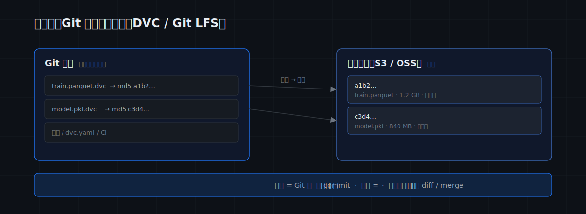
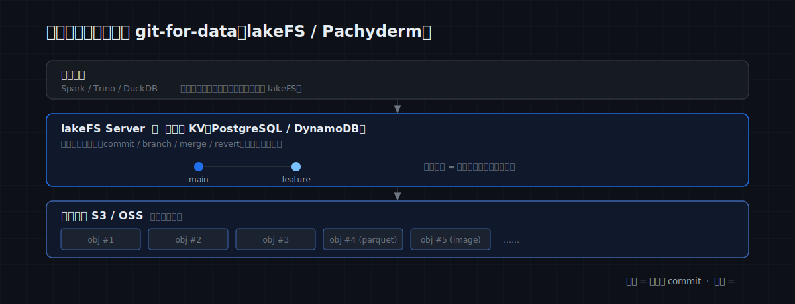
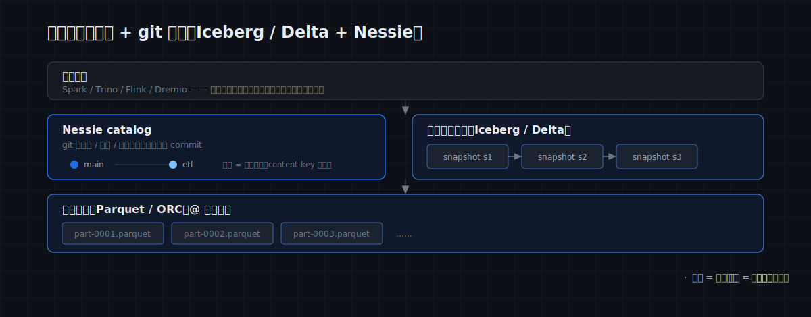
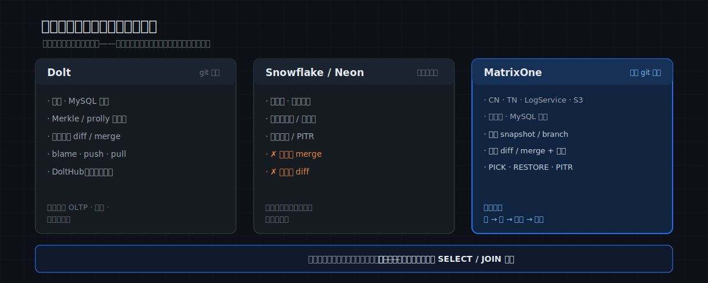

# MatrixOne Git4Data 技术详解（四）：数据版本控制全景——MatrixOne、lakeFS、DVC、Neon、Dolt 到底有什么不同

前三篇我们讲清了 MatrixOne 的 git4data 是什么、怎么用、底层怎么实现。在进入真实场景实践之前，还有一件事我们要讨论清楚：

> **"给数据做版本控制"这件事，不止 MatrixOne 一家在做。** lakeFS、Dolt、Nessie、Snowflake、Neon、DVC……一批产品都打着 "git for data" / "version control for data" 的口号。但大家说的，其实**不是同一件事**。

这一篇我们把 git for data 这个技术的对比图景彻底讲透：先立一个分析框架，再**按"版本控制做在哪一层"把它们分成四个种类**（每个种类配一张架构图），然后用一张 **git 原语完整度矩阵**把各家的 git 语义对齐——同样叫 git，到底"git"到什么程度，一目了然——最后给出 MatrixOne 的准确坐标，以及它诚实的边界。

---

## 先立一个分析框架

要比较"数据版本控制"，不能只问"有没有 diff/merge"。真正区分这些产品的，是下面五个问题：

1. **版本化的对象是什么**——文件字节？对象存储里的对象？表的快照？还是数据行？
2. **版本控制做在哪一层**——代码仓库里边？对象存储之上？表格式之上？还是数据库内核里？
3. **粒度多细**——整个文件？整个对象？一次快照？还是单行 / 单元格？
4. **git 语义有多完整**——只是能回到过去（time-travel）？还是 branch、diff、三方 merge、cherry-pick 一应俱全？
5. **冲突怎么裁决**——根本没有合并？还是有合并但只能整文件二选一？还是行级的真假冲突判定？

这五个问题里，**第 2 个（在哪一层）决定了它属于哪个种类**，而 **第 3、4 个（粒度 + git 完整度）决定了它在种类里的高下**。下面就按"层次"分成四个种类来看。

---

## 一个贯穿全文的场景

为了让差异看得见，我们设定一个具体场景，让每一种方案都来回答同样四个动作：

> 你维护着一份数据资产——把它想象成一张 **5000 万行的用户特征表**（或者一个 **100GB、上百万文件的多模态训练集**，下文按需切换）。团队要反复做四件事：
>
> - **动作 A｜看清改动**：改了一批数据后，精确知道改了**哪些行**、改成了什么（git diff）。
> - **动作 B｜并行协作**：多人各开一条分支并行修改，最后合并回主线，冲突要有人裁决（git branch + merge）。
> - **动作 C｜挑改动 / 取数**：把某一条改动单独挑到另一条分支（cherry-pick），或直接在某个版本上取一批数据。
> - **动作 D｜事故恢复**：误删整表、误改一批，要能秒级回到出事前（git reset / restore）。

带着这四个动作往下看，每一种方案的细节就会变得很清晰。

---

## 种类一：Git 原生文件版本 —— DVC / Git LFS

**做法**：把数据当"大文件"，**指针**存进 Git、**字节**存进远端缓存（S3 等）。Git 里看到的是几十字节的 `.dvc` 指针文件，真正的数据躺在内容寻址的缓存里。版本控制完全**借用 Git**——你 commit / branch / merge 的，其实是那些指针文件。



- **Git LFS**：只解决"大文件别撑爆 Git 仓库"，纯做存取，**不理解文件内容**——它 diff 两个版本，比的是指针，不是数据。
- **DVC**：在这个思路上做强，强项是把**数据 + 模型 + 代码 + 流水线 DAG** 绑在一起（`dvc add`、`dvc repro` 跑 DAG、`dvc exp run` 管实验），让一次 ML 训练**可复现**。

**放到场景里**：

- **动作 A（看清改动）**：`dvc diff` 告诉你"`train.parquet` 这个文件变了"，到此为止——改了哪 310 行？看不到。

- **动作 B（并行合并）**：没有数据感知的合并，只能靠 **Git 对指针文件做文本合并**；两个人改了同一个数据文件，就是一次二进制冲突。

- **动作 C（挑改动 / 取数）**：没有行级 cherry-pick；取数得先 `dvc checkout` 把整个文件拉到本地，再喂给 pandas / Spark。

- **动作 D（事故恢复）**：`git checkout <旧 commit>` + `dvc checkout`，把文件换回旧版本——以文件为单位。

**与 MatrixOne 的关键差异**：DVC 的 git 语义是**借** Git 的、作用在**文件**上；MatrixOne 的 git 语义是**内核原生**的、作用在**行**上。

---

## 种类二：对象存储的 git-for-data —— lakeFS / Pachyderm

**做法**：在对象存储（S3/OSS）之上架一层，提供 git 式的 commit / branch / merge / revert，作用于**整个仓库的对象**。需要**常驻一个 lakeFS server + 一个元数据 KV**（一般用 PostgreSQL / DynamoDB）；数据字节仍在你的对象存储里，lakeFS 只管元数据；真正要算数，还得靠外部引擎。



**lakeFS** 是这一类的代表，也是 MatrixOne 经常被问到对比的产品。它的 git 语义其实相当完整（branch / commit / merge / revert 都有），**但是颗粒度完全不一样**。

**放到场景里**（这次用 100GB 多模态训练集）：

- **动作 A（看清改动）**：同一批数据改了 310 行标注，`lakectl diff lakefs://repo/main lakefs://repo/feature` 报告的是"**6 个对象变了**"——它的 diff 粒度是**对象（整文件）**，看不到是哪 310 行。要行级，得在 lakeFS 上叠 Iceberg + Spark（lakeFS 现在自带 `refs_data_diff` 这个 Spark SQL 函数，但**算在 Spark，不在 lakeFS**）。

- **动作 B（并行合并）**：lakeFS 的合并是**对象级三方合并**——两条分支改了**不同**对象，干净合并；但两边都改了**同一个 parquet 文件**，就是冲突，它**无法把文件内部的两批行融合**，只能 `source-wins` / `dest-wins` 二选一。

- **动作 C（挑改动 / 取数）**：能 cherry-pick，但单位仍是**对象**；取数要把对象读出来喂外部引擎（Spark / Trino / DuckDB）。

- **动作 D（事故恢复）**：`lakectl branch revert` 回到历史 commit——以对象为单位，整仓库一致。

**它强在哪**：**范围是整仓库**——一次 commit / branch / merge 天然覆盖仓库里**所有文件**，多文件、跨格式的原子一致性非常省心；海量**非结构化字节**（图像 / 视频 / 音频 / 权重）的内容级版本，更是它的主场。

**与 MatrixOne 的关键差异**：lakeFS 的 git 很完整，但停在**对象**这一粒度；MatrixOne 把同一套 git 语义做到了**行**。前者是"对象存储的Object Git"，后者是"数据库里长出来的 Git"——**lakeFS 管字节、MatrixOne 管目录与标注**，两者恰好互补，本系列后面会专门讲它们怎么组合。

> 同层还有 **Pachyderm**：主打"数据一变就自动触发流水线"的 data-driven pipeline + 血缘，粒度同样是文件 / commit。

---

## 种类三：开放表格式 + git 分支 —— Iceberg / Delta + Nessie

**做法**：Iceberg / Delta Lake / Hudi 这些**开放表格式**，把一张表表示成一串**不可变快照**（每次写入 = 一个新快照），自带时间旅行；再叠一个 **Nessie** 这样的 catalog，就能给表加上 git 式的分支 / 标签 / 合并，而且能**跨多张表**一起提交。查询则全部交给外部引擎。



```sql
-- Iceberg：按快照 id 或时间读历史
SELECT * FROM db.t FOR SYSTEM_VERSION AS OF 10963874102873;
SELECT * FROM db.t FOR SYSTEM_TIME AS OF '2026-06-10 01:21:00';
-- Nessie：跨表分支与合并
CREATE BRANCH etl IN nessie;
MERGE BRANCH etl INTO main IN nessie;
```

**放到场景里**：

- **动作 A（看清改动）**：版本化在**快照级**。两个快照之间改了哪些行，表格式本身不直接给，要靠外部引擎查两个快照做 diff。

- **动作 B（并行合并）**：Nessie 的合并是**真合并**，但粒度是**表快照级**——冲突判定是"**同一张表**在两条分支上都被改过"（乐观并发，content-key 冲突），**不是**行级三方合并。它不裁决行，把行级的事交给表格式。

- **动作 C（挑改动 / 取数）**：Nessie 支持 commit 级的 cherry-pick（仍是表/快照级）；取数靠 Spark / Trino / Flink / Dremio。

- **动作 D（事故恢复）**：`RESTORE TABLE t TO VERSION AS OF 123`（Delta）/ 回退到某快照。

**与 MatrixOne 的关键差异**：这条路的强项是**开放生态、多引擎互操作、湖仓规模**——一份数据，Spark 也读、Trino 也读、Flink 也写。代价是 git 语义停在**表快照级**、且**没有自带的计算引擎**。

---

## 种类四：数据库内建的版本控制 —— Dolt、Snowflake、Neon、MatrixOne

**做法**：不在数据库外面加一层，而是让**数据库内核自己**管版本——引擎既理解每一行的语义，又能把改动存成不可变增量。**MatrixOne 就属于这一类**，同类的还有 Dolt、Snowflake 和 Neon。但同样是"数据库做版本控制"，三者的 git 完整度差得很远。



### Dolt：把 git 工作流做成数据库

底层用 Merkle / prolly tree 存储，让**逐单元格**的 diff/merge 成为天然产物，还原汁原味搬来了开发者的 git：

```sql
SELECT * FROM dolt_diff_orders WHERE to_commit = HASHOF('HEAD') AND from_commit = HASHOF('HEAD^');
CALL DOLT_MERGE('feature');            -- 单元格级三方合并，冲突落 dolt_conflicts_orders
SELECT * FROM orders AS OF 'HEAD~20';  -- 时间旅行
```

还有行级 `dolt blame`/历史、远端 `clone / push / pull`、托管平台 DoltHub——**git 语义最"深"**的一家：连分布式协作工作流都做齐了。但是 Dolt 是个单机数据库，也不支持OLAP，相对来说使用场景有限。

### Snowflake / BigQuery / Neon：零拷贝克隆 + 时间旅行

```sql
CREATE TABLE t_clone CLONE t;             -- 零拷贝克隆（秒级）
SELECT * FROM t AT(OFFSET => -300);       -- 5 分钟前的样子
UNDROP TABLE t;                           -- 救回误删
```

它们能"开分支""回到过去"，体验很爽，但 **git 语义只做了前半段**：

- **Snowflake**：零拷贝克隆 + 时间旅行（默认 1 天，标准版最多 1 天、企业版到 90 天，外加 7 天 Fail-safe）。但**没有 merge**——克隆出去各自漂移，合不回来；要 diff 自己写 `MINUS` / `EXCEPT`。
- **Neon**（serverless Postgres，2025 被 Databricks 收购）：写时复制的库分支、能缩到零、天生适配 branch-per-PR。但**没有任何 merge**，父子之间只有 **reset（单向覆盖）**，它的 "diff" 还**只比 schema、不比数据行**。

### MatrixOne：把行级 git 语义做全

MatrixOne 跑在一个分布式、MySQL 兼容的引擎上，把 git 原语**在行级**做齐：`SNAPSHOT` 与 `PITR` 覆盖**表 / 库 / 租户 / 集群**，`DATA BRANCH CREATE` 作用在表或库，`DIFF` / `MERGE` / `PICK` 则是表对表的操作：

```sql
CREATE SNAPSHOT s FOR TABLE db orders;                                   -- 快照 / 打标签
DATA BRANCH CREATE TABLE db.orders_feature FROM db.orders{SNAPSHOT='s'};  -- 建分支表
DATA BRANCH DIFF db.orders_feature AGAINST db.orders{SNAPSHOT='s'} OUTPUT SUMMARY;     -- 行级 diff
DATA BRANCH MERGE db.orders_feature INTO db.orders WHEN CONFLICT FAIL;    -- 行级三方合并 + 冲突策略
DATA BRANCH PICK db.orders_feature INTO db.orders KEYS (101, 102) WHEN CONFLICT FAIL;  -- cherry-pick（需主键）
RESTORE TABLE db.orders {SNAPSHOT='s'};                                   -- 恢复
CREATE PITR p FOR DATABASE db RANGE 1 'd';                                -- 任意时间点恢复
```

**放到场景里**（同一类里，三种风格分别怎么答）：

- **动作 A（看清改动）**：Dolt、MatrixOne 给你**逐行**的改动清单（Dolt 还能到单元格）；Snowflake / Neon 没有原生行级 diff（自己写 `EXCEPT`，Neon 还只比 schema）。

- **动作 B（并行合并）**：Dolt 单元格级、MatrixOne 行级——都是**带冲突裁决的三方合并**；Snowflake 没有 merge（克隆各自漂移），Neon 只有单向 reset。

- **动作 C（挑改动 / 取数）**：取数三者都能直接 SQL；但 cherry-pick 只有 Dolt（commit 级）和 MatrixOne（行级 `PICK`）有，Snowflake / Neon 没有。

- **动作 D（事故恢复）**：都能回到过去——Dolt `reset` 到历史 commit、Snowflake 时间旅行 + `UNDROP`、Neon PITR、MatrixOne `RESTORE` + PITR。

**这一类内部的区别**：**只有 Dolt 和 MatrixOne 把 git 做到了行级**；Snowflake / Neon 只有"克隆 + 时间旅行"，缺了带冲突的 merge。而两者之间——**Dolt 是单元格级 diff/冲突**、且工作流更深（clone / push / pull / DoltHub、行级 blame）；**MatrixOne 是带冲突策略的行级 diff / merge / `PICK`**，且 `SNAPSHOT` / `PITR` 还覆盖表 → 集群。

> 至于"能不能在版本上直接跑 SQL"——数据库这一类天然都能，所以它不是这一类内部的区分点；本篇重点是 git 语义的完整度。

---

## git 原语完整度矩阵：同样叫 git，到底"git"到什么程度

把上面四个种类拍平，逐个 git 原语对一遍——这张表是全文的核心：

| 工具 | 快照 / time-travel | 分支 branch | diff（粒度） | merge（+冲突） | cherry-pick | 恢复 restore/PITR | 分布式 git 工作流 |
|---|---|---|---|---|---|---|---|
| DVC / Git LFS | 借 Git | 借 Git（指针） | 文件级 | 指针文本合并 | ✗ | `git checkout` | ✓（Git remote，指针） |
| lakeFS | ✓ | ✓ | **对象级** | ✓ 对象级（source/dest） | ✓（对象） | revert | 部分 |
| Iceberg/Delta + Nessie | ✓ | ✓ | 快照级（靠引擎） | ✓ **表快照级** | ✓（commit 级） | RESTORE | ✗ |
| Snowflake / BigQuery | ✓ | clone（非真分支） | ✗（自写 EXCEPT） | ✗ | ✗ | UNDROP / clone | ✗ |
| Neon | ✓（PITR） | ✓（CoW） | ✗（只 schema） | ✗（只 reset） | ✗ | PITR / reset | ✗ |
| **Dolt** | ✓ | ✓ | **单元格级** | ✓ **单元格 3 方 + 冲突** | ✓ | reset | ✓（push/pull/DoltHub） |
| **MatrixOne** | ✓ | ✓ | **行级** | ✓ **行级 3 方 + FAIL/SKIP/ACCEPT** | ✓（`PICK`） | ✓ RESTORE + PITR | ✗ |

读这张表的三个结论：

1. **真正把 git 做到行/单元格级的，只有 Dolt 和 MatrixOne。** 其余的，要么停在文件（DVC）、对象（lakeFS）、快照（Iceberg）这些粗粒度，要么干脆缺了 merge（Snowflake / Neon）。
2. **Snowflake / Neon 的"版本控制"其实只做了前半段**——能克隆、能回到过去，但没有带冲突的合并，谈不上完整的 git。
3. **Dolt 深在工作流、MatrixOne 全在原语**：Dolt 多了分布式 push/pull/blame，MatrixOne 多了冲突策略 + cherry-pick + PITR + 多粒度。两者是这条赛道上 git 语义最完整的一对。

同一次改动，各家"看见"的粒度天差地别，正是上面矩阵第一行（diff 粒度）的直观版：


---

## 一张总览图

| 种类 | 代表 | 在哪一层 | 粒度 | git 语义完整度 |
|---|---|---|---|---|
| Git 原生文件 | DVC / Git LFS | 代码仓库旁 | 文件 | 借 Git，作用在指针上 |
| 对象存储 git | lakeFS / Pachyderm | 对象存储之上 | 对象 | 完整，但停在对象级 |
| 表格式 + git | Iceberg/Delta + Nessie | 表格式 + catalog | 快照 | 完整，但停在表快照级 |
| 数据库内建 | Dolt | 数据库内核 | 行 / 单元格 | **行级最全**（+ 分布式工作流） |
| 数据库内建 | Snowflake / Neon | 数据库 | 表 / 库 | 只有克隆 + 时间旅行，无 merge |
| **数据库内建** | **MatrixOne** | 数据库内核 | **行** | **行级最全**（+ 冲突策略 / PICK / PITR；快照/PITR 覆盖表→集群） |

把这张表换成一张坐标图——横轴粒度越往右越细，纵轴 git 语义越往上越完整。**右上角（行级 + 完整 git）站着 Dolt 和 MatrixOne**，正是"数据库内核里做版本控制"这一类：


---

## MatrixOne 的定位

把这张图浓缩成一句定位：

> **MatrixOne ≈「Dolt 的行级 git 完整度 + 数仓的零拷贝克隆/时间旅行 + Neon 的库分支」，并补齐了带冲突策略的行级 merge、cherry-pick 与 PITR（快照/PITR 覆盖表到集群），合在一个开源、MySQL 兼容的云原生HTAP数据库里。**

对照前面的四个动作：**A 看清改动**（行级 DIFF）、**B 并行协作**（行级三方合并 + 冲突策略）、**C 挑改动 / 取数**（`PICK` + 直接 SQL）、**D 事故恢复**（snapshot + PITR）——MatrixOne 是少数能把这四类都做到**既在行级、又在同一个引擎里**的系统。

但另外一方面也要明确它**不是什么**：

- **它不替代 DVC**：缺 `dvc repro / exp` 那套"数据+模型+代码"三联复现——纯 ML 流水线版本化，DVC 仍顺手。

- **它不替代 lakeFS**：海量字节级非结构化版本、跨格式整仓库原子提交，是 lakeFS 主场；MatrixOne 只版本化文件"引用"。→ **组合最优**。

- **它的 git 工作流不如 Dolt **：没有分布式 git 工作流（remote / push-pull / DoltHub / 逐单元格 blame）。

搞清楚这些区别开发者才知道什么时候该用 MatrixOne、什么时候该用别人、什么时候该组合。

---

> 📎 可运行 SQL：[github.com/matrixorigin/git4data-tutorial](https://github.com/matrixorigin/git4data-tutorial) ｜ 源码与社区：[github.com/matrixorigin/matrixone](https://github.com/matrixorigin/matrixone)
