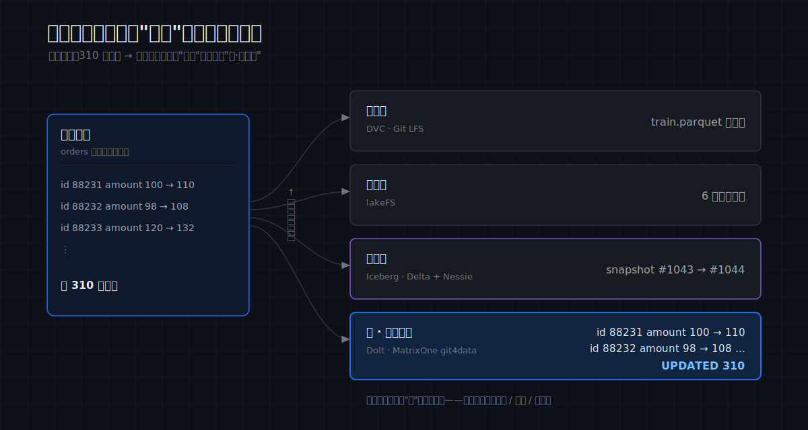
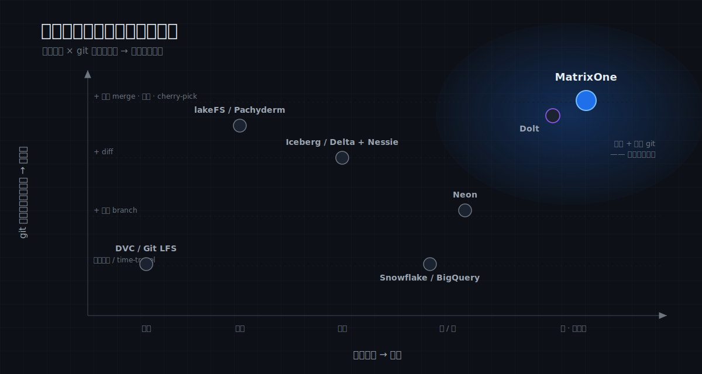

# MatrixOne Git4Data 技术详解（四）：数据版本控制全景——git4data、lakeFS、Dolt 们到底有什么不同

前三篇我们讲清了 MatrixOne git4data 是什么、怎么用、底层怎么实现。但在进入实践之前，有一件事必须先说清楚：

> **"给数据做版本控制"这件事，不止 MatrixOne 一家在做。** lakeFS、Dolt、Nessie、Snowflake、Neon、DVC……一堆产品都打着 "git for data" / "version control for data" 的旗号。但它们说的，其实**不是同一件事**。

"git4data" 这个词被用滥了，反而模糊了边界。这一篇我们把它彻底讲透：先立一个分析框架，再用一个**贯穿全文的具体场景**，把这条赛道上的每一家拉到同一张考卷前——同样的任务，各家给出的答案差在哪，一目了然——最后给出 MatrixOne git4data 的准确坐标，以及它诚实的边界。

---

## 先立一个分析框架

要比较"数据版本控制"，不能只问"有没有 diff/merge"。真正区分这些产品的，是下面五个问题：

1. **版本化的对象是什么**——文件字节？对象存储里的对象？表的快照？还是数据行？
2. **版本控制做在哪一层**——代码仓库旁边？对象存储之上？表格式之上？还是数据库内核里？
3. **粒度多细**——整个文件？整个对象？一次快照？还是单行 / 单元格？
4. **能不能在某个版本上直接计算**——跑 SQL、做聚合、join 维表、向量检索？
5. **协作模型是什么**——离散 commit 链？分支 + 合并？冲突怎么裁决？

这五个问题里，**第 3 个（粒度）和第 4 个（能不能在版本上直接计算）最致命**——它们几乎决定了一个工具到底是在"版本化数据"，还是只在"版本化装着数据的文件"。

---

## 一个贯穿全文的场景

为了让差异看得见，我们设定一个具体场景，让每一家都来回答同样四个动作：

> 你维护着一份数据资产——把它想象成一张 **5000 万行的用户特征表**（或者一个 **100GB、上百万文件的多模态训练集**，下文按需切换）。团队要反复做四件事：
>
> - **动作 A｜看清改动**：改了一批数据后，精确知道改了**哪些行**、改成了什么。
> - **动作 B｜并行协作**：多人各开一条分支并行修改，最后合并回主线，冲突要有人裁决。
> - **动作 C｜版本上计算**：回到某个历史版本，**直接**在那个版本上跑分析 SQL、或取一批训练数据。
> - **动作 D｜事故恢复**：误删整表、误改一批，要能秒级回到出事前。

带着这四个动作往下看，每一家的"家族基因"会立刻显形。

---

## 家族一：Git 原生文件版本 —— DVC / Git LFS

**做法**：把数据当"大文件"，**指针**存进 Git、**字节**存进远端缓存（S3 等）。Git 里看到的是几十字节的 `.dvc` 指针文件，真正的数据躺在内容寻址的缓存里。

- **Git LFS**：只解决"大文件别撑爆 Git 仓库"，纯做存取，**不理解文件内容**——它 diff 两个版本，比的是指针文件，不是数据。
- **DVC**：在这个思路上做强，强项是把**数据 + 模型 + 代码 + 流水线 DAG** 绑在一起（`dvc add`、`dvc repro` 跑 DAG、`dvc exp run` 管实验），让一次 ML 训练**可复现**。

**放到场景里**：
- **动作 A**：`dvc diff` 告诉你"`train.parquet` 这个文件变了"，**到此为止**——改了哪 310 行？看不到。
- **动作 B**：没有数据感知的合并，只能靠 **Git 对指针文件做文本合并**；两个人改了同一个数据文件，就是一次二进制冲突。
- **动作 C**：**不能**。要分析某版本，得先 `dvc checkout` 把文件拉到本地，再喂给 pandas / Spark。
- **动作 D**：`git checkout <旧commit>` + `dvc checkout`，把文件换回旧版本——以文件为单位。

**与 git4data 的关键差异**：DVC 版本化的是**文件**，且**与代码仓库强耦合**。它在 ML 流水线复现上很顺手，但它眼里没有"行"，更不能在某个版本上直接跑 SQL。**纯复现流水线选 DVC；要行级语义和版本上计算，它根本不在这条赛道上。**

---

## 家族二：对象存储的 git-for-data —— lakeFS / Pachyderm

**做法**：在对象存储（S3/OSS）之上，提供 git 式的 commit / branch / merge / revert，作用于**整个仓库的对象**。需要**常驻一个 lakeFS server + 一个元数据 KV**（生产用 PostgreSQL / DynamoDB）；数据字节仍在你的对象存储里，lakeFS 只管元数据。

**lakeFS** 是这一家的代表，也是和 git4data 最常被拿来比的产品。我们做过对照实测，结论很清晰。

**放到场景里**（这次用 100GB 多模态训练集）：
- **动作 A**：同一批数据改了 310 行标注，`lakectl diff lakefs://repo/main lakefs://repo/feature` 报告的是"**6 个对象变了**"——它的 native diff 粒度是**对象（整文件）**，看不到是哪 310 行。
  - 要行级，得在 lakeFS 上叠 **Iceberg + Spark**：lakeFS 现在自带 `refs_data_diff` 这个 Spark SQL 函数，能返回行级增删（带 `+` / `-` 标记）——但**计算跑在 Spark 里，不在 lakeFS 里**。行级能力是**叠出来的**，不是 lakeFS 本身的。
- **动作 B**：lakeFS 的合并是**对象级三方合并**——两条分支改了**不同**对象，干净合并；但两边都改了**同一个 parquet 文件**，就是冲突，它**无法把文件内部的两批行融合**，只能 `source-wins` / `dest-wins` 二选一。
- **动作 C**：**lakeFS 自己不计算**。要在某分支上算指标、做特征、join 维表，必须把对象读出来、解析、喂给外部引擎（Spark / Trino / DuckDB）。
- **动作 D**：`lakectl branch revert` 回到历史 commit——以对象为单位，整仓库一致。

**它强在哪**：**范围是整仓库**——一次 commit / branch / merge 天然覆盖仓库里**所有文件**，多文件、跨格式的原子一致性非常省心，这是 lakeFS 强于 git4data 的地方。海量**非结构化字节**（图像 / 视频 / 音频 / 权重）的内容级版本，更是它的主场。

**与 git4data 的关键差异**：lakeFS 管的是**对象**，git4data 管的是**行**。前者是"数据湖的 Git"，后者是"数据库里长出来的 Git"。两者恰好互补——**lakeFS 管字节、git4data 管目录与标注**——本系列后面会专门讲它们怎么组合。

> 同层还有 **Pachyderm**：主打"数据一变就自动触发流水线"的 data-driven pipeline + 血缘，粒度同样是文件 / commit，不做行级、也不在版本上跑 SQL。

---

## 家族三：表格式 + git 分支 —— Iceberg / Delta + Nessie

**做法**：Iceberg / Delta Lake / Hudi 这些**开放表格式**，把一张表表示成一串**不可变快照**（每次写入 = 一个新快照），自带时间旅行：

```sql
-- Iceberg：按快照 id 或时间读历史
SELECT * FROM db.t FOR SYSTEM_VERSION AS OF 10963874102873;
SELECT * FROM db.t FOR SYSTEM_TIME AS OF '2026-06-10 01:21:00';
-- Delta
SELECT * FROM t VERSION AS OF 123;
```

再叠一个 **Nessie**（或 Unity Catalog）这样的 catalog，就能给表加上 git 式的分支 / 标签 / 合并，而且能**跨多张表**一起提交：

```sql
CREATE BRANCH etl IN nessie;
-- 在 etl 分支上改多张表……
MERGE BRANCH etl INTO main IN nessie;
```

**放到场景里**：
- **动作 A**：版本化在**快照级**。两个快照之间改了哪些行，表格式本身不直接给，要靠外部引擎查两个快照做 diff。
- **动作 B**：Nessie 的合并是**真合并**，但粒度是**表快照级**——冲突判定是"**同一张表**在两条分支上都被改过"（乐观并发，content-key 冲突），**不是** git4data / Dolt 那种行级三方合并。它不裁决行，把行级的事交给表格式。
- **动作 C**：**表格式和 Nessie 都不计算**——它们只存快照和指针，查询全靠外部引擎（Spark / Trino / Flink / Dremio）。好处是**多引擎都能读同一份数据**。
- **动作 D**：`RESTORE TABLE t TO VERSION AS OF 123`（Delta）/ 回退到某快照。

**与 git4data 的关键差异**：这条路的强项是**开放生态、多引擎互操作、湖仓规模**——一份数据，Spark 也读、Trino 也读、Flink 也写。代价是**没有内核级的行级合并**，也**没有一个自带的计算引擎**。数据已在开放湖仓、要多引擎共享，这条路最自然；要行级 git 语义 + 自带 HTAP 计算，它不是。

---

## 家族四：版本化 SQL 数据库 —— Dolt

**做法**：把 **git 工作流本身**做成一个 MySQL 兼容的数据库（还有 Postgres 兼容的 Doltgres）。底层用 Merkle / prolly tree 存储，让**逐单元格**的 diff 成为天然产物。这是和 git4data **最像**的一家。

**它有多"git"**：

```sql
-- 行 / 单元格级 diff（系统表）
SELECT * FROM dolt_diff_orders
WHERE to_commit = HASHOF('HEAD') AND from_commit = HASHOF('HEAD^');
-- 时间旅行
SELECT * FROM orders AS OF 'HEAD~20';
-- 三方合并 + 冲突表
CALL DOLT_MERGE('feature');                       -- 冲突落在 dolt_conflicts_orders（base/our/their 三列）
CALL DOLT_CONFLICTS_RESOLVE('orders', '--ours');
```

还有逐单元格 `dolt blame`、完整提交图、远端 `dolt clone / push / pull`、托管平台 DoltHub——"**git 语义优先**"，对标的是开发者用 git 的全部手感。

**放到场景里**：动作 A / B / D 它都能漂亮地完成（行级 diff、cell 级三方合并、reset 到历史 commit）；动作 C 也能——它本身就是个 SQL 引擎，`AS OF` 直接查任意版本。

**和 git4data 的区别——这是全文最该讲清的一对**：
- **Dolt 的 git 更"深"**：分布式 git 工作流（remote / push-pull / DoltHub / 逐单元格 blame / 完整 commit DAG）是它的**核心卖点**；git4data 没有这一整套，用的是 snapshot / data branch 模型。
- **git4data 的引擎更"强"**：Dolt **偏 OLTP、单机、分析能力弱**（官方 benchmark 约 MySQL 的 1–2 倍延迟），向量检索是 **2.0 起的 beta**；git4data 跑在一个**分布式 HTAP、生产级向量、云原生**的引擎上，强在"行级版本 × 大规模分析计算 × 一份数据同时扛事务和分析"。

一句话：**Dolt 是"把 git 做成了数据库"，git4data 是"让 HTAP 数据库长出了 git"——一个从版本控制出发，一个从数据库引擎出发。**

---

## 家族五：云数仓零拷贝克隆 / 分支 —— Snowflake / BigQuery / Neon

**做法**：成熟云数据库提供**零拷贝克隆**和**时间旅行**，让你能"开分支""回到过去"，但**通常不带行级 git 语义**（没有带冲突策略的 DIFF / MERGE / PICK）。

**Snowflake**：

```sql
CREATE TABLE t_clone CLONE t;                     -- 零拷贝克隆（元数据级，秒级）
SELECT * FROM t AT(OFFSET => -300);               -- 5 分钟前的样子
SELECT * FROM t BEFORE(STATEMENT => '01b2...');   -- 某条语句之前
UNDROP TABLE t;                                   -- 救回误删
```

时间旅行默认 **1 天**；**标准版最多也就 1 天，企业版才能到 90 天**，之后还有 7 天 Fail-safe（只能找官方恢复）。但它**没有 merge 原语**——克隆出去的表各自漂移，**回不去、合不回来**；要 diff 两个版本，自己写 `MINUS` / `EXCEPT`。

**Neon**（serverless Postgres，2025 年被 Databricks 收购）：招牌是**写时复制的数据库分支**——每个分支是一个**独立、可自动伸缩、能缩到零**的 Postgres endpoint，天生适配 **branch-per-PR** 的 CI。但要注意：Neon **没有任何 merge 原语**，父子之间只有 **reset（父→子单向覆盖，子的改动直接丢）**；它的 "schema diff" **只比 schema、不比数据行**。所以 Neon 是 **branch + reset / PITR**，不是 git 式的合并。

**BigQuery**：快照表 + 时间旅行，同样无行级合并。

**与 git4data 的关键差异**：它们都有"零拷贝克隆 + 回到过去"，体验很爽，但**缺了 git 的后半段**——行级 `DIFF`、带冲突策略的 `MERGE`、`PICK`。git4data 在"行级 git 语义"上比它们走得更远；反过来，**Neon 在 serverless 形态（per-branch endpoint、缩到零）上比 git4data 走得更远**——这是 git4data 现在还不具备的形态。

---

## 把差异钉死：同一个任务，各家怎么回答

前面每一家都过了一遍场景，这里把最锋利的四组对比并排放出来——同一个动作，各家的答案差在哪。

### 动作 A：「改了 310 行，告诉我改了哪 310 行」

| 系统 | 它的回答 |
|---|---|
| DVC / Git LFS | "某个**文件**变了"——看不到行 |
| lakeFS | "**6 个对象**变了"；要行级须叠 Iceberg + Spark（`refs_data_diff`，算在 Spark） |
| Iceberg/Delta + Nessie | 给你一个**新快照 id**；行级差异要外部引擎查两个快照 |
| Snowflake / Neon | **无原生行级 diff**；自己写 `MINUS` / `EXCEPT`（Neon 的 diff 只比 schema） |
| Dolt | `SELECT * FROM dolt_diff_orders …` → **逐行 / 逐单元格**，from_ / to_ 一清二楚 |
| **MatrixOne git4data** | `DATA BRANCH DIFF … OUTPUT SUMMARY` → **UPDATED 310**，毫秒级，只扫增量对象 |

这一组最能说明问题：**只有 Dolt 和 git4data 把"行"当一等公民**，其余的要么看到文件、要么看到快照、要么得自己写 SQL 兜底。同一次改动，各家"看见"的粒度完全不同：



### 动作 B：「两人并行改同一张表，合并，冲突要裁决」

| 系统 | 合并能力 |
|---|---|
| **MatrixOne git4data** | **行级**三方合并，`WHEN CONFLICT FAIL / SKIP / ACCEPT` 三种策略 |
| Dolt | **单元格级**三方合并，冲突落 `dolt_conflicts_*`，SQL 解决 |
| lakeFS | **对象级**合并；同一文件两边都改 = 冲突，只能 source / dest 二选一 |
| Nessie | **表快照级**合并；同一张表两边都改 = 冲突 |
| Snowflake | **无 merge**：clone 后各自漂移，合不回来 |
| Neon | **无 merge**：只有 reset（父→子单向覆盖） |
| DVC | 靠 Git 对**指针文件**做文本合并 |

粒度决定了"能不能不打架地并行"：**改同一张表的不同行，在 git4data / Dolt 里是干净合并，在 lakeFS / Nessie 里却可能是一场冲突**——因为后者眼里那是"同一个文件 / 同一张表被两边动了"。

### 动作 C：「在某个历史版本上，直接跑分析 / 取训练数据」

- **自带引擎、直接算**：git4data（HTAP SQL + 向量）、Dolt（OLTP SQL，`AS OF`）、Snowflake / Neon（SQL，但"版本"是 clone / branch，不是行级语义）。
- **自己不算、要外部引擎**：lakeFS、DVC、Git LFS、Pachyderm（把对象读出来喂 Spark / Trino）；Iceberg / Delta 也要 Spark / Trino / Flink。

这一条是"数据库家族"和"文件 / 对象家族"的**分水岭**：前者，"一个版本"就是一张可以立刻 `SELECT`、`JOIN`、做向量检索的表；后者，"一个版本"是一堆还要解析的字节。

### 动作 D：「误删整表，秒级恢复」

几乎每一家都有某种"回到过去"：git4data 用 snapshot + PITR（`RESTORE`），Snowflake 用 Time Travel + `UNDROP`，Neon 用 PITR（从历史 LSN 开分支），Dolt reset 到历史 commit，lakeFS revert 到历史 commit，Iceberg / Delta `RESTORE TO VERSION`。**恢复，是这条赛道的"标配"**；真正拉开差距的，是前面 A / B / C 三个动作。

---

## 一张总览图

| 家族 | 代表 | 版本化什么 | 在哪一层 | 粒度 | 版本上可计算 | 行级 merge+冲突 |
|---|---|---|---|---|---|---|
| Git 原生文件 | DVC / Git LFS | 文件字节 | 代码仓库旁 | 文件 | ✗ | ✗ |
| 对象存储 git | lakeFS / Pachyderm | 对象 | 对象存储之上 | 对象（整文件） | ✗（需外部引擎） | ✗（对象级） |
| 表格式 + git | Iceberg/Delta + Nessie | 表快照 | 表格式 + catalog | 快照 | ✗（需外部引擎） | ✗（表快照级） |
| 版本化 SQL 库 | Dolt | 数据行 | 数据库内核 | 行 / 单元格 | ✓（SQL，偏 OLTP；向量 beta） | ✓（单元格级） |
| 云数仓克隆 / 分支 | Snowflake / Neon | 表 / 库 | 数据库 | 表 / 库 | ✓ | ✗（无 merge） |
| **MatrixOne git4data** | — | 数据行 + 对象引用 | 数据库内核（HTAP） | **行 / 单元格** | ✓（HTAP SQL + 向量） | ✓（行级，带冲突策略） |

把这张表换成一张坐标图——粒度越往右越细、计算能力越往上越强，git4data 最终独占右上角：



---

## MatrixOne git4data 的坐标，与诚实的边界

把这张图浓缩成一句定位：

> **git4data ≈「Dolt 的行级 git 语义 + Snowflake 的零拷贝/时间旅行 + Neon 的库分支 + 内建向量/HTAP/SQL 计算」，合在一个开源、MySQL 兼容的云数据库里。**

它独特的价值，是把**行级 git 语义**和**一个活的、可 SQL + 向量计算的 HTAP 引擎**真正合二为一——这正是前三篇反复展示、后面实践篇要落地的能力。对照上面的四个动作：**A 看清改动**（行级 DIFF）、**B 并行协作**（行级三方合并 + 冲突策略）、**C 版本上计算**（HTAP SQL + 向量）、**D 事故恢复**（snapshot + PITR）——它是少数把四个动作**在一个引擎里全部做齐**的。

但"全面"也意味着说清它**不是什么**：

- **它不替代 DVC**：没有和 Git / 代码 / 流水线的原生耦合，缺 `dvc repro / exp` 那套"数据+模型+代码"三联复现——纯 ML 流水线版本化，DVC 仍顺手。
- **它不替代 lakeFS**：海量字节级非结构化版本、跨格式整仓库原子提交，是 lakeFS 主场；git4data 只版本化文件"引用"。→ **组合最优**。
- **它不是 Dolt**：没有分布式 git 工作流（remote / push-pull / DoltHub / 逐单元格 blame）——Dolt 的 git"更深"。
- **它不是开放湖仓格式**（Iceberg / Delta）：不主打多引擎互操作、PB 级湖仓生态。
- **它不是 serverless 数仓**（Snowflake / Neon）：规模与生态广度、per-branch 缩到零的形态不及。

讲清边界，不是示弱——恰恰是这条赛道上**最容易被混淆的地方**，把它说明白，读者才知道什么时候该用 git4data、什么时候该用别人、什么时候该组合。

---

## 一句话选型

- 要**行级版本 + 在版本上直接跑 SQL/向量 + 一份数据同时做事务和分析** → **MatrixOne git4data**（本系列主角）。
- 要**海量原始文件（图像/视频/权重）的字节级版本** → **lakeFS**（并和 git4data 组合：lakeFS 管字节、MatrixOne 管目录与标注）。
- 要**纯 ML 复现，数据+模型+代码一起版本化** → **DVC**。
- 数据已在**开放湖仓**、多引擎共享 → **Iceberg/Delta + Nessie**。
- 要**完整的分布式 git 工作流（push/pull/DoltHub）** → **Dolt**。
- 要**serverless、branch-per-PR、缩到零** → **Neon**。

---

## 结语

地图画完了。从这一篇起，本系列离开理论、进入实践——而你现在带着一张清晰的坐标系上路：知道我们说的 "git4data" 具体指什么，知道它在赛道里站在哪，也知道它的边界在哪。

下一篇是实践第一站，也是 git4data 最朴素、最高频的用途：**误操作急救**——从手滑 UPDATE 到误删整表，怎么用快照、DIFF、PITR 在秒级把数据救回来。

> 📎 可运行 SQL：[github.com/matrixorigin/git4data-tutorial](https://github.com/matrixorigin/git4data-tutorial) ｜ 源码与社区：[github.com/matrixorigin/matrixone](https://github.com/matrixorigin/matrixone)
