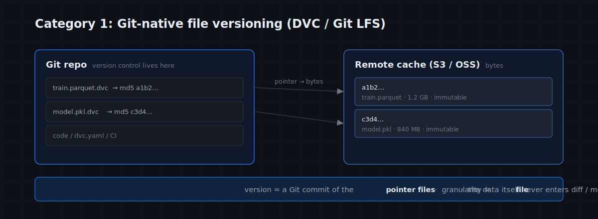
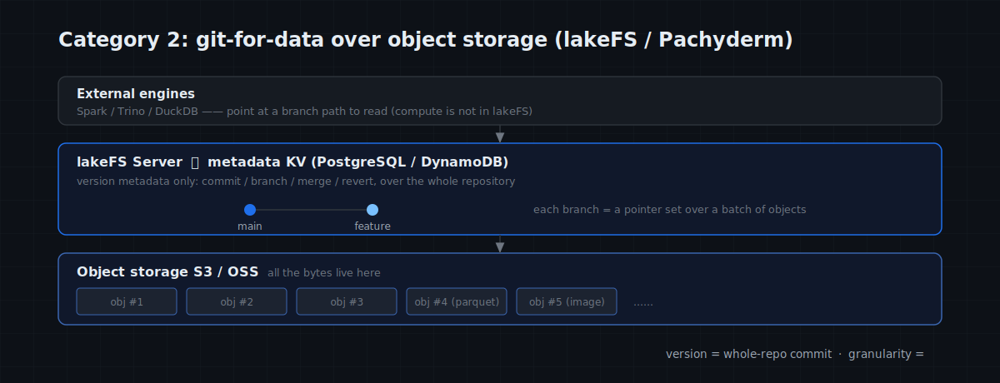
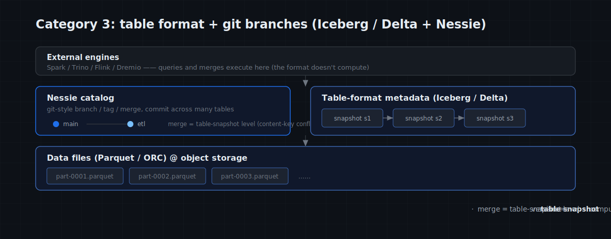
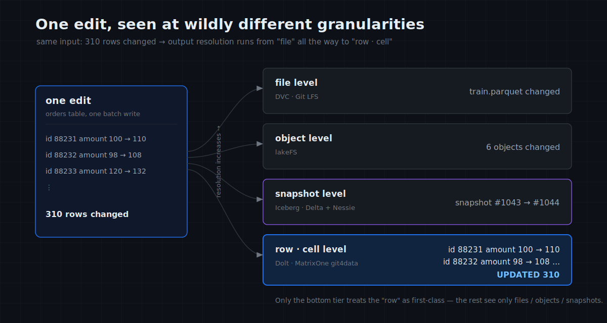
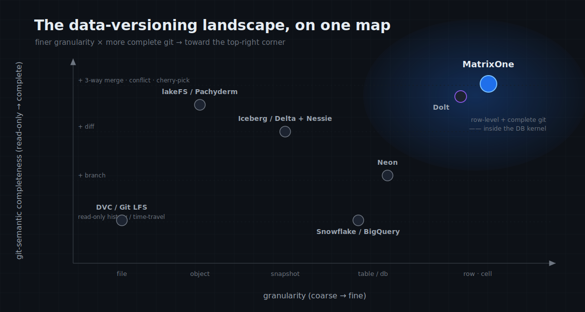

# MatrixOne Git4Data Deep Dive (Part 4): The Data-Versioning Landscape — How MatrixOne, lakeFS, DVC, Neon, and Dolt Actually Differ

The first three articles established what MatrixOne's git4data is, how to use it, and how it works underneath. Before moving into real-world practice, there's one more thing to settle:

> **"Version control for data" is not something only MatrixOne does.** lakeFS, Dolt, Nessie, Snowflake, Neon, DVC — a crowd of products fly the "git for data" / "version control for data" banner. But what they all mean by it is **not the same thing.**

This article maps the comparison landscape of "git for data" in full: a framework first, then **four categories grouped by "which layer the versioning lives at"** (each with an architecture diagram), then a **git-primitive completeness matrix** that aligns everyone's git semantics — same word "git," but *how much* git, exactly — and finally MatrixOne's exact coordinates and its honest boundaries.

---

## A framework first

To compare "data version control," you can't just ask "does it have diff/merge?" What actually separates these products is five questions:

1. **What does it version** — file bytes? objects in object storage? table snapshots? or data rows?
2. **At which layer does it sit** — inside the code repo? on top of object storage? on top of a table format? or inside the database kernel?
3. **How fine is the granularity** — a whole file? a whole object? a snapshot? or a single row / cell?
4. **How complete are the git semantics** — just "go back in time" (time-travel)? or branch, diff, three-way merge, cherry-pick — the full set?
5. **How are conflicts adjudicated** — no merge at all? merge but only whole-file all-or-nothing? or row-level true/false conflict detection?

Of these, **#2 (which layer) decides which category a tool belongs to**, while **#3 and #4 (granularity + git completeness) decide its standing within that category**. So we'll group everyone into four categories *by layer*.

---

## One running scenario

To make the differences visible, fix a concrete scenario and make every approach answer the same four actions:

> You maintain a data asset — picture a **50-million-row user-feature table** (or a **100GB multimodal training set of millions of files**, whichever fits below). The team repeatedly does four things:
>
> - **Action A | See the change**: after editing a batch of data, know precisely **which rows** changed, and to what (git diff).
> - **Action B | Parallel collaboration**: several people each open a branch, edit in parallel, merge back to mainline, with conflicts adjudicated (git branch + merge).
> - **Action C | Cherry-pick / pull data**: lift one change onto another branch (cherry-pick), or pull a batch of data directly on some version.
> - **Action D | Incident recovery**: a dropped table or a botched bulk edit — bring it back in seconds (git reset / restore).

Hold these four actions, and the details of each approach come into focus.

---

## Category 1: Git-native file versioning — DVC / Git LFS

**Approach**: treat data as "large files," store **pointers** in Git and **bytes** in a remote cache (S3, etc.). What you see in Git is a tens-of-bytes `.dvc` pointer file; the real data sits in a content-addressed cache. Version control is entirely **borrowed from Git** — what you commit / branch / merge is the pointer files.



- **Git LFS**: purely solves "don't blow up the Git repo with big files," handling storage only — it **doesn't understand file contents**, so diffing two versions compares the pointers, not the data.
- **DVC**: a stronger take on the idea; its strength is binding **data + model + code + pipeline DAG** together (`dvc add`, `dvc repro`, `dvc exp run`) to make an ML run **reproducible**.

**In the scenario**:

- **Action A (see the change)**: `dvc diff` tells you "`train.parquet` changed" — and that's it. Which 310 rows? Invisible.

- **Action B (parallel merge)**: no data-aware merge; you fall back to **Git's text merge of the pointer files**. Two people editing the same data file is one binary conflict.

- **Action C (cherry-pick / pull data)**: no row-level cherry-pick; pulling data means `dvc checkout` the whole file locally, then feed pandas / Spark.

- **Action D (incident recovery)**: `git checkout <old commit>` + `dvc checkout`, swapping files back — at file granularity.

**Key difference from MatrixOne**: DVC's git semantics are **borrowed** from Git and act on **files**; MatrixOne's are **kernel-native** and act on **rows**.

---

## Category 2: git-for-data over object storage — lakeFS / Pachyderm

**Approach**: a layer over object storage (S3/OSS) providing git-style commit / branch / merge / revert, acting on **all objects in the whole repository**. It needs **a standing lakeFS server + a metadata KV** (typically PostgreSQL / DynamoDB); the data bytes stay in your object store, lakeFS owns only the metadata; to actually compute, you still need an external engine.



**lakeFS** is this category's flagship, and a product MatrixOne is frequently asked to be compared against. Its git semantics are actually quite complete (branch / commit / merge / revert) — **but the granularity is on an entirely different level.**

**In the scenario** (using the 100GB multimodal set):

- **Action A (see the change)**: the same batch changed 310 annotation rows, and `lakectl diff lakefs://repo/main lakefs://repo/feature` reports "**6 objects changed**" — its diff granularity is the **object (whole file)**, it can't show which 310 rows. For row-level, layer Iceberg + Spark on top (lakeFS now ships a `refs_data_diff` Spark SQL function — but **computed in Spark, not in lakeFS**).

- **Action B (parallel merge)**: lakeFS merge is an **object-level three-way merge** — different objects merge cleanly; both branches touching the **same parquet file** is a conflict, and it **can't fuse the two batches of rows inside the file** — only `source-wins` / `dest-wins`.

- **Action C (cherry-pick / pull data)**: it can cherry-pick, but the unit is still the **object**; pulling data means reading objects out into an external engine (Spark / Trino / DuckDB).

- **Action D (incident recovery)**: `lakectl branch revert` to a historical commit — at object granularity, whole-repo consistent.

**Where it's strong**: **scope is the whole repository** — one commit / branch / merge naturally covers **all files**, making multi-file, cross-format atomic consistency effortless; content-level versioning of massive **unstructured bytes** (images / video / audio / weights) is its home turf.

**Key difference from MatrixOne**: lakeFS's git is complete but stops at the **object** granularity; MatrixOne brings the same git semantics down to the **row**. The former is "Object Git over object storage," the latter "Git grown inside the database" — **lakeFS owns the bytes, MatrixOne owns the catalog and labels** — complementary, and a later article covers how they combine.

> Same layer: **Pachyderm** — a data-driven pipeline that auto-triggers on data change, plus lineage; same file / commit granularity.

---

## Category 3: open table format + git branches — Iceberg / Delta + Nessie

**Approach**: open table formats like Iceberg / Delta Lake / Hudi represent a table as a chain of **immutable snapshots** (each write = a new snapshot), with built-in time travel; layer a catalog like **Nessie** (or Unity Catalog) on top and tables gain git-style branches / tags / merge — and a single commit can span **multiple tables**. Querying is delegated entirely to external engines.



```sql
-- Iceberg: read history by snapshot id or timestamp
SELECT * FROM db.t FOR SYSTEM_VERSION AS OF 10963874102873;
SELECT * FROM db.t FOR SYSTEM_TIME AS OF '2026-06-10 01:21:00';
-- Nessie: cross-table branch & merge
CREATE BRANCH etl IN nessie;
MERGE BRANCH etl INTO main IN nessie;
```

**In the scenario**:

- **Action A (see the change)**: versioning is at the **snapshot level**. Which rows differ between two snapshots, the format doesn't directly tell you — an external engine has to diff the two snapshots.

- **Action B (parallel merge)**: Nessie's merge is a **real merge**, but at **table-snapshot** granularity — a conflict means "the **same table** was changed on both branches" (optimistic concurrency, content-key conflict), **not** a row-level three-way merge. It delegates rows to the table format.

- **Action C (cherry-pick / pull data)**: Nessie supports commit-level cherry-pick (still table/snapshot level); pulling data is Spark / Trino / Flink / Dremio.

- **Action D (incident recovery)**: `RESTORE TABLE t TO VERSION AS OF 123` (Delta) / roll back to a snapshot.

**Key difference from MatrixOne**: this path's strength is **open ecosystem, multi-engine interoperability, lakehouse scale** — one dataset that Spark reads, Trino reads, Flink writes. The cost is git semantics that stop at the **table-snapshot level** and **no built-in compute engine**.

---

## Category 4: in-database version control — Dolt, Snowflake, Neon, MatrixOne

**Approach**: don't add a layer outside the database — let the **database kernel itself** manage versions, understanding the semantics of every row and storing changes as immutable increments. **MatrixOne belongs here**, alongside Dolt and Snowflake, Neon. But even within "a database doing version control," their git completeness differs widely.


### Dolt: the git workflow made into a database

A Merkle / prolly-tree storage layer makes **cell-level** diff/merge a natural byproduct, and it brings a developer's full git over:

```sql
SELECT * FROM dolt_diff_orders WHERE to_commit = HASHOF('HEAD') AND from_commit = HASHOF('HEAD^');
CALL DOLT_MERGE('feature');            -- cell-level three-way merge, conflicts in dolt_conflicts_orders
SELECT * FROM orders AS OF 'HEAD~20';  -- time travel
```

Plus per-cell `dolt blame`, remote `clone / push / pull`, the hosted DoltHub — the **"deepest" git** of all: even the distributed collaboration workflow is there. But Dolt is a single-node database with no OLAP support, so its applicable scenarios are relatively limited.

### Snowflake / BigQuery / Neon: zero-copy clone + time travel

```sql
CREATE TABLE t_clone CLONE t;             -- zero-copy clone (seconds)
SELECT * FROM t AT(OFFSET => -300);       -- how it looked 5 minutes ago
UNDROP TABLE t;                           -- rescue a drop
```

They can "branch" and "go back in time," which feels great, but their **git semantics only do the first half**:

- **Snowflake**: zero-copy clone + time travel (1 day default; Standard caps at 1 day, Enterprise reaches 90, plus a 7-day Fail-safe). But **no merge** — clones drift apart, nothing to merge back; to diff, write `MINUS` / `EXCEPT` yourself.
- **Neon** (serverless Postgres, acquired by Databricks in 2025): copy-on-write database branches, scale-to-zero, a natural fit for branch-per-PR. But **no merge at all** — the only parent↔child sync is **reset (one-way overwrite)**, and its "diff" **compares schema only, not data rows**.

### MatrixOne: the full set of row-level git semantics

MatrixOne runs on a distributed, MySQL-compatible engine, and implements the git primitives **at the row level**, across **table → database → tenant → cluster** granularities:

```sql
CREATE SNAPSHOT s FOR TABLE db t;                         -- snapshot / tag
DATA BRANCH CREATE feature FROM main;                     -- branch
DATA BRANCH DIFF orders AGAINST orders {SNAPSHOT='s'} OUTPUT SUMMARY;  -- row-level diff
DATA BRANCH MERGE feature INTO main WHEN CONFLICT FAIL;   -- row-level three-way merge + conflict policy
DATA BRANCH PICK <change> ...;                            -- cherry-pick
RESTORE TABLE db.t {SNAPSHOT = s};                        -- restore
CREATE PITR p FOR DATABASE db RANGE 1 'd';                -- point-in-time recovery
```

**In the scenario** (within one category, how the three styles each answer):

- **Action A (see the change)**: Dolt and MatrixOne give you a **row / cell-level** changelist; Snowflake / Neon have no native row-level diff (write `EXCEPT` yourself; Neon compares schema only).

- **Action B (parallel merge)**: Dolt at cell level, MatrixOne at row level — both **three-way merge with conflict adjudication**; Snowflake has no merge (clones drift), Neon only one-way reset.

- **Action C (cherry-pick / pull data)**: all three pull data via direct SQL; but cherry-pick exists only in Dolt (commit-level) and MatrixOne (row-level `PICK`), not Snowflake / Neon.

- **Action D (incident recovery)**: all can go back in time — Dolt `reset` to a historical commit, Snowflake time travel + `UNDROP`, Neon PITR, MatrixOne `RESTORE` + PITR.

**The differences within this category**: **only Dolt and MatrixOne have true row/cell-level git**; Snowflake / Neon have just "clone + time travel," missing merge-with-conflict. And between Dolt and MatrixOne — **Dolt's git is "deeper"** (distributed push/pull/DoltHub/per-cell blame), **MatrixOne's git is "broader"** (row-level merge with conflict policy + `PICK` + `PITR`, one set of semantics across table-to-cluster granularities).

> As for "can you run SQL on a version" — every database in this category can, so it isn't a differentiator *within* the category; this article's focus is git-semantic completeness.

---

## The git-primitive completeness matrix: same word "git," but how much git?

Flatten the four categories and check them off, git primitive by git primitive — this table is the heart of the article:

| Tool | snapshot / time-travel | branch | diff (granularity) | merge (+ conflict) | cherry-pick | restore / PITR | distributed git workflow |
|---|---|---|---|---|---|---|---|
| DVC / Git LFS | via Git | via Git (pointers) | file-level | pointer text merge | ✗ | `git checkout` | ✓ (Git remote, pointers) |
| lakeFS | ✓ | ✓ | **object-level** | ✓ object-level (source/dest) | ✓ (object) | revert | partial |
| Iceberg/Delta + Nessie | ✓ | ✓ | snapshot-level (via engine) | ✓ **table-snapshot level** | ✓ (commit-level) | RESTORE | ✗ |
| Snowflake / BigQuery | ✓ | clone (not a true branch) | ✗ (write EXCEPT) | ✗ | ✗ | UNDROP / clone | ✗ |
| Neon | ✓ (PITR) | ✓ (CoW) | ✗ (schema only) | ✗ (reset only) | ✗ | PITR / reset | ✗ |
| **Dolt** | ✓ | ✓ | **cell-level** | ✓ **cell 3-way + conflict** | ✓ | reset | ✓ (push/pull/DoltHub) |
| **MatrixOne** | ✓ | ✓ | **row-level** | ✓ **row 3-way + FAIL/SKIP/ACCEPT** | ✓ (`PICK`) | ✓ RESTORE + PITR | ✗ |

Three takeaways:

1. **Only Dolt and MatrixOne take git down to the row/cell level.** The rest stop at coarse granularities — file (DVC), object (lakeFS), snapshot (Iceberg) — or are simply missing merge (Snowflake / Neon).
2. **Snowflake / Neon's "version control" is really only the first half** — clone and go back in time, but no merge-with-conflict, so not complete git.
3. **Dolt is deep on workflow, MatrixOne is broad on primitives**: Dolt adds distributed push/pull/blame; MatrixOne adds conflict policy + cherry-pick + PITR + multi-granularity. The two are the most git-complete pair on this track.

The same edit, seen at wildly different resolutions — the visual version of the matrix's first row (diff granularity):



---

## One overview table

| Category | Representatives | At which layer | Granularity | git-semantic completeness |
|---|---|---|---|---|
| Git-native files | DVC / Git LFS | beside the code repo | file | borrowed from Git, acts on pointers |
| git over object store | lakeFS / Pachyderm | over object storage | object | complete, but stops at object level |
| table format + git | Iceberg/Delta + Nessie | table format + catalog | snapshot | complete, but stops at table-snapshot |
| in-database | Dolt | database kernel | row / cell | **most complete at row level** (+ distributed workflow) |
| in-database | Snowflake / Neon | database | table / db | only clone + time travel, no merge |
| **in-database** | **MatrixOne** | database kernel | **row / cell** | **most complete at row level** (+ conflict policy / PICK / PITR / multi-granularity) |

The same landscape, as a positioning map — finer granularity to the right, more complete git semantics toward the top. **The top-right corner (row-level + complete git) holds Dolt and MatrixOne** — exactly the "version control inside the database kernel" category:



---

## MatrixOne's coordinates, and its honest boundaries

Condense the map into one position:

> **MatrixOne ≈ "Dolt's row-level git completeness + a warehouse's zero-copy clone/time-travel + Neon's database branching," with row-level merge-with-conflict, cherry-pick, and PITR all filled in, across table-to-cluster granularities, inside one open-source, MySQL-compatible database.**

Against the four actions: **A see the change** (row-level DIFF), **B parallel collaboration** (row-level three-way merge + conflict policy), **C cherry-pick / pull data** (`PICK` + direct SQL), **D incident recovery** (snapshot + PITR) — it's one of the few that does all four **at the row level, in a single engine.**

But "comprehensive" also means being clear about what it **isn't**:

- **It doesn't replace DVC**: none of the "data+model+code" triad reproduction of `dvc repro/exp` — for pure ML pipeline versioning, DVC is still handier.

- **It doesn't replace lakeFS**: massive byte-level unstructured versioning and cross-format whole-repo atomic commits are lakeFS's turf; MatrixOne versions only the file *reference*. → **best used together**.

- **Its git isn't as "deep" as Dolt's**: no distributed git workflow (remotes / push-pull / DoltHub / per-cell blame).

- **It isn't an open lakehouse format** (Iceberg/Delta): not built for multi-engine interoperability or PB-scale lakehouse ecosystems.

- **It isn't a serverless warehouse** (Snowflake/Neon): it trails on the per-branch scale-to-zero form factor.

Stating the boundaries isn't weakness — this is exactly the spot on this track **most prone to confusion**, and only by spelling it out can a reader know when to use MatrixOne, when to use someone else, and when to combine them.

---

## Picking one, in a sentence

- Want **complete, row-level, conflict-aware git, inside a MySQL-compatible database** → **MatrixOne** (this series' subject).
- Want a **full distributed git workflow (push/pull/DoltHub/blame)** → **Dolt**.
- Want **byte-level versioning of massive raw files (images/video/weights)** → **lakeFS** (and combine with MatrixOne).
- Want **pure ML reproduction, versioning data + model + code together** → **DVC**.
- Data already in an **open lakehouse**, shared across engines → **Iceberg/Delta + Nessie**.
- Want **serverless, branch-per-PR, scale-to-zero** (no row-level merge needed) → **Neon**.

---

## Closing

The map is drawn. From this article on, the series leaves theory and enters practice — and you set out with a clear coordinate system: knowing what we mean by "git4data," where it stands on the track (row-level + complete git, sharing the top-right corner with Dolt), and where its edges are.

Next is the first practical stop, and git4data's most unglamorous, most frequent use: **incident rescue** — from a fat-fingered UPDATE to a dropped table, how to bring data back in seconds with snapshots, DIFF, and PITR.

> 📎 Runnable SQL: [github.com/matrixorigin/git4data-tutorial](https://github.com/matrixorigin/git4data-tutorial) ｜ Source & community: [github.com/matrixorigin/matrixone](https://github.com/matrixorigin/matrixone)
